# Методы

В данной работе рассмотрены различные методы кластеризации - k-means, алгоритм агломеративной иерархической кластеризации и OPTICS.

## k-means

Основная идея алгоритма k-means заключается в том, что данные произвольно разбиваются на кластеры, после чего итеративно перевычисляется центр масс для каждого кластера, полученного на предыдущем шаге, затем векторы разбиваются на кластеры вновь в соответствии с тем, какой из новых центров оказался ближе по выбранной метрике.

Цель алгоритма заключается в разделении 𝑛 наблюдений на 𝑘 кластеров таким образом, чтобы каждое наблюдение принадлежало ровно одному кластеру, расположенному на наименьшем расстоянии от наблюдения. 

## Алгоритм агломеративной иерархической кластеризации

Агломеративный метод строит иерархию кластеров, двигаясь снизу вверх, начиная с наименьших кластеров (каждая вершина графа является отдельным кластером), обычно одиночных, и последовательно на каждом шаге объединяет те кластеры, которые находятся ближе всего друг к другу. Обычно процесс заканчивается, когда все кластеры объединяются в корневой кластер, состоящий из всех элементов исходного множества.

## OPTICS

OPTICS -  это алгоритм поиска кластеров на основе плотности в пространственных данных. Его основная идея похожа на DBSCAN , но устраняет один из основных недостатков DBSCAN: проблему обнаружения значимых кластеров в данных различной плотности. Для этого точки базы данных упорядочиваются (линейно) таким образом, что пространственно ближайшие точки становятся соседями в упорядочении. Кроме того, для каждой точки сохраняется особое расстояние, которое представляет плотность, которая должна быть принята для кластера, чтобы обе точки принадлежали одному кластеру. Это представлено в виде дендрограммы.

# Датасеты

Вышеописанные методы тестировались на следующих датасетах:

- Линейно разделимые множества
- Линейно разделимые множества, расположенные близко или касающиеся друг друга
- Линейно неразделимое множество (средняя площадь пересечения 10-20%)
- Линейно неразделимое множество (средняя площадь пересечения 50-70%)
- Эталонный датасет Breast Cancer
- Эталонный датасет Wine Quality

|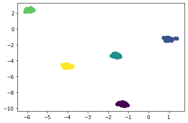|
|:--:|
| *Датасет 1. Линейно разделимые множества.* |
 
|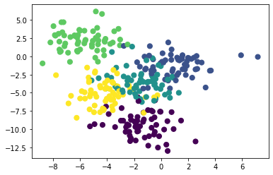|
|:--:|
| *Датасет 2. Линейно разделимые множества, расположенные близко или касающиеся друг друга.* |
 
|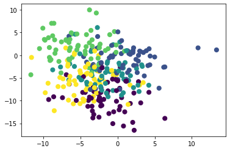|
|:--:|
| *Датасет 3. Линейно неразделимое множество (средняя площадь пересечения 10-20%).* |
 
|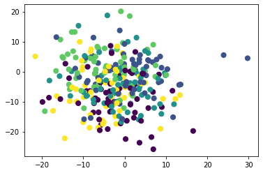|
|:--:|
| *Датасет 4. Линейно неразделимое множество (средняя площадь пересечения 50-70%).* |
 
|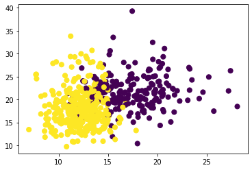|
|:--:|
| *Эталонный датасет Breast Cancer.* |
 
||
|:--:|
| *Эталонный датасет Wine Quality.* |

# Метрики

Оценка качества кластеризации производилась по следующим метрикам:

- V-мера
- Полнота
- Индекс Фаулкса – Мэллова
- Гомогенность

_V-мера_ - это средняя гармоническая однородности и полноты.

_Полнота_ - это свойство, двойственное свойству однородности. Значение метрики качества должно уменьшаться при разделении эталонного кластера на части.
Полнота измеряет насколько объекты одного класса относятся к одному кластеру

_Индекс Фоулкса – Мэллова_ используется для определения сходства между двумя кластерами. Более высокое значение индекса означает большее сходство между кластерами. Этот индекс также хорошо работает на зашумленных данных.

_Гомогенность_ - это значение метрики качества должно уменьшаться при объединении в один кластер двух эталонных.
Гомогенность измеряет, насколько каждый кластер состоит из объектов одного класса

# Результаты

## k-means

### Евклидова метрика

|               | V-mesure | Completeness | Fowlkes-Mallow | Homogenity |
| :------------ | -------: | -----------: | -------------: | ---------: |
| 1             |        1 |            1 |              1 |          1 |
| 2             | 0.697264 |     0.698022 |       0.735169 |   0.696509 |
| 3             | 0.317407 |     0.320007 |       0.396553 |   0.314848 |
| 4             |  0.08401 |    0.0843068 |       0.239744 |  0.0837153 |
| breast cancer | 0.464793 |     0.516809 |       0.791517 |   0.422291 |
| wine quality  | 0.428757 |     0.428701 |       0.583537 |   0.428812 |

|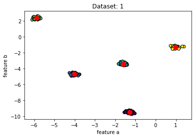|
|:--:|
| *K-means, евклидова метрика, Датасет 1* |

|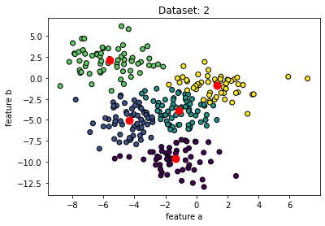|
|:--:|
| *K-means, евклидова метрика, Датасет 2* |

|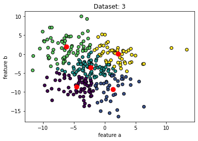|
|:--:|
| *K-means, евклидова метрика, Датасет 3* |

|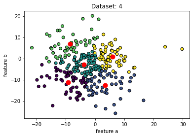|
|:--:|
| *K-means, евклидова метрика, Датасет 4* |

|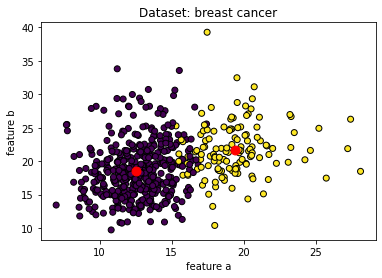|
|:--:|
| *K-means, евклидова метрика, Датасет Breast Cancer* |

|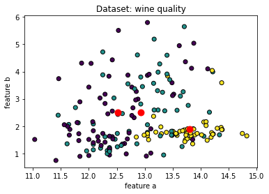|
|:--:|
| *K-means, евклидова метрика, Датасет Wine Quality* |

### Манхеттенская метрика

|               |  V-mesure | Completeness | Fowlkes-Mallow | Homogenity |
| :------------ | --------: | -----------: | -------------: | ---------: |
| 1             |         1 |            1 |              1 |          1 |
| 2             |  0.668319 |     0.668937 |       0.688112 |   0.667702 |
| 3             |  0.338049 |     0.339195 |       0.415465 |    0.33691 |
| 4             | 0.0870521 |    0.0876989 |       0.242695 |  0.0864148 |
| breast cancer |  0.456708 |     0.510052 |       0.788211 |   0.413465 |
| wine quality  |  0.431543 |     0.431385 |       0.585935 |   0.431701 |

||
| :--: |
| *K-means, манхеттенская метрика, Датасет 1* |

|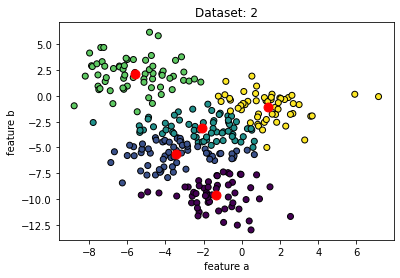|
| :--: |
| *K-means, манхеттенская метрика, Датасет 2* |

|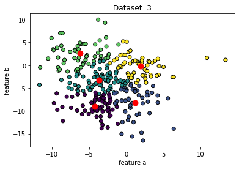|
| :--: |
| *K-means, манхеттенская метрика, Датасет 3* |

|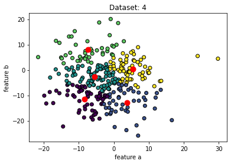|
| :--: |
| *K-means, манхеттенская метрика, Датасет 4* |

||
| :--: |
| *K-means, манхеттенская метрика, Датасет Breast Cancer* |

|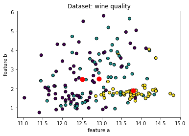|
| :--: |
| *K-means, манхеттенская метрика, Датасет Wine Quality* |

## Алгоритм агломеративной иерархической кластеризации

### Евклидова метрика

|               |  V-mesure | Completeness | Fowlkes-Mallow | Homogenity |
| :------------ | --------: | -----------: | -------------: | ---------: |
| 1             |         1 |            1 |              1 |          1 |
| 2             |  0.675832 |     0.678153 |       0.709681 |   0.673526 |
| 3             |  0.321083 |     0.323531 |       0.384739 |   0.318672 |
| 4             | 0.0830093 |    0.0852188 |       0.246371 |  0.0809116 |
| breast cancer |  0.319082 |     0.407601 |       0.739228 |    0.26215 |
| wine quality  |  0.416077 |     0.416293 |       0.582122 |   0.415861 |

|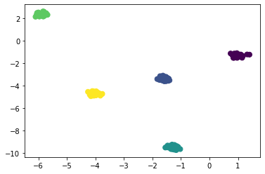|
|:--:|
| *Аггломеративная кластеризация, евклидова метрика, Датасет 1* |

|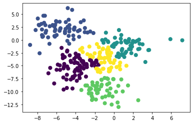|
|:--:|
| *Аггломеративная кластеризация, евклидова метрика, Датасет 2* |

|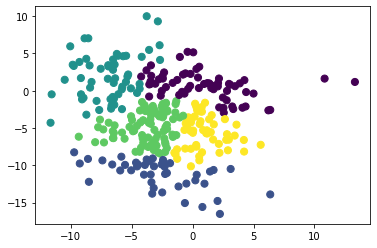|
|:--:|
| *Аггломеративная кластеризация, евклидова метрика, Датасет 3* |

|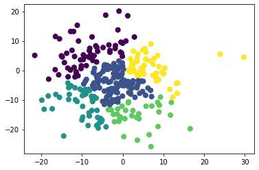|
|:--:|
| *Аггломеративная кластеризация, евклидова метрика, Датасет 4* |

|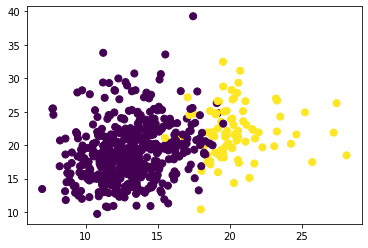|
|:--:|
| *Аггломеративная кластеризация, евклидова метрика, Датасет Breast Cancer* |

|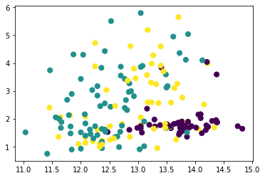|
|:--:|
| *Аггломеративная кластеризация, евклидова метрика, Датасет Wine Quality* |

### Манхеттенская метрика

|               |  V-mesure | Completeness | Fowlkes-Mallow | Homogenity |
| :------------ | --------: | -----------: | -------------: | ---------: |
| 1             |         1 |            1 |              1 |          1 |
| 2             |  0.661681 |     0.673164 |       0.673158 |   0.650584 |
| 3             |  0.328866 |      0.33839 |       0.414054 |   0.319864 |
| 4             | 0.0565259 |    0.0654418 |       0.273425 |  0.0497481 |
| breast cancer | 0.0880967 |     0.235139 |       0.721494 |  0.0542019 |
| wine quality  |  0.442275 |     0.448047 |       0.589682 |    0.43665 |

|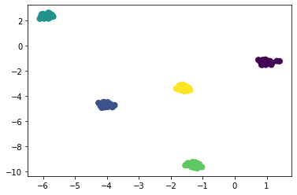|
|:--:|
| *Аггломеративная кластеризация, манхеттенская метрика, Датасет 1* |

|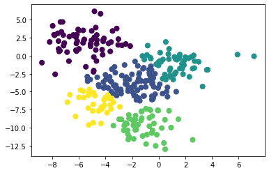|
|:--:|
| *Аггломеративная кластеризация, манхеттенская метрика, Датасет 2* |

|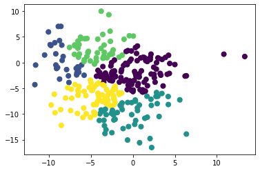|
|:--:|
| *Аггломеративная кластеризация, манхеттенская метрика, Датасет 3* |

||
|:--:|
| *Аггломеративная кластеризация, манхеттенская метрика, Датасет 4* |

|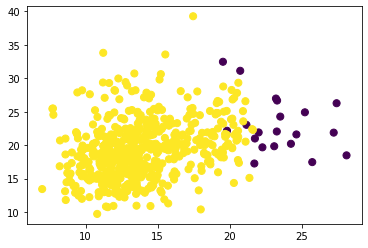|
|:--:|
| *Аггломеративная кластеризация, манхеттенская метрика, Датасет Breast Cancer* |

|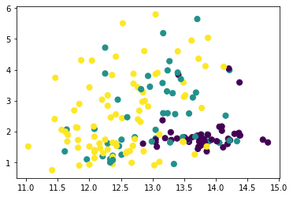|
|:--:|
| *Аггломеративная кластеризация, манхеттенская метрика, Датасет Wine Quality* |

## OPTICS

### Евклидова метрика

|               | V-mesure | Completeness | Fowlkes-Mallow | Homogenity |
| :------------ | -------: | -----------: | -------------: | ---------: |
| 1             |        1 |            1 |              1 |          1 |
| 2             | 0.356688 |     0.389988 |       0.346776 |   0.328627 |
| 3             | 0.217932 |     0.179928 |       0.225498 |   0.276288 |
| 4             | 0.249568 |     0.174175 |      0.0962486 |   0.440045 |
| breast cancer | 0.154971 |     0.117049 |       0.493887 |   0.229242 |
| wine quality  | 0.276606 |     0.180435 |       0.152288 |   0.592305 |

||
|:--:|
| *OPTICS, евклидова метрика, Датасет 1* |

|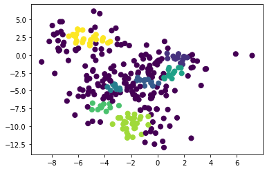|
|:--:|
| *OPTICS, евклидова метрика, Датасет 2* |

|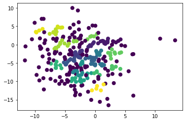|
|:--:|
| *OPTICS, евклидова метрика, Датасет 3* |

|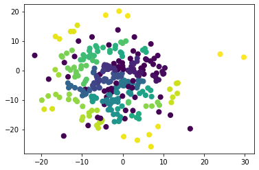|
|:--:|
| *OPTICS, евклидова метрика, Датасет 4* |

|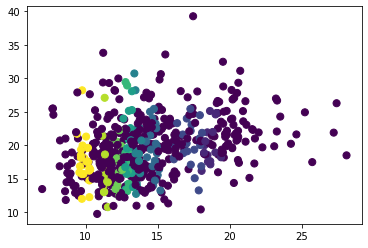|
|:--:|
| *OPTICS, евклидова метрика, Датасет Breast Cancer* |

|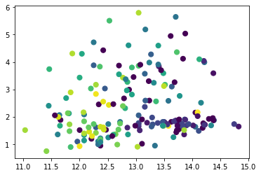|
|:--:|
| *OPTICS, евклидова метрика, Датасет Wine* |

### Манхеттенская метрика

|               | V-mesure | Completeness | Fowlkes-Mallow | Homogenity |
| :------------ | -------: | -----------: | -------------: | ---------: |
| 1             |        1 |            1 |              1 |          1 |
| 2             | 0.358768 |     0.389889 |       0.356059 |   0.332248 |
| 3             | 0.203824 |     0.171729 |       0.232271 |   0.250673 |
| 4             | 0.243216 |     0.170108 |      0.0922051 |   0.426524 |
| breast cancer | 0.130749 |     0.154482 |       0.659543 |   0.113337 |
| wine quality  | 0.303906 |     0.198218 |       0.159531 |   0.651029 |

|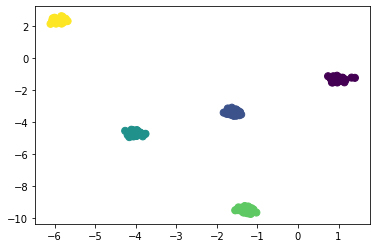|
|:--:|
| *OPTICS, манхеттенская метрика, Датасет 1* |

|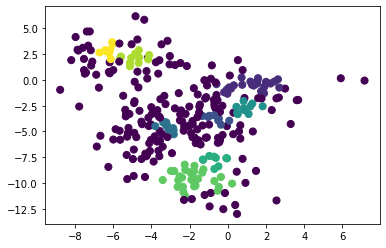|
|:--:|
| *OPTICS, манхеттенская метрика, Датасет 2* |

||
|:--:|
| *OPTICS, манхеттенская метрика, Датасет 3* |

|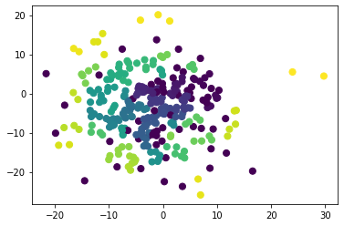|
|:--:|
| *OPTICS, манхеттенская метрика, Датасет 4* |

|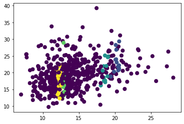|
|:--:|
| *OPTICS, манхеттенская метрика, Датасет Breast Cancer* |

|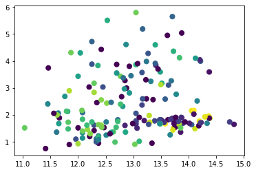|
|:--:|
| *OPTICS, манхеттенская метрика, Датасет Wine* |

# Сравнительная таблица
|               |                       |               |                |               | _Kmeans_            |                           |               |                |               |
|---------------|-----------------------|---------------|----------------|---------------|---------------------|---------------------------|---------------|----------------|---------------|
|               | **Евклидова метрика** |               |                |               |                     | **Манхеттенская метрика** |               |                |               |
|               |              V-mesure |  Completeness | Fowlkes-Mallow |    Homogenity |                     |                  V-mesure |  Completeness | Fowlkes-Mallow |    Homogenity |
| 1             |                 **1** |         **1** |          **1** |         **1** |                     |                     **1** |         **1** |          **1** |         **1** |
| 2             |          **0.697264** |  **0.698022** |   **0.735169** |  **0.696509** |                     |              **0.668319** |  **0.668937** |   **0.688112** |  **0.667702** |
| 3             |          **0.317407** |  **0.320007** |   **0.396553** |  **0.314848** |                     |              **0.338049** |  **0.339195** |   **0.415465** |   **0.33691** |
| 4             |           **0.08401** | **0.0843068** |   **0.239744** | **0.0837153** |                     |             **0.0870521** | **0.0876989** |   **0.242695** | **0.0864148** |
| breast cancer |          **0.464793** |  **0.516809** |   **0.791517** |  **0.422291** |                     |              **0.456708** |  **0.510052** |   **0.788211** |  **0.413465** |
| wine quality  |          **0.428757** |  **0.428701** |   **0.583537** |  **0.428812** |                     |              **0.431543** |  **0.431385** |   **0.585935** |  **0.431701** |
|               |                       |               |                |               | **_Agglomerative_** |                           |               |                |               |
|               | **Евклидова метрика** |               |                |               |                     | **Манхеттенская метрика** |               |                |               |
|               |              V-mesure |  Completeness | Fowlkes-Mallow |    Homogenity |                     |                  V-mesure |  Completeness | Fowlkes-Mallow |    Homogenity |
| 1             |                 **1** |         **1** |          **1** |         **1** |                     |                     **1** |         **1** |          **1** |         **1** |
| 2             |          **0.675832** |  **0.678153** |   **0.709681** |  **0.673526** |                     |              **0.661681** |  **0.673164** |   **0.673158** |  **0.650584** |
| 3             |          **0.321083** |  **0.323531** |   **0.384739** |  **0.318672** |                     |              **0.328866** |   **0.33839** |   **0.414054** |  **0.319864** |
| 4             |         **0.0830093** | **0.0852188** |   **0.246371** | **0.0809116** |                     |             **0.0565259** | **0.0654418** |   **0.273425** | **0.0497481** |
| breast cancer |          **0.319082** |  **0.407601** |   **0.739228** |   **0.26215** |                     |             **0.0880967** |  **0.235139** |   **0.721494** | **0.0542019** |
| wine quality  |          **0.416077** |  **0.416293** |   **0.582122** |  **0.415861** |                     |              **0.442275** |  **0.448047** |   **0.589682** |   **0.43665** |
|               |                       |               |                |               | **_OPTICS_**        |                           |               |                |               |
|               | **Евклидова метрика** |               |                |               |                     | **Манхеттенская метрика** |               |                |               |
|               |              V-mesure |  Completeness | Fowlkes-Mallow |    Homogenity |                     |                  V-mesure |  Completeness | Fowlkes-Mallow |    Homogenity |
| 1             |                 **1** |         **1** |          **1** |         **1** |                     |                     **1** |         **1** |          **1** |         **1** |
| 2             |          **0.356688** |  **0.389988** |   **0.346776** |  **0.328627** |                     |              **0.358768** |  **0.389889** |   **0.356059** |  **0.332248** |
| 3             |          **0.217932** |  **0.179928** |   **0.225498** |  **0.276288** |                     |              **0.203824** |  **0.171729** |   **0.232271** |  **0.250673** |
| 4             |          **0.249568** |  **0.174175** |  **0.0962486** |  **0.440045** |                     |              **0.243216** |  **0.170108** |  **0.0922051** |  **0.426524** |
| breast cancer |          **0.154971** |  **0.117049** |   **0.493887** |  **0.229242** |                     |              **0.130749** |  **0.154482** |   **0.659543** |  **0.113337** |
| wine quality  |          **0.276606** |  **0.180435** |   **0.152288** |  **0.592305** |                     |              **0.303906** |  **0.198218** |   **0.159531** |  **0.651029** |

# Выводы

При линейно разделимых множествах (с расстоянием между группами в 10^3 раз больше, чем диаметр группы) все методы отрабатывают одинаково отлично. На остальных множествах наиболее низкие показатели у OPTICS. Для всех методов лучшие показатели для датасета Wine Quality достигаются при манхеттенской метрике.

