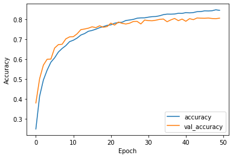
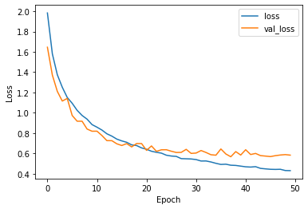
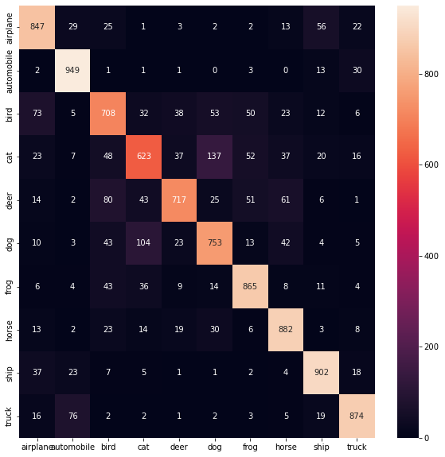
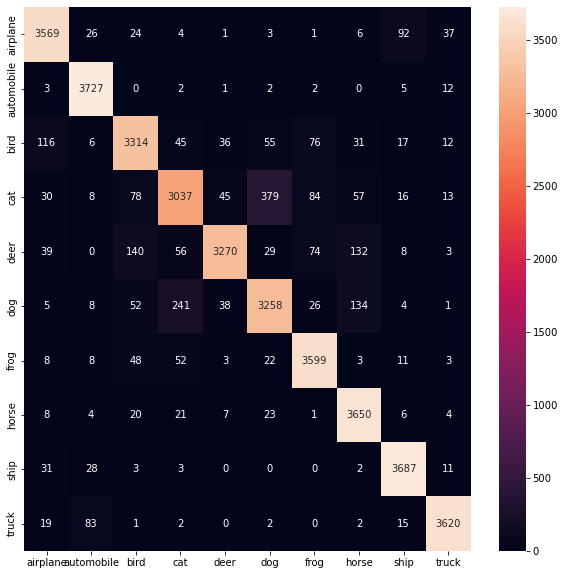
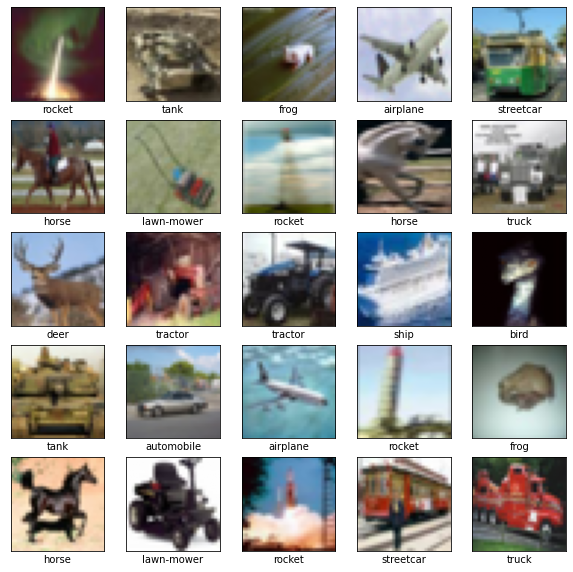
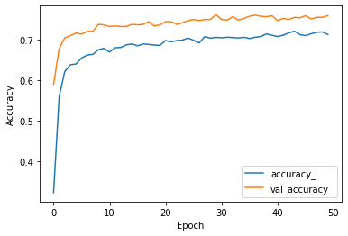
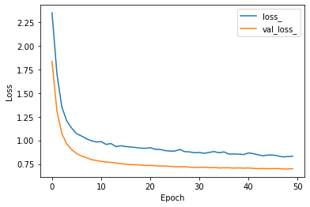
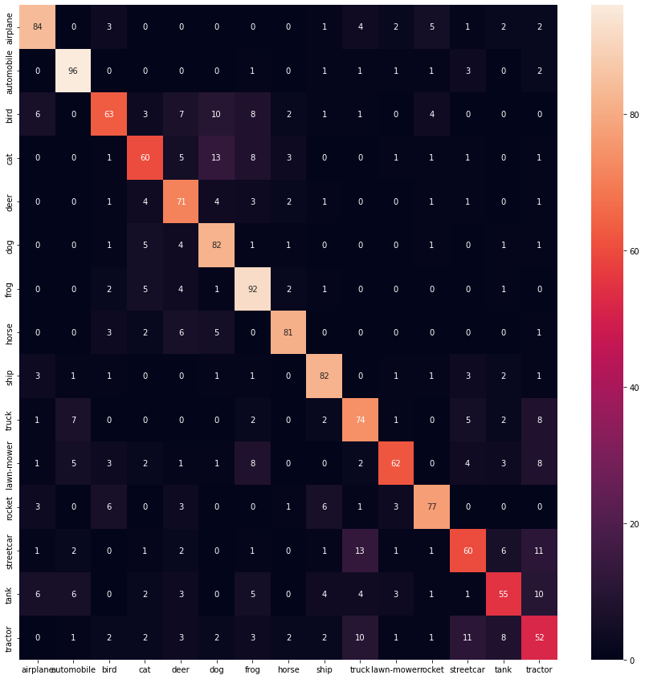
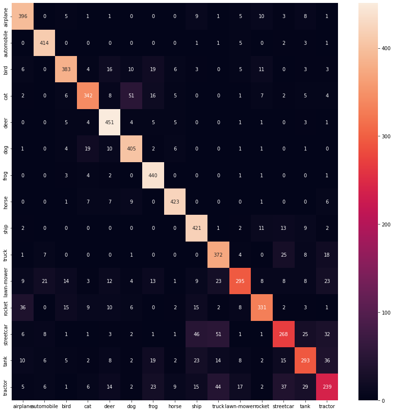

# 1. Архитектура

_Эта работа на [Github](https://github.com/ujnomw/neural-networks/blob/master/cnn)_

В основе сверточной нейронной сети лежит идея применения слоя фильтров на небольшие участки изображения для выдления характерных признаков изображения (вертикальные, горизонтальные линии например). Последовательное использование подобных слоев приводит к выделению более специфичных признаков, например фары автомобиля.

Дальнейшие слои осуществляют классификацию на основе выделенных признаков.

Архитектура используеммой CNN:

```text
Model: "sequential_28"
_________________________________________________________________
Layer (type)                 Output Shape              Param #
=================================================================
conv2d_38 (Conv2D)           (None, 30, 30, 32)        896
_________________________________________________________________
conv2d_39 (Conv2D)           (None, 28, 28, 32)        9248
_________________________________________________________________
max_pooling2d_21 (MaxPooling (None, 14, 14, 32)        0
_________________________________________________________________
dropout_27 (Dropout)         (None, 14, 14, 32)        0
_________________________________________________________________
conv2d_40 (Conv2D)           (None, 14, 14, 64)        18496
_________________________________________________________________
conv2d_41 (Conv2D)           (None, 12, 12, 64)        36928
_________________________________________________________________
max_pooling2d_22 (MaxPooling (None, 6, 6, 64)          0
_________________________________________________________________
dropout_28 (Dropout)         (None, 6, 6, 64)          0
_________________________________________________________________
conv2d_42 (Conv2D)           (None, 6, 6, 64)          36928
_________________________________________________________________
conv2d_43 (Conv2D)           (None, 4, 4, 64)          36928
_________________________________________________________________
max_pooling2d_23 (MaxPooling (None, 2, 2, 64)          0
_________________________________________________________________
dropout_29 (Dropout)         (None, 2, 2, 64)          0
_________________________________________________________________
flatten_10 (Flatten)         (None, 256)               0
_________________________________________________________________
dense_49 (Dense)             (None, 512)               131584
_________________________________________________________________
dropout_30 (Dropout)         (None, 512)               0
_________________________________________________________________
dense_50 (Dense)             (None, 10)                5130
=================================================================
Total params: 276,138
Trainable params: 276,138
Non-trainable params: 0
_________________________________________________________________
```

# 2. Классификация на эталонном датасете CIFAR-10

CIFAR-10 (Canadian Institute For Advanced Research) — еще один большой набор изображений, который обычно используется для тестирования алгоритмов машинного обучения. Он содержит 60 000 цветных картинок размером 32х32 пикселя, размеченных в один из десяти классов: самолеты, автомобили, коты, олени, собаки, лягушки, лошади, корабли и грузовики. В наборе данных по 6000 картинок каждого класса, примеры некоторых из них приведены ниже.

|  |
| :--: |
| *Примеры изображений CIFAR-10* | 

## Настройка параметров обучения

Параметры обучения варьировались для достижения наилучшего результата. Нижеописанные результаты были получены при 50 эпохах, размере батча 256 и скорости обучения 0.001.


## Результаты

||
|:--:|
| *Точность на обучающем и валидационном множестве* |


| |
|:--:|
| *Ошибка на обучающем и валидационном множестве* |

### Метрики для тестового множества

```text
test:
              precision    recall  f1-score   support

           0       0.81      0.85      0.83      1000
           1       0.86      0.95      0.90      1000
           2       0.72      0.71      0.72      1000
           3       0.72      0.62      0.67      1000
           4       0.84      0.72      0.78      1000
           5       0.74      0.75      0.75      1000
           6       0.83      0.86      0.85      1000
           7       0.82      0.88      0.85      1000
           8       0.86      0.90      0.88      1000
           9       0.89      0.87      0.88      1000

    accuracy                           0.81     10000
   macro avg       0.81      0.81      0.81     10000
weighted avg       0.81      0.81      0.81     10000
```

||
|:--:|
| *Матрица ошибок для тестового множества* |

### Метрики для обучающего множества

```text
train:
              precision    recall  f1-score   support

           0       0.93      0.95      0.94      3763
           1       0.96      0.99      0.97      3754
           2       0.90      0.89      0.90      3708
           3       0.88      0.81      0.84      3747
           4       0.96      0.87      0.91      3751
           5       0.86      0.86      0.86      3767
           6       0.93      0.96      0.94      3757
           7       0.91      0.97      0.94      3744
           8       0.95      0.98      0.97      3765
           9       0.97      0.97      0.97      3744

    accuracy                           0.93     37500
   macro avg       0.93      0.93      0.93     37500
weighted avg       0.93      0.93      0.93     37500
```

||
|:--:|
| *Матрица ошибок для обучающего множества*|


# 3. Сравнение со сверточной нейронной сетью аналогичной архитектуры
Аналогичная архитектура была использованна в [данной работе](https://learnopencv.com/image-classification-using-convolutional-neural-networks-in-keras/). Полученные результаты незначительно превосходят вышеупомянутые по точности.

# 4. Классификация на датасете CIFAR-10 + vehicles 2



Дообучим текущую модель на 15 классах - CIFAR-10 и суперкласс vehicles2 CIFAR-100. Для этого изменим слои выполняющие классификацию.

```text
Model: "sequential_31"
_________________________________________________________________
Layer (type)                 Output Shape              Param #
=================================================================
conv2d_38 (Conv2D)           (None, 30, 30, 32)        896
_________________________________________________________________
conv2d_39 (Conv2D)           (None, 28, 28, 32)        9248
_________________________________________________________________
max_pooling2d_21 (MaxPooling (None, 14, 14, 32)        0
_________________________________________________________________
dropout_27 (Dropout)         (None, 14, 14, 32)        0
_________________________________________________________________
conv2d_40 (Conv2D)           (None, 14, 14, 64)        18496
_________________________________________________________________
conv2d_41 (Conv2D)           (None, 12, 12, 64)        36928
_________________________________________________________________
max_pooling2d_22 (MaxPooling (None, 6, 6, 64)          0
_________________________________________________________________
dropout_28 (Dropout)         (None, 6, 6, 64)          0
_________________________________________________________________
conv2d_42 (Conv2D)           (None, 6, 6, 64)          36928
_________________________________________________________________
conv2d_43 (Conv2D)           (None, 4, 4, 64)          36928
_________________________________________________________________
max_pooling2d_23 (MaxPooling (None, 2, 2, 64)          0
_________________________________________________________________
dropout_29 (Dropout)         (None, 2, 2, 64)          0
_________________________________________________________________
flatten_10 (Flatten)         (None, 256)               0
_________________________________________________________________
dense_55 (Dense)             (None, 512)               131584
_________________________________________________________________
dropout_33 (Dropout)         (None, 512)               0
_________________________________________________________________
dense_56 (Dense)             (None, 15)                7695
=================================================================
Total params: 278,703
Trainable params: 139,279
Non-trainable params: 139,424
_________________________________________________________________
```

Динамика обучения:




Тестовое множество:

```text
test:
              precision    recall  f1-score   support

           0       0.80      0.81      0.80       104
           1       0.81      0.91      0.86       106
           2       0.73      0.60      0.66       105
           3       0.70      0.64      0.67        94
           4       0.65      0.80      0.72        89
           5       0.69      0.85      0.76        97
           6       0.69      0.85      0.76       108
           7       0.86      0.83      0.84        98
           8       0.80      0.85      0.82        97
           9       0.67      0.73      0.70       102
          10       0.82      0.62      0.70       100
          11       0.82      0.77      0.79       100
          12       0.67      0.60      0.63       100
          13       0.69      0.55      0.61       100
          14       0.53      0.52      0.53       100

    accuracy                           0.73      1500
   macro avg       0.73      0.73      0.72      1500
weighted avg       0.73      0.73      0.72      1500
```



Обучающие множество:

```text
train:
              precision    recall  f1-score   support

           0       0.84      0.90      0.87       440
           1       0.90      0.97      0.93       427
           2       0.86      0.82      0.84       469
           3       0.85      0.76      0.80       449
           4       0.83      0.94      0.88       480
           5       0.82      0.90      0.86       450
           6       0.82      0.97      0.89       452
           7       0.92      0.93      0.93       454
           8       0.78      0.91      0.84       461
           9       0.73      0.85      0.79       436
          10       0.83      0.65      0.73       451
          11       0.86      0.75      0.80       440
          12       0.71      0.60      0.65       447
          13       0.74      0.66      0.70       445
          14       0.65      0.53      0.59       449

    accuracy                           0.81      6750
   macro avg       0.81      0.81      0.81      6750
weighted avg       0.81      0.81      0.81      6750
```



# 5. Сравнительный анализ результатов сети на CIFAR-10 и дообученной сети на CIFAR-10 и vehicles2

Результаты сети дообученной на расширенном множестве данных уступают результатам на оригинальной сети. Точность упала на 11% и 12% для тестового и обучающего множеств, соответственно. Анологичная тенденция наблюдается и для остальных метрик качества.
