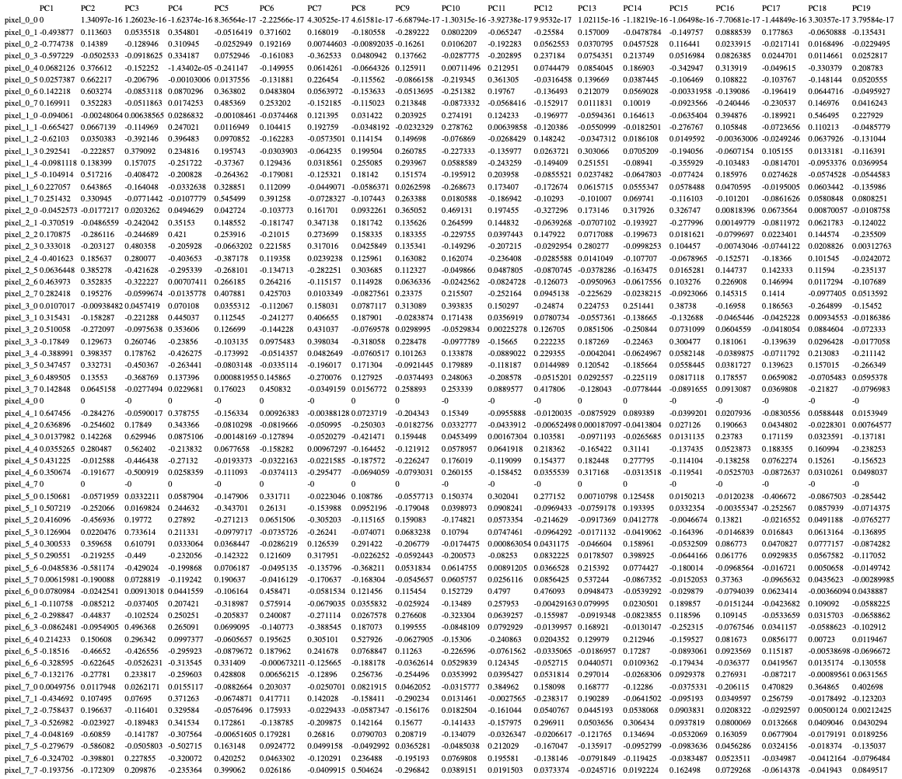
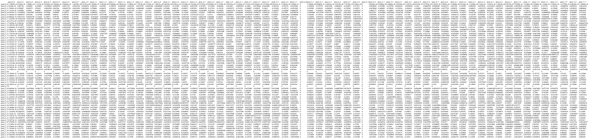

# Метод

Метод главных компонент (_англ._ Principal Component Analysis ) применяется для уменьшения размерности данных.

Реализация - https://github.com/ujnomw/neural-networks/blob/master/pca.ipynb

# Данные

Реализованный метод тестировался на трех различных датасетах.

| Датасет             | Количество признаков |
| ------------------- | -------------------- |
| Breast Cancer       | 30                   |
| MNIST               | 64                   |
| Custom (make_blobs) | 1000                 |

# Результаты

## Breast Cancer

### Матрица кореляции

Исходя из матрицы кореляции исключим один из признаков, входящий в пару признаков, которая имеет кореляцию меньше 0.9. Полученный список признаков ниже.

### Список признаков

'mean radius', 'mean texture', 'mean smoothness',
       'mean compactness', 'mean concavity', 'mean symmetry',
       'mean fractal dimension', 'radius error', 'texture error',
       'smoothness error', 'compactness error', 'concavity error',
       'concave points error', 'symmetry error',
       'fractal dimension error', 'worst smoothness', 'worst compactness',
       'worst concavity', 'worst symmetry', 'worst fractal dimension'

### Отобранные компоненты

| Критерий выбора  | Количество компонент |
| ---------------- | -------------------- |
| Кайзера          | 6                    |
| Сломанной трости | 3                    |
| Каменистой осыпи | 3                    |

### График описываемой дисперсии

<figure>

<figcaption align = "center">
<b>График описываемой дисперсии Breast Cancer</b></figcaption>
</figure>

### Определение числа главных компонент

Здесь и далее будет выбиратся число главных компонент, описывающие максимальную дисперсию.

### Матрица факторной нагрузки

### Ранжированный список признаков с суммарной нагрузкой

|                         |   Суммарная нагрузка |
|:------------------------|---------------------:|
| mean texture            |            0.930271  |
| texture error           |            0.91136   |
| fractal dimension error |            0.906421  |
| compactness error       |            0.88926   |
| concavity error         |            0.804465  |
| worst fractal dimension |            0.461667  |
| symmetry error          |            0.451559  |
| mean fractal dimension  |            0.39      |
| concave points error    |            0.377428  |
| worst compactness       |            0.32421   |
| worst concavity         |            0.29803   |
| mean concavity          |            0.116756  |
| mean compactness        |            0.102615  |
| smoothness error        |            0.0574514 |
| worst symmetry          |           -0.0228657 |
| mean symmetry           |           -0.0751346 |
| radius error            |           -0.231596  |
| mean radius             |           -0.384065  |
| worst smoothness        |           -0.628577  |
| mean smoothness         |           -0.713485  |

### Анализ остатков: матрица остатков корреляции

_rest_pca.csv в репозитории_

## MNIST

### Матрица кореляций

Исходный набор признаков был созранен исходя из матрицы кореляции, что вполне ожидаемо для данных подобного рода.

### Список признаков

'pixel_0_0',
'pixel_0_1',
'pixel_0_2',
'pixel_0_3',
'pixel_0_4',
'pixel_0_5',
'pixel_0_6',
'pixel_0_7',
'pixel_1_0',
'pixel_1_1',
'pixel_1_2',
'pixel_1_3',
'pixel_1_4',
'pixel_1_5',
'pixel_1_6',
'pixel_1_7',
'pixel_2_0',
'pixel_2_1',
'pixel_2_2',
'pixel_2_3',
'pixel_2_4',
'pixel_2_5',
'pixel_2_6',
'pixel_2_7',
'pixel_3_0',
'pixel_3_1',
'pixel_3_2',
'pixel_3_3',
'pixel_3_4',
'pixel_3_5',
'pixel_3_6',
'pixel_3_7',
'pixel_4_0',
'pixel_4_1',
'pixel_4_2',
'pixel_4_3',
'pixel_4_4',
'pixel_4_5',
'pixel_4_6',
'pixel_4_7',
'pixel_5_0',
'pixel_5_1',
'pixel_5_2',
'pixel_5_3',
'pixel_5_4',
'pixel_5_5',
'pixel_5_6',
'pixel_5_7',
'pixel_6_0',
'pixel_6_1',
'pixel_6_2',
'pixel_6_3',
'pixel_6_4',
'pixel_6_5',
'pixel_6_6',
'pixel_6_7',
'pixel_7_0',
'pixel_7_1',
'pixel_7_2',
'pixel_7_3',
'pixel_7_4',
'pixel_7_5',
'pixel_7_6',
'pixel_7_7'

### Отобранные компоненты

| Критерий выбора  | Количество компонент |
| ---------------- | -------------------- |
| Кайзера          | 19                   |
| Сломанной трости | 14                   |
| Каменистой осыпи | 6                    |

### График описываемой дисперсии

Итоговое число главных компонент 19.

### Матрица факторной нагрузки

_loadings_mnist.csv в репозитории_

### Ранжированный список признаков с суммарной нагрузкой

|           | Суммарная нагрузка |
| :-------- | -----------------: |
| pixel_7_0 |             1.6143 |
| pixel_2_0 |            1.42388 |
| pixel_1_0 |            1.34752 |
| pixel_6_0 |            1.29892 |
| pixel_6_4 |           0.974535 |
| pixel_3_0 |           0.949859 |
| pixel_5_4 |           0.867577 |
| pixel_3_7 |           0.800576 |
| pixel_2_7 |           0.751352 |
| pixel_6_7 |           0.613802 |
| pixel_2_6 |           0.578924 |
| pixel_7_3 |           0.545168 |
| pixel_1_3 |           0.521196 |
| pixel_5_7 |           0.508278 |
| pixel_6_1 |           0.488552 |
| pixel_2_3 |           0.475451 |
| pixel_3_2 |           0.455068 |
| pixel_1_7 |           0.448736 |
| pixel_7_7 |            0.44759 |
| pixel_3_3 |           0.444798 |
| pixel_4_4 |           0.434904 |
| pixel_4_3 |           0.397971 |
| pixel_1_6 |           0.364014 |
| pixel_3_1 |           0.306249 |
| pixel_0_4 |           0.253461 |
| pixel_4_2 |           0.239829 |
| pixel_3_6 |           0.227309 |
| pixel_2_2 |           0.222209 |
| pixel_0_6 |           0.218929 |
| pixel_0_3 |           0.172217 |
| pixel_0_5 |           0.172178 |
| pixel_0_7 |           0.143831 |
| pixel_5_0 |           0.131085 |
| pixel_4_1 |           0.110488 |
| pixel_5_5 |          0.0798344 |
| pixel_7_1 |           0.070275 |
| pixel_7_4 |          0.0449975 |
| pixel_5_3 |         0.00518491 |
| pixel_4_7 |                  0 |
| pixel_4_0 |                  0 |
| pixel_0_0 |       -2.19985e-16 |
| pixel_2_1 |         -0.0139371 |
| pixel_6_3 |         -0.0421049 |
| pixel_5_1 |         -0.0688835 |
| pixel_0_2 |         -0.0718304 |
| pixel_7_2 |         -0.0850427 |
| pixel_1_1 |          -0.086199 |
| pixel_3_4 |         -0.0910245 |
| pixel_3_5 |          -0.104028 |
| pixel_4_5 |          -0.125785 |
| pixel_1_2 |          -0.136705 |
| pixel_0_1 |          -0.144172 |
| pixel_1_5 |          -0.288203 |
| pixel_5_2 |          -0.310215 |
| pixel_6_5 |          -0.318943 |
| pixel_7_6 |          -0.342381 |
| pixel_4_6 |           -0.35434 |
| pixel_2_5 |          -0.357303 |
| pixel_1_4 |          -0.423752 |
| pixel_6_2 |          -0.484876 |
| pixel_2_4 |          -0.540631 |
| pixel_6_6 |           -0.73471 |
| pixel_5_6 |          -0.783125 |
| pixel_7_5 |          -0.814427 |

### Анализ остатков: матрица остатков корреляции

_rest_mnist.csv в репозитории_

## Custom dataset

### Матрица кореляций

Исходя из матрицы кореляции были оставлены все признаки.

### Список признаков

'Feature0',
'Feature1',
'Feature2',
'Feature3',
'Feature4',
'Feature5',
'Feature6',
'Feature7',
'Feature8',
'Feature9',
'Feature10',
'Feature11',
'Feature12',
'Feature13',
'Feature14',
'Feature15',
'Feature16',
'Feature17',
'Feature18',
'Feature19',
'Feature20',
'Feature21',
'Feature22',
'Feature23',
'Feature24',
'Feature25',
'Feature26',
'Feature27',
'Feature28',
'Feature29',
'Feature30',
'Feature31',
'Feature32',
'Feature33',
'Feature34',
'Feature35',
'Feature36',
'Feature37',
'Feature38',
'Feature39',
'Feature40',
'Feature41',
'Feature42',
'Feature43',
'Feature44',
'Feature45',
'Feature46',
'Feature47',
'Feature48',
'Feature49',
'Feature50',
'Feature51',
'Feature52',
'Feature53',
'Feature54',
'Feature55',
'Feature56',
'Feature57',
'Feature58',
'Feature59',
'Feature60',
'Feature61',
'Feature62',
'Feature63',
'Feature64',
'Feature65',
'Feature66',
'Feature67',
'Feature68',
'Feature69',
'Feature70',
'Feature71',
'Feature72',
'Feature73',
'Feature74',
'Feature75',
'Feature76',
'Feature77',
'Feature78',
'Feature79',
'Feature80',
'Feature81',
'Feature82',
'Feature83',
'Feature84',
'Feature85',
'Feature86',
'Feature87',
'Feature88',
'Feature89',
'Feature90',
'Feature91',
'Feature92',
'Feature93',
'Feature94',
'Feature95',
'Feature96',
'Feature97',
'Feature98',
'Feature99',
'Feature100',
'Feature101',
'Feature102',
'Feature103',
'Feature104',
'Feature105',
'Feature106',
'Feature107',
'Feature108',
'Feature109',
'Feature110',
'Feature111',
'Feature112',
'Feature113',
'Feature114',
'Feature115',
'Feature116',
'Feature117',
'Feature118',
'Feature119',
'Feature120',
'Feature121',
'Feature122',
'Feature123',
'Feature124',
'Feature125',
'Feature126',
'Feature127',
'Feature128',
'Feature129',
'Feature130',
'Feature131',
'Feature132',
'Feature133',
'Feature134',
'Feature135',
'Feature136',
'Feature137',
'Feature138',
'Feature139',
'Feature140',
'Feature141',
'Feature142',
'Feature143',
'Feature144',
'Feature145',
'Feature146',
'Feature147',
'Feature148',
'Feature149',
'Feature150',
'Feature151',
'Feature152',
'Feature153',
'Feature154',
'Feature155',
'Feature156',
'Feature157',
'Feature158',
'Feature159',
'Feature160',
'Feature161',
'Feature162',
'Feature163',
'Feature164',
'Feature165',
'Feature166',
'Feature167',
'Feature168',
'Feature169',
'Feature170',
'Feature171',
'Feature172',
'Feature173',
'Feature174',
'Feature175',
'Feature176',
'Feature177',
'Feature178',
'Feature179',
'Feature180',
'Feature181',
'Feature182',
'Feature183',
'Feature184',
'Feature185',
'Feature186',
'Feature187',
'Feature188',
'Feature189',
'Feature190',
'Feature191',
'Feature192',
'Feature193',
'Feature194',
'Feature195',
'Feature196',
'Feature197',
'Feature198',
'Feature199',
'Feature200',
'Feature201',
'Feature202',
'Feature203',
'Feature204',
'Feature205',
'Feature206',
'Feature207',
'Feature208',
'Feature209',
'Feature210',
'Feature211',
'Feature212',
'Feature213',
'Feature214',
'Feature215',
'Feature216',
'Feature217',
'Feature218',
'Feature219',
'Feature220',
'Feature221',
'Feature222',
'Feature223',
'Feature224',
'Feature225',
'Feature226',
'Feature227',
'Feature228',
'Feature229',
'Feature230',
'Feature231',
'Feature232',
'Feature233',
'Feature234',
'Feature235',
'Feature236',
'Feature237',
'Feature238',
'Feature239',
'Feature240',
'Feature241',
'Feature242',
'Feature243',
'Feature244',
'Feature245',
'Feature246',
'Feature247',
'Feature248',
'Feature249',
'Feature250',
'Feature251',
'Feature252',
'Feature253',
'Feature254',
'Feature255',
'Feature256',
'Feature257',
'Feature258',
'Feature259',
'Feature260',
'Feature261',
'Feature262',
'Feature263',
'Feature264',
'Feature265',
'Feature266',
'Feature267',
'Feature268',
'Feature269',
'Feature270',
'Feature271',
'Feature272',
'Feature273',
'Feature274',
'Feature275',
'Feature276',
'Feature277',
'Feature278',
'Feature279',
'Feature280',
'Feature281',
'Feature282',
'Feature283',
'Feature284',
'Feature285',
'Feature286',
'Feature287',
'Feature288',
'Feature289',
'Feature290',
'Feature291',
'Feature292',
'Feature293',
'Feature294',
'Feature295',
'Feature296',
'Feature297',
'Feature298',
'Feature299',
'Feature300',
'Feature301',
'Feature302',
'Feature303',
'Feature304',
'Feature305',
'Feature306',
'Feature307',
'Feature308',
'Feature309',
'Feature310',
'Feature311',
'Feature312',
'Feature313',
'Feature314',
'Feature315',
'Feature316',
'Feature317',
'Feature318',
'Feature319',
'Feature320',
'Feature321',
'Feature322',
'Feature323',
'Feature324',
'Feature325',
'Feature326',
'Feature327',
'Feature328',
'Feature329',
'Feature330',
'Feature331',
'Feature332',
'Feature333',
'Feature334',
'Feature335',
'Feature336',
'Feature337',
'Feature338',
'Feature339',
'Feature340',
'Feature341',
'Feature342',
'Feature343',
'Feature344',
'Feature345',
'Feature346',
'Feature347',
'Feature348',
'Feature349',
'Feature350',
'Feature351',
'Feature352',
'Feature353',
'Feature354',
'Feature355',
'Feature356',
'Feature357',
'Feature358',
'Feature359',
'Feature360',
'Feature361',
'Feature362',
'Feature363',
'Feature364',
'Feature365',
'Feature366',
'Feature367',
'Feature368',
'Feature369',
'Feature370',
'Feature371',
'Feature372',
'Feature373',
'Feature374',
'Feature375',
'Feature376',
'Feature377',
'Feature378',
'Feature379',
'Feature380',
'Feature381',
'Feature382',
'Feature383',
'Feature384',
'Feature385',
'Feature386',
'Feature387',
'Feature388',
'Feature389',
'Feature390',
'Feature391',
'Feature392',
'Feature393',
'Feature394',
'Feature395',
'Feature396',
'Feature397',
'Feature398',
'Feature399',
'Feature400',
'Feature401',
'Feature402',
'Feature403',
'Feature404',
'Feature405',
'Feature406',
'Feature407',
'Feature408',
'Feature409',
'Feature410',
'Feature411',
'Feature412',
'Feature413',
'Feature414',
'Feature415',
'Feature416',
'Feature417',
'Feature418',
'Feature419',
'Feature420',
'Feature421',
'Feature422',
'Feature423',
'Feature424',
'Feature425',
'Feature426',
'Feature427',
'Feature428',
'Feature429',
'Feature430',
'Feature431',
'Feature432',
'Feature433',
'Feature434',
'Feature435',
'Feature436',
'Feature437',
'Feature438',
'Feature439',
'Feature440',
'Feature441',
'Feature442',
'Feature443',
'Feature444',
'Feature445',
'Feature446',
'Feature447',
'Feature448',
'Feature449',
'Feature450',
'Feature451',
'Feature452',
'Feature453',
'Feature454',
'Feature455',
'Feature456',
'Feature457',
'Feature458',
'Feature459',
'Feature460',
'Feature461',
'Feature462',
'Feature463',
'Feature464',
'Feature465',
'Feature466',
'Feature467',
'Feature468',
'Feature469',
'Feature470',
'Feature471',
'Feature472',
'Feature473',
'Feature474',
'Feature475',
'Feature476',
'Feature477',
'Feature478',
'Feature479',
'Feature480',
'Feature481',
'Feature482',
'Feature483',
'Feature484',
'Feature485',
'Feature486',
'Feature487',
'Feature488',
'Feature489',
'Feature490',
'Feature491',
'Feature492',
'Feature493',
'Feature494',
'Feature495',
'Feature496',
'Feature497',
'Feature498',
'Feature499',
'Feature500',
'Feature501',
'Feature502',
'Feature503',
'Feature504',
'Feature505',
'Feature506',
'Feature507',
'Feature508',
'Feature509',
'Feature510',
'Feature511',
'Feature512',
'Feature513',
'Feature514',
'Feature515',
'Feature516',
'Feature517',
'Feature518',
'Feature519',
'Feature520',
'Feature521',
'Feature522',
'Feature523',
'Feature524',
'Feature525',
'Feature526',
'Feature527',
'Feature528',
'Feature529',
'Feature530',
'Feature531',
'Feature532',
'Feature533',
'Feature534',
'Feature535',
'Feature536',
'Feature537',
'Feature538',
'Feature539',
'Feature540',
'Feature541',
'Feature542',
'Feature543',
'Feature544',
'Feature545',
'Feature546',
'Feature547',
'Feature548',
'Feature549',
'Feature550',
'Feature551',
'Feature552',
'Feature553',
'Feature554',
'Feature555',
'Feature556',
'Feature557',
'Feature558',
'Feature559',
'Feature560',
'Feature561',
'Feature562',
'Feature563',
'Feature564',
'Feature565',
'Feature566',
'Feature567',
'Feature568',
'Feature569',
'Feature570',
'Feature571',
'Feature572',
'Feature573',
'Feature574',
'Feature575',
'Feature576',
'Feature577',
'Feature578',
'Feature579',
'Feature580',
'Feature581',
'Feature582',
'Feature583',
'Feature584',
'Feature585',
'Feature586',
'Feature587',
'Feature588',
'Feature589',
'Feature590',
'Feature591',
'Feature592',
'Feature593',
'Feature594',
'Feature595',
'Feature596',
'Feature597',
'Feature598',
'Feature599',
'Feature600',
'Feature601',
'Feature602',
'Feature603',
'Feature604',
'Feature605',
'Feature606',
'Feature607',
'Feature608',
'Feature609',
'Feature610',
'Feature611',
'Feature612',
'Feature613',
'Feature614',
'Feature615',
'Feature616',
'Feature617',
'Feature618',
'Feature619',
'Feature620',
'Feature621',
'Feature622',
'Feature623',
'Feature624',
'Feature625',
'Feature626',
'Feature627',
'Feature628',
'Feature629',
'Feature630',
'Feature631',
'Feature632',
'Feature633',
'Feature634',
'Feature635',
'Feature636',
'Feature637',
'Feature638',
'Feature639',
'Feature640',
'Feature641',
'Feature642',
'Feature643',
'Feature644',
'Feature645',
'Feature646',
'Feature647',
'Feature648',
'Feature649',
'Feature650',
'Feature651',
'Feature652',
'Feature653',
'Feature654',
'Feature655',
'Feature656',
'Feature657',
'Feature658',
'Feature659',
'Feature660',
'Feature661',
'Feature662',
'Feature663',
'Feature664',
'Feature665',
'Feature666',
'Feature667',
'Feature668',
'Feature669',
'Feature670',
'Feature671',
'Feature672',
'Feature673',
'Feature674',
'Feature675',
'Feature676',
'Feature677',
'Feature678',
'Feature679',
'Feature680',
'Feature681',
'Feature682',
'Feature683',
'Feature684',
'Feature685',
'Feature686',
'Feature687',
'Feature688',
'Feature689',
'Feature690',
'Feature691',
'Feature692',
'Feature693',
'Feature694',
'Feature695',
'Feature696',
'Feature697',
'Feature698',
'Feature699',
'Feature700',
'Feature701',
'Feature702',
'Feature703',
'Feature704',
'Feature705',
'Feature706',
'Feature707',
'Feature708',
'Feature709',
'Feature710',
'Feature711',
'Feature712',
'Feature713',
'Feature714',
'Feature715',
'Feature716',
'Feature717',
'Feature718',
'Feature719',
'Feature720',
'Feature721',
'Feature722',
'Feature723',
'Feature724',
'Feature725',
'Feature726',
'Feature727',
'Feature728',
'Feature729',
'Feature730',
'Feature731',
'Feature732',
'Feature733',
'Feature734',
'Feature735',
'Feature736',
'Feature737',
'Feature738',
'Feature739',
'Feature740',
'Feature741',
'Feature742',
'Feature743',
'Feature744',
'Feature745',
'Feature746',
'Feature747',
'Feature748',
'Feature749',
'Feature750',
'Feature751',
'Feature752',
'Feature753',
'Feature754',
'Feature755',
'Feature756',
'Feature757',
'Feature758',
'Feature759',
'Feature760',
'Feature761',
'Feature762',
'Feature763',
'Feature764',
'Feature765',
'Feature766',
'Feature767',
'Feature768',
'Feature769',
'Feature770',
'Feature771',
'Feature772',
'Feature773',
'Feature774',
'Feature775',
'Feature776',
'Feature777',
'Feature778',
'Feature779',
'Feature780',
'Feature781',
'Feature782',
'Feature783',
'Feature784',
'Feature785',
'Feature786',
'Feature787',
'Feature788',
'Feature789',
'Feature790',
'Feature791',
'Feature792',
'Feature793',
'Feature794',
'Feature795',
'Feature796',
'Feature797',
'Feature798',
'Feature799',
'Feature800',
'Feature801',
'Feature802',
'Feature803',
'Feature804',
'Feature805',
'Feature806',
'Feature807',
'Feature808',
'Feature809',
'Feature810',
'Feature811',
'Feature812',
'Feature813',
'Feature814',
'Feature815',
'Feature816',
'Feature817',
'Feature818',
'Feature819',
'Feature820',
'Feature821',
'Feature822',
'Feature823',
'Feature824',
'Feature825',
'Feature826',
'Feature827',
'Feature828',
'Feature829',
'Feature830',
'Feature831',
'Feature832',
'Feature833',
'Feature834',
'Feature835',
'Feature836',
'Feature837',
'Feature838',
'Feature839',
'Feature840',
'Feature841',
'Feature842',
'Feature843',
'Feature844',
'Feature845',
'Feature846',
'Feature847',
'Feature848',
'Feature849',
'Feature850',
'Feature851',
'Feature852',
'Feature853',
'Feature854',
'Feature855',
'Feature856',
'Feature857',
'Feature858',
'Feature859',
'Feature860',
'Feature861',
'Feature862',
'Feature863',
'Feature864',
'Feature865',
'Feature866',
'Feature867',
'Feature868',
'Feature869',
'Feature870',
'Feature871',
'Feature872',
'Feature873',
'Feature874',
'Feature875',
'Feature876',
'Feature877',
'Feature878',
'Feature879',
'Feature880',
'Feature881',
'Feature882',
'Feature883',
'Feature884',
'Feature885',
'Feature886',
'Feature887',
'Feature888',
'Feature889',
'Feature890',
'Feature891',
'Feature892',
'Feature893',
'Feature894',
'Feature895',
'Feature896',
'Feature897',
'Feature898',
'Feature899',
'Feature900',
'Feature901',
'Feature902',
'Feature903',
'Feature904',
'Feature905',
'Feature906',
'Feature907',
'Feature908',
'Feature909',
'Feature910',
'Feature911',
'Feature912',
'Feature913',
'Feature914',
'Feature915',
'Feature916',
'Feature917',
'Feature918',
'Feature919',
'Feature920',
'Feature921',
'Feature922',
'Feature923',
'Feature924',
'Feature925',
'Feature926',
'Feature927',
'Feature928',
'Feature929',
'Feature930',
'Feature931',
'Feature932',
'Feature933',
'Feature934',
'Feature935',
'Feature936',
'Feature937',
'Feature938',
'Feature939',
'Feature940',
'Feature941',
'Feature942',
'Feature943',
'Feature944',
'Feature945',
'Feature946',
'Feature947',
'Feature948',
'Feature949',
'Feature950',
'Feature951',
'Feature952',
'Feature953',
'Feature954',
'Feature955',
'Feature956',
'Feature957',
'Feature958',
'Feature959',
'Feature960',
'Feature961',
'Feature962',
'Feature963',
'Feature964',
'Feature965',
'Feature966',
'Feature967',
'Feature968',
'Feature969',
'Feature970',
'Feature971',
'Feature972',
'Feature973',
'Feature974',
'Feature975',
'Feature976',
'Feature977',
'Feature978',
'Feature979',
'Feature980',
'Feature981',
'Feature982',
'Feature983',
'Feature984',
'Feature985',
'Feature986',
'Feature987',
'Feature988',
'Feature989',
'Feature990',
'Feature991',
'Feature992',
'Feature993',
'Feature994',
'Feature995',
'Feature996',
'Feature997',
'Feature998',
'Feature999'

### Отобранные компоненты

| Критерий выбора  | Количество компонент |
| ---------------- | -------------------- |
| Кайзера          | 19                   |
| Сломанной трости | 19                   |
| Каменистой осыпи | 13                   |

### График описываемой дисперсии

### Матрица факторной нагрузки

В репозитории файл [loadings_custom_19.csv](loadings_custom_19.csv)

### Ранжированный список признаков с суммарной нагрузкой

|            | Суммарная нагрузка |
| :--------- | -----------------: |
| Feature712 |           0.351198 |
| Feature455 |           0.340495 |
| Feature425 |           0.338998 |
| Feature162 |           0.321466 |
| Feature926 |           0.320373 |
| Feature443 |           0.316149 |
| Feature156 |           0.306436 |
| Feature598 |           0.301898 |
| Feature946 |           0.295544 |
| Feature423 |           0.295046 |
| Feature642 |            0.29053 |
| Feature169 |           0.288735 |
| Feature216 |           0.286278 |
| Feature980 |           0.273884 |
| Feature764 |           0.269142 |
| Feature592 |           0.263526 |
| Feature552 |           0.261823 |
| Feature60  |           0.260035 |
| Feature35  |           0.259441 |
| Feature23  |           0.254951 |
| Feature89  |            0.25478 |
| Feature761 |            0.25248 |
| Feature747 |           0.251979 |
| Feature499 |           0.251024 |
| Feature240 |           0.250756 |
| Feature532 |           0.247447 |
| Feature754 |           0.241889 |
| Feature736 |           0.240012 |
| Feature447 |           0.235909 |
| Feature243 |           0.235746 |
| Feature486 |            0.23252 |
| Feature51  |           0.231203 |
| Feature569 |           0.230519 |
| Feature831 |             0.2292 |
| Feature607 |           0.226774 |
| Feature527 |           0.223866 |
| Feature276 |           0.221725 |
| Feature921 |           0.221482 |
| Feature12  |           0.220807 |
| Feature57  |           0.220116 |
| Feature567 |           0.218681 |
| Feature370 |           0.217889 |
| Feature144 |           0.215748 |
| Feature872 |           0.214126 |
| Feature961 |            0.21372 |
| Feature262 |            0.21255 |
| Feature785 |           0.211785 |
| Feature373 |           0.210368 |
| Feature654 |           0.208031 |
| Feature266 |           0.208009 |
| Feature309 |           0.207356 |
| Feature4   |            0.20711 |
| Feature285 |           0.207005 |
| Feature139 |           0.206936 |
| Feature897 |           0.206887 |
| Feature264 |           0.206726 |
| Feature347 |           0.205528 |
| Feature877 |           0.204608 |
| Feature706 |           0.200276 |
| Feature686 |            0.19986 |
| Feature648 |           0.194736 |
| Feature790 |           0.193117 |
| Feature418 |           0.193105 |
| Feature151 |           0.192504 |
| Feature687 |           0.191677 |
| Feature127 |            0.19154 |
| Feature507 |           0.190712 |
| Feature114 |           0.190017 |
| Feature24  |           0.189384 |
| Feature782 |           0.189032 |
| Feature342 |           0.188528 |
| Feature217 |           0.186084 |
| Feature927 |           0.185867 |
| Feature855 |           0.185173 |
| Feature556 |           0.185046 |
| Feature883 |           0.180622 |
| Feature784 |           0.178853 |
| Feature524 |           0.176124 |
| Feature241 |           0.174801 |
| Feature667 |           0.172193 |
| Feature172 |           0.169867 |
| Feature32  |           0.169349 |
| Feature286 |           0.169322 |
| Feature954 |           0.168225 |
| Feature204 |           0.168103 |
| Feature25  |           0.168046 |
| Feature290 |           0.167297 |
| Feature352 |           0.165568 |
| Feature803 |            0.16343 |
| Feature414 |           0.163118 |
| Feature478 |            0.16292 |
| Feature304 |           0.162815 |
| Feature408 |           0.162352 |
| Feature393 |           0.161224 |
| Feature868 |           0.160157 |
| Feature116 |           0.159269 |
| Feature433 |           0.159031 |
| Feature466 |           0.158054 |
| Feature436 |           0.157812 |
| Feature633 |           0.157636 |
| Feature646 |           0.157195 |
| Feature260 |           0.156604 |
| Feature668 |           0.155408 |
| Feature999 |           0.155084 |
| Feature489 |           0.154355 |
| Feature199 |           0.154299 |
| Feature68  |           0.153682 |
| Feature292 |           0.152365 |
| Feature824 |           0.151696 |
| Feature549 |            0.15088 |
| Feature464 |           0.149248 |
| Feature61  |           0.148858 |
| Feature623 |           0.148684 |
| Feature491 |           0.148426 |
| Feature221 |           0.148417 |
| Feature989 |           0.148162 |
| Feature846 |           0.147596 |
| Feature966 |           0.147529 |
| Feature895 |           0.147207 |
| Feature235 |           0.146691 |
| Feature659 |           0.146481 |
| Feature209 |           0.145396 |
| Feature490 |           0.144608 |
| Feature962 |           0.144192 |
| Feature81  |           0.144036 |
| Feature616 |           0.143196 |
| Feature245 |            0.14307 |
| Feature95  |           0.142263 |
| Feature45  |           0.142186 |
| Feature910 |           0.142061 |
| Feature441 |           0.141528 |
| Feature8   |           0.141298 |
| Feature660 |           0.141208 |
| Feature96  |           0.140612 |
| Feature643 |           0.139755 |
| Feature106 |           0.139718 |
| Feature843 |           0.139577 |
| Feature367 |           0.138889 |
| Feature182 |           0.138208 |
| Feature173 |           0.137663 |
| Feature830 |           0.136649 |
| Feature21  |           0.136332 |
| Feature996 |           0.135512 |
| Feature36  |           0.135433 |
| Feature421 |           0.135412 |
| Feature591 |           0.135159 |
| Feature428 |           0.134385 |
| Feature118 |           0.134333 |
| Feature819 |           0.133715 |
| Feature378 |           0.132535 |
| Feature714 |           0.131975 |
| Feature602 |           0.131203 |
| Feature67  |           0.130474 |
| Feature922 |           0.129768 |
| Feature944 |           0.129508 |
| Feature227 |           0.128634 |
| Feature867 |           0.127894 |
| Feature71  |           0.127363 |
| Feature984 |           0.127349 |
| Feature531 |           0.127281 |
| Feature693 |           0.127067 |
| Feature336 |            0.12651 |
| Feature113 |           0.126184 |
| Feature568 |           0.125789 |
| Feature398 |           0.125737 |
| Feature526 |            0.12552 |
| Feature411 |           0.124434 |
| Feature134 |           0.123922 |
| Feature752 |           0.123859 |
| Feature661 |            0.12301 |
| Feature136 |            0.12245 |
| Feature539 |           0.122262 |
| Feature143 |            0.12197 |
| Feature229 |           0.121526 |
| Feature837 |           0.121201 |
| Feature948 |           0.120978 |
| Feature351 |           0.120268 |
| Feature802 |           0.119608 |
| Feature699 |           0.118807 |
| Feature571 |           0.118504 |
| Feature192 |           0.118497 |
| Feature100 |           0.117866 |
| Feature324 |           0.116129 |
| Feature816 |           0.116096 |
| Feature253 |           0.115705 |
| Feature88  |           0.114134 |
| Feature189 |           0.111993 |
| Feature14  |           0.111972 |
| Feature403 |           0.110893 |
| Feature308 |           0.110836 |
| Feature964 |           0.110235 |
| Feature724 |           0.109704 |
| Feature485 |           0.109529 |
| Feature641 |           0.108748 |
| Feature462 |           0.108704 |
| Feature348 |            0.10849 |
| Feature759 |           0.108456 |
| Feature651 |           0.107143 |
| Feature288 |           0.106479 |
| Feature573 |           0.106392 |
| Feature208 |           0.104492 |
| Feature175 |           0.104462 |
| Feature762 |           0.104312 |
| Feature184 |           0.104228 |
| Feature477 |           0.103878 |
| Feature231 |           0.103332 |
| Feature631 |           0.102986 |
| Feature682 |           0.102717 |
| Feature866 |           0.102122 |
| Feature372 |           0.101892 |
| Feature636 |           0.101266 |
| Feature977 |           0.100281 |
| Feature28  |           0.100115 |
| Feature361 |          0.0998901 |
| Feature291 |          0.0996223 |
| Feature865 |          0.0990494 |
| Feature945 |          0.0990251 |
| Feature732 |          0.0990074 |
| Feature232 |          0.0990014 |
| Feature937 |          0.0979396 |
| Feature242 |          0.0976537 |
| Feature561 |          0.0975346 |
| Feature305 |          0.0972213 |
| Feature520 |          0.0971875 |
| Feature763 |          0.0968178 |
| Feature212 |          0.0967872 |
| Feature676 |          0.0966208 |
| Feature639 |          0.0965828 |
| Feature658 |          0.0964041 |
| Feature606 |          0.0960523 |
| Feature366 |          0.0951582 |
| Feature834 |          0.0940842 |
| Feature427 |          0.0940178 |
| Feature165 |           0.093248 |
| Feature726 |          0.0931136 |
| Feature707 |          0.0929177 |
| Feature385 |          0.0927334 |
| Feature685 |          0.0926619 |
| Feature430 |          0.0919276 |
| Feature230 |          0.0904796 |
| Feature523 |          0.0897812 |
| Feature705 |          0.0896487 |
| Feature534 |          0.0893181 |
| Feature992 |          0.0888385 |
| Feature5   |          0.0883412 |
| Feature244 |          0.0882626 |
| Feature841 |          0.0877761 |
| Feature973 |          0.0877496 |
| Feature794 |           0.087713 |
| Feature683 |          0.0876352 |
| Feature254 |          0.0866761 |
| Feature753 |          0.0863781 |
| Feature595 |          0.0863297 |
| Feature540 |          0.0857515 |
| Feature476 |            0.08555 |
| Feature249 |          0.0847091 |
| Feature963 |          0.0835337 |
| Feature482 |          0.0834988 |
| Feature445 |           0.083485 |
| Feature187 |          0.0831594 |
| Feature365 |           0.083031 |
| Feature274 |           0.081734 |
| Feature176 |           0.081542 |
| Feature152 |          0.0804025 |
| Feature692 |          0.0803277 |
| Feature613 |          0.0797557 |
| Feature415 |          0.0796366 |
| Feature137 |          0.0795013 |
| Feature133 |          0.0792288 |
| Feature673 |          0.0785768 |
| Feature461 |          0.0783298 |
| Feature558 |          0.0782308 |
| Feature882 |          0.0770192 |
| Feature303 |            0.07655 |
| Feature15  |          0.0764849 |
| Feature155 |          0.0763507 |
| Feature259 |          0.0763409 |
| Feature778 |            0.07572 |
| Feature827 |          0.0753396 |
| Feature535 |          0.0753189 |
| Feature198 |          0.0738111 |
| Feature829 |          0.0736689 |
| Feature751 |           0.073503 |
| Feature271 |          0.0727514 |
| Feature17  |          0.0727482 |
| Feature102 |          0.0721522 |
| Feature126 |          0.0716796 |
| Feature576 |          0.0705533 |
| Feature993 |          0.0703983 |
| Feature480 |          0.0701201 |
| Feature363 |          0.0697746 |
| Feature796 |          0.0688886 |
| Feature22  |          0.0682707 |
| Feature708 |           0.067287 |
| Feature583 |          0.0670709 |
| Feature577 |          0.0669413 |
| Feature861 |          0.0666255 |
| Feature497 |          0.0662146 |
| Feature20  |          0.0656584 |
| Feature58  |          0.0645282 |
| Feature399 |          0.0643711 |
| Feature746 |          0.0643103 |
| Feature965 |           0.064261 |
| Feature696 |          0.0640431 |
| Feature970 |          0.0637916 |
| Feature579 |          0.0632865 |
| Feature779 |          0.0630377 |
| Feature805 |          0.0627838 |
| Feature247 |           0.062611 |
| Feature389 |          0.0621853 |
| Feature649 |          0.0619349 |
| Feature611 |          0.0616872 |
| Feature612 |          0.0604956 |
| Feature494 |          0.0603851 |
| Feature674 |           0.060382 |
| Feature663 |          0.0602221 |
| Feature251 |          0.0601838 |
| Feature860 |          0.0594307 |
| Feature678 |          0.0591618 |
| Feature87  |          0.0582516 |
| Feature460 |          0.0578824 |
| Feature842 |          0.0575876 |
| Feature52  |          0.0574003 |
| Feature278 |          0.0567555 |
| Feature65  |          0.0563528 |
| Feature63  |          0.0562839 |
| Feature815 |          0.0555941 |
| Feature344 |          0.0547895 |
| Feature226 |          0.0546931 |
| Feature836 |          0.0545626 |
| Feature953 |           0.053604 |
| Feature391 |          0.0530703 |
| Feature813 |          0.0529691 |
| Feature101 |          0.0529624 |
| Feature875 |          0.0526956 |
| Feature933 |          0.0526356 |
| Feature64  |          0.0522599 |
| Feature812 |          0.0512743 |
| Feature773 |          0.0508686 |
| Feature522 |          0.0504585 |
| Feature70  |          0.0503682 |
| Feature983 |          0.0501411 |
| Feature637 |          0.0500364 |
| Feature345 |           0.050001 |
| Feature672 |           0.049585 |
| Feature589 |          0.0488449 |
| Feature737 |          0.0486439 |
| Feature709 |          0.0474207 |
| Feature512 |          0.0462509 |
| Feature510 |          0.0454064 |
| Feature318 |          0.0452091 |
| Feature42  |          0.0449878 |
| Feature825 |          0.0444417 |
| Feature500 |          0.0441391 |
| Feature218 |          0.0439823 |
| Feature112 |          0.0437904 |
| Feature420 |          0.0429274 |
| Feature721 |          0.0423801 |
| Feature901 |          0.0421525 |
| Feature53  |          0.0418194 |
| Feature27  |           0.041071 |
| Feature653 |          0.0404594 |
| Feature438 |          0.0401054 |
| Feature104 |          0.0400473 |
| Feature835 |          0.0393219 |
| Feature717 |          0.0387644 |
| Feature400 |          0.0385842 |
| Feature371 |          0.0384128 |
| Feature495 |           0.038153 |
| Feature341 |          0.0379542 |
| Feature38  |          0.0369801 |
| Feature16  |          0.0368788 |
| Feature409 |          0.0362048 |
| Feature892 |          0.0358125 |
| Feature392 |          0.0349249 |
| Feature735 |          0.0346858 |
| Feature853 |          0.0345895 |
| Feature98  |          0.0343254 |
| Feature315 |          0.0341139 |
| Feature546 |          0.0339058 |
| Feature246 |          0.0337575 |
| Feature99  |          0.0329762 |
| Feature413 |          0.0327337 |
| Feature354 |          0.0325706 |
| Feature515 |          0.0320235 |
| Feature905 |           0.032017 |
| Feature40  |           0.031692 |
| Feature603 |          0.0316116 |
| Feature596 |           0.031581 |
| Feature48  |          0.0309868 |
| Feature435 |          0.0302526 |
| Feature498 |          0.0302054 |
| Feature938 |          0.0299123 |
| Feature31  |          0.0295717 |
| Feature294 |          0.0286733 |
| Feature311 |          0.0285439 |
| Feature988 |          0.0284589 |
| Feature727 |          0.0279868 |
| Feature326 |          0.0267626 |
| Feature501 |          0.0262689 |
| Feature316 |          0.0262659 |
| Feature833 |          0.0262195 |
| Feature575 |          0.0259621 |
| Feature967 |          0.0258179 |
| Feature791 |          0.0241111 |
| Feature200 |          0.0240576 |
| Feature907 |           0.023768 |
| Feature446 |          0.0237233 |
| Feature725 |          0.0234112 |
| Feature555 |          0.0233992 |
| Feature624 |          0.0230462 |
| Feature493 |          0.0229851 |
| Feature627 |          0.0226401 |
| Feature864 |          0.0225062 |
| Feature781 |          0.0215636 |
| Feature514 |          0.0212118 |
| Feature281 |          0.0210569 |
| Feature703 |          0.0204465 |
| Feature407 |          0.0200904 |
| Feature201 |          0.0200186 |
| Feature884 |          0.0197058 |
| Feature885 |          0.0195703 |
| Feature177 |          0.0195215 |
| Feature503 |          0.0193822 |
| Feature375 |          0.0187286 |
| Feature728 |          0.0186206 |
| Feature729 |          0.0182077 |
| Feature957 |           0.018069 |
| Feature337 |          0.0177429 |
| Feature328 |          0.0175915 |
| Feature376 |          0.0170741 |
| Feature469 |          0.0168828 |
| Feature789 |          0.0167744 |
| Feature671 |          0.0163673 |
| Feature586 |          0.0161978 |
| Feature223 |          0.0159899 |
| Feature74  |          0.0158906 |
| Feature650 |          0.0157687 |
| Feature299 |          0.0154591 |
| Feature312 |          0.0152555 |
| Feature338 |          0.0150637 |
| Feature439 |          0.0146504 |
| Feature384 |          0.0132195 |
| Feature383 |          0.0125322 |
| Feature821 |          0.0120491 |
| Feature622 |          0.0119514 |
| Feature776 |          0.0115351 |
| Feature811 |          0.0111624 |
| Feature140 |          0.0110711 |
| Feature601 |          0.0110159 |
| Feature26  |          0.0108429 |
| Feature283 |          0.0104419 |
| Feature250 |          0.0102112 |
| Feature77  |          0.0101709 |
| Feature440 |          0.0100281 |
| Feature994 |         0.00944143 |
| Feature750 |         0.00929764 |
| Feature168 |         0.00898877 |
| Feature559 |         0.00897784 |
| Feature115 |          0.0086624 |
| Feature870 |         0.00821747 |
| Feature795 |         0.00735917 |
| Feature873 |         0.00729456 |
| Feature768 |         0.00710619 |
| Feature195 |         0.00631752 |
| Feature906 |           0.006172 |
| Feature677 |         0.00526953 |
| Feature422 |         0.00505541 |
| Feature135 |         0.00321953 |
| Feature472 |         0.00251327 |
| Feature401 |         0.00223362 |
| Feature108 |         0.00211466 |
| Feature10  |         0.00175724 |
| Feature701 |         0.00171982 |
| Feature78  |         0.00141015 |
| Feature917 |        0.000583073 |
| Feature743 |        0.000569788 |
| Feature49  |        0.000162405 |
| Feature222 |        6.64899e-05 |
| Feature638 |       -0.000443708 |
| Feature196 |       -0.000752738 |
| Feature465 |       -0.000801113 |
| Feature268 |        -0.00104215 |
| Feature590 |        -0.00142278 |
| Feature563 |         -0.0019508 |
| Feature880 |        -0.00225219 |
| Feature488 |        -0.00266076 |
| Feature914 |        -0.00421255 |
| Feature975 |        -0.00495622 |
| Feature416 |        -0.00502181 |
| Feature681 |        -0.00533512 |
| Feature252 |        -0.00558541 |
| Feature33  |        -0.00569397 |
| Feature886 |        -0.00651083 |
| Feature808 |        -0.00665729 |
| Feature780 |        -0.00762775 |
| Feature797 |        -0.00811977 |
| Feature900 |        -0.00829131 |
| Feature390 |        -0.00848685 |
| Feature635 |        -0.00849305 |
| Feature317 |         -0.0089353 |
| Feature442 |         -0.0105394 |
| Feature912 |         -0.0106159 |
| Feature1   |         -0.0119478 |
| Feature298 |         -0.0120903 |
| Feature991 |         -0.0124651 |
| Feature331 |         -0.0128101 |
| Feature615 |         -0.0129483 |
| Feature574 |         -0.0143943 |
| Feature382 |         -0.0144039 |
| Feature330 |         -0.0144264 |
| Feature374 |         -0.0145296 |
| Feature282 |         -0.0148245 |
| Feature190 |         -0.0155114 |
| Feature320 |         -0.0155574 |
| Feature748 |         -0.0168103 |
| Feature234 |         -0.0170808 |
| Feature215 |         -0.0171742 |
| Feature958 |         -0.0175695 |
| Feature838 |         -0.0176601 |
| Feature896 |          -0.018061 |
| Feature734 |         -0.0181355 |
| Feature29  |         -0.0182325 |
| Feature386 |         -0.0184981 |
| Feature360 |         -0.0185032 |
| Feature263 |         -0.0185706 |
| Feature891 |         -0.0186556 |
| Feature550 |         -0.0197081 |
| Feature887 |         -0.0201723 |
| Feature13  |         -0.0202168 |
| Feature769 |          -0.020286 |
| Feature749 |         -0.0203746 |
| Feature871 |         -0.0204011 |
| Feature818 |         -0.0205056 |
| Feature335 |         -0.0206771 |
| Feature214 |         -0.0211331 |
| Feature537 |         -0.0213092 |
| Feature508 |         -0.0219115 |
| Feature744 |         -0.0220948 |
| Feature828 |         -0.0227385 |
| Feature43  |         -0.0237306 |
| Feature238 |         -0.0238889 |
| Feature697 |         -0.0255781 |
| Feature655 |         -0.0274765 |
| Feature513 |         -0.0276232 |
| Feature110 |         -0.0280358 |
| Feature767 |         -0.0280876 |
| Feature684 |         -0.0280924 |
| Feature909 |         -0.0293868 |
| Feature248 |         -0.0295939 |
| Feature11  |         -0.0295982 |
| Feature180 |         -0.0296425 |
| Feature280 |         -0.0304427 |
| Feature426 |          -0.030837 |
| Feature255 |         -0.0313253 |
| Feature955 |         -0.0313413 |
| Feature597 |         -0.0317735 |
| Feature720 |          -0.032391 |
| Feature451 |         -0.0327917 |
| Feature94  |          -0.032851 |
| Feature334 |         -0.0330903 |
| Feature995 |         -0.0347149 |
| Feature90  |         -0.0347923 |
| Feature434 |         -0.0348317 |
| Feature656 |         -0.0351197 |
| Feature73  |         -0.0357362 |
| Feature3   |         -0.0357608 |
| Feature85  |         -0.0358263 |
| Feature183 |         -0.0376436 |
| Feature397 |         -0.0382052 |
| Feature547 |         -0.0382406 |
| Feature75  |         -0.0382865 |
| Feature594 |          -0.038661 |
| Feature990 |         -0.0392856 |
| Feature19  |         -0.0394443 |
| Feature969 |         -0.0397239 |
| Feature758 |         -0.0400157 |
| Feature132 |         -0.0415488 |
| Feature452 |         -0.0415935 |
| Feature404 |         -0.0417758 |
| Feature617 |         -0.0420439 |
| Feature277 |         -0.0421491 |
| Feature619 |         -0.0423623 |
| Feature83  |         -0.0426588 |
| Feature186 |         -0.0428516 |
| Feature971 |         -0.0430552 |
| Feature881 |         -0.0433511 |
| Feature570 |         -0.0437811 |
| Feature799 |         -0.0440849 |
| Feature412 |         -0.0443084 |
| Feature467 |         -0.0452042 |
| Feature538 |         -0.0453283 |
| Feature258 |         -0.0455867 |
| Feature608 |         -0.0456471 |
| Feature985 |         -0.0456483 |
| Feature380 |         -0.0457153 |
| Feature856 |         -0.0460068 |
| Feature6   |         -0.0461287 |
| Feature471 |          -0.046438 |
| Feature845 |         -0.0468307 |
| Feature888 |         -0.0469681 |
| Feature826 |         -0.0472286 |
| Feature711 |         -0.0473658 |
| Feature519 |         -0.0475768 |
| Feature120 |         -0.0485667 |
| Feature377 |         -0.0491193 |
| Feature369 |          -0.049759 |
| Feature444 |         -0.0498133 |
| Feature584 |         -0.0501199 |
| Feature904 |         -0.0502677 |
| Feature46  |         -0.0503128 |
| Feature481 |          -0.050361 |
| Feature56  |         -0.0505201 |
| Feature920 |         -0.0510788 |
| Feature454 |         -0.0511397 |
| Feature207 |         -0.0515896 |
| Feature47  |         -0.0516557 |
| Feature178 |         -0.0516918 |
| Feature147 |         -0.0519001 |
| Feature170 |         -0.0521401 |
| Feature160 |         -0.0525173 |
| Feature450 |          -0.052883 |
| Feature719 |         -0.0536143 |
| Feature913 |         -0.0536718 |
| Feature128 |         -0.0537217 |
| Feature600 |         -0.0538117 |
| Feature840 |         -0.0542397 |
| Feature279 |         -0.0547531 |
| Feature771 |         -0.0549019 |
| Feature605 |         -0.0555083 |
| Feature193 |         -0.0557367 |
| Feature893 |         -0.0559857 |
| Feature479 |         -0.0564941 |
| Feature916 |         -0.0581859 |
| Feature167 |         -0.0581996 |
| Feature355 |         -0.0585128 |
| Feature293 |         -0.0589829 |
| Feature731 |         -0.0591359 |
| Feature86  |         -0.0591426 |
| Feature237 |          -0.060044 |
| Feature716 |         -0.0602909 |
| Feature974 |         -0.0626736 |
| Feature273 |         -0.0635241 |
| Feature111 |         -0.0644939 |
| Feature368 |         -0.0647855 |
| Feature690 |         -0.0648956 |
| Feature929 |          -0.065364 |
| Feature453 |         -0.0657576 |
| Feature775 |          -0.066093 |
| Feature353 |         -0.0662819 |
| Feature332 |         -0.0663402 |
| Feature951 |         -0.0676606 |
| Feature580 |         -0.0686387 |
| Feature770 |         -0.0689435 |
| Feature419 |         -0.0690996 |
| Feature911 |         -0.0697266 |
| Feature233 |         -0.0700237 |
| Feature798 |         -0.0710709 |
| Feature267 |         -0.0718768 |
| Feature379 |          -0.072566 |
| Feature566 |         -0.0726183 |
| Feature756 |         -0.0726988 |
| Feature810 |         -0.0729078 |
| Feature219 |         -0.0732083 |
| Feature225 |         -0.0737854 |
| Feature817 |         -0.0742962 |
| Feature157 |         -0.0743886 |
| Feature289 |         -0.0744858 |
| Feature952 |         -0.0746259 |
| Feature858 |         -0.0746633 |
| Feature121 |           -0.07514 |
| Feature987 |         -0.0759455 |
| Feature852 |         -0.0759676 |
| Feature675 |          -0.076052 |
| Feature306 |         -0.0760896 |
| Feature269 |         -0.0764274 |
| Feature220 |         -0.0771136 |
| Feature518 |         -0.0777619 |
| Feature688 |         -0.0778835 |
| Feature998 |         -0.0779691 |
| Feature851 |         -0.0780007 |
| Feature346 |         -0.0780742 |
| Feature496 |          -0.078624 |
| Feature202 |         -0.0790833 |
| Feature265 |         -0.0795907 |
| Feature39  |         -0.0797333 |
| Feature159 |         -0.0797348 |
| Feature504 |         -0.0797704 |
| Feature630 |         -0.0799081 |
| Feature406 |         -0.0801479 |
| Feature284 |          -0.080912 |
| Feature456 |         -0.0810096 |
| Feature475 |         -0.0812267 |
| Feature863 |         -0.0813957 |
| Feature680 |         -0.0815114 |
| Feature44  |         -0.0817276 |
| Feature119 |         -0.0817488 |
| Feature899 |         -0.0819118 |
| Feature91  |         -0.0821673 |
| Feature72  |           -0.08222 |
| Feature191 |         -0.0825753 |
| Feature511 |         -0.0840904 |
| Feature356 |         -0.0845945 |
| Feature138 |         -0.0850727 |
| Feature325 |         -0.0852346 |
| Feature848 |         -0.0866955 |
| Feature670 |         -0.0868477 |
| Feature849 |         -0.0869036 |
| Feature502 |         -0.0869192 |
| Feature449 |         -0.0869338 |
| Feature859 |          -0.087095 |
| Feature730 |         -0.0871958 |
| Feature388 |         -0.0877417 |
| Feature919 |         -0.0885077 |
| Feature806 |         -0.0893876 |
| Feature171 |         -0.0894428 |
| Feature666 |          -0.089692 |
| Feature357 |         -0.0908192 |
| Feature188 |         -0.0913334 |
| Feature239 |         -0.0921307 |
| Feature327 |         -0.0928925 |
| Feature702 |         -0.0935658 |
| Feature79  |         -0.0938006 |
| Feature700 |         -0.0939394 |
| Feature410 |         -0.0943719 |
| Feature257 |         -0.0948084 |
| Feature733 |         -0.0953671 |
| Feature935 |         -0.0954197 |
| Feature766 |         -0.0955563 |
| Feature940 |         -0.0966689 |
| Feature741 |         -0.0968534 |
| Feature742 |         -0.0969238 |
| Feature484 |         -0.0969268 |
| Feature632 |         -0.0972904 |
| Feature562 |         -0.0979024 |
| Feature321 |          -0.097951 |
| Feature593 |         -0.0981323 |
| Feature525 |         -0.0983352 |
| Feature689 |         -0.0998887 |
| Feature417 |         -0.0998994 |
| Feature588 |          -0.100703 |
| Feature698 |          -0.100903 |
| Feature396 |          -0.101397 |
| Feature691 |          -0.102371 |
| Feature93  |          -0.102672 |
| Feature715 |           -0.10279 |
| Feature832 |          -0.102973 |
| Feature185 |          -0.103124 |
| Feature130 |          -0.103317 |
| Feature163 |          -0.103741 |
| Feature148 |           -0.10408 |
| Feature939 |          -0.104085 |
| Feature66  |          -0.104106 |
| Feature807 |          -0.104269 |
| Feature0   |          -0.104724 |
| Feature786 |          -0.105032 |
| Feature82  |          -0.105077 |
| Feature713 |          -0.107653 |
| Feature647 |          -0.108619 |
| Feature59  |          -0.108685 |
| Feature949 |          -0.108931 |
| Feature822 |          -0.109253 |
| Feature718 |           -0.10931 |
| Feature582 |          -0.110758 |
| Feature924 |          -0.110989 |
| Feature310 |           -0.11144 |
| Feature103 |          -0.111878 |
| Feature84  |          -0.113421 |
| Feature362 |          -0.114669 |
| Feature107 |          -0.114887 |
| Feature587 |          -0.115084 |
| Feature564 |          -0.115738 |
| Feature850 |          -0.116845 |
| Feature804 |          -0.117245 |
| Feature350 |          -0.119245 |
| Feature295 |          -0.119842 |
| Feature210 |          -0.120013 |
| Feature431 |          -0.120734 |
| Feature979 |          -0.121003 |
| Feature820 |          -0.121839 |
| Feature256 |          -0.121925 |
| Feature664 |          -0.122755 |
| Feature458 |          -0.124234 |
| Feature213 |          -0.124529 |
| Feature506 |          -0.125524 |
| Feature620 |          -0.125874 |
| Feature942 |          -0.126147 |
| Feature645 |          -0.126191 |
| Feature297 |            -0.1264 |
| Feature644 |          -0.128352 |
| Feature554 |           -0.12844 |
| Feature203 |           -0.12849 |
| Feature814 |          -0.128571 |
| Feature300 |          -0.128787 |
| Feature307 |          -0.128815 |
| Feature862 |          -0.129442 |
| Feature774 |          -0.129825 |
| Feature394 |          -0.129964 |
| Feature890 |          -0.130249 |
| Feature982 |          -0.130523 |
| Feature628 |          -0.131267 |
| Feature918 |          -0.131923 |
| Feature545 |          -0.132018 |
| Feature153 |           -0.13213 |
| Feature424 |          -0.132225 |
| Feature854 |          -0.132446 |
| Feature878 |          -0.132703 |
| Feature956 |          -0.132763 |
| Feature943 |            -0.1342 |
| Feature270 |          -0.135042 |
| Feature930 |          -0.135195 |
| Feature902 |          -0.135711 |
| Feature122 |          -0.135731 |
| Feature457 |          -0.135921 |
| Feature459 |          -0.136697 |
| Feature109 |            -0.1369 |
| Feature429 |          -0.137004 |
| Feature197 |          -0.137514 |
| Feature932 |          -0.137864 |
| Feature2   |          -0.138605 |
| Feature364 |          -0.138711 |
| Feature679 |          -0.139089 |
| Feature879 |          -0.139148 |
| Feature123 |          -0.139176 |
| Feature923 |          -0.139903 |
| Feature30  |          -0.139932 |
| Feature343 |          -0.140128 |
| Feature474 |          -0.140793 |
| Feature609 |           -0.14103 |
| Feature908 |          -0.144041 |
| Feature34  |          -0.144584 |
| Feature483 |           -0.14647 |
| Feature313 |          -0.147072 |
| Feature723 |          -0.147301 |
| Feature710 |          -0.147949 |
| Feature625 |          -0.148012 |
| Feature787 |          -0.148992 |
| Feature142 |           -0.15023 |
| Feature529 |          -0.150381 |
| Feature652 |          -0.150424 |
| Feature542 |          -0.150692 |
| Feature947 |          -0.150708 |
| Feature801 |          -0.152085 |
| Feature322 |          -0.152184 |
| Feature473 |          -0.153025 |
| Feature179 |          -0.153958 |
| Feature470 |          -0.154206 |
| Feature978 |          -0.154327 |
| Feature869 |          -0.154965 |
| Feature618 |          -0.156421 |
| Feature894 |          -0.156591 |
| Feature129 |          -0.156865 |
| Feature516 |            -0.1571 |
| Feature329 |            -0.1596 |
| Feature405 |          -0.160548 |
| Feature551 |          -0.162022 |
| Feature745 |           -0.16322 |
| Feature738 |           -0.16378 |
| Feature62  |          -0.163995 |
| Feature224 |          -0.166097 |
| Feature544 |          -0.167051 |
| Feature903 |          -0.167079 |
| Feature694 |          -0.169978 |
| Feature739 |          -0.170863 |
| Feature468 |           -0.17194 |
| Feature621 |          -0.172202 |
| Feature800 |          -0.172468 |
| Feature610 |          -0.172693 |
| Feature487 |          -0.173047 |
| Feature205 |          -0.173337 |
| Feature505 |          -0.174113 |
| Feature548 |          -0.175986 |
| Feature275 |          -0.176357 |
| Feature76  |           -0.17755 |
| Feature174 |          -0.178155 |
| Feature581 |          -0.178291 |
| Feature931 |           -0.17839 |
| Feature847 |          -0.178532 |
| Feature131 |          -0.178642 |
| Feature662 |          -0.180403 |
| Feature889 |          -0.181245 |
| Feature657 |          -0.181871 |
| Feature150 |           -0.18245 |
| Feature981 |           -0.18295 |
| Feature211 |          -0.183612 |
| Feature760 |          -0.184493 |
| Feature823 |          -0.184815 |
| Feature665 |          -0.186332 |
| Feature986 |          -0.186514 |
| Feature448 |          -0.188619 |
| Feature783 |          -0.188671 |
| Feature578 |           -0.18878 |
| Feature565 |          -0.191184 |
| Feature97  |          -0.192688 |
| Feature349 |          -0.193241 |
| Feature634 |          -0.194943 |
| Feature857 |          -0.196753 |
| Feature194 |          -0.197383 |
| Feature402 |          -0.198349 |
| Feature323 |          -0.199684 |
| Feature959 |          -0.200042 |
| Feature18  |           -0.20054 |
| Feature509 |          -0.200631 |
| Feature117 |          -0.200885 |
| Feature604 |          -0.200981 |
| Feature528 |           -0.20331 |
| Feature704 |          -0.203473 |
| Feature972 |             -0.206 |
| Feature640 |          -0.206308 |
| Feature557 |          -0.207334 |
| Feature695 |          -0.207679 |
| Feature793 |          -0.208659 |
| Feature359 |          -0.209321 |
| Feature105 |          -0.210329 |
| Feature997 |          -0.210665 |
| Feature553 |          -0.210982 |
| Feature915 |          -0.212451 |
| Feature772 |          -0.212501 |
| Feature69  |          -0.214028 |
| Feature629 |          -0.214234 |
| Feature145 |          -0.215477 |
| Feature941 |          -0.218274 |
| Feature976 |           -0.21874 |
| Feature740 |          -0.223026 |
| Feature722 |          -0.224074 |
| Feature928 |          -0.224473 |
| Feature521 |          -0.228882 |
| Feature181 |          -0.230505 |
| Feature572 |          -0.232089 |
| Feature792 |          -0.232766 |
| Feature154 |          -0.232869 |
| Feature543 |           -0.23297 |
| Feature599 |          -0.236365 |
| Feature626 |          -0.238748 |
| Feature614 |          -0.239168 |
| Feature755 |          -0.239591 |
| Feature340 |          -0.240234 |
| Feature50  |          -0.241687 |
| Feature206 |          -0.242905 |
| Feature146 |          -0.243209 |
| Feature560 |          -0.244063 |
| Feature158 |          -0.244141 |
| Feature585 |          -0.244384 |
| Feature296 |          -0.246063 |
| Feature788 |          -0.248609 |
| Feature149 |          -0.249013 |
| Feature80  |          -0.249392 |
| Feature92  |          -0.249931 |
| Feature301 |          -0.251168 |
| Feature125 |          -0.251893 |
| Feature261 |          -0.252123 |
| Feature950 |          -0.252513 |
| Feature960 |          -0.253347 |
| Feature395 |           -0.25467 |
| Feature839 |          -0.254924 |
| Feature166 |          -0.257764 |
| Feature936 |          -0.258122 |
| Feature517 |          -0.258459 |
| Feature492 |          -0.258731 |
| Feature161 |          -0.259469 |
| Feature934 |          -0.259578 |
| Feature124 |          -0.262076 |
| Feature314 |          -0.264103 |
| Feature9   |          -0.265325 |
| Feature432 |          -0.265694 |
| Feature777 |          -0.265831 |
| Feature358 |          -0.267042 |
| Feature874 |          -0.267236 |
| Feature765 |          -0.267874 |
| Feature302 |           -0.27397 |
| Feature968 |            -0.2775 |
| Feature536 |          -0.280587 |
| Feature876 |          -0.282059 |
| Feature463 |          -0.284334 |
| Feature809 |           -0.28646 |
| Feature164 |          -0.288076 |
| Feature898 |           -0.28867 |
| Feature7   |           -0.28913 |
| Feature925 |          -0.290841 |
| Feature37  |          -0.292884 |
| Feature272 |           -0.29702 |
| Feature757 |          -0.303225 |
| Feature669 |          -0.303652 |
| Feature54  |          -0.305513 |
| Feature287 |          -0.305612 |
| Feature387 |          -0.312445 |
| Feature141 |          -0.312644 |
| Feature236 |          -0.313038 |
| Feature228 |           -0.31529 |
| Feature333 |          -0.316068 |
| Feature55  |          -0.321329 |
| Feature381 |          -0.330721 |
| Feature530 |          -0.331855 |
| Feature541 |          -0.346891 |
| Feature339 |          -0.348186 |
| Feature41  |          -0.352716 |
| Feature533 |          -0.360765 |
| Feature437 |          -0.376166 |
| Feature844 |          -0.392048 |
| Feature319 |           -0.42217 |

### Анализ остатков: матрица остатков корреляции

[файл rest_custom19.csv](rest_custom19.csv)

# Выводы

Лучший результат был получен на первом датасете - остаточная дисперсия получилась около 90%. На датасете с самым большим числом признаков остаточная дисперсия чуть больше 80%, при этом размерность данных сократилась на порядки. Касательно второго датасета, остаточная дисперсия около 80% при 19 компонентах, однако [в исследовании](https://ryanwingate.com/intro-to-machine-learning/unsupervised/pca-on-mnist/) MNIST был сжат до 59 компонент для получения точности классификации около 90%, что говорит о необходимости учитывания особенностей данных и специфики дальнейшей работы с ними при выборе числа главных компонент.