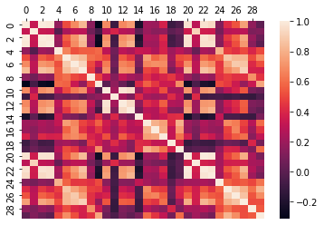
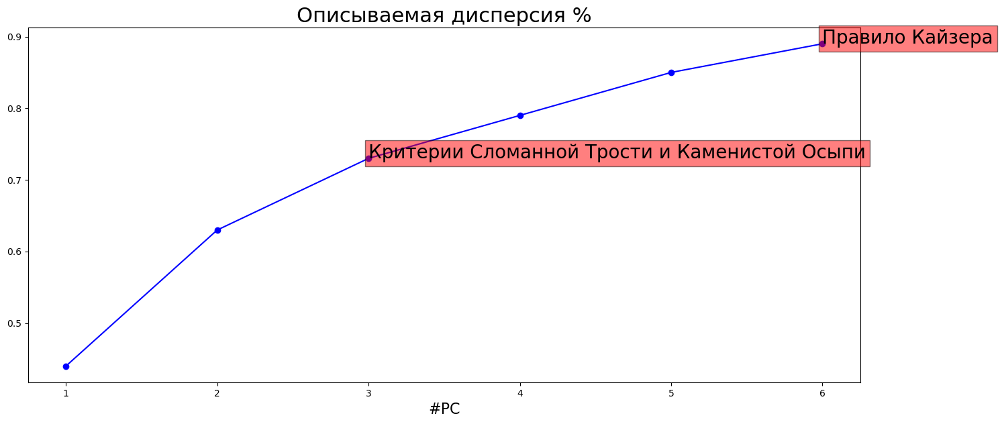
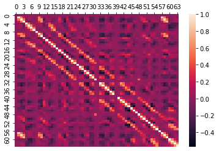
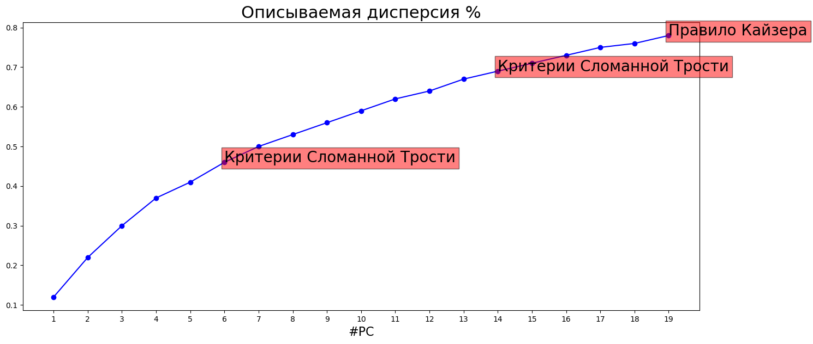
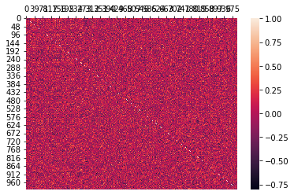
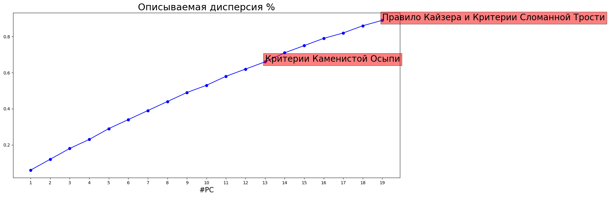

# Метод

Метод главных компонент (_англ._ Principal Component Analysis ) применяется для уменьшения размерности данных.

Реализация - https://github.com/ujnomw/neural-networks/blob/master/pca.ipynb

# Данные

Реализованный метод тестировался на трех различных датасетах.

| Датасет             | Количество признаков |
| ------------------- | -------------------- |
| Breast Cancer       | 30                   |
| MNIST               | 64                   |
| Custom (make_blobs) | 1000                 |

# Результаты

## Breast Cancer

### Матрица кореляции

### Список признаков

'mean radius', 'mean texture', 'mean perimeter', 'mean area',
'mean smoothness', 'mean compactness', 'mean concavity',
'mean concave points', 'mean symmetry', 'mean fractal dimension',
'radius error', 'texture error', 'perimeter error', 'area error',
'smoothness error', 'compactness error', 'concavity error',
'concave points error', 'symmetry error',
'fractal dimension error', 'worst radius', 'worst texture',
'worst perimeter', 'worst area', 'worst smoothness',
'worst compactness', 'worst concavity', 'worst concave points',
'worst symmetry', 'worst fractal dimension'

### Отобранные компоненты

| Критерий выбора  | Количество компонент |
| ---------------- | -------------------- |
| Кайзера          | 6                    |
| Сломанной трости | 3                    |
| Каменистой осыпи | 3                    |

### Матрица факторной нагрузки

|                         |       PC1 |        PC2 |        PC3 |        PC4 |        PC5 |          PC6 |
| :---------------------- | --------: | ---------: | ---------: | ---------: | ---------: | -----------: |
| mean radius             |  0.798469 |  -0.558394 | -0.0143338 |  0.0583282 |  0.0485615 |    0.0206099 |
| mean texture            |  0.378346 |  -0.142564 |   0.108454 |  -0.849451 | -0.0635753 |   -0.0353892 |
| mean perimeter          |  0.829965 |    -0.5138 | -0.0156493 |  0.0591369 |  0.0480325 |    0.0190347 |
| mean area               |  0.806101 |  -0.551755 |  0.0482195 |  0.0752663 |  0.0132773 |   -0.0020768 |
| mean smoothness         |   0.52011 |   0.444392 |  -0.175226 |   0.224505 |  -0.469197 |    -0.314945 |
| mean compactness        |  0.872817 |    0.36268 |  -0.124485 |  0.0447856 |  0.0150415 |   -0.0155403 |
| mean concavity          |  0.942542 |    0.14366 | 0.00459327 |  0.0269361 |   0.111006 |   -0.0102763 |
| mean concave points     |   0.95149 | -0.0830163 | -0.0429506 |  0.0920316 | -0.0563684 |   -0.0572427 |
| mean symmetry           |  0.503978 |   0.454506 | -0.0676092 |  0.0945516 |  -0.393183 |      0.39202 |
| mean fractal dimension  |  0.234772 |   0.875292 | -0.0379279 |  0.0684389 | -0.0570924 |    -0.131345 |
| radius error            |  0.751328 |  -0.252033 |    0.45109 |   0.137959 |  -0.198501 |   -0.0281571 |
| texture error           | 0.0635705 |   0.214849 |   0.629441 |  -0.506889 |  -0.246301 |   -0.0316153 |
| perimeter error         |  0.770833 |  -0.213602 |   0.448005 |   0.125354 |  -0.155492 |   0.00199151 |
| area error              |  0.739987 |  -0.363638 |   0.362924 |   0.152417 |  -0.163953 |   -0.0471411 |
| smoothness error        | 0.0530049 |    0.48813 |   0.518896 |  0.0629136 |  -0.298241 |    -0.377128 |
| compactness error       |  0.621527 |   0.555669 |   0.260053 | -0.0386931 |   0.359803 |    0.0761011 |
| concavity error         |  0.560234 |   0.470883 |   0.296486 | 0.00185495 |   0.454923 |    0.0619644 |
| concave points error    |  0.669033 |   0.311176 |   0.377459 |   0.104331 |    0.25131 |   -0.0343398 |
| symmetry error          |  0.155017 |   0.438984 |   0.484865 |  0.0620813 |  -0.324977 |     0.539155 |
| fractal dimension error |  0.374128 |   0.668791 |   0.355358 |  0.0215581 |   0.338379 |   -0.0585022 |
| worst radius            |  0.831641 |  -0.524987 | -0.0798189 |  0.0217166 | -0.0056632 | -0.000318999 |
| worst texture           |  0.381062 |  -0.108565 | -0.0710668 |  -0.891367 |   -0.11937 |   -0.0549971 |
| worst perimeter         |  0.863167 |  -0.477261 | -0.0815655 |  0.0194425 | 0.00957975 |   0.00934978 |
| worst area              |  0.820238 |  -0.523759 | -0.0199977 |  0.0364752 | -0.0352018 |   -0.0276742 |
| worst smoothness        |   0.46672 |   0.411421 |  -0.436499 |  0.0248647 |  -0.416951 |    -0.406094 |
| worst compactness       |  0.766346 |   0.342865 |  -0.396643 |  -0.128644 |   0.156538 |    0.0524651 |
| worst concavity         |  0.834453 |   0.233914 |  -0.290763 |  -0.104167 |   0.242276 |    0.0312105 |
| worst concave points    |  0.915132 | -0.0197163 |  -0.286204 |  0.0084614 |  0.0556885 |   -0.0339536 |
| worst symmetry          |  0.448307 |   0.338783 |  -0.455846 | -0.0510624 |  -0.314297 |     0.548702 |
| worst fractal dimension |  0.480695 |   0.657443 |  -0.391125 |  -0.108537 |   0.121349 |   -0.0882277 |

### Ранжированный список признаков с суммарной нагрузкой

Для 6 компонент:

|                         | Суммарная нагрузка |
| :---------------------- | -----------------: |
| concavity error         |           0.938903 |
| compactness error       |           0.879585 |
| fractal dimension error |           0.819571 |
| symmetry error          |           0.796381 |
| concave points error    |           0.776787 |
| mean concavity          |           0.417454 |
| mean symmetry           |           0.405918 |
| perimeter error         |           0.358327 |
| mean compactness        |           0.346453 |
| worst concavity         |           0.296621 |
| mean fractal dimension  |           0.293096 |
| radius error            |            0.28679 |
| worst symmetry          |           0.211593 |
| area error              |            0.20435 |
| worst compactness       |           0.195795 |
| mean concave points     |           0.169948 |
| worst fractal dimension |           0.111478 |
| mean perimeter          |          0.0997078 |
| worst concave points    |          0.0907503 |
| mean area               |           0.080495 |
| mean radius             |          0.0744501 |
| worst perimeter         |          0.0179727 |
| smoothness error        |          -0.002518 |
| worst radius            |         -0.0286567 |
| worst area              |          -0.033044 |
| texture error           |          -0.098212 |
| mean smoothness         |          -0.267669 |
| mean texture            |          -0.576129 |
| worst smoothness        |          -0.635579 |
| worst texture           |          -0.758995 |

Для 3 компонент:

|                         | Суммарная нагрузка |
| :---------------------- | -----------------: |
| fractal dimension error |           0.594164 |
| compactness error       |           0.557889 |
| concave points error    |           0.538396 |
| smoothness error        |           0.527801 |
| concavity error         |           0.527261 |
| symmetry error          |            0.51493 |
| texture error           |           0.482042 |
| mean fractal dimension  |           0.408364 |
| perimeter error         |           0.388514 |
| radius error            |           0.368908 |
| mean concavity          |             0.3213 |
| mean compactness        |           0.317085 |
| mean symmetry           |           0.288277 |
| area error              |           0.266584 |
| mean smoothness         |           0.224411 |
| mean concave points     |           0.200523 |
| worst fractal dimension |           0.174332 |
| worst concavity         |           0.153675 |
| worst compactness       |           0.117614 |
| mean texture            |           0.108568 |
| worst concave points    |          0.0722842 |
| worst smoothness        |          0.0404592 |
| mean area               |          0.0186179 |
| worst texture           |          0.0167041 |
| mean perimeter          |         0.00304179 |
| worst area              |        -0.00638363 |
| worst symmetry          |        -0.00652495 |
| worst perimeter         |         -0.0117853 |
| mean radius             |         -0.0234859 |
| worst radius            |         -0.0393768 |

### Анализ остатков: матрица остатков корреляции

Для 6 компонент:

|                         | mean radius | mean texture | mean perimeter |  mean area | mean smoothness | mean compactness | mean concavity | mean concave points | mean symmetry | mean fractal dimension | radius error | texture error | perimeter error | area error | smoothness error | compactness error | concavity error | concave points error | symmetry error | fractal dimension error | worst radius | worst texture | worst perimeter | worst area | worst smoothness | worst compactness | worst concavity | worst concave points | worst symmetry | worst fractal dimension |
| :---------------------- | ----------: | -----------: | -------------: | ---------: | --------------: | ---------------: | -------------: | ------------------: | ------------: | ---------------------: | -----------: | ------------: | --------------: | ---------: | ---------------: | ----------------: | --------------: | -------------------: | -------------: | ----------------------: | -----------: | ------------: | --------------: | ---------: | ---------------: | ----------------: | --------------: | -------------------: | -------------: | ----------------------: |
| mean radius             |    0.980711 |     0.321187 |       0.979123 |   0.968348 |        0.175014 |         0.504077 |       0.669721 |            0.811294 |      0.152214 |              -0.296782 |     0.667953 |    -0.0891115 |        0.663437 |   0.722259 |        -0.210877 |          0.210086 |        0.196779 |             0.375233 |     -0.0955891 |              -0.0336289 |     0.950735 |      0.295005 |        0.946886 |    0.92262 |         0.123953 |          0.411449 |        0.521928 |             0.733827 |       0.165838 |               0.0142915 |
| mean texture            |    0.321187 |     0.935696 |       0.326574 |   0.318925 |     -0.00391046 |         0.232131 |       0.293357 |            0.292332 |     0.0710207 |              -0.074215 |     0.271967 |      0.339317 |        0.275941 |   0.259075 |       0.00571037 |          0.172569 |        0.126429 |              0.15474 |    -0.00259362 |                0.041409 |     0.348816 |      0.848498 |        0.353449 |   0.340345 |        0.0891455 |           0.26546 |        0.287646 |             0.291943 |       0.100196 |                0.111958 |
| mean perimeter          |    0.979123 |     0.326574 |       0.981768 |   0.968044 |        0.210462 |         0.554272 |       0.708845 |            0.839585 |      0.187017 |              -0.247821 |     0.680941 |    -0.0789094 |        0.682727 |   0.731783 |        -0.191801 |          0.254556 |        0.230579 |              0.40622 |     -0.0727874 |               0.0030588 |     0.951066 |       0.30044 |        0.952493 |   0.923477 |         0.153366 |          0.453098 |        0.558454 |             0.760543 |       0.190564 |               0.0571165 |
| mean area               |    0.968348 |     0.318925 |       0.968044 |   0.980772 |        0.178462 |         0.496808 |       0.679268 |            0.811557 |      0.155619 |              -0.269068 |     0.718361 |    -0.0611918 |        0.713163 |   0.783889 |        -0.160171 |          0.217393 |        0.211133 |             0.370479 |      -0.065289 |              -0.0112535 |     0.944243 |      0.286418 |        0.941279 |   0.940576 |         0.126176 |          0.391071 |        0.510125 |             0.712873 |       0.148154 |               0.0128777 |
| mean smoothness         |    0.175014 |  -0.00391046 |       0.210462 |   0.178462 |        0.942839 |         0.642201 |       0.514789 |            0.538209 |      0.539207 |               0.555622 |     0.287227 |     0.0692017 |        0.284714 |   0.234333 |         0.293392 |          0.326645 |        0.261448 |             0.379149 |       0.200196 |                0.283545 |     0.213612 |     0.0512636 |        0.239383 |   0.204614 |          0.75153 |           0.46983 |        0.437013 |             0.493933 |       0.390545 |                0.485094 |
| mean compactness        |    0.504077 |     0.232131 |       0.554272 |   0.496808 |        0.642201 |         0.988328 |       0.874993 |            0.822295 |      0.596695 |               0.554656 |     0.498655 |     0.0497916 |        0.550288 |   0.456423 |         0.132469 |          0.736965 |         0.57096 |             0.641939 |       0.237933 |                0.506529 |     0.530902 |      0.239659 |        0.585404 |   0.505673 |         0.543593 |           0.85211 |        0.804758 |              0.80355 |       0.501566 |                0.671801 |
| mean concavity          |    0.669721 |     0.293357 |       0.708845 |   0.679268 |        0.514789 |         0.874993 |       0.991907 |             0.91274 |      0.503482 |               0.334088 |     0.629752 |      0.077431 |        0.658302 |   0.614297 |        0.0985197 |          0.667405 |         0.68913 |             0.680382 |       0.189954 |                0.448003 |     0.679955 |      0.288948 |        0.721136 |   0.668069 |         0.437071 |          0.744899 |        0.873959 |               0.8505 |       0.410515 |                0.505905 |
| mean concave points     |    0.811294 |     0.292332 |       0.839585 |   0.811557 |        0.538209 |         0.822295 |        0.91274 |            0.986962 |      0.459671 |               0.165679 |     0.687895 |     0.0253147 |        0.701442 |   0.679154 |         0.023741 |          0.493326 |        0.443194 |             0.614027 |       0.102876 |                0.261914 |     0.817707 |      0.289918 |        0.843522 |   0.796709 |         0.436223 |          0.661327 |        0.746181 |             0.898235 |       0.374314 |                0.364791 |
| mean symmetry           |    0.152214 |    0.0710207 |       0.187017 |   0.155619 |        0.539207 |         0.596695 |       0.503482 |            0.459671 |      0.950831 |                0.47396 |     0.299341 |      0.121211 |        0.310279 |   0.222857 |         0.191566 |          0.434547 |        0.363228 |             0.409476 |       0.403837 |                0.351362 |     0.186899 |     0.0854215 |        0.220142 |    0.17887 |         0.412876 |          0.468788 |        0.437559 |             0.429064 |       0.642893 |                0.437228 |
| mean fractal dimension  |   -0.296782 |    -0.074215 |      -0.247821 |  -0.269068 |        0.555622 |         0.554656 |       0.334088 |            0.165679 |       0.47396 |               0.973099 |   0.00627669 |      0.159481 |       0.0465465 | -0.0820122 |          0.37818 |          0.555267 |        0.445429 |             0.338758 |       0.349707 |                 0.67737 |    -0.241644 |    -0.0528476 |       -0.193813 |  -0.220548 |         0.472295 |           0.45033 |        0.341904 |             0.172717 |       0.333562 |                0.746474 |
| radius error            |    0.667953 |     0.271967 |       0.680941 |   0.718361 |        0.287227 |         0.498655 |       0.629752 |            0.687895 |      0.299341 |             0.00627669 |     0.972551 |       0.19473 |        0.947548 |   0.926008 |         0.142114 |          0.364223 |        0.341476 |             0.509238 |       0.229074 |                0.233881 |     0.704128 |      0.194164 |        0.709765 |   0.737818 |          0.13615 |          0.302329 |        0.393444 |             0.532565 |       0.104943 |               0.0676114 |
| texture error           |  -0.0891115 |     0.339317 |     -0.0789094 | -0.0611918 |       0.0692017 |        0.0497916 |       0.077431 |           0.0253147 |      0.121211 |               0.159481 |      0.19473 |      0.938922 |        0.205063 |  0.0995948 |         0.363428 |          0.222001 |        0.188949 |             0.220975 |       0.380957 |                0.267175 |    -0.104133 |      0.366439 |      -0.0947432 | -0.0785088 |       -0.0690758 |        -0.0805011 |      -0.0575757 |            -0.106192 |      -0.120901 |              -0.0364596 |
| perimeter error         |    0.663437 |     0.275941 |       0.682727 |   0.713163 |        0.284714 |         0.550288 |       0.658302 |            0.701442 |      0.310279 |              0.0465465 |     0.947548 |      0.205063 |        0.976776 |   0.913931 |         0.131598 |          0.423507 |        0.370482 |             0.552545 |       0.255491 |                0.249877 |     0.686668 |      0.197718 |        0.711458 |   0.717696 |          0.12619 |          0.355695 |         0.43036 |             0.556244 |       0.119011 |                0.102371 |
| area error              |    0.722259 |     0.259075 |       0.731783 |   0.783889 |        0.234333 |         0.456423 |       0.614297 |            0.679154 |      0.222857 |             -0.0820122 |     0.926008 |     0.0995948 |        0.913931 |   0.974987 |        0.0577328 |          0.293152 |        0.279405 |             0.411693 |       0.127975 |                 0.13404 |     0.744168 |      0.198772 |        0.749047 |   0.795846 |         0.120736 |           0.29663 |         0.39563 |             0.537371 |      0.0855758 |               0.0348148 |
| smoothness error        |   -0.210877 |   0.00571037 |      -0.191801 |  -0.160171 |        0.293392 |         0.132469 |      0.0985197 |            0.023741 |      0.191566 |                0.37818 |     0.142114 |      0.363428 |        0.131598 |  0.0577328 |         0.939596 |           0.33563 |        0.269952 |             0.315477 |       0.410194 |                0.411679 |    -0.220195 |    -0.0727308 |       -0.206399 |  -0.176692 |         0.283154 |        -0.0378311 |      -0.0410501 |           -0.0922237 |     -0.0737575 |                0.103957 |
| compactness error       |    0.210086 |     0.172569 |       0.254556 |   0.217393 |        0.326645 |         0.736965 |       0.667405 |            0.493326 |      0.434547 |               0.555267 |     0.364223 |      0.222001 |        0.423507 |   0.293152 |          0.33563 |          0.989335 |        0.789739 |             0.738787 |       0.407435 |                0.791711 |     0.208397 |      0.123283 |        0.263784 |   0.203692 |         0.228196 |          0.671199 |        0.630615 |             0.481861 |       0.288768 |                0.580582 |
| concavity error         |    0.196779 |     0.126429 |       0.230579 |   0.211133 |        0.261448 |          0.57096 |        0.68913 |            0.443194 |      0.363228 |               0.445429 |     0.341476 |      0.188949 |        0.370482 |   0.279405 |         0.269952 |          0.789739 |        0.986725 |             0.765259 |       0.328522 |                0.714595 |     0.189992 |     0.0840464 |        0.229343 |    0.19203 |         0.174454 |          0.478917 |        0.654584 |             0.439997 |       0.216663 |                0.431139 |
| concave points error    |    0.375233 |      0.15474 |        0.40622 |   0.370479 |        0.379149 |         0.641939 |       0.680382 |            0.614027 |      0.409476 |               0.338758 |     0.509238 |      0.220975 |        0.552545 |   0.411693 |         0.315477 |          0.738787 |        0.765259 |             0.992715 |       0.326932 |                0.601918 |     0.357459 |      0.079189 |        0.394427 |   0.340552 |         0.211882 |            0.4548 |        0.548971 |             0.602549 |       0.166048 |                0.309484 |
| symmetry error          |  -0.0955891 |  -0.00259362 |     -0.0727874 |  -0.065289 |        0.200196 |         0.237933 |       0.189954 |            0.102876 |      0.403837 |               0.349707 |     0.229074 |      0.380957 |        0.255491 |   0.127975 |         0.410194 |          0.407435 |        0.328522 |             0.326932 |       0.937879 |                0.386503 |    -0.120549 |    -0.0887492 |      -0.0958968 |  -0.103719 |      -0.00234297 |         0.0744061 |       0.0569037 |           -0.0148894 |       0.344135 |               0.0966884 |
| fractal dimension error |  -0.0336289 |     0.041409 |      0.0030588 | -0.0112535 |        0.283545 |         0.506529 |       0.448003 |            0.261914 |      0.351362 |                0.67737 |     0.233881 |      0.267175 |        0.249877 |    0.13404 |         0.411679 |          0.791711 |        0.714595 |             0.601918 |       0.386503 |                0.982931 |   -0.0285056 |    -0.0154463 |      0.00754058 | -0.0144052 |          0.16532 |            0.3882 |        0.376488 |             0.217955 |       0.136375 |                0.581544 |
| worst radius            |    0.950735 |     0.348816 |       0.951066 |   0.944243 |        0.213612 |         0.530902 |       0.679955 |            0.817707 |      0.186899 |              -0.241644 |     0.704128 |     -0.104133 |        0.686668 |   0.744168 |        -0.220195 |          0.208397 |        0.189992 |             0.357459 |      -0.120549 |              -0.0285056 |      0.98122 |      0.355981 |        0.975364 |    0.96566 |         0.216475 |          0.471353 |         0.56733 |              0.77532 |       0.241738 |               0.0977527 |
| worst texture           |    0.295005 |     0.848498 |        0.30044 |   0.286418 |       0.0512636 |         0.239659 |       0.288948 |            0.289918 |     0.0854215 |             -0.0528476 |     0.194164 |      0.366439 |        0.197718 |   0.198772 |       -0.0727308 |          0.123283 |       0.0840464 |             0.079189 |     -0.0887492 |              -0.0154463 |     0.355981 |      0.935694 |        0.360084 |    0.34301 |         0.231116 |          0.342614 |        0.350583 |              0.35259 |       0.220371 |                0.205669 |
| worst perimeter         |    0.946886 |     0.353449 |       0.952493 |   0.941279 |        0.239383 |         0.585404 |       0.721136 |            0.843522 |      0.220142 |              -0.193813 |     0.709765 |    -0.0947432 |        0.711458 |   0.749047 |        -0.206399 |          0.263784 |        0.229343 |             0.394427 |     -0.0958968 |              0.00754058 |     0.975364 |      0.360084 |        0.982046 |   0.959765 |         0.236183 |          0.523951 |        0.610894 |             0.803927 |       0.266931 |                0.141986 |
| worst area              |     0.92262 |     0.340345 |       0.923477 |   0.940576 |        0.204614 |         0.505673 |       0.668069 |            0.796709 |       0.17887 |              -0.220548 |     0.737818 |    -0.0785088 |        0.717696 |   0.795846 |        -0.176692 |          0.203692 |         0.19203 |             0.340552 |      -0.103719 |              -0.0144052 |      0.96566 |       0.34301 |        0.959765 |   0.981621 |         0.207673 |          0.436521 |        0.539116 |             0.736634 |       0.210691 |               0.0857753 |
| worst smoothness        |    0.123953 |    0.0891455 |       0.153366 |   0.126176 |         0.75153 |         0.543593 |       0.437071 |            0.436223 |      0.412876 |               0.472295 |      0.13615 |    -0.0690758 |         0.12619 |   0.120736 |         0.283154 |          0.228196 |        0.174454 |             0.211882 |    -0.00234297 |                 0.16532 |     0.216475 |      0.231116 |        0.236183 |   0.207673 |         0.944131 |          0.554197 |        0.509519 |             0.532256 |       0.489199 |                0.591867 |
| worst compactness       |    0.411449 |      0.26546 |       0.453098 |   0.391071 |         0.46983 |          0.85211 |       0.744899 |            0.661327 |      0.468788 |                0.45033 |     0.302329 |    -0.0805011 |        0.355695 |    0.29663 |       -0.0378311 |          0.671199 |        0.478917 |               0.4548 |      0.0744061 |                  0.3882 |     0.471353 |      0.342614 |        0.523951 |   0.436521 |         0.554197 |           0.97385 |        0.868957 |             0.784084 |       0.595389 |                0.785231 |
| worst concavity         |    0.521928 |     0.287646 |       0.558454 |   0.510125 |        0.437013 |         0.804758 |       0.873959 |            0.746181 |      0.437559 |               0.341904 |     0.393444 |    -0.0575757 |         0.43036 |    0.39563 |       -0.0410501 |          0.630615 |        0.654584 |             0.548971 |      0.0569037 |                0.376488 |      0.56733 |      0.350583 |        0.610894 |   0.539116 |         0.509519 |          0.868957 |        0.977955 |             0.839254 |       0.523608 |                0.665096 |
| worst concave points    |    0.733827 |     0.291943 |       0.760543 |   0.712873 |        0.493933 |          0.80355 |         0.8505 |            0.898235 |      0.429064 |               0.172717 |     0.532565 |     -0.106192 |        0.556244 |   0.537371 |       -0.0922237 |          0.481861 |        0.439997 |             0.602549 |     -0.0148894 |                0.217955 |      0.77532 |       0.35259 |        0.803927 |   0.736634 |         0.532256 |          0.784084 |        0.839254 |             0.983056 |       0.494121 |                0.497041 |
| worst symmetry          |    0.165838 |     0.100196 |       0.190564 |   0.148154 |        0.390545 |         0.501566 |       0.410515 |            0.374314 |      0.642893 |               0.333562 |     0.104943 |     -0.120901 |        0.119011 |  0.0855758 |       -0.0737575 |          0.288768 |        0.216663 |             0.166048 |       0.344135 |                0.136375 |     0.241738 |      0.220371 |        0.266931 |   0.210691 |         0.489199 |          0.595389 |        0.523608 |             0.494121 |       0.919473 |                0.527962 |
| worst fractal dimension |   0.0142915 |     0.111958 |      0.0571165 |  0.0128777 |        0.485094 |         0.671801 |       0.505905 |            0.364791 |      0.437228 |               0.746474 |    0.0676114 |    -0.0364596 |        0.102371 |  0.0348148 |         0.103957 |          0.580582 |        0.431139 |             0.309484 |      0.0966884 |                0.581544 |    0.0977527 |      0.205669 |        0.141986 |  0.0857753 |         0.591867 |          0.785231 |        0.665096 |             0.497041 |       0.527962 |                0.968443 |

Для 3 компонент:

|                         | mean radius | mean texture | mean perimeter |    mean area | mean smoothness | mean compactness | mean concavity | mean concave points | mean symmetry | mean fractal dimension | radius error | texture error | perimeter error | area error | smoothness error | compactness error | concavity error | concave points error | symmetry error | fractal dimension error | worst radius | worst texture | worst perimeter |  worst area | worst smoothness | worst compactness | worst concavity | worst concave points | worst symmetry | worst fractal dimension |
| :---------------------- | ----------: | -----------: | -------------: | -----------: | --------------: | ---------------: | -------------: | ------------------: | ------------: | ---------------------: | -----------: | ------------: | --------------: | ---------: | ---------------: | ----------------: | --------------: | -------------------: | -------------: | ----------------------: | -----------: | ------------: | --------------: | ----------: | ---------------: | ----------------: | --------------: | -------------------: | -------------: | ----------------------: |
| mean radius             |    0.950512 |     0.305868 |       0.949495 |     0.937937 |        0.175714 |         0.497028 |       0.655462 |            0.790467 |      0.153836 |              -0.278056 |       0.6451 |    -0.0891639 |        0.641385 |   0.697025 |        -0.201427 |            0.2134 |        0.199483 |             0.370845 |     -0.0884436 |              -0.0226154 |     0.920534 |      0.280534 |        0.917403 |    0.892453 |         0.124703 |          0.406518 |        0.512915 |              0.71609 |       0.166248 |               0.0231741 |
| mean texture            |    0.305868 |      0.99448 |       0.312244 |     0.302702 |       -0.017842 |         0.237372 |       0.297071 |            0.283868 |     0.0765585 |             -0.0608486 |     0.260531 |      0.385451 |        0.266963 |   0.243087 |        0.0115573 |          0.195522 |        0.145312 |             0.161009 |      0.0124311 |               0.0615205 |     0.335626 |      0.908542 |        0.341784 |    0.326209 |        0.0852647 |          0.281457 |        0.300981 |             0.289384 |       0.111693 |                0.131468 |
| mean perimeter          |    0.949495 |     0.312244 |       0.952681 |     0.938383 |        0.211073 |         0.546851 |       0.694647 |             0.81904 |      0.188069 |              -0.229718 |      0.65963 |    -0.0772265 |        0.662127 |    0.70797 |        -0.181003 |          0.257841 |        0.233317 |             0.402407 |     -0.0652227 |               0.0142193 |     0.921348 |      0.286606 |        0.923436 |    0.893965 |         0.153606 |          0.447084 |        0.548657 |             0.742411 |       0.189464 |               0.0647437 |
| mean area               |    0.937937 |     0.302702 |       0.938383 |     0.950289 |         0.18528 |         0.492535 |       0.666547 |            0.792867 |      0.159757 |              -0.246776 |     0.696189 |    -0.0618067 |          0.6916 |    0.75921 |         -0.14785 |          0.220526 |        0.212943 |             0.366213 |      -0.058622 |            -8.55024e-05 |     0.914405 |      0.271857 |        0.912227 |    0.910862 |         0.133363 |          0.388226 |        0.502509 |              0.69728 |       0.150508 |               0.0248761 |
| mean smoothness         |    0.175714 |    -0.017842 |       0.211073 |      0.18528 |        0.977231 |         0.637085 |       0.511041 |            0.545475 |      0.539877 |               0.561217 |     0.324933 |      0.096476 |        0.318307 |   0.267929 |         0.348746 |          0.314638 |        0.248454 |             0.387994 |       0.215298 |                0.283981 |      0.21375 |     0.0313373 |         0.23803 |    0.210603 |         0.769551 |          0.437048 |        0.406989 |             0.480641 |       0.358646 |                0.459559 |
| mean compactness        |    0.497028 |     0.237372 |       0.546851 |     0.492535 |        0.637085 |         0.975609 |       0.866272 |             0.81368 |      0.586459 |               0.551568 |     0.511164 |     0.0767208 |        0.561792 |    0.46584 |         0.157607 |          0.737179 |         0.57257 |             0.648326 |       0.249238 |                0.513903 |     0.521837 |       0.23884 |        0.575696 |    0.499477 |         0.530656 |          0.828762 |        0.784612 |             0.785129 |       0.475246 |                0.652504 |
| mean concavity          |    0.655462 |     0.297071 |       0.694647 |     0.666547 |        0.511041 |         0.866272 |       0.983767 |             0.90113 |      0.493463 |               0.339932 |     0.628988 |     0.0966952 |        0.657382 |   0.610865 |         0.118552 |          0.672107 |        0.694704 |             0.685369 |       0.194481 |                0.459942 |     0.664561 |      0.289229 |        0.705724 |    0.654397 |         0.430419 |          0.731454 |        0.861621 |             0.834777 |       0.390059 |                0.500181 |
| mean concave points     |    0.790467 |     0.283868 |        0.81904 |     0.792867 |        0.545475 |          0.81368 |        0.90113 |            0.973509 |       0.45772 |               0.178548 |     0.686339 |      0.041707 |        0.699176 |   0.674077 |        0.0509473 |          0.493733 |        0.443213 |             0.615926 |        0.11407 |                0.272089 |     0.796297 |      0.278869 |        0.822077 |    0.777547 |         0.437889 |          0.644636 |        0.728514 |              0.87913 |       0.359156 |                0.359759 |
| mean symmetry           |    0.153836 |    0.0765585 |       0.188069 |     0.159757 |        0.539877 |         0.586459 |       0.493463 |             0.45772 |       0.98714 |               0.460597 |     0.322856 |      0.149208 |        0.332392 |   0.241998 |         0.198763 |            0.4184 |        0.342734 |             0.399304 |        0.46004 |                 0.33143 |     0.188382 |      0.087872 |        0.220687 |    0.182301 |         0.398905 |          0.446754 |        0.413258 |             0.414554 |       0.673291 |                0.407568 |
| mean fractal dimension  |   -0.278056 |   -0.0608486 |      -0.229718 |    -0.246776 |        0.561217 |         0.551568 |       0.339932 |            0.178548 |      0.460597 |               0.960039 |    0.0409674 |      0.184447 |       0.0789479 | -0.0483624 |         0.404143 |          0.552402 |        0.444206 |             0.351189 |       0.348854 |                0.677531 |    -0.224393 |    -0.0457284 |       -0.177843 |   -0.199864 |         0.469953 |          0.431866 |        0.330032 |             0.172071 |        0.30114 |                0.723178 |
| radius error            |      0.6451 |     0.260531 |        0.65963 |     0.696189 |        0.324933 |         0.511164 |       0.628988 |            0.686339 |      0.322856 |              0.0409674 |     0.961617 |      0.195924 |        0.936114 |   0.911969 |         0.165089 |          0.364948 |        0.336262 |             0.505183 |       0.239237 |                0.240513 |     0.685196 |      0.188688 |        0.691823 |    0.719341 |         0.175447 |          0.312472 |        0.395544 |             0.533034 |       0.125559 |               0.0925745 |
| texture error           |  -0.0891639 |     0.385451 |     -0.0772265 |   -0.0618067 |        0.096476 |        0.0767208 |      0.0966952 |            0.041707 |      0.149208 |               0.184447 |     0.195924 |      0.966113 |        0.207013 |  0.0978032 |         0.373171 |          0.235981 |        0.194437 |               0.2244 |       0.391017 |                0.274837 |   -0.0982466 |      0.420123 |      -0.0873448 |  -0.0737157 |       -0.0307393 |        -0.0472231 |      -0.0307157 |           -0.0839472 |     -0.0855976 |             -0.00165917 |
| perimeter error         |    0.641385 |     0.266963 |       0.662127 |       0.6916 |        0.318307 |         0.561792 |       0.657382 |            0.699176 |      0.332392 |              0.0789479 |     0.936114 |      0.207013 |        0.965037 |   0.899522 |         0.151951 |          0.424949 |        0.366327 |             0.548603 |       0.265557 |                0.256538 |     0.668287 |      0.194372 |        0.694066 |    0.699601 |         0.161727 |          0.365835 |        0.432869 |             0.556387 |       0.139233 |                0.126299 |
| area error              |    0.697025 |     0.243087 |        0.70797 |      0.75921 |        0.267929 |          0.46584 |       0.610865 |            0.674077 |      0.241998 |             -0.0483624 |     0.911969 |     0.0978032 |        0.899522 |   0.958101 |        0.0794702 |          0.293849 |        0.275177 |             0.407438 |       0.135744 |                0.141775 |     0.722219 |      0.188094 |        0.728049 |    0.774326 |         0.155608 |          0.304101 |        0.395551 |             0.534646 |       0.101607 |               0.0580567 |
| smoothness error        |   -0.201427 |    0.0115573 |      -0.181003 |     -0.14785 |        0.348746 |         0.157607 |       0.118552 |           0.0509473 |      0.198763 |               0.404143 |     0.165089 |      0.373171 |        0.151951 |  0.0794702 |         0.979497 |          0.337438 |        0.267016 |             0.327024 |       0.395867 |                0.418358 |    -0.206408 |    -0.0629851 |       -0.192515 |   -0.160453 |         0.340146 |        -0.0250591 |      -0.0298349 |           -0.0705021 |     -0.0816047 |                0.123841 |
| compactness error       |      0.2134 |     0.195522 |       0.257841 |     0.220526 |        0.314638 |         0.737179 |       0.672107 |            0.493733 |        0.4184 |               0.552402 |     0.364948 |      0.235981 |        0.424949 |   0.293849 |         0.337438 |           1.00006 |        0.802016 |             0.747277 |        0.39594 |                0.802232 |     0.211141 |      0.144471 |        0.266732 |    0.206415 |         0.220712 |          0.674573 |        0.637065 |             0.483549 |       0.271777 |                0.582973 |
| concavity error         |    0.199483 |     0.145312 |       0.233317 |     0.212943 |        0.248454 |          0.57257 |       0.694704 |            0.443213 |      0.342734 |               0.444206 |     0.336262 |      0.194437 |        0.366327 |   0.275177 |         0.267016 |          0.802016 |         1.00128 |             0.773718 |        0.30837 |                 0.72671 |     0.192135 |      0.102078 |        0.231863 |    0.193533 |          0.16844 |          0.486583 |        0.665276 |             0.444177 |       0.198072 |                0.438692 |
| concave points error    |    0.370845 |     0.161009 |       0.402407 |     0.366213 |        0.387994 |         0.648326 |       0.685369 |            0.615926 |      0.399304 |               0.351189 |     0.505183 |        0.2244 |        0.548603 |   0.407438 |         0.327024 |          0.747277 |        0.773718 |             0.999524 |       0.311244 |                0.614021 |     0.353978 |      0.086526 |        0.391413 |    0.337308 |         0.225581 |          0.462133 |        0.556426 |             0.606661 |       0.152742 |                0.322967 |
| symmetry error          |  -0.0884436 |    0.0124311 |     -0.0652227 |    -0.058622 |        0.215298 |         0.249238 |       0.194481 |             0.11407 |       0.46004 |               0.348854 |     0.239237 |      0.391017 |        0.265557 |   0.135744 |         0.395867 |           0.39594 |         0.30837 |             0.311244 |       0.986509 |                0.362275 |    -0.109505 |    -0.0681133 |       -0.084597 |  -0.0939821 |       0.00971715 |         0.0868546 |       0.0614774 |          -0.00425614 |       0.413022 |               0.0986578 |
| fractal dimension error |  -0.0226154 |    0.0615205 |      0.0142193 | -8.55024e-05 |        0.283981 |         0.513903 |       0.459942 |            0.272089 |       0.33143 |               0.677531 |     0.240513 |      0.274837 |        0.256538 |   0.141775 |         0.418358 |          0.802232 |         0.72671 |             0.614021 |       0.362275 |                0.993746 |   -0.0173302 |    0.00393648 |        0.018821 | -0.00296258 |         0.171657 |          0.396574 |        0.388711 |             0.229045 |       0.113162 |                0.588932 |
| worst radius            |    0.920534 |     0.335626 |       0.921348 |     0.914405 |         0.21375 |         0.521837 |       0.664561 |            0.796297 |      0.188382 |              -0.224393 |     0.685196 |    -0.0982466 |        0.668287 |   0.722219 |        -0.206408 |          0.211141 |        0.192135 |             0.353978 |      -0.109505 |              -0.0173302 |     0.950729 |      0.342532 |        0.945432 |    0.935757 |         0.214875 |          0.462113 |        0.554556 |             0.754781 |       0.239143 |                0.102229 |
| worst texture           |    0.280534 |     0.908542 |       0.286606 |     0.271857 |       0.0313373 |          0.23884 |       0.289229 |            0.278869 |      0.087872 |             -0.0457284 |     0.188688 |      0.420123 |        0.194372 |   0.188094 |       -0.0629851 |          0.144471 |        0.102078 |             0.086526 |     -0.0681133 |              0.00393648 |     0.342532 |      0.994422 |        0.347777 |    0.329449 |         0.217678 |          0.349092 |        0.356059 |             0.343694 |       0.224487 |                0.214446 |
| worst perimeter         |    0.917403 |     0.341784 |       0.923436 |     0.912227 |         0.23803 |         0.575696 |       0.705724 |            0.822077 |      0.220687 |              -0.177843 |     0.691823 |    -0.0873448 |        0.694066 |   0.728049 |        -0.192515 |          0.266732 |        0.231863 |             0.391413 |      -0.084597 |                0.018821 |     0.945432 |      0.347777 |         0.95263 |    0.930494 |         0.232886 |           0.51387 |        0.597653 |             0.782972 |       0.263032 |                0.145133 |
| worst area              |    0.892453 |     0.326209 |       0.893965 |     0.910862 |        0.210603 |         0.499477 |       0.654397 |            0.777547 |      0.182301 |              -0.199864 |     0.719341 |    -0.0737157 |        0.699601 |   0.774326 |        -0.160453 |          0.206415 |        0.193533 |             0.337308 |     -0.0939821 |             -0.00296258 |     0.935757 |      0.329449 |        0.930494 |    0.952356 |         0.212436 |          0.429664 |        0.528116 |              0.71853 |       0.209648 |               0.0935974 |
| worst smoothness        |    0.124703 |    0.0852647 |       0.153606 |     0.133363 |        0.769551 |         0.530656 |       0.430419 |            0.437889 |      0.398905 |               0.469953 |     0.175447 |    -0.0307393 |        0.161727 |   0.155608 |         0.340146 |          0.220712 |         0.16844 |             0.225581 |     0.00971715 |                0.171657 |     0.214875 |      0.217678 |        0.232886 |    0.212436 |         0.945256 |          0.513502 |        0.474917 |             0.511676 |       0.439334 |                0.557496 |
| worst compactness       |    0.406518 |     0.281457 |       0.447084 |     0.388226 |        0.437048 |         0.828762 |       0.731454 |            0.644636 |      0.446754 |               0.431866 |     0.312472 |    -0.0472231 |        0.365835 |   0.304101 |       -0.0250591 |          0.674573 |        0.486583 |             0.462133 |      0.0868546 |                0.396574 |     0.462113 |      0.349092 |         0.51387 |    0.429664 |         0.513502 |          0.943821 |        0.845352 |             0.758038 |       0.560272 |                0.754209 |
| worst concavity         |    0.512915 |     0.300981 |       0.548657 |     0.502509 |        0.406989 |         0.784612 |       0.861621 |            0.728514 |      0.413258 |               0.330032 |     0.395544 |    -0.0307157 |        0.432869 |   0.395551 |       -0.0298349 |          0.637065 |        0.665276 |             0.556426 |      0.0614774 |                0.388711 |     0.554556 |      0.356059 |        0.597653 |    0.528116 |         0.474917 |          0.845352 |        0.959756 |             0.815759 |       0.488806 |                0.643481 |
| worst concave points    |     0.71609 |     0.289384 |       0.742411 |      0.69728 |        0.480641 |         0.785129 |       0.834777 |             0.87913 |      0.414554 |               0.172071 |     0.533034 |    -0.0839472 |        0.556387 |   0.534646 |       -0.0705021 |          0.483549 |        0.444177 |             0.606661 |    -0.00425614 |                0.229045 |     0.754781 |      0.343694 |        0.782972 |     0.71853 |         0.511676 |          0.758038 |        0.815759 |             0.956617 |       0.465395 |                0.478892 |
| worst symmetry          |    0.166248 |     0.111693 |       0.189464 |     0.150508 |        0.358646 |         0.475246 |       0.390059 |            0.359156 |      0.673291 |                0.30114 |     0.125559 |    -0.0855976 |        0.139233 |   0.101607 |       -0.0816047 |          0.271777 |        0.198072 |             0.152742 |       0.413022 |                0.113162 |     0.239143 |      0.224487 |        0.263032 |    0.209648 |         0.439334 |          0.560272 |        0.488806 |             0.465395 |       0.947344 |                0.479394 |
| worst fractal dimension |   0.0231741 |     0.131468 |      0.0647437 |    0.0248761 |        0.459559 |         0.652504 |       0.500181 |            0.359759 |      0.407568 |               0.723178 |    0.0925745 |   -0.00165917 |        0.126299 |  0.0580567 |         0.123841 |          0.582973 |        0.438692 |             0.322967 |      0.0986578 |                0.588932 |     0.102229 |      0.214446 |        0.145133 |   0.0935974 |         0.557496 |          0.754209 |        0.643481 |             0.478892 |       0.479394 |                0.933141 |

### График описываемой дисперсии

## MNIST

### Матрица кореляций

### Список признаков

'pixel_0_0',
'pixel_0_1',
'pixel_0_2',
'pixel_0_3',
'pixel_0_4',
'pixel_0_5',
'pixel_0_6',
'pixel_0_7',
'pixel_1_0',
'pixel_1_1',
'pixel_1_2',
'pixel_1_3',
'pixel_1_4',
'pixel_1_5',
'pixel_1_6',
'pixel_1_7',
'pixel_2_0',
'pixel_2_1',
'pixel_2_2',
'pixel_2_3',
'pixel_2_4',
'pixel_2_5',
'pixel_2_6',
'pixel_2_7',
'pixel_3_0',
'pixel_3_1',
'pixel_3_2',
'pixel_3_3',
'pixel_3_4',
'pixel_3_5',
'pixel_3_6',
'pixel_3_7',
'pixel_4_0',
'pixel_4_1',
'pixel_4_2',
'pixel_4_3',
'pixel_4_4',
'pixel_4_5',
'pixel_4_6',
'pixel_4_7',
'pixel_5_0',
'pixel_5_1',
'pixel_5_2',
'pixel_5_3',
'pixel_5_4',
'pixel_5_5',
'pixel_5_6',
'pixel_5_7',
'pixel_6_0',
'pixel_6_1',
'pixel_6_2',
'pixel_6_3',
'pixel_6_4',
'pixel_6_5',
'pixel_6_6',
'pixel_6_7',
'pixel_7_0',
'pixel_7_1',
'pixel_7_2',
'pixel_7_3',
'pixel_7_4',
'pixel_7_5',
'pixel_7_6',
'pixel_7_7'

### Отобранные компоненты

| Критерий выбора  | Количество компонент |
| ---------------- | -------------------- |
| Кайзера          | 19                   |
| Сломанной трости | 14                   |
| Каменистой осыпи | 6                    |

### Матрица факторной нагрузки

|           |        PC1 |         PC2 |         PC3 |          PC4 |         PC5 |          PC6 |         PC7 |         PC8 |          PC9 |         PC10 |         PC11 |        PC12 |        PC13 |         PC14 |         PC15 |         PC16 |         PC17 |        PC18 |        PC19 |
| :-------- | ---------: | ----------: | ----------: | -----------: | ----------: | -----------: | ----------: | ----------: | -----------: | -----------: | -----------: | ----------: | ----------: | -----------: | -----------: | -----------: | -----------: | ----------: | ----------: |
| pixel_0_0 |          0 | 1.34097e-16 | 1.26023e-16 | -1.62374e-16 | 8.36564e-17 | -2.22566e-17 | 4.30525e-17 | 4.61581e-17 | -6.68794e-17 | -1.30315e-16 | -3.92738e-17 |  9.9532e-17 | 1.02115e-16 | -1.18219e-16 | -1.06498e-16 | -7.70681e-17 | -1.44849e-16 | 3.30357e-17 | 3.79584e-17 |
| pixel_0_1 |  -0.493877 |    0.113603 |   0.0535518 |     0.354801 |  -0.0516419 |     0.371602 |    0.168019 |   -0.180558 |    -0.289222 |    0.0802209 |    -0.065247 |    -0.25584 |    0.157009 |   -0.0478784 |    -0.149757 |    0.0888539 |     0.177863 |  -0.0650888 |   -0.135431 |
| pixel_0_2 |  -0.774738 |     0.14389 |   -0.128946 |     0.310945 |  -0.0252949 |     0.192169 |  0.00744603 | -0.00892035 |     -0.16261 |    0.0106207 |    -0.192283 |   0.0562553 |   0.0370795 |    0.0457528 |     0.116441 |    0.0233915 |   -0.0217141 |   0.0168496 |  -0.0229495 |
| pixel_0_3 |  -0.597229 |  -0.0502533 |  -0.0918625 |     0.334187 |   0.0752946 |    -0.161083 |   -0.362533 |   0.0480942 |     0.137662 |   -0.0287775 |    -0.202895 |    0.237184 |   0.0754351 |     0.213749 |    0.0516984 |    0.0826385 |    0.0244701 |   0.0114661 |   0.0252817 |
| pixel_0_4 |  0.0682126 |    0.376612 |   -0.152252 | -1.43402e-05 |   -0.241147 |    -0.149955 |   0.0614261 |  -0.0664326 |     0.125911 |   0.00711496 |     0.212951 |   0.0744479 |   0.0854045 |     0.186903 |    -0.342947 |     0.313919 |    -0.049615 |   -0.330379 |    0.208783 |
| pixel_0_5 |  0.0257387 |    0.662217 |   -0.206796 |  -0.00103006 |   0.0137556 |    -0.131881 |    0.226454 |   -0.115562 |   -0.0866158 |    -0.219345 |     0.361305 |  -0.0316458 |    0.139669 |    0.0387445 |    -0.106469 |     0.108822 |    -0.103767 |   -0.148144 |   0.0520555 |
| pixel_0_6 |   0.142218 |    0.603274 |  -0.0853118 |    0.0870296 |    0.363802 |    0.0483804 |   0.0563972 |   -0.153633 |   -0.0513695 |    -0.251382 |      0.19767 |   -0.136493 |    0.212079 |    0.0569028 |  -0.00331958 |    -0.139086 |    -0.196419 |   0.0644716 |  -0.0495927 |
| pixel_0_7 |   0.169911 |    0.352283 |  -0.0511863 |    0.0174253 |    0.485369 |     0.253202 |   -0.152185 |   -0.115023 |     0.213848 |   -0.0873332 |   -0.0568416 |   -0.152917 |   0.0111831 |      0.10019 |   -0.0923566 |    -0.240446 |    -0.230537 |    0.146976 |   0.0416243 |
| pixel_1_0 |  -0.094061 | -0.00248064 |  0.00638565 |    0.0286832 | -0.00108461 |   -0.0374468 |    0.121395 |    0.031422 |     0.203925 |     0.274191 |     0.124233 |   -0.196977 |  -0.0594361 |     0.164613 |   -0.0635404 |     0.394876 |    -0.189921 |    0.546495 |    0.227929 |
| pixel_1_1 |  -0.665427 |   0.0667139 |   -0.114969 |     0.247021 |   0.0116949 |     0.104415 |    0.192759 |  -0.0348192 |   -0.0232329 |     0.278762 |   0.00639858 |   -0.120386 |  -0.0550999 |   -0.0182501 |    -0.276767 |     0.105848 |   -0.0723656 |    0.110213 |  -0.0485779 |
| pixel_1_2 |   -0.62103 |   0.0350383 |   -0.392146 |     0.396483 |   0.0970852 |    -0.162283 |  -0.0573501 |    0.114154 |     0.149698 |    -0.076869 |   -0.0268429 |    0.148242 |  -0.0347312 |    0.0186108 |    0.0149592 |  -0.00363006 |   -0.0249246 |   0.0637926 |   -0.131044 |
| pixel_1_3 |   0.292541 |   -0.222857 |    0.379092 |     0.234816 |    0.195743 |   -0.0303903 |   -0.064235 |    0.199504 |     0.260785 |    -0.227333 |    -0.135977 |   0.0263721 |    0.303066 |    0.0705209 |    -0.194056 |   -0.0607154 |     0.105155 |   0.0133181 |   -0.116391 |
| pixel_1_4 | -0.0981118 |    0.138399 |    0.157075 |    -0.251722 |    -0.37367 |     0.129436 |   0.0318561 |    0.255085 |     0.293967 |    0.0588589 |    -0.243259 |   -0.149409 |    0.251551 |     -0.08941 |    -0.355929 |    -0.103483 |   -0.0814701 |  -0.0953376 |   0.0369954 |
| pixel_1_5 |  -0.104914 |    0.517216 |   -0.408472 |    -0.200828 |   -0.264362 |    -0.179081 |   -0.125321 |     0.18142 |     0.151574 |    -0.195912 |     0.203958 |  -0.0855521 |   0.0237482 |   -0.0647803 |    -0.077424 |     0.185976 |    0.0274628 |  -0.0574528 |  -0.0544583 |
| pixel_1_6 |   0.227057 |    0.643865 |   -0.164048 |   -0.0332638 |    0.328851 |     0.112099 |  -0.0449071 |  -0.0586371 |    0.0262598 |    -0.268673 |     0.173407 |   -0.172674 |   0.0615715 |    0.0555347 |    0.0578488 |    0.0470595 |   -0.0195005 |   0.0603442 |   -0.135986 |
| pixel_1_7 |   0.251432 |    0.330945 |  -0.0771442 |   -0.0107779 |    0.545499 |     0.391258 |  -0.0728327 |   -0.107443 |     0.263388 |    0.0180588 |    -0.186942 |    -0.10293 |   -0.101007 |     0.069741 |    -0.116103 |    -0.101201 |   -0.0861626 |   0.0580848 |   0.0808251 |
| pixel_2_0 | -0.0452573 |  -0.0177217 |   0.0203262 |    0.0494629 |    0.042724 |    -0.103773 |    0.161701 |   0.0932261 |     0.365052 |     0.469131 |     0.197455 |   -0.327296 |    0.173146 |     0.317926 |     0.326747 |   0.00818396 |    0.0673564 |  0.00870057 |  -0.0108758 |
| pixel_2_1 |  -0.370519 |  -0.0486559 |   -0.242042 |      0.35153 |    0.148552 |    -0.181747 |    0.347138 |    0.181742 |     0.135626 |     0.264599 |     0.144832 |  -0.0639268 |  -0.0707102 |    -0.193927 |    -0.277996 |   0.00149779 |   -0.0811972 |   0.0621783 |   -0.124022 |
| pixel_2_2 |   0.170875 |   -0.286116 |   -0.244689 |        0.421 |    0.253916 |     -0.21015 |    0.273699 |    0.158335 |     0.183355 |    -0.229755 |    0.0397443 |    0.147922 |   0.0717088 |    -0.199673 |    0.0181621 |   -0.0799697 |    0.0223401 |    0.144574 |   -0.235509 |
| pixel_2_3 |   0.333018 |   -0.203127 |    0.480358 |    -0.205928 |  -0.0663202 |     0.221585 |    0.317016 |   0.0425849 |     0.135341 |    -0.149296 |    -0.207215 |  -0.0292954 |    0.280277 |   -0.0998253 |     0.104457 |  -0.00743046 |   -0.0744122 |   0.0208826 |  0.00312763 |
| pixel_2_4 |  -0.401623 |    0.185637 |    0.280077 |    -0.403653 |   -0.387178 |     0.119358 |   0.0239238 |    0.125961 |     0.163082 |     0.162074 |    -0.236408 |  -0.0285588 |   0.0141049 |    -0.107707 |   -0.0678965 |    -0.152571 |     -0.18366 |    0.101545 |  -0.0242072 |
| pixel_2_5 |  0.0636448 |    0.385278 |   -0.421628 |    -0.295339 |   -0.268101 |    -0.134713 |   -0.282251 |    0.303685 |     0.112327 |    -0.049866 |    0.0487805 |  -0.0870745 |  -0.0378286 |    -0.163475 |    0.0165281 |     0.144737 |     0.142333 |     0.11594 |   -0.235137 |
| pixel_2_6 |   0.463973 |    0.352835 |   -0.322227 |   0.00707411 |    0.266185 |     0.264216 |   -0.115157 |    0.114928 |    0.0636336 |   -0.0242562 |   -0.0824728 |   -0.126073 |  -0.0950963 |   -0.0617556 |     0.103276 |     0.226908 |     0.146994 |   0.0117294 |   -0.107689 |
| pixel_2_7 |   0.282418 |    0.195276 |  -0.0599674 |   -0.0135778 |    0.407881 |     0.425703 |   0.0103349 |  -0.0827561 |      0.23375 |     0.215507 |    -0.252164 |   0.0945138 |   -0.225629 |   -0.0238215 |   -0.0923066 |     0.145315 |       0.1414 |  -0.0977405 |   0.0513592 |
| pixel_3_0 |  0.0107017 | -0.00938482 |   0.0457419 |     0.070108 |   0.0355312 |    -0.112067 |    0.158031 |   0.0787117 |     0.313089 |     0.393835 |     0.150297 |    -0.24874 |    0.224753 |     0.251441 |      0.38738 |     -0.16958 |     0.186563 |   -0.264899 |    -0.15452 |
| pixel_3_1 |   0.315431 |   -0.158287 |   -0.221288 |     0.445037 |    0.112545 |    -0.241277 |    0.406655 |    0.187901 |   -0.0283874 |     0.171438 |    0.0356919 |   0.0780734 |  -0.0557361 |    -0.138665 |    -0.132688 |   -0.0465446 |   -0.0425228 |  0.00934553 |  -0.0186386 |
| pixel_3_2 |   0.510058 |   -0.272097 |  -0.0975638 |     0.353606 |    0.126699 |    -0.144228 |    0.431037 |  -0.0769578 |    0.0298995 |   -0.0529834 |   0.00225278 |    0.126705 |   0.0851506 |    -0.250844 |    0.0731099 |    0.0604559 |   -0.0418054 |   0.0884604 |   -0.072333 |
| pixel_3_3 |   -0.17849 |    0.129673 |    0.260746 |     -0.23856 |   -0.103135 |    0.0975483 |    0.398034 |   -0.318058 |     0.228478 |   -0.0977789 |     -0.15665 |    0.222235 |    0.187269 |     -0.22463 |     0.300477 |     0.181061 |    -0.139639 |   0.0296428 |  -0.0177058 |
| pixel_3_4 |  -0.388991 |    0.398357 |    0.178762 |    -0.426275 |   -0.173992 |   -0.0514357 |   0.0482649 |  -0.0760517 |     0.101263 |     0.133878 |   -0.0889022 |    0.229355 |  -0.0042041 |   -0.0624967 |    0.0582148 |   -0.0389875 |   -0.0711792 |    0.213083 |   -0.211142 |
| pixel_3_5 |   0.347457 |    0.332731 |   -0.450367 |    -0.263441 |  -0.0803148 |   -0.0335114 |   -0.196017 |    0.171304 |   -0.0921445 |     0.179889 |    -0.118187 |   0.0144989 |    0.120542 |    -0.185664 |    0.0558445 |    0.0381727 |     0.139623 |    0.157015 |   -0.266349 |
| pixel_3_6 |   0.489505 |     0.13553 |   -0.368769 |     0.137396 | 0.000881955 |     0.145865 |   -0.270076 |    0.127925 |   -0.0374493 |     0.248063 |    -0.208578 |  -0.0515201 |   0.0292557 |    -0.225119 |    0.0817118 |     0.178557 |    0.0659082 |  -0.0705483 |   0.0595378 |
| pixel_3_7 |   0.142848 |   0.0645158 |  -0.0277494 |    0.0229681 |    0.176023 |     0.450832 |  -0.0349159 |   0.0156772 |     0.258893 |     0.253339 |    0.0889577 |    0.417806 |   -0.128043 |   -0.0778444 |   -0.0891655 |    0.0913087 |    0.0369808 |    -0.21827 |  -0.0796983 |
| pixel_4_0 |          0 |           0 |          -0 |            0 |          -0 |            0 |          -0 |           0 |            0 |           -0 |           -0 |          -0 |           0 |            0 |           -0 |           -0 |           -0 |          -0 |          -0 |
| pixel_4_1 |   0.647456 |   -0.284276 |  -0.0590017 |     0.378755 |   -0.156334 |   0.00926383 | -0.00388128 |   0.0723719 |    -0.204343 |      0.15349 |   -0.0955888 |  -0.0120035 |  -0.0875929 |     0.089389 |   -0.0399201 |    0.0207936 |   -0.0830556 |   0.0588448 |   0.0153949 |
| pixel_4_2 |   0.636896 |   -0.254602 |     0.17849 |     0.343366 |  -0.0810298 |   -0.0819666 |   -0.050995 |   -0.250303 |   -0.0182756 |    0.0332777 |   -0.0433912 | -0.00652498 | 0.000187097 |   -0.0413804 |     0.027126 |     0.190663 |    0.0434802 |  -0.0228301 |  0.00764577 |
| pixel_4_3 |  0.0137982 |    0.142268 |    0.629946 |    0.0875106 | -0.00148169 |    -0.127894 |  -0.0520279 |   -0.421471 |     0.159448 |    0.0453499 |   0.00167304 |    0.103581 |  -0.0971193 |   -0.0265685 |    0.0131135 |      0.23783 |     0.171159 |   0.0323591 |   -0.137181 |
| pixel_4_4 |  0.0355265 |    0.280487 |    0.562402 |    -0.213832 |   0.0677658 |    -0.158282 |  0.00967297 |   -0.164452 |    -0.121912 |    0.0578957 |    0.0641918 |    0.218362 |   -0.165422 |      0.31141 |    -0.137435 |    0.0523873 |     0.188355 |    0.160994 |   -0.238253 |
| pixel_4_5 |   0.431225 |   -0.012588 |   -0.446438 |     -0.27132 |  -0.0193373 |   -0.0322163 |  -0.0221585 |   -0.187572 |    -0.226247 |     0.176019 |    -0.119099 |    0.154377 |    0.182448 |     0.277795 |    -0.114104 |    -0.138258 |    0.0762274 |     0.15261 |   -0.156523 |
| pixel_4_6 |   0.350674 |   -0.191677 |   -0.500919 |    0.0258359 |   -0.111093 |   -0.0374113 |   -0.295477 |  -0.0694059 |   -0.0793031 |     0.260155 |    -0.158452 |   0.0355539 |    0.317168 |   -0.0313518 |    -0.119541 |   -0.0525703 |   -0.0872637 |   0.0310261 |   0.0498037 |
| pixel_4_7 |          0 |           0 |          -0 |            0 |          -0 |            0 |          -0 |           0 |            0 |           -0 |           -0 |          -0 |           0 |            0 |           -0 |           -0 |           -0 |          -0 |          -0 |
| pixel_5_0 |   0.150681 |  -0.0571959 |   0.0332211 |    0.0587904 |   -0.147906 |     0.331711 |  -0.0223046 |    0.108786 |   -0.0557713 |     0.150374 |     0.302041 |    0.277152 |  0.00710798 |     0.125458 |    0.0150213 |   -0.0120238 |    -0.406672 |  -0.0867503 |   -0.285442 |
| pixel_5_1 |   0.507219 |   -0.252066 |   0.0169824 |     0.244632 |   -0.343701 |      0.26131 |   -0.153988 |   0.0952196 |    -0.179048 |    0.0398973 |    0.0908241 |  -0.0969433 |  -0.0759178 |     0.193395 |    0.0332354 |  -0.00355347 |    -0.252567 |   0.0857939 |  -0.0714375 |
| pixel_5_2 |   0.416096 |   -0.456936 |     0.19772 |      0.27892 |   -0.271213 |    0.0651506 |   -0.305203 |   -0.115165 |     0.159083 |    -0.174821 |    0.0573354 |   -0.214629 |  -0.0917369 |    0.0412778 |   -0.0046674 |      0.13821 |   -0.0216552 |   0.0491188 |  -0.0765277 |
| pixel_5_3 |   0.126904 |   0.0220476 |    0.733614 |     0.211331 |  -0.0979717 |   -0.0735726 |    -0.26241 |   -0.074071 |    0.0683238 |      0.10794 |    0.0747461 |  -0.0964292 |  -0.0171132 |   -0.0419062 |    -0.164396 |   -0.0146839 |     0.016843 |   0.0613164 |   -0.136895 |
| pixel_5_4 |   0.300533 |    0.359658 |    0.610791 |    0.0333064 |   0.0368447 |   -0.0286219 |    0.126539 |    0.291422 |    -0.206779 |   -0.0174475 |  0.000863054 |   0.0431175 |   -0.046604 |     0.158961 |   -0.0532509 |     0.086773 |    0.0470827 |   0.0777157 |  -0.0874282 |
| pixel_5_5 |   0.290551 |   -0.219255 |      -0.449 |    -0.232056 |   -0.142322 |     0.121609 |    0.317951 |  -0.0226252 |   -0.0592443 |    -0.200573 |     -0.08253 |   0.0832225 |   0.0178507 |     0.398925 |   -0.0644166 |     0.061776 |    0.0929835 |   0.0567582 |   -0.117052 |
| pixel_5_6 | -0.0485836 |   -0.581174 |   -0.429024 |    -0.199868 |   0.0706187 |   -0.0495135 |   -0.135796 |   -0.368211 |    0.0531834 |    0.0614755 |   0.00891205 |   0.0366528 |    0.215392 |    0.0774427 |    -0.180014 |   -0.0968564 |    -0.016721 |   0.0050658 |  -0.0149742 |
| pixel_5_7 | 0.00615981 |   -0.190088 |   0.0728819 |    -0.119242 |    0.190637 |   -0.0416129 |   -0.170637 |   -0.168304 |   -0.0545657 |    0.0605757 |    0.0256116 |   0.0856425 |    0.537244 |   -0.0867352 |   -0.0152053 |      0.37363 |   -0.0965632 |   0.0435623 | -0.00289985 |
| pixel_6_0 |  0.0780984 |  -0.0242541 |  0.00913018 |    0.0441559 |   -0.106164 |     0.458471 |  -0.0581534 |    0.121456 |     0.115454 |     0.152729 |       0.4797 |    0.476093 |   0.0948473 |   -0.0539292 |    -0.029879 |   -0.0794039 |    0.0623414 | -0.00366094 |   0.0438887 |
| pixel_6_1 |  -0.110758 |   -0.085212 |   -0.037405 |     0.207421 |   -0.318987 |     0.575914 |  -0.0679035 |   0.0355832 |    -0.025924 |     -0.13489 |     0.257953 | -0.00429163 |    0.079995 |    0.0230501 |     0.189857 |   -0.0151244 |   -0.0423682 |    0.109092 |  -0.0588225 |
| pixel_6_2 |  -0.298847 |    -0.44837 |   -0.102524 |     0.250251 |   -0.205837 |     0.240087 |   -0.271114 |   0.0267578 |     0.276608 |    -0.323304 |    0.0639257 |   -0.155987 |  -0.0919348 |   -0.0823855 |     0.118596 |     0.109145 |   -0.0533659 |   0.0315703 |  -0.0658862 |
| pixel_6_3 | -0.0862481 |  -0.0954905 |    0.496368 |     0.265091 |   0.0699095 |    -0.140773 |   -0.388545 |    0.187073 |     0.199555 |   -0.0848109 |    0.0792929 |  -0.0139957 |    0.168921 |   -0.0130147 |    -0.252315 |   -0.0767546 |    0.0341157 |  -0.0588623 |   -0.102912 |
| pixel_6_4 |   0.214233 |    0.150608 |    0.296342 |    0.0997377 |  -0.0605657 |     0.195625 |    0.305101 |    0.527926 |   -0.0627905 |     -0.15306 |    -0.240863 |   0.0204352 |    0.129979 |     0.212946 |    -0.159527 |     0.081673 |    0.0856177 |     0.00723 |   0.0119467 |
| pixel_6_5 |   -0.18516 |    -0.46652 |   -0.426556 |    -0.295923 |  -0.0879672 |     0.187962 |    0.241678 |   0.0768847 |      0.11263 |    -0.226596 |   -0.0761562 |  -0.0335065 |  -0.0186957 |      0.17287 |   -0.0893061 |    0.0923569 |     0.115187 | -0.00538698 |  -0.0696672 |
| pixel_6_6 |  -0.328595 |   -0.622645 |  -0.0526231 |    -0.313545 |    0.331409 | -0.000673211 |   -0.125665 |   -0.188178 |   -0.0362614 |    0.0529839 |     0.124345 |   -0.052715 |   0.0440571 |    0.0109362 |    -0.179434 |    -0.036377 |    0.0419567 |   0.0135174 |   -0.130558 |
| pixel_6_7 |  -0.132176 |    -0.27781 |    0.233817 |    -0.259603 |    0.428808 |   0.00656215 |    -0.12896 |    0.256736 |    -0.254496 |    0.0353992 |    0.0395427 |   0.0531814 |    0.297014 |   -0.0268306 |    0.0929378 |     0.276931 |    -0.087217 | -0.00089561 |   0.0631565 |
| pixel_7_0 |  0.0049756 |   0.0117948 |   0.0262171 |    0.0155117 |  -0.0882664 |     0.203037 |  -0.0250701 |   0.0821915 |    0.0462052 |   -0.0315777 |     0.384962 |    0.158098 |    0.168777 |     -0.12286 |   -0.0375331 |    -0.206115 |     0.470829 |    0.364865 |    0.402698 |
| pixel_7_1 |  -0.434692 |    0.107495 |     0.07695 |     0.371263 |  -0.0674871 |     0.417711 |    0.142028 |   -0.158411 |    -0.290234 |    0.0131461 |   -0.0027565 |   -0.238317 |    0.190289 |   -0.0641502 |    -0.095193 |    0.0349597 |     0.256759 |  -0.0178492 |   -0.123203 |
| pixel_7_2 |  -0.758437 |    0.196637 |   -0.116401 |     0.329584 |  -0.0576496 |     0.175933 |  -0.0229433 |  -0.0587347 |    -0.156176 |    0.0182504 |    -0.161044 |   0.0540767 |   0.0445193 |    0.0538068 |    0.0903831 |    0.0208322 |   -0.0292597 |  0.00500124 |  0.00212425 |
| pixel_7_3 |  -0.526982 |   -0.023927 |   -0.189483 |     0.341534 |    0.172861 |    -0.138785 |   -0.209875 |    0.142164 |      0.15677 |    -0.141433 |    -0.157975 |    0.296911 |   0.0503656 |     0.306434 |    0.0937819 |    0.0800069 |    0.0132668 |   0.0409046 |   0.0430294 |
| pixel_7_4 |  -0.048169 |    -0.60859 |   -0.141787 |    -0.307564 | -0.00651605 |     0.179281 |     0.26816 |   0.0790703 |     0.208719 |    -0.134079 |   -0.0326347 |  -0.0206617 |   -0.121765 |     0.134694 |   -0.0532069 |     0.163059 |    0.0677904 |  -0.0179191 |   0.0189256 |
| pixel_7_5 |  -0.279679 |   -0.586082 |  -0.0505803 |    -0.502715 |    0.163148 |    0.0924772 |   0.0499158 |  -0.0492992 |    0.0365281 |   -0.0485038 |     0.212029 |   -0.167047 |   -0.135917 |   -0.0952799 |   -0.0983636 |    0.0456286 |    0.0324156 |   -0.018374 |   -0.135037 |
| pixel_7_6 |  -0.324702 |   -0.398801 |    0.227855 |    -0.320072 |    0.420252 |    0.0463302 |   -0.120291 |    0.236488 |    -0.195193 |    0.0769808 |     0.195581 |   -0.138146 |  -0.0791849 |    -0.119425 |   -0.0383487 |    0.0523511 |    -0.034987 |  -0.0412164 |  -0.0796484 |
| pixel_7_7 |  -0.193756 |   -0.172309 |    0.209876 |    -0.235364 |    0.399062 |     0.026186 |  -0.0409915 |    0.504624 |    -0.296842 |    0.0389151 |    0.0191503 |   0.0373374 |  -0.0245716 |    0.0192224 |     0.162498 |    0.0729268 |   -0.0614378 |   -0.041943 |   0.0849517 |

### Ранжированный список признаков с суммарной нагрузкой

Для 19 компонент:

|           | Суммарная нагрузка |
| :-------- | -----------------: |
| pixel_7_0 |             1.6143 |
| pixel_2_0 |            1.42388 |
| pixel_1_0 |            1.34752 |
| pixel_6_0 |            1.29892 |
| pixel_6_4 |           0.974535 |
| pixel_3_0 |           0.949859 |
| pixel_5_4 |           0.867577 |
| pixel_3_7 |           0.800576 |
| pixel_2_7 |           0.751352 |
| pixel_6_7 |           0.613802 |
| pixel_2_6 |           0.578924 |
| pixel_7_3 |           0.545168 |
| pixel_1_3 |           0.521196 |
| pixel_5_7 |           0.508278 |
| pixel_6_1 |           0.488552 |
| pixel_2_3 |           0.475451 |
| pixel_3_2 |           0.455068 |
| pixel_1_7 |           0.448736 |
| pixel_7_7 |            0.44759 |
| pixel_3_3 |           0.444798 |
| pixel_4_4 |           0.434904 |
| pixel_4_3 |           0.397971 |
| pixel_1_6 |           0.364014 |
| pixel_3_1 |           0.306249 |
| pixel_0_4 |           0.253461 |
| pixel_4_2 |           0.239829 |
| pixel_3_6 |           0.227309 |
| pixel_2_2 |           0.222209 |
| pixel_0_6 |           0.218929 |
| pixel_0_3 |           0.172217 |
| pixel_0_5 |           0.172178 |
| pixel_0_7 |           0.143831 |
| pixel_5_0 |           0.131085 |
| pixel_4_1 |           0.110488 |
| pixel_5_5 |          0.0798344 |
| pixel_7_1 |           0.070275 |
| pixel_7_4 |          0.0449975 |
| pixel_5_3 |         0.00518491 |
| pixel_4_7 |                  0 |
| pixel_4_0 |                  0 |
| pixel_0_0 |       -2.19985e-16 |
| pixel_2_1 |         -0.0139371 |
| pixel_6_3 |         -0.0421049 |
| pixel_5_1 |         -0.0688835 |
| pixel_0_2 |         -0.0718304 |
| pixel_7_2 |         -0.0850427 |
| pixel_1_1 |          -0.086199 |
| pixel_3_4 |         -0.0910245 |
| pixel_3_5 |          -0.104028 |
| pixel_4_5 |          -0.125785 |
| pixel_1_2 |          -0.136705 |
| pixel_0_1 |          -0.144172 |
| pixel_1_5 |          -0.288203 |
| pixel_5_2 |          -0.310215 |
| pixel_6_5 |          -0.318943 |
| pixel_7_6 |          -0.342381 |
| pixel_4_6 |           -0.35434 |
| pixel_2_5 |          -0.357303 |
| pixel_1_4 |          -0.423752 |
| pixel_6_2 |          -0.484876 |
| pixel_2_4 |          -0.540631 |
| pixel_6_6 |           -0.73471 |
| pixel_5_6 |          -0.783125 |
| pixel_7_5 |          -0.814427 |

Для 14 компонент:

|           | Суммарная нагрузка |
| :-------- | -----------------: |
| pixel_6_0 |            1.29087 |
| pixel_3_7 |            1.07106 |
| pixel_2_0 |            1.06713 |
| pixel_3_0 |           0.997696 |
| pixel_6_4 |           0.941106 |
| pixel_5_0 |           0.895019 |
| pixel_5_4 |           0.800804 |
| pixel_1_3 |           0.738482 |
| pixel_2_7 |           0.618032 |
| pixel_7_0 |           0.597411 |
| pixel_1_7 |           0.592138 |
| pixel_0_6 |           0.523837 |
| pixel_3_1 |           0.522092 |
| pixel_0_7 |           0.476644 |
| pixel_1_0 |           0.447419 |
| pixel_0_4 |           0.442675 |
| pixel_2_3 |           0.429819 |
| pixel_4_4 |           0.401376 |
| pixel_6_3 |           0.388186 |
| pixel_2_1 |           0.370749 |
| pixel_1_6 |            0.36461 |
| pixel_0_5 |           0.364029 |
| pixel_3_2 |           0.360624 |
| pixel_2_2 |           0.349007 |
| pixel_6_1 |           0.327954 |
| pixel_6_7 |           0.294497 |
| pixel_7_3 |           0.290433 |
| pixel_7_7 |           0.250949 |
| pixel_5_7 |           0.244977 |
| pixel_5_3 |            0.22754 |
| pixel_2_6 |           0.226454 |
| pixel_5_1 |           0.136686 |
| pixel_4_1 |           0.132986 |
| pixel_3_3 |           0.126226 |
| pixel_1_4 |           0.124315 |
| pixel_4_3 |          0.0979702 |
| pixel_1_1 |          0.0648219 |
| pixel_5_5 |          0.0516824 |
| pixel_4_5 |           0.034177 |
| pixel_7_1 |          0.0176611 |
| pixel_4_2 |          0.0100284 |
| pixel_0_0 |        5.83158e-16 |
| pixel_4_7 |                  0 |
| pixel_4_0 |                  0 |
| pixel_0_3 |        -0.00935606 |
| pixel_3_4 |         -0.0383392 |
| pixel_1_2 |         -0.0589264 |
| pixel_0_1 |         -0.0628214 |
| pixel_3_6 |         -0.0769923 |
| pixel_7_4 |          -0.122754 |
| pixel_7_2 |          -0.166116 |
| pixel_0_2 |          -0.172153 |
| pixel_4_6 |          -0.199729 |
| pixel_7_6 |          -0.200526 |
| pixel_3_5 |          -0.216224 |
| pixel_2_4 |          -0.238684 |
| pixel_1_5 |          -0.304476 |
| pixel_6_5 |           -0.36224 |
| pixel_5_2 |          -0.383077 |
| pixel_6_6 |          -0.471069 |
| pixel_5_6 |          -0.510572 |
| pixel_2_5 |           -0.52339 |
| pixel_6_2 |          -0.602213 |
| pixel_7_5 |          -0.645329 |

Для 6 компонент:

|           | Суммарная нагрузка |
| :-------- | -----------------: |
| pixel_1_7 |           0.751148 |
| pixel_2_7 |           0.654043 |
| pixel_0_7 |           0.634565 |
| pixel_0_6 |           0.549826 |
| pixel_5_4 |           0.549165 |
| pixel_1_6 |           0.522202 |
| pixel_2_6 |           0.498115 |
| pixel_3_7 |           0.461984 |
| pixel_6_4 |           0.408736 |
| pixel_1_3 |           0.395213 |
| pixel_5_3 |           0.382444 |
| pixel_7_1 |           0.325579 |
| pixel_4_3 |           0.304758 |
| pixel_4_2 |           0.282511 |
| pixel_6_0 |           0.269131 |
| pixel_0_1 |           0.268156 |
| pixel_2_3 |           0.246723 |
| pixel_3_6 |             0.2347 |
| pixel_6_3 |           0.233059 |
| pixel_4_4 |           0.210271 |
| pixel_4_1 |           0.200579 |
| pixel_5_0 |           0.197152 |
| pixel_3_2 |           0.193846 |
| pixel_6_1 |           0.185493 |
| pixel_5_1 |           0.176729 |
| pixel_0_5 |           0.117843 |
| pixel_7_0 |           0.101301 |
| pixel_3_1 |           0.091805 |
| pixel_7_7 |          0.0795301 |
| pixel_5_2 |          0.0747362 |
| pixel_2_2 |          0.0646773 |
| pixel_6_7 |          0.0619901 |
| pixel_3_0 |         0.00601179 |
| pixel_4_7 |                  0 |
| pixel_4_0 |                  0 |
| pixel_0_0 |       -5.85198e-17 |
| pixel_7_2 |        -0.00790022 |
| pixel_3_3 |         -0.0161107 |
| pixel_5_7 |         -0.0192903 |
| pixel_0_2 |         -0.0217283 |
| pixel_2_0 |         -0.0300449 |
| pixel_1_0 |         -0.0421509 |
| pixel_7_6 |         -0.0722666 |
| pixel_1_1 |         -0.0726415 |
| pixel_7_3 |          -0.102426 |
| pixel_2_1 |          -0.114114 |
| pixel_0_4 |          -0.119445 |
| pixel_3_5 |          -0.132322 |
| pixel_0_3 |          -0.170486 |
| pixel_1_4 |          -0.172311 |
| pixel_6_2 |          -0.185171 |
| pixel_4_5 |          -0.210323 |
| pixel_1_2 |          -0.233066 |
| pixel_4_6 |          -0.245391 |
| pixel_3_4 |          -0.246964 |
| pixel_2_4 |          -0.300905 |
| pixel_5_5 |          -0.304676 |
| pixel_6_6 |          -0.367627 |
| pixel_1_5 |          -0.370446 |
| pixel_7_4 |          -0.378573 |
| pixel_2_5 |          -0.390699 |
| pixel_7_5 |          -0.468076 |
| pixel_6_5 |          -0.531886 |
| pixel_5_6 |          -0.537716 |

### Анализ остатков: матрица остатков корреляции

Для 19 компонент:

|           |    pixel_0_0 |   pixel_0_1 |   pixel_0_2 |   pixel_0_3 |   pixel_0_4 |    pixel_0_5 |    pixel_0_6 |    pixel_0_7 |   pixel_1_0 |   pixel_1_1 |    pixel_1_2 |    pixel_1_3 |   pixel_1_4 |   pixel_1_5 |    pixel_1_6 |   pixel_1_7 |    pixel_2_0 |   pixel_2_1 |   pixel_2_2 |   pixel_2_3 |   pixel_2_4 |   pixel_2_5 |   pixel_2_6 |    pixel_2_7 |    pixel_3_0 |   pixel_3_1 |   pixel_3_2 |   pixel_3_3 |    pixel_3_4 |    pixel_3_5 |   pixel_3_6 |    pixel_3_7 | pixel_4_0 |   pixel_4_1 |   pixel_4_2 |    pixel_4_3 |    pixel_4_4 |    pixel_4_5 |   pixel_4_6 | pixel_4_7 |   pixel_5_0 |   pixel_5_1 |   pixel_5_2 |    pixel_5_3 |    pixel_5_4 |   pixel_5_5 |   pixel_5_6 |   pixel_5_7 |    pixel_6_0 |   pixel_6_1 |   pixel_6_2 |    pixel_6_3 |   pixel_6_4 |   pixel_6_5 |    pixel_6_6 |   pixel_6_7 |    pixel_7_0 |   pixel_7_1 |   pixel_7_2 |   pixel_7_3 |    pixel_7_4 |    pixel_7_5 |    pixel_7_6 |    pixel_7_7 |
| :-------- | -----------: | ----------: | ----------: | ----------: | ----------: | -----------: | -----------: | -----------: | ----------: | ----------: | -----------: | -----------: | ----------: | ----------: | -----------: | ----------: | -----------: | ----------: | ----------: | ----------: | ----------: | ----------: | ----------: | -----------: | -----------: | ----------: | ----------: | ----------: | -----------: | -----------: | ----------: | -----------: | --------: | ----------: | ----------: | -----------: | -----------: | -----------: | ----------: | --------: | ----------: | ----------: | ----------: | -----------: | -----------: | ----------: | ----------: | ----------: | -----------: | ----------: | ----------: | -----------: | ----------: | ----------: | -----------: | ----------: | -----------: | ----------: | ----------: | ----------: | -----------: | -----------: | -----------: | -----------: |
| pixel_0_0 | -3.79692e-33 |  3.0168e-18 | 1.70481e-18 | -1.3115e-18 | 9.53443e-19 |  1.56626e-18 |  4.89262e-19 | -1.66752e-18 | 5.21751e-20 | 7.36256e-19 | -2.69125e-20 | -8.89996e-19 |  1.0834e-18 | 1.27893e-18 | -1.75319e-20 | -2.1343e-18 | -7.48721e-19 | 2.69743e-19 | 6.10211e-19 | 1.43199e-18 | -5.6139e-19 | 5.15723e-19 | 6.02592e-19 | -2.11785e-18 | -8.87316e-19 | 7.41396e-19 | 1.71911e-18 | 8.34363e-19 | -2.51238e-18 |  6.52313e-19 | 2.34815e-18 |  -2.4599e-19 |         0 | 1.74964e-18 | 6.99005e-19 | -3.60341e-18 | -5.62192e-18 | -7.74742e-19 | 2.34621e-18 |         0 | 2.86444e-18 | 3.49696e-18 | 1.44686e-18 | -2.05749e-18 | -1.67637e-18 | 9.01153e-19 | 1.57703e-19 | 2.10747e-18 |  2.39387e-18 | 5.16996e-18 | 3.03319e-18 | -1.41944e-18 |  1.1162e-18 | 1.31831e-18 | -1.56435e-18 | 9.30774e-19 |  7.97495e-19 | 3.31483e-18 | 1.67046e-18 | -1.2104e-18 |  2.74623e-19 | -6.27799e-19 | -9.08195e-19 | -3.18469e-19 |
| pixel_0_1 |   3.0168e-18 |    0.981726 |    0.550007 |    0.210005 |  -0.0190933 |    0.0590735 |    0.0471374 |   -0.0362724 |   0.0349578 |    0.548126 |     0.225281 |    -0.109575 |   0.0260799 |   -0.061997 |   -0.0315107 |  -0.0430706 |  -0.00500487 |    0.210521 |   -0.111599 |   -0.106475 |   0.0977955 |   -0.167972 |   -0.133694 |    -0.040366 |    -0.013027 |  -0.0856534 |    -0.14601 |   0.0739044 |    0.0434946 |    -0.207169 |   -0.152275 |   -0.0154262 |         0 |   -0.168526 |   -0.179735 |    0.0416396 |   -0.0606615 |    -0.236655 |   -0.173217 |         0 |  -0.0186283 |   -0.123998 |   -0.142795 |    0.0220343 |   -0.0559692 |     -0.1641 |  -0.0864578 |  -0.0289289 |   -0.0101271 |    0.221724 |    0.115559 |    0.0206791 |   0.0279532 |  -0.0110418 |    0.0290374 |  -0.0454386 |  -0.00790162 |    0.837404 |    0.549121 |    0.151751 |    -0.101126 |   -0.0306536 |    0.0255913 |   -0.0411918 |
| pixel_0_2 |  1.70481e-18 |    0.550007 |    0.990579 |     0.55436 |  -0.0810592 |     0.045186 |   0.00303738 |   -0.0615254 |   0.0228502 |    0.578084 |     0.626676 |    -0.283619 |   0.0306812 |   0.0655302 |   -0.0884008 |   -0.100099 |   -0.0160456 |    0.279002 |    -0.08328 |   -0.309527 |    0.207565 |  -0.0845738 |   -0.217514 |    -0.119129 |   -0.0358375 |   -0.151541 |   -0.308887 |    0.105935 |      0.19813 |    -0.193302 |   -0.192713 |   -0.0513436 |         0 |   -0.343503 |   -0.394192 |   -0.0546037 |    -0.118922 |    -0.279249 |   -0.183071 |         0 |  -0.0678044 |   -0.268699 |   -0.338929 |    -0.154766 |    -0.202642 |   -0.189867 |  -0.0674189 |  -0.0651899 |   -0.0377729 |    0.202074 |    0.260601 |    -0.040071 |  -0.0531275 |    0.082655 |    0.0527929 | -0.00493412 |   -0.0237092 |    0.508931 |     0.92854 |    0.494013 |    -0.132902 |   -0.0375144 |    0.0740523 |    0.0808664 |
| pixel_0_3 |  -1.3115e-18 |    0.210005 |     0.55436 |     0.98599 |   0.0228184 |    -0.167508 |    -0.112824 |   -0.0399602 |   0.0353889 |    0.328213 |     0.588361 |  -0.00618462 |   -0.067287 |   0.0231342 |    -0.176319 |    -0.11347 |    0.0226949 |    0.190049 |   0.0401204 |   -0.356011 |   0.0691043 |  -0.0183408 |   -0.223441 |    -0.149878 |  -0.00241178 |   -0.106154 |   -0.252322 |  -0.0557289 |    0.0893711 |    -0.182072 |   -0.142048 |   -0.0683279 |         0 |    -0.22643 |   -0.223939 |     0.015886 |   -0.0792729 |    -0.227169 |  -0.0399167 |         0 |  -0.0981771 |   -0.255924 |   -0.102803 |   -0.0251369 |    -0.241969 |   -0.214474 |   0.0874619 |   0.0437638 |   -0.0616573 |   0.0169757 |    0.296431 |     0.274608 |   -0.180654 |   0.0223016 |     0.139326 |   0.0734372 |    -0.046919 |    0.178413 |    0.554483 |    0.754054 |   -0.0648372 |   -0.0499662 |    0.0563258 |    0.0814957 |
| pixel_0_4 |  9.53443e-19 |  -0.0190933 |  -0.0810592 |   0.0228184 |    0.975049 |     0.494859 |     0.128573 |    0.0148873 |   0.0408348 |   0.0489547 |     0.015775 |     -0.13467 |    0.153763 |     0.38063 |     0.134611 |    0.017119 |    0.0109513 |   0.0351802 |   -0.116498 |   -0.151208 |   -0.025593 |    0.183811 |   0.0807439 |    0.0224534 |    0.0105693 |   0.0268689 |  -0.0592935 |   0.0380723 |    0.0954129 |     0.129121 |    0.077903 |   0.00788744 |         0 |  -0.0269998 |  -0.0179798 |    0.0251107 |    0.0707621 |    0.0913824 |   0.0497949 |         0 |   0.0223783 |  -0.0165869 |  -0.0952646 |   -0.0363766 |     0.052401 |   0.0722316 |   -0.092382 |  -0.0441166 |    0.0218603 |  -0.0160341 |   -0.162977 |   -0.0457181 |   0.0280705 |   -0.122401 |    -0.263181 |   -0.211952 |     0.021531 |  -0.0451571 |   -0.018591 | -0.00980938 |   -0.0844608 |    -0.214209 |    -0.246883 |    -0.211018 |
| pixel_0_5 |  1.56626e-18 |   0.0590735 |    0.045186 |   -0.167508 |    0.494859 |      0.98418 |     0.597781 |     0.153838 |  0.00160699 |   0.0379497 |    0.0727388 |    -0.196742 |  -0.0516021 |    0.531302 |     0.527295 |    0.111222 |   -0.0231757 |   0.0674328 |  -0.0510074 |   -0.192734 |  -0.0743165 |     0.21227 |     0.16111 | -0.000426111 |   -0.0209512 |   0.0343347 |  -0.0432473 |    0.100676 |     0.158503 |     0.165026 |  0.00421961 |   -0.0298068 |         0 |   -0.186285 |   -0.139916 |   -0.0140649 |    0.0847822 |    0.0724624 |   -0.081144 |         0 |  -0.0353951 |   -0.161763 |   -0.331623 |    -0.165535 |      0.11785 |    0.021738 |   -0.253618 |  -0.0876292 |   -0.0106614 |  -0.0446132 |   -0.296067 |    -0.162359 |   0.0304466 |   -0.158622 |    -0.348045 |   -0.188977 |     0.031895 |   0.0621684 |   0.0977028 |  -0.0656797 |    -0.348856 |    -0.268179 |    -0.266073 |    -0.165408 |
| pixel_0_6 |  4.89262e-19 |   0.0471374 |  0.00303738 |   -0.112824 |    0.128573 |     0.597781 |     0.984452 |     0.476796 |  -0.0230887 |  -0.0416607 |  -0.00544029 |   0.00299285 |  -0.0725552 |    0.191378 |     0.719159 |    0.359365 |   -0.0174114 |  -0.0314423 |   0.0230786 |  -0.0833267 |   -0.152343 |   0.0663144 |    0.296608 |     0.126054 |   -0.0127991 | -0.00136928 |   0.0148073 |   0.0205413 |    0.0378571 |      0.13879 |   0.0767987 |     0.021173 |         0 |   -0.126992 |  -0.0579161 |    0.0276292 |    0.0848019 |    0.0841483 |  -0.0519104 |         0 |  -0.0283076 |   -0.120349 |   -0.228944 |   -0.0457051 |     0.163404 |  -0.0533791 |   -0.226401 |  -0.0389269 |   -0.0102775 |  -0.0471887 |   -0.270991 |   -0.0627647 |   0.0419894 |   -0.268112 |    -0.265895 |  -0.0862786 | -0.000697132 |    0.060632 |   0.0393084 |  -0.0445056 |    -0.378107 |    -0.302864 |    -0.178475 |    -0.078624 |
| pixel_0_7 | -1.66752e-18 |  -0.0362724 |  -0.0615254 |  -0.0399602 |   0.0148873 |     0.153838 |     0.476796 |     0.982465 |  -0.0109056 |  -0.0590844 |   -0.0437904 |    0.0584048 |  -0.0303943 |   0.0375414 |     0.407556 |    0.696457 |  -0.00565951 |  -0.0686374 |  -0.0111386 |  -0.0214026 |   -0.082264 |   0.0268715 |    0.306952 |     0.279214 |  -0.00150073 |  -0.0516345 |  -0.0230657 |  -0.0493546 |   -0.0294167 |     0.119862 |    0.124627 |     0.154146 |         0 |  -0.0555345 |  -0.0206774 |   0.00237266 |    0.0380104 |    0.0679735 | -0.00463425 |         0 | -0.00910887 |   -0.048463 |  -0.0695232 |   0.00236595 |    0.0815727 |  -0.0638119 |  -0.0935191 | -0.00893379 |  -0.00239105 |  -0.0493237 |   -0.131296 |   0.00159638 |  0.00517733 |   -0.157745 |   -0.0966377 |   -0.023825 |  -0.00149344 |  -0.0323285 |  -0.0496706 | 0.000297916 |    -0.175805 |    -0.140609 |   -0.0629539 |   -0.0225924 |
| pixel_1_0 |  5.21751e-20 |   0.0349578 |   0.0228502 |   0.0353889 |   0.0408348 |   0.00160699 |   -0.0230887 |   -0.0109056 |    0.969405 |    0.213299 |    0.0408373 |    -0.030633 |   0.0133413 |    0.026339 |    -0.027929 | -0.00958711 |     0.276914 |    0.135658 |  -0.0339039 |  -0.0194764 |   0.0438331 | -0.00743694 |  -0.0314228 |  -0.00438742 |   0.00863531 |   0.0155266 | -0.00315868 |   0.0236612 |    0.0233623 |   -0.0518661 |  -0.0361926 |   0.00614422 |         0 |  -0.0342639 |  -0.0303831 |    0.0277469 |  -0.00337109 |   -0.0592425 |  -0.0406206 |         0 | -0.00125032 |  -0.0364829 |  -0.0138386 |    0.0193844 |   0.00307208 |  -0.0173806 |  -0.0177743 | -0.00941613 |   0.00495101 |  -0.0234181 |   0.0173712 |  -0.00990492 |  -0.0139722 |   0.0145394 |   0.00994241 |  0.00995984 |  -0.00212411 |   0.0122288 |   0.0262428 |   0.0434022 |    0.0450373 |    0.0302184 |    0.0197736 |   -0.0036811 |
| pixel_1_1 |  7.36256e-19 |    0.548126 |    0.578084 |    0.328213 |   0.0489547 |    0.0379497 |   -0.0416607 |   -0.0590844 |    0.213299 |    0.987152 |     0.494899 |    -0.251424 |    0.055166 |   0.0252051 |    -0.116065 |   -0.075329 |    0.0877409 |    0.598942 |  -0.0697778 |   -0.295485 |    0.205254 |   -0.093877 |   -0.208013 |    -0.073753 |   0.00304484 |  -0.0398177 |   -0.224231 |    0.053867 |     0.163774 |    -0.209904 |   -0.201765 |   -0.0309327 |         0 |   -0.283876 |   -0.351888 |   -0.0334306 |   -0.0897956 |    -0.242659 |   -0.158288 |         0 |  -0.0399897 |   -0.238102 |    -0.27849 |   -0.0674397 |    -0.193827 |    -0.17633 |   0.0133814 |  -0.0509649 |    -0.021545 |   0.0733691 |    0.126493 |   -0.0268105 |  -0.0692249 |   0.0916546 |     0.164333 |  -0.0383504 |   -0.0127799 |    0.402901 |    0.585854 |    0.306031 |  -0.00114453 |    0.0696759 |     0.109775 |  0.000447536 |
| pixel_1_2 | -2.69125e-20 |    0.225281 |    0.626676 |    0.588361 |    0.015775 |    0.0727388 |  -0.00544029 |   -0.0437904 |   0.0408373 |    0.494899 |     0.989683 |    -0.120974 |  -0.0784062 |    0.198612 |   -0.0537252 |      -0.101 |    0.0393865 |    0.481089 |     0.33407 |   -0.521357 |  -0.0144618 |   0.0679566 |   -0.133383 |    -0.140891 |   0.00667215 |   0.0663386 |   -0.142039 |  -0.0822559 |    0.0688535 |    -0.106894 |   -0.114313 |   -0.0591265 |         0 |   -0.270389 |   -0.338894 |    -0.160543 |    -0.231057 |    -0.197501 |  -0.0451908 |         0 |  -0.0977101 |    -0.28281 |   -0.233226 |    -0.263896 |    -0.363075 |  -0.0993591 |   0.0667543 |  -0.0710353 |   -0.0620012 |   0.0682851 |    0.311636 |    0.0247152 |   -0.200956 |    0.145967 |    0.0849134 |  -0.0718598 |   -0.0347086 |    0.198193 |    0.596079 |    0.624797 |   -0.0768471 |    -0.029242 |   0.00661141 |   0.00265953 |
| pixel_1_3 | -8.89996e-19 |   -0.109575 |   -0.283619 | -0.00618462 |    -0.13467 |    -0.196742 |   0.00299285 |    0.0584048 |   -0.030633 |   -0.251424 |    -0.120974 |     0.984718 |    0.110154 |   -0.279359 |   -0.0400092 |   0.0775144 |    0.0116013 |  -0.0944605 |    0.281495 |    0.395616 |    -0.19101 |   -0.239984 |  0.00707872 |    0.0625781 |    0.0329849 |    0.127585 |    0.196755 |  -0.0845761 |    -0.237423 |    -0.167089 |   0.0175762 |    0.0310302 |         0 |    0.202498 |    0.292193 |     0.187787 |    0.0890788 |   -0.0869968 |  -0.0147414 |         0 |   0.0200111 |    0.129824 |    0.308389 |     0.289316 |     0.206332 |  -0.0673018 |  -0.0503758 |   0.0764556 |    0.0185354 |  -0.0511541 |   0.0468152 |     0.423141 |     0.28663 |   -0.114403 |    0.0140833 |    0.128061 |    0.0182715 |  -0.0584033 |   -0.286222 |   0.0445428 |    0.0453169 |   -0.0953715 |    0.0285502 |    0.0564817 |
| pixel_1_4 |   1.0834e-18 |   0.0260799 |   0.0306812 |   -0.067287 |    0.153763 |   -0.0516021 |   -0.0725552 |   -0.0303943 |   0.0133413 |    0.055166 |   -0.0784062 |     0.110154 |     0.97982 |    0.200201 |    -0.090009 |  -0.0198159 |    0.0259003 |  -0.0233008 |   -0.232962 |    0.183696 |    0.541718 |    0.154801 |   -0.100418 |   -0.0405434 |    0.0177307 |   -0.161199 |   -0.219255 |    0.120654 |     0.201867 |    0.0552478 |  -0.0337893 |   -0.0165574 |         0 |   -0.154373 |   -0.140862 |    0.0102461 |    0.0137944 |   -0.0751504 |   -0.026096 |         0 |   0.0012242 |  -0.0631284 |  -0.0574632 |    0.0864363 |    0.0545803 |  -0.0132656 |   -0.103876 |  -0.0449285 |    0.0163447 |    0.028684 | -0.00540975 |     0.102304 |    0.211454 |   0.0817749 |    -0.121168 |  -0.0450773 |    0.0271373 |   0.0129208 |   0.0317306 |   -0.157582 |    0.0143623 |  -0.00117012 |    -0.043842 |   -0.0363552 |
| pixel_1_5 |  1.27893e-18 |   -0.061997 |   0.0655302 |   0.0231342 |     0.38063 |     0.531302 |     0.191378 |    0.0375414 |    0.026339 |   0.0252051 |     0.198612 |    -0.279359 |    0.200201 |    0.986514 |     0.344889 |  -0.0158373 |   -0.0195943 |   0.0375134 |   -0.107993 |   -0.305687 |    0.145539 |    0.720943 |    0.164096 |   -0.0911848 |    -0.039318 |   -0.122615 |   -0.236968 |  -0.0409635 |     0.212959 |     0.335035 |   0.0870119 |   -0.0498582 |         0 |   -0.253476 |   -0.282786 |    -0.180156 |   -0.0694875 |    0.0375531 |   0.0404531 |         0 |  -0.0779826 |   -0.167673 |   -0.217183 |    -0.279441 |   -0.0749373 |   0.0707931 |   -0.118846 |   -0.104126 |   -0.0220695 |  -0.0316058 |   -0.027101 |    -0.151429 |  -0.0778449 |   0.0263839 |    -0.255324 |    -0.18919 |    0.0295542 |   -0.074875 |   0.0917765 |   0.0699612 |    -0.200009 |    -0.132114 |    -0.223471 |     -0.14708 |
| pixel_1_6 | -1.75319e-20 |  -0.0315107 |  -0.0884008 |   -0.176319 |    0.134611 |     0.527295 |     0.719159 |     0.407556 |   -0.027929 |   -0.116065 |   -0.0537252 |   -0.0400092 |   -0.090009 |    0.344889 |      0.98773 |    0.423322 |   -0.0199216 |   -0.101118 |  -0.0500893 |   -0.108053 |   -0.162906 |    0.267184 |    0.582951 |     0.224525 |    -0.016832 |  -0.0736042 |  -0.0487458 |  -0.0145726 |    0.0589863 |     0.256344 |    0.166539 |    0.0804803 |         0 |   -0.110431 |  -0.0788688 |  -0.00170291 |     0.103716 |     0.104168 |  -0.0483083 |         0 |  -0.0323622 |  -0.0898188 |   -0.196148 |   -0.0937881 |     0.176655 |  0.00101876 |   -0.241778 |  -0.0468466 |   -0.0106522 |  -0.0453208 |   -0.241708 |   -0.0974632 |   0.0682471 |   -0.206164 |    -0.298612 |   -0.105711 |   0.00401443 |  -0.0109888 |  -0.0617948 |  -0.0657871 |    -0.296087 |    -0.281233 |    -0.208014 |   -0.0956541 |
| pixel_1_7 |  -2.1343e-18 |  -0.0430706 |   -0.100099 |    -0.11347 |    0.017119 |     0.111222 |     0.359365 |     0.696457 | -0.00958711 |   -0.075329 |       -0.101 |    0.0775144 |  -0.0198159 |  -0.0158373 |     0.423322 |    0.984047 |  -0.00426164 |   -0.076537 | -0.00820469 |   0.0185273 |     -0.1105 |  -0.0140222 |    0.431487 |     0.647309 |  -0.00100418 |  -0.0135786 |   0.0255464 |  -0.0317443 |   -0.0397908 |     0.140908 |    0.196173 |     0.246426 |         0 |  0.00272113 |   0.0107168 |  -0.00941946 |    0.0301704 |     0.101191 |   0.0115799 |         0 | -0.00623924 |   -0.041041 |  -0.0848065 |   -0.0519948 |    0.0828231 | -0.00897409 |  -0.0903891 | -0.00818609 |  -0.00178695 |   -0.043935 |   -0.154448 |   -0.0750443 |   0.0701328 |   -0.131402 |      -0.1005 |  -0.0243723 |  1.06885e-06 |  -0.0353932 |  -0.0999305 |  -0.0551423 |    -0.101205 |    -0.137503 |   -0.0659748 |   -0.0237864 |
| pixel_2_0 | -7.48721e-19 | -0.00500487 |  -0.0160456 |   0.0226949 |   0.0109513 |   -0.0231757 |   -0.0174114 |  -0.00565951 |    0.276914 |   0.0877409 |    0.0393865 |    0.0116013 |   0.0259003 |  -0.0195943 |   -0.0199216 | -0.00426164 |     0.979361 |    0.157098 |  0.00380012 |  0.00593114 |    0.014522 |  -0.0315672 |  -0.0231434 |   -0.0013489 |     0.513279 |    0.053971 |   0.0043849 |   0.0109151 |  -0.00814204 |   -0.0470148 |  -0.0269848 |   0.00297351 |         0 |  -0.0289074 |  -0.0201279 |     0.012235 |   -0.0327716 |   -0.0429553 |  -0.0253912 |         0 | -0.00232537 |  -0.0247807 |  -0.0212843 |    0.0258122 |    -0.016346 |  -0.0331129 |  -0.0179092 | -0.00274002 |   0.00404635 |  -0.0173227 |  -0.0415348 |    0.0183195 |  -0.0221011 |  -0.0155453 |   -0.0034171 | -0.00732537 |   0.00466822 |  -0.0124816 |  -0.0197261 |   0.0225557 |     0.020345 |   0.00951865 |    0.0180443 |    0.0167755 |
| pixel_2_1 |  2.69743e-19 |    0.210521 |    0.279002 |    0.190049 |   0.0351802 |    0.0674328 |   -0.0314423 |   -0.0686374 |    0.135658 |    0.598942 |     0.481089 |   -0.0944605 |  -0.0233008 |   0.0375134 |    -0.101118 |   -0.076537 |     0.157098 |    0.982323 |    0.305402 |   -0.298169 |  -0.0300857 |  -0.0506642 |   -0.112311 |   -0.0635993 |     0.115293 |    0.417978 |    0.114199 |  -0.0719781 |    -0.012083 |    -0.128662 |  -0.0967367 |   -0.0272095 |         0 |   -0.107546 |   -0.210446 |    -0.122106 |    -0.207256 |    -0.188653 |  -0.0500809 |         0 |  -0.0474095 |   -0.184057 |   -0.211861 |    -0.129832 |    -0.191714 |   -0.101182 |   0.0281414 |  -0.0601464 |   -0.0259745 |  -0.0406146 |    0.076729 |    0.0127144 |  -0.0524655 |   0.0895956 |    0.0864288 |  -0.0510952 |   -0.0148142 |    0.163367 |    0.258929 |    0.229608 |    0.0362042 |    0.0492085 |    0.0770016 |    0.0093226 |
| pixel_2_2 |  6.10211e-19 |   -0.111599 |    -0.08328 |   0.0401204 |   -0.116498 |   -0.0510074 |    0.0230786 |   -0.0111386 |  -0.0339039 |  -0.0697778 |      0.33407 |     0.281495 |   -0.232962 |   -0.107993 |   -0.0500893 | -0.00820469 |   0.00380012 |    0.305402 |    0.981891 |   0.0329754 |   -0.402663 |  -0.0887783 |   0.0517161 |    0.0087802 |    0.0365449 |    0.459657 |    0.600174 |   -0.111854 |    -0.324526 |   -0.0281965 |   0.0361989 |    0.0158415 |         0 |    0.226324 |    0.158231 |    -0.170287 |    -0.255483 |    0.0108824 |    0.111183 |         0 |  -0.0292654 |    0.045724 |    0.135465 |    -0.121203 |    -0.105168 |    0.135066 |    0.117394 | 0.000896119 |   -0.0192959 |  -0.0303638 |    0.140947 |    0.0133906 |   0.0324046 |   0.0905484 |    0.0266446 |  -0.0499645 |    0.0127378 |  -0.0709851 |   -0.118407 |    0.137809 |     0.118175 |   -0.0181617 |   -0.0418178 |   -0.0490236 |
| pixel_2_3 |  1.43199e-18 |   -0.106475 |   -0.309527 |   -0.356011 |   -0.151208 |    -0.192734 |   -0.0833267 |   -0.0214026 |  -0.0194764 |   -0.295485 |    -0.521357 |     0.395616 |    0.183696 |   -0.305687 |    -0.108053 |   0.0185273 |   0.00593114 |   -0.298169 |   0.0329754 |    0.986417 |    0.162428 |   -0.240467 |  -0.0305737 |    0.0534155 |      0.04581 |  -0.0427458 |    0.220724 |    0.396207 |   -0.0451793 |    -0.119639 |  -0.0747467 |    0.0412305 |         0 |    0.129237 |    0.211835 |     0.140517 |       0.0807 |     -0.04271 |   -0.101908 |         0 |   0.0645357 |    0.149583 |     0.22345 |     0.236289 |     0.297036 |   0.0894077 |  -0.0917769 |   0.0835372 |    0.0426205 |   0.0117485 |  -0.0775027 |    0.0648491 |    0.333689 | -0.00127217 |   -0.0303005 |    0.119366 |    0.0147252 |  -0.0813814 |   -0.327297 |   -0.335692 |     0.204503 |    0.0768672 |    0.0429973 |     0.066176 |
| pixel_2_4 |  -5.6139e-19 |   0.0977955 |    0.207565 |   0.0691043 |   -0.025593 |   -0.0743165 |    -0.152343 |    -0.082264 |   0.0438331 |    0.205254 |   -0.0144618 |     -0.19101 |    0.541718 |    0.145539 |    -0.162906 |     -0.1105 |     0.014522 |  -0.0300857 |   -0.402663 |    0.162428 |    0.985565 |    0.150788 |   -0.285841 |    -0.104582 |   -0.0029948 |   -0.327838 |   -0.446883 |    0.296217 |     0.617896 |   -0.0688588 |   -0.240826 |   -0.0414124 |         0 |   -0.331778 |   -0.368167 |    0.0738086 |     0.152668 |    -0.185843 |   -0.197079 |         0 |  -0.0385617 |   -0.160093 |   -0.214901 |      0.11703 |     0.062266 |   -0.169725 |    -0.16848 |  -0.0681355 |    -0.011637 |   0.0504553 |  0.00546909 |    0.0228731 |   0.0661175 |   0.0245955 |   -0.0230422 |  0.00914795 |   -0.0082754 |   0.0664317 |    0.215331 |  -0.0608223 |   0.00310226 |     0.105209 |    0.0757934 |    0.0587711 |
| pixel_2_5 |  5.15723e-19 |   -0.167972 |  -0.0845738 |  -0.0183408 |    0.183811 |      0.21227 |    0.0663144 |    0.0268715 | -0.00743694 |   -0.093877 |    0.0679566 |    -0.239984 |    0.154801 |    0.720943 |     0.267184 |  -0.0140222 |   -0.0315672 |  -0.0506642 |  -0.0887783 |   -0.240467 |    0.150788 |    0.982434 |    0.298388 |   -0.0438998 |   -0.0425868 |   -0.114601 |    -0.20561 |   -0.141465 |     0.213232 |     0.612269 |    0.240755 |  -0.00986185 |         0 |   -0.116097 |   -0.207663 |    -0.226217 |    -0.100352 |     0.138457 |    0.180554 |         0 |  -0.0497642 |  -0.0547587 |   -0.097878 |    -0.227092 |   -0.0424071 |   0.0939822 |  -0.0705561 |  -0.0880746 |   -0.0184312 |  -0.0402103 |  -0.0548533 |    -0.168416 |   -0.054407 |   0.0473484 |    -0.211296 |   -0.144607 |    0.0252931 |   -0.171716 |  -0.0783069 |  -0.0151772 |    -0.120203 |   -0.0804573 |    -0.173217 |    -0.099659 |
| pixel_2_6 |  6.02592e-19 |   -0.133694 |   -0.217514 |   -0.223441 |   0.0807439 |      0.16111 |     0.296608 |     0.306952 |  -0.0314228 |   -0.208013 |    -0.133383 |   0.00707872 |   -0.100418 |    0.164096 |     0.582951 |    0.431487 |   -0.0231434 |   -0.112311 |   0.0517161 |  -0.0305737 |   -0.285841 |    0.298388 |    0.988009 |     0.447064 |   -0.0175375 |   0.0746991 |    0.114584 |   -0.135674 |    -0.183582 |     0.438685 |    0.570345 |     0.163145 |         0 |    0.161093 |   0.0831175 |    -0.121526 |   -0.0928104 |     0.218743 |    0.164107 |         0 |   0.0536768 |    0.124658 |  -0.0255606 |    -0.150834 |    0.0813859 |    0.142451 |   -0.149404 |     -0.0441 |    0.0512433 |  -0.0247044 |   -0.162923 |    -0.196104 |    0.107475 |  -0.0687121 |    -0.271342 |   -0.104843 |  -0.00844755 |   -0.115139 |    -0.21502 |   -0.128869 |    -0.081367 |    -0.226355 |    -0.205357 |   -0.0940239 |
| pixel_2_7 | -2.11785e-18 |   -0.040366 |   -0.119129 |   -0.149878 |   0.0224534 | -0.000426111 |     0.126054 |     0.279214 | -0.00438742 |   -0.073753 |    -0.140891 |    0.0625781 |  -0.0405434 |  -0.0911848 |     0.224525 |    0.647309 |   -0.0013489 |  -0.0635993 |   0.0087802 |   0.0534155 |   -0.104582 |  -0.0438998 |    0.447064 |     0.983318 |  -0.00104337 |   0.0501806 |   0.0656075 |  0.00751105 |   -0.0253948 |     0.116165 |    0.293376 |     0.440886 |         0 |   0.0858062 |   0.0908228 |     0.061245 |    0.0481745 |     0.118736 |   0.0478569 |         0 |   0.0135642 |   0.0058815 |  -0.0589003 |   -0.0578731 |    0.0681107 |   0.0502595 |   -0.074317 | -0.00710042 |    0.0465119 |  -0.0298884 |   -0.146658 |    -0.121162 |   0.0960277 |  -0.0815541 |   -0.0881513 |  -0.0212205 |   0.00241914 |  -0.0346885 |   -0.118445 |    -0.11017 |  -0.00682548 |    -0.109401 |   -0.0583032 |   -0.0209823 |
| pixel_3_0 | -8.87316e-19 |   -0.013027 |  -0.0358375 | -0.00241178 |   0.0105693 |   -0.0209512 |   -0.0127991 |  -0.00150073 |  0.00863531 |  0.00304484 |   0.00667215 |    0.0329849 |   0.0177307 |   -0.039318 |    -0.016832 | -0.00100418 |     0.513279 |    0.115293 |   0.0365449 |     0.04581 |  -0.0029948 |  -0.0425868 |  -0.0175375 |  -0.00104337 |     0.971895 |    0.112353 |   0.0319784 |  0.00819864 |  -0.00657795 |   -0.0186097 |  -0.0203552 | -0.000904759 |         0 |  0.00425487 |   0.0244058 |    0.0377187 |  -0.00771053 |   -0.0281402 |  -0.0275893 |         0 | -0.00292823 |  -0.0159794 |  -0.0115877 |    0.0376498 |   0.00823831 |  -0.0452062 |  -0.0286329 | 0.000123734 |   0.00171077 |  -0.0125807 |  -0.0408609 |    0.0207627 |  0.00127009 |  -0.0489853 |   -0.0268632 | -0.00363201 |   0.00681509 |  -0.0118551 |  -0.0354762 | 0.000691569 |   0.00853118 |   -0.0399243 |   -0.0171452 |  -0.00503661 |
| pixel_3_1 |  7.41396e-19 |  -0.0856534 |   -0.151541 |   -0.106154 |   0.0268689 |    0.0343347 |  -0.00136928 |   -0.0516345 |   0.0155266 |  -0.0398177 |    0.0663386 |     0.127585 |   -0.161199 |   -0.122615 |   -0.0736042 |  -0.0135786 |     0.053971 |    0.417978 |    0.459657 |  -0.0427458 |   -0.327838 |   -0.114601 |   0.0746991 |    0.0501806 |     0.112353 |    0.987193 |    0.575006 |   -0.220136 |    -0.299288 |    0.0189836 |    0.166243 |    0.0334568 |         0 |    0.498688 |    0.298643 |    -0.156668 |    -0.169316 |      0.08181 |    0.163063 |         0 |   0.0151722 |    0.157731 |   0.0513511 |    -0.125523 |   0.00157228 |    0.112353 | -0.00787485 |  -0.0575129 |    -0.017074 |  -0.0853691 |   -0.100697 |   -0.0737558 |    0.105348 |  -0.0120133 |    -0.143708 |    -0.10294 |   -0.0164646 |  -0.0737553 |   -0.161604 |  -0.0217647 |    0.0298531 |    -0.149535 |    -0.153147 |   -0.0821408 |
| pixel_3_2 |  1.71911e-18 |    -0.14601 |   -0.308887 |   -0.252322 |  -0.0592935 |   -0.0432473 |    0.0148073 |   -0.0230657 | -0.00315868 |   -0.224231 |    -0.142039 |     0.196755 |   -0.219255 |   -0.236968 |   -0.0487458 |   0.0255464 |    0.0043849 |    0.114199 |    0.600174 |    0.220724 |   -0.446883 |    -0.20561 |    0.114584 |    0.0656075 |    0.0319784 |    0.575006 |     0.98669 |   0.0847773 |    -0.394508 |    0.0282535 |    0.171576 |    0.0458698 |         0 |     0.46859 |    0.544832 |   -0.0224293 |    -0.177055 |     0.141788 |    0.154139 |         0 |   0.0472099 |    0.206305 |    0.218077 |    -0.027082 |     0.039684 |    0.219243 |   0.0933454 |   0.0256871 |    0.0127962 |  -0.0672366 |  -0.0548986 |    -0.076914 |    0.076189 | -0.00853729 |   -0.0989773 |  -0.0666734 |  -0.00961129 |   -0.133018 |   -0.321317 |   -0.186574 |     0.082852 |    -0.113994 |    -0.191169 |    -0.125742 |
| pixel_3_3 |  8.34363e-19 |   0.0739044 |    0.105935 |  -0.0557289 |   0.0380723 |     0.100676 |    0.0205413 |   -0.0493546 |   0.0236612 |    0.053867 |   -0.0822559 |   -0.0845761 |    0.120654 |  -0.0409635 |   -0.0145726 |  -0.0317443 |    0.0109151 |  -0.0719781 |   -0.111854 |    0.396207 |    0.296217 |   -0.141465 |   -0.135674 |   0.00751105 |   0.00819864 |   -0.220136 |   0.0847773 |       0.978 |     0.429062 |    -0.115472 |   -0.191739 |    0.0179789 |         0 |   -0.311422 |   -0.082588 |     0.330079 |     0.108715 |     -0.15376 |   -0.257253 |         0 |   -0.015546 |   -0.240734 |   -0.197995 |   -0.0161057 |    0.0319972 |  -0.0318124 |  -0.0869645 |   0.0507883 |  -0.00293531 |   0.0318568 |  -0.0514232 |   -0.0918556 | -0.00534619 |   0.0121719 |   -0.0549863 |  0.00839404 |   -0.0215776 |   0.0500671 |     0.10467 |   -0.052141 |    0.0648749 |     0.044317 |   -0.0725589 |   -0.0327321 |
| pixel_3_4 | -2.51238e-18 |   0.0434946 |     0.19813 |   0.0893711 |   0.0954129 |     0.158503 |    0.0378571 |   -0.0294167 |   0.0233623 |    0.163774 |    0.0688535 |    -0.237423 |    0.201867 |    0.212959 |    0.0589863 |  -0.0397908 |  -0.00814204 |   -0.012083 |   -0.324526 |  -0.0451793 |    0.617896 |    0.213232 |   -0.183582 |   -0.0253948 |  -0.00657795 |   -0.299288 |   -0.394508 |    0.429062 |     0.985491 |     0.123913 |   -0.287055 |  -0.00700552 |         0 |   -0.429083 |   -0.420405 |     0.177175 |     0.377504 |   -0.0543634 |   -0.230868 |         0 |  -0.0636257 |   -0.296477 |   -0.386742 |   0.00520653 |    0.0498643 |   -0.179281 |   -0.181286 | -0.00161785 |   -0.0305999 |  -0.0287462 |   -0.151938 |    -0.050677 |  -0.0485264 |  -0.0958488 |   -0.0511057 | -0.00519593 |   0.00537931 |   0.0281067 |    0.208425 |   0.0362576 |    -0.106967 |   0.00803208 |    0.0316919 |    0.0309465 |
| pixel_3_5 |  6.52313e-19 |   -0.207169 |   -0.193302 |   -0.182072 |    0.129121 |     0.165026 |      0.13879 |     0.119862 |  -0.0518661 |   -0.209904 |    -0.106894 |    -0.167089 |   0.0552478 |    0.335035 |     0.256344 |    0.140908 |   -0.0470148 |   -0.128662 |  -0.0281965 |   -0.119639 |  -0.0688588 |    0.612269 |    0.438685 |     0.116165 |   -0.0186097 |   0.0189836 |   0.0282535 |   -0.115472 |     0.123913 |     0.983553 |    0.504177 |    0.0493108 |         0 |   0.0802542 | -0.00638111 |    -0.256448 |    -0.118576 |     0.513338 |    0.356955 |         0 |   0.0331888 |   0.0189512 |   -0.150916 |    -0.211837 |   -0.0175078 |    0.169415 |  -0.0239354 |  -0.0212403 | -0.000831452 |  -0.0743257 |   -0.247379 |    -0.237174 | -0.00464434 |  -0.0303345 |    -0.216092 |   -0.117223 |  0.000961898 |   -0.193259 |   -0.193652 |    -0.18793 |    -0.159536 |    -0.150392 |    -0.182872 |   -0.0885523 |
| pixel_3_6 |  2.34815e-18 |   -0.152275 |   -0.192713 |   -0.142048 |    0.077903 |   0.00421961 |    0.0767987 |     0.124627 |  -0.0361926 |   -0.201765 |    -0.114313 |    0.0175762 |  -0.0337893 |   0.0870119 |     0.166539 |    0.196173 |   -0.0269848 |  -0.0967367 |   0.0361989 |  -0.0747467 |   -0.240826 |    0.240755 |    0.570345 |     0.293376 |   -0.0203552 |    0.166243 |    0.171576 |   -0.191739 |    -0.287055 |     0.504177 |    0.986308 |     0.142706 |         0 |    0.378903 |    0.279485 |    -0.164253 |    -0.263759 |     0.267709 |    0.474428 |         0 |   0.0754781 |    0.248318 |   0.0904423 |    -0.111489 |   -0.0526497 |   0.0768894 |  -0.0245599 |   -0.031732 |    0.0677437 |  -0.0101468 |  -0.0842055 |    -0.132506 |   0.0136997 |  -0.0830471 |    -0.253889 |   -0.114811 |    -0.012698 |   -0.144429 |   -0.183034 |   -0.155816 |    -0.142034 |    -0.270658 |    -0.236217 |    -0.110742 |
| pixel_3_7 |  -2.4599e-19 |  -0.0154262 |  -0.0513436 |  -0.0683279 |  0.00788744 |   -0.0298068 |     0.021173 |     0.154146 |  0.00614422 |  -0.0309327 |   -0.0591265 |    0.0310302 |  -0.0165574 |  -0.0498582 |    0.0804803 |    0.246426 |   0.00297351 |  -0.0272095 |   0.0158415 |   0.0412305 |  -0.0414124 | -0.00986185 |    0.163145 |     0.440886 | -0.000904759 |   0.0334568 |   0.0458698 |   0.0179789 |  -0.00700552 |    0.0493108 |    0.142706 |     0.981961 |         0 |   0.0341373 |   0.0529514 |    0.0116376 |   -0.0029834 |    0.0413557 |   0.0344763 |         0 |    0.150549 |   0.0398532 |  -0.0157165 |   -0.0163239 |     0.018708 |   0.0201531 |  -0.0255926 | -0.00310515 |     0.450076 |   0.0887408 |  -0.0300584 |  -0.00592157 |    0.034623 |  -0.0205785 |   -0.0382658 | -0.00790129 |   0.00397864 |   -0.012567 |  -0.0511118 |  -0.0305226 | -0.000639487 |   -0.0411036 |   -0.0255313 |  -0.00792488 |
| pixel_4_0 |            0 |           0 |           0 |           0 |           0 |            0 |            0 |            0 |           0 |           0 |            0 |            0 |           0 |           0 |            0 |           0 |            0 |           0 |           0 |           0 |           0 |           0 |           0 |            0 |            0 |           0 |           0 |           0 |            0 |            0 |           0 |            0 |         0 |           0 |           0 |            0 |            0 |            0 |           0 |         0 |           0 |           0 |           0 |            0 |            0 |           0 |           0 |           0 |            0 |           0 |           0 |            0 |           0 |           0 |            0 |           0 |            0 |           0 |           0 |           0 |            0 |            0 |            0 |            0 |
| pixel_4_1 |  1.74964e-18 |   -0.168526 |   -0.343503 |    -0.22643 |  -0.0269998 |    -0.186285 |    -0.126992 |   -0.0555345 |  -0.0342639 |   -0.283876 |    -0.270389 |     0.202498 |   -0.154373 |   -0.253476 |    -0.110431 |  0.00272113 |   -0.0289074 |   -0.107546 |    0.226324 |    0.129237 |   -0.331778 |   -0.116097 |    0.161093 |    0.0858062 |   0.00425487 |    0.498688 |     0.46859 |   -0.311422 |    -0.429083 |    0.0802542 |    0.378903 |    0.0341373 |         0 |    0.990498 |    0.624423 |   -0.0918767 |   -0.0921245 |     0.260517 |    0.369557 |         0 |    0.151672 |    0.662411 |    0.475433 |    0.0988413 |     0.109448 |    0.204809 |   0.0302584 |  -0.0358184 |    0.0310214 |   0.0232238 |  -0.0184502 |   -0.0321253 |    0.157317 |   -0.076315 |     -0.18931 |   -0.109459 |   -0.0126937 |   -0.140984 |   -0.337132 |   -0.211499 |    0.0218586 |     -0.21191 |    -0.214809 |    -0.119586 |
| pixel_4_2 |  6.99005e-19 |   -0.179735 |   -0.394192 |   -0.223939 |  -0.0179798 |    -0.139916 |   -0.0579161 |   -0.0206774 |  -0.0303831 |   -0.351888 |    -0.338894 |     0.292193 |   -0.140862 |   -0.282786 |   -0.0788688 |   0.0107168 |   -0.0201279 |   -0.210446 |    0.158231 |    0.211835 |   -0.368167 |   -0.207663 |   0.0831175 |    0.0908228 |    0.0244058 |    0.298643 |    0.544832 |   -0.082588 |    -0.420405 |  -0.00638111 |    0.279485 |    0.0529514 |         0 |    0.624423 |    0.990892 |     0.325677 |      0.01428 |     0.151918 |    0.206299 |         0 |   0.0593553 |    0.403463 |    0.620897 |     0.240699 |     0.138422 |   0.0928235 |   0.0350366 |   0.0601788 |    0.0224168 |  -0.0467026 | 0.000369766 |    0.0974389 |   0.0546426 |   -0.166886 |    -0.135571 |  -0.0591836 |   -0.0252617 |   -0.153586 |   -0.375311 |    -0.28348 |   -0.0713106 |    -0.199739 |    -0.208789 |     -0.17866 |
| pixel_4_3 | -3.60341e-18 |   0.0416396 |  -0.0546037 |    0.015886 |   0.0251107 |   -0.0140649 |    0.0276292 |   0.00237266 |   0.0277469 |  -0.0334306 |    -0.160543 |     0.187787 |   0.0102461 |   -0.180156 |  -0.00170291 | -0.00941946 |     0.012235 |   -0.122106 |   -0.170287 |    0.140517 |   0.0738086 |   -0.226217 |   -0.121526 |     0.061245 |    0.0377187 |   -0.156668 |  -0.0224293 |    0.330079 |     0.177175 |    -0.256448 |   -0.164253 |    0.0116376 |         0 |  -0.0918767 |    0.325677 |     0.984254 |     0.541228 |     -0.23616 |   -0.269947 |         0 |  -0.0425838 |   -0.127132 |    0.178598 |     0.543526 |     0.283297 |   -0.313505 |    -0.24729 |    0.053629 |   -0.0296668 |  -0.0845336 |  -0.0987149 |     0.225401 |   -0.017256 |   -0.328266 |   -0.0851027 | -0.00840345 |  -0.00795967 |   0.0466631 |  -0.0276023 |  -0.0772486 |    -0.182935 |    -0.108945 |   -0.0296642 |    -0.086377 |
| pixel_4_4 | -5.62192e-18 |  -0.0606615 |   -0.118922 |  -0.0792729 |   0.0707621 |    0.0847822 |    0.0848019 |    0.0380104 | -0.00337109 |  -0.0897956 |    -0.231057 |    0.0890788 |   0.0137944 |  -0.0694875 |     0.103716 |   0.0301704 |   -0.0327716 |   -0.207256 |   -0.255483 |      0.0807 |    0.152668 |   -0.100352 |  -0.0928104 |    0.0481745 |  -0.00771053 |   -0.169316 |   -0.177055 |    0.108715 |     0.377504 |    -0.118576 |   -0.263759 |   -0.0029834 |         0 |  -0.0921245 |     0.01428 |     0.541228 |      0.98004 |    0.0230105 |   -0.350598 |         0 | -0.00807699 |  -0.0905906 |  -0.0930801 |     0.363283 |     0.531386 |    -0.11722 |   -0.268598 |   0.0306404 |   -0.0266782 |   -0.160644 |   -0.339987 |     0.145756 |     0.11378 |   -0.283065 |   -0.0472032 |   0.0658001 |    0.0164885 |  -0.0546514 |  -0.0918598 |   -0.117864 |    -0.181291 |   -0.0691963 |    0.0553473 |    0.0755892 |
| pixel_4_5 | -7.74742e-19 |   -0.236655 |   -0.279249 |   -0.227169 |   0.0913824 |    0.0724624 |    0.0841483 |    0.0679735 |  -0.0592425 |   -0.242659 |    -0.197501 |   -0.0869968 |  -0.0751504 |   0.0375531 |     0.104168 |    0.101191 |   -0.0429553 |   -0.188653 |   0.0108824 |    -0.04271 |   -0.185843 |    0.138457 |    0.218743 |     0.118736 |   -0.0281402 |     0.08181 |    0.141788 |    -0.15376 |   -0.0543634 |     0.513338 |    0.267709 |    0.0413557 |         0 |    0.260517 |    0.151918 |     -0.23616 |    0.0230105 |     0.982332 |    0.500778 |         0 |   0.0378155 |    0.171308 |  -0.0307592 |    -0.276778 |     -0.14872 |    0.529525 |     0.34348 |   0.0387936 |   0.00891993 |  -0.0887253 |   -0.284049 |    -0.299648 |  -0.0722539 |    0.120162 |    0.0263981 |  -0.0936757 |   -0.0285936 |   -0.230894 |   -0.271799 |   -0.196049 |    0.0196631 |   -0.0293169 |    -0.178825 |    -0.121466 |
| pixel_4_6 |  2.34621e-18 |   -0.173217 |   -0.183071 |  -0.0399167 |   0.0497949 |    -0.081144 |   -0.0519104 |  -0.00463425 |  -0.0406206 |   -0.158288 |   -0.0451908 |   -0.0147414 |   -0.026096 |   0.0404531 |   -0.0483083 |   0.0115799 |   -0.0253912 |  -0.0500809 |    0.111183 |   -0.101908 |   -0.197079 |    0.180554 |    0.164107 |    0.0478569 |   -0.0275893 |    0.163063 |    0.154139 |   -0.257253 |    -0.230868 |     0.356955 |    0.474428 |    0.0344763 |         0 |    0.369557 |    0.206299 |    -0.269947 |    -0.350598 |     0.500778 |    0.985972 |         0 |   0.0380941 |    0.290109 |    0.159191 |    -0.189291 |    -0.293588 |    0.195169 |    0.469403 |      0.1391 |    0.0342671 |  -0.0143032 |      -0.024 |    -0.139043 |   -0.141763 |    0.100584 |    0.0303148 |  -0.0738347 |   -0.0214287 |    -0.17556 |   -0.182209 |  -0.0424584 |     0.027765 |   -0.0706035 |    -0.179068 |    -0.147944 |
| pixel_4_7 |            0 |           0 |           0 |           0 |           0 |            0 |            0 |            0 |           0 |           0 |            0 |            0 |           0 |           0 |            0 |           0 |            0 |           0 |           0 |           0 |           0 |           0 |           0 |            0 |            0 |           0 |           0 |           0 |            0 |            0 |           0 |            0 |         0 |           0 |           0 |            0 |            0 |            0 |           0 |         0 |           0 |           0 |           0 |            0 |            0 |           0 |           0 |           0 |            0 |           0 |           0 |            0 |           0 |           0 |            0 |           0 |            0 |           0 |           0 |           0 |            0 |            0 |            0 |            0 |
| pixel_5_0 |  2.86444e-18 |  -0.0186283 |  -0.0678044 |  -0.0981771 |   0.0223783 |   -0.0353951 |   -0.0283076 |  -0.00910887 | -0.00125032 |  -0.0399897 |   -0.0977101 |    0.0200111 |   0.0012242 |  -0.0779826 |   -0.0323622 | -0.00623924 |  -0.00232537 |  -0.0474095 |  -0.0292654 |   0.0645357 |  -0.0385617 |  -0.0497642 |   0.0536768 |    0.0135642 |  -0.00292823 |   0.0151722 |   0.0472099 |   -0.015546 |   -0.0636257 |    0.0331888 |   0.0754781 |     0.150549 |         0 |    0.151672 |   0.0593553 |   -0.0425838 |  -0.00807699 |    0.0378155 |   0.0380941 |         0 |    0.976793 |    0.282751 |    0.079751 |    0.0699364 |    0.0698734 |   0.0566998 |  -0.0209229 | -0.00709313 |     0.362348 |    0.210488 |  0.00582369 |    -0.003032 |   0.0668174 | -0.00661058 |    -0.047127 |  -0.0144495 |    0.0105646 |  -0.0153096 |  -0.0674603 |  -0.0777161 |    0.0324578 |    -0.025165 |   -0.0333469 |    -0.013629 |
| pixel_5_1 |  3.49696e-18 |   -0.123998 |   -0.268699 |   -0.255924 |  -0.0165869 |    -0.161763 |    -0.120349 |    -0.048463 |  -0.0364829 |   -0.238102 |     -0.28281 |     0.129824 |  -0.0631284 |   -0.167673 |   -0.0898188 |   -0.041041 |   -0.0247807 |   -0.184057 |    0.045724 |    0.149583 |   -0.160093 |  -0.0547587 |    0.124658 |    0.0058815 |   -0.0159794 |    0.157731 |    0.206305 |   -0.240734 |    -0.296477 |    0.0189512 |    0.248318 |    0.0398532 |         0 |    0.662411 |    0.403463 |    -0.127132 |   -0.0905906 |     0.171308 |    0.290109 |         0 |    0.282751 |    0.985427 |    0.558052 |      0.16723 |     0.134326 |    0.207681 |   0.0188503 |   -0.033161 |     0.133579 |    0.340922 |    0.146789 |   0.00312371 |    0.131571 |  -0.0515785 |    -0.159958 |  -0.0974751 |    0.0160536 |  -0.0883797 |   -0.258777 |   -0.231148 |    0.0429541 |    -0.131847 |    -0.146273 |    -0.102237 |
| pixel_5_2 |  1.44686e-18 |   -0.142795 |   -0.338929 |   -0.102803 |  -0.0952646 |    -0.331623 |    -0.228944 |   -0.0695232 |  -0.0138386 |    -0.27849 |    -0.233226 |     0.308389 |  -0.0574632 |   -0.217183 |    -0.196148 |  -0.0848065 |   -0.0212843 |   -0.211861 |    0.135465 |     0.22345 |   -0.214901 |   -0.097878 |  -0.0255606 |   -0.0589003 |   -0.0115877 |   0.0513511 |    0.218077 |   -0.197995 |    -0.386742 |    -0.150916 |   0.0904423 |   -0.0157165 |         0 |    0.475433 |    0.620897 |     0.178598 |   -0.0930801 |   -0.0307592 |    0.159191 |         0 |    0.079751 |    0.558052 |    0.986762 |     0.364155 |  -0.00503505 |   0.0741911 |    0.123791 |   0.0664897 |    0.0294314 |    0.157432 |     0.43648 |     0.209797 |  0.00719452 | -0.00602611 |    0.0066083 |  -0.0730792 |   0.00547814 |   -0.104961 |     -0.3266 |   -0.163445 |     0.142141 |    0.0182273 |   -0.0648957 |    -0.172965 |
| pixel_5_3 | -2.05749e-18 |   0.0220343 |   -0.154766 |  -0.0251369 |  -0.0363766 |    -0.165535 |   -0.0457051 |   0.00236595 |   0.0193844 |  -0.0674397 |    -0.263896 |     0.289316 |   0.0864363 |   -0.279441 |   -0.0937881 |  -0.0519948 |    0.0258122 |   -0.129832 |   -0.121203 |    0.236289 |     0.11703 |   -0.227092 |   -0.150834 |   -0.0578731 |    0.0376498 |   -0.125523 |   -0.027082 |  -0.0161057 |   0.00520653 |    -0.211837 |   -0.111489 |   -0.0163239 |         0 |   0.0988413 |    0.240699 |     0.543526 |     0.363283 |    -0.276778 |   -0.189291 |         0 |   0.0699364 |     0.16723 |    0.364155 |     0.988356 |     0.454917 |   -0.401829 |   -0.284303 |   0.0522029 |    0.0197859 |  -0.0298897 |  -0.0266105 |     0.553485 |    0.108665 |   -0.437094 |   -0.0943188 |     0.02298 |    0.0326759 |   0.0467466 |   -0.119004 |   -0.163132 |    -0.221349 |    -0.152177 |    0.0391881 |   -0.0472181 |
| pixel_5_4 | -1.67637e-18 |  -0.0559692 |   -0.202642 |   -0.241969 |    0.052401 |      0.11785 |     0.163404 |    0.0815727 |  0.00307208 |   -0.193827 |    -0.363075 |     0.206332 |   0.0545803 |  -0.0749373 |     0.176655 |   0.0828231 |    -0.016346 |   -0.191714 |   -0.105168 |    0.297036 |    0.062266 |  -0.0424071 |   0.0813859 |    0.0681107 |   0.00823831 |  0.00157228 |    0.039684 |   0.0319972 |    0.0498643 |   -0.0175078 |  -0.0526497 |     0.018708 |         0 |    0.109448 |    0.138422 |     0.283297 |     0.531386 |     -0.14872 |   -0.293588 |         0 |   0.0698734 |    0.134326 | -0.00503505 |     0.454917 |     0.990332 |   -0.153478 |   -0.564051 |  -0.0468957 |    0.0124727 |  -0.0831922 |   -0.393372 |     0.189812 |    0.543309 |   -0.443846 |    -0.351627 |   0.0927116 |    0.0059252 |  -0.0301817 |   -0.199562 |   -0.196542 |    -0.255962 |    -0.322792 |    -0.035595 |      0.13674 |
| pixel_5_5 |  9.01153e-19 |     -0.1641 |   -0.189867 |   -0.214474 |   0.0722316 |     0.021738 |   -0.0533791 |   -0.0638119 |  -0.0173806 |    -0.17633 |   -0.0993591 |   -0.0673018 |  -0.0132656 |   0.0707931 |   0.00101876 | -0.00897409 |   -0.0331129 |   -0.101182 |    0.135066 |   0.0894077 |   -0.169725 |   0.0939822 |    0.142451 |    0.0502595 |   -0.0452062 |    0.112353 |    0.219243 |  -0.0318124 |    -0.179281 |     0.169415 |   0.0768894 |    0.0201531 |         0 |    0.204809 |   0.0928235 |    -0.313505 |     -0.11722 |     0.529525 |    0.195169 |         0 |   0.0566998 |    0.207681 |   0.0741911 |    -0.401829 |    -0.153478 |    0.983403 |    0.280017 |  -0.0628505 |    0.0233136 |   0.0313098 |  -0.0109625 |    -0.361823 |   0.0642001 |    0.565431 |    0.0470636 |  -0.0740612 |   -0.0319192 |   -0.154077 |   -0.205149 |   -0.132198 |     0.316754 |     0.115852 |    -0.170619 |   -0.0985422 |
| pixel_5_6 |  1.57703e-19 |  -0.0864578 |  -0.0674189 |   0.0874619 |   -0.092382 |    -0.253618 |    -0.226401 |   -0.0935191 |  -0.0177743 |   0.0133814 |    0.0667543 |   -0.0503758 |   -0.103876 |   -0.118846 |    -0.241778 |  -0.0903891 |   -0.0179092 |   0.0281414 |    0.117394 |  -0.0917769 |    -0.16848 |  -0.0705561 |   -0.149404 |    -0.074317 |   -0.0286329 | -0.00787485 |   0.0933454 |  -0.0869645 |    -0.181286 |   -0.0239354 |  -0.0245599 |   -0.0255926 |         0 |   0.0302584 |   0.0350366 |     -0.24729 |    -0.268598 |      0.34348 |    0.469403 |         0 |  -0.0209229 |   0.0188503 |    0.123791 |    -0.284303 |    -0.564051 |    0.280017 |    0.988205 |    0.216838 |   -0.0142883 |  -0.0359172 |    0.192919 |    -0.119495 |   -0.383963 |    0.402319 |     0.657071 |   0.0693097 |   -0.0232784 |   -0.113179 |  -0.0837898 |   0.0801876 |     0.383266 |     0.432271 |     0.119273 |    -0.113797 |
| pixel_5_7 |  2.10747e-18 |  -0.0289289 |  -0.0651899 |   0.0437638 |  -0.0441166 |   -0.0876292 |   -0.0389269 |  -0.00893379 | -0.00941613 |  -0.0509649 |   -0.0710353 |    0.0764556 |  -0.0449285 |   -0.104126 |   -0.0468466 | -0.00818609 |  -0.00274002 |  -0.0601464 | 0.000896119 |   0.0835372 |  -0.0681355 |  -0.0880746 |     -0.0441 |  -0.00710042 |  0.000123734 |  -0.0575129 |   0.0256871 |   0.0507883 |  -0.00161785 |   -0.0212403 |   -0.031732 |  -0.00310515 |         0 |  -0.0358184 |   0.0601788 |     0.053629 |    0.0306404 |    0.0387936 |      0.1391 |         0 | -0.00709313 |   -0.033161 |   0.0664897 |    0.0522029 |   -0.0468957 |  -0.0628505 |    0.216838 |    0.979151 |  -0.00259084 |  -0.0320402 |  0.00963761 |    0.0505713 |  -0.0757742 |  0.00513065 |     0.200477 |    0.376672 |    0.0017049 |  -0.0288007 |  -0.0685817 |  0.00589168 |    0.0666198 |     0.115696 |      0.13709 |   0.00506619 |
| pixel_6_0 |  2.39387e-18 |  -0.0101271 |  -0.0377729 |  -0.0616573 |   0.0218603 |   -0.0106614 |   -0.0102775 |  -0.00239105 |  0.00495101 |   -0.021545 |   -0.0620012 |    0.0185354 |   0.0163447 |  -0.0220695 |   -0.0106522 | -0.00178695 |   0.00404635 |  -0.0259745 |  -0.0192959 |   0.0426205 |   -0.011637 |  -0.0184312 |   0.0512433 |    0.0465119 |   0.00171077 |   -0.017074 |   0.0127962 | -0.00293531 |   -0.0305999 | -0.000831452 |   0.0677437 |     0.450076 |         0 |   0.0310214 |   0.0224168 |   -0.0296668 |   -0.0266782 |   0.00891993 |   0.0342671 |         0 |    0.362348 |    0.133579 |   0.0294314 |    0.0197859 |    0.0124727 |   0.0233136 |  -0.0142883 | -0.00259084 |     0.982402 |    0.293489 |   0.0495143 |    0.0393694 |   0.0463051 |  0.00955385 |   -0.0297629 | -0.00587183 |     0.336777 |   0.0335803 |  -0.0300078 |  -0.0390923 |     0.018895 |   -0.0112333 |   -0.0194421 |   -0.0056826 |
| pixel_6_1 |  5.16996e-18 |    0.221724 |    0.202074 |   0.0169757 |  -0.0160341 |   -0.0446132 |   -0.0471887 |   -0.0493237 |  -0.0234181 |   0.0733691 |    0.0682851 |   -0.0511541 |    0.028684 |  -0.0316058 |   -0.0453208 |   -0.043935 |   -0.0173227 |  -0.0406146 |  -0.0303638 |   0.0117485 |   0.0504553 |  -0.0402103 |  -0.0247044 |   -0.0298884 |   -0.0125807 |  -0.0853691 |  -0.0672366 |   0.0318568 |   -0.0287462 |   -0.0743257 |  -0.0101468 |    0.0887408 |         0 |   0.0232238 |  -0.0467026 |   -0.0845336 |    -0.160644 |   -0.0887253 |  -0.0143032 |         0 |    0.210488 |    0.340922 |    0.157432 |   -0.0298897 |   -0.0831922 |   0.0313098 |  -0.0359172 |  -0.0320402 |     0.293489 |    0.985766 |    0.402961 |   -0.0170333 |   0.0317387 |    0.076817 |   -0.0743644 |  -0.0702396 |     0.202793 |    0.330814 |    0.193872 |   0.0376957 |     0.077841 |     0.011839 |   -0.0390803 |   -0.0664735 |
| pixel_6_2 |  3.03319e-18 |    0.115559 |    0.260601 |    0.296431 |   -0.162977 |    -0.296067 |    -0.270991 |    -0.131296 |   0.0173712 |    0.126493 |     0.311636 |    0.0468152 | -0.00540975 |   -0.027101 |    -0.241708 |   -0.154448 |   -0.0415348 |    0.076729 |    0.140947 |  -0.0775027 |  0.00546909 |  -0.0548533 |   -0.162923 |    -0.146658 |   -0.0408609 |   -0.100697 |  -0.0548986 |  -0.0514232 |    -0.151938 |    -0.247379 |  -0.0842055 |   -0.0300584 |         0 |  -0.0184502 | 0.000369766 |   -0.0987149 |    -0.339987 |    -0.284049 |      -0.024 |         0 |  0.00582369 |    0.146789 |     0.43648 |   -0.0266105 |    -0.393372 |  -0.0109625 |    0.192919 |  0.00963761 |    0.0495143 |    0.402961 |    0.985101 |     0.204751 |   -0.142413 |    0.301685 |     0.230903 | -0.00792419 |    0.0348169 |    0.139428 |    0.254361 |    0.225392 |     0.272306 |     0.255868 |     0.128507 |   -0.0487583 |
| pixel_6_3 | -1.41944e-18 |   0.0206791 |   -0.040071 |    0.274608 |  -0.0457181 |    -0.162359 |   -0.0627647 |   0.00159638 | -0.00990492 |  -0.0268105 |    0.0247152 |     0.423141 |    0.102304 |   -0.151429 |   -0.0974632 |  -0.0750443 |    0.0183195 |   0.0127144 |   0.0133906 |   0.0648491 |   0.0228731 |   -0.168416 |   -0.196104 |    -0.121162 |    0.0207627 |  -0.0737558 |   -0.076914 |  -0.0918556 |    -0.050677 |    -0.237174 |   -0.132506 |  -0.00592157 |         0 |  -0.0321253 |   0.0974389 |     0.225401 |     0.145756 |    -0.299648 |   -0.139043 |         0 |   -0.003032 |  0.00312371 |    0.209797 |     0.553485 |     0.189812 |   -0.361823 |   -0.119495 |   0.0505713 |    0.0393694 |  -0.0170333 |    0.204751 |     0.985364 |    0.128527 |   -0.222817 |    0.0740872 |    0.119222 |    0.0280699 |   0.0372827 |  -0.0184975 |    0.150503 |     -0.22782 |   -0.0455218 |     0.175625 |     0.113689 |
| pixel_6_4 |   1.1162e-18 |   0.0279532 |  -0.0531275 |   -0.180654 |   0.0280705 |    0.0304466 |    0.0419894 |   0.00517733 |  -0.0139722 |  -0.0692249 |    -0.200956 |      0.28663 |    0.211454 |  -0.0778449 |    0.0682471 |   0.0701328 |   -0.0221011 |  -0.0524655 |   0.0324046 |    0.333689 |   0.0661175 |   -0.054407 |    0.107475 |    0.0960277 |   0.00127009 |    0.105348 |    0.076189 | -0.00534619 |   -0.0485264 |  -0.00464434 |   0.0136997 |     0.034623 |         0 |    0.157317 |   0.0546426 |    -0.017256 |      0.11378 |   -0.0722539 |   -0.141763 |         0 |   0.0668174 |    0.131571 |  0.00719452 |     0.108665 |     0.543309 |   0.0642001 |   -0.383963 |  -0.0757742 |    0.0463051 |   0.0317387 |   -0.142413 |     0.128527 |    0.984141 |  -0.0084813 |    -0.329661 |   0.0398533 |    0.0332332 |   0.0414751 |  -0.0812091 |  -0.0634852 |    0.0585107 |    -0.292836 |   -0.0919484 |     0.127099 |
| pixel_6_5 |  1.31831e-18 |  -0.0110418 |    0.082655 |   0.0223016 |   -0.122401 |    -0.158622 |    -0.268112 |    -0.157745 |   0.0145394 |   0.0916546 |     0.145967 |    -0.114403 |   0.0817749 |   0.0263839 |    -0.206164 |   -0.131402 |   -0.0155453 |   0.0895956 |   0.0905484 | -0.00127217 |   0.0245955 |   0.0473484 |  -0.0687121 |   -0.0815541 |   -0.0489853 |  -0.0120133 | -0.00853729 |   0.0121719 |   -0.0958488 |   -0.0303345 |  -0.0830471 |   -0.0205785 |         0 |   -0.076315 |   -0.166886 |    -0.328266 |    -0.283065 |     0.120162 |    0.100584 |         0 | -0.00661058 |  -0.0515785 | -0.00602611 |    -0.437094 |    -0.443846 |    0.565431 |    0.402319 |  0.00513065 |   0.00955385 |    0.076817 |    0.301685 |    -0.222817 |  -0.0084813 |    0.987859 |      0.36932 |   0.0578171 |  -0.00366147 |  -0.0223868 |    0.040061 |   0.0625286 |     0.573771 |     0.523926 |     0.095838 |    0.0552511 |
| pixel_6_6 | -1.56435e-18 |   0.0290374 |   0.0527929 |    0.139326 |   -0.263181 |    -0.348045 |    -0.265895 |   -0.0966377 |  0.00994241 |    0.164333 |    0.0849134 |    0.0140833 |   -0.121168 |   -0.255324 |    -0.298612 |     -0.1005 |   -0.0034171 |   0.0864288 |   0.0266446 |  -0.0303005 |  -0.0230422 |   -0.211296 |   -0.271342 |   -0.0881513 |   -0.0268632 |   -0.143708 |  -0.0989773 |  -0.0549863 |   -0.0511057 |    -0.216092 |   -0.253889 |   -0.0382658 |         0 |    -0.18931 |   -0.135571 |   -0.0851027 |   -0.0472032 |    0.0263981 |   0.0303148 |         0 |   -0.047127 |   -0.159958 |   0.0066083 |   -0.0943188 |    -0.351627 |   0.0470636 |    0.657071 |    0.200477 |   -0.0297629 |  -0.0743644 |    0.230903 |    0.0740872 |   -0.329661 |     0.36932 |     0.989703 |    0.388985 |   -0.0207498 | -0.00505089 |    0.020986 |   0.0950462 |     0.390961 |     0.699658 |     0.595231 |     0.194648 |
| pixel_6_7 |  9.30774e-19 |  -0.0454386 | -0.00493412 |   0.0734372 |   -0.211952 |    -0.188977 |   -0.0862786 |    -0.023825 |  0.00995984 |  -0.0383504 |   -0.0718598 |     0.128061 |  -0.0450773 |    -0.18919 |    -0.105711 |  -0.0243723 |  -0.00732537 |  -0.0510952 |  -0.0499645 |    0.119366 |  0.00914795 |   -0.144607 |   -0.104843 |   -0.0212205 |  -0.00363201 |    -0.10294 |  -0.0666734 |  0.00839404 |  -0.00519593 |    -0.117223 |   -0.114811 |  -0.00790129 |         0 |   -0.109459 |  -0.0591836 |  -0.00840345 |    0.0658001 |   -0.0936757 |  -0.0738347 |         0 |  -0.0144495 |  -0.0974751 |  -0.0730792 |      0.02298 |    0.0927116 |  -0.0740612 |   0.0693097 |    0.376672 |  -0.00587183 |  -0.0702396 | -0.00792419 |     0.119222 |   0.0398533 |   0.0578171 |     0.388985 |    0.983176 |  -0.00080094 |  -0.0469844 |  -0.0454066 |   0.0484303 |     0.104897 |     0.259497 |     0.501722 |     0.551917 |
| pixel_7_0 |  7.97495e-19 | -0.00790162 |  -0.0237092 |   -0.046919 |    0.021531 |     0.031895 | -0.000697132 |  -0.00149344 | -0.00212411 |  -0.0127799 |   -0.0347086 |    0.0182715 |   0.0271373 |   0.0295542 |   0.00401443 | 1.06885e-06 |   0.00466822 |  -0.0148142 |   0.0127378 |   0.0147252 |  -0.0082754 |   0.0252931 | -0.00844755 |   0.00241914 |   0.00681509 |  -0.0164646 | -0.00961129 |  -0.0215776 |   0.00537931 |  0.000961898 |   -0.012698 |   0.00397864 |         0 |  -0.0126937 |  -0.0252617 |  -0.00795967 |    0.0164885 |   -0.0285936 |  -0.0214287 |         0 |   0.0105646 |   0.0160536 |  0.00547814 |    0.0326759 |    0.0059252 |  -0.0319192 |  -0.0232784 |   0.0017049 |     0.336777 |    0.202793 |   0.0348169 |    0.0280699 |   0.0332332 | -0.00366147 |   -0.0207498 | -0.00080094 |      0.96919 |   0.0899001 | -0.00565077 |  -0.0353517 |    0.0065447 |  -0.00534224 |   -0.0112111 |  -0.00146677 |
| pixel_7_1 |  3.31483e-18 |    0.837404 |    0.508931 |    0.178413 |  -0.0451571 |    0.0621684 |     0.060632 |   -0.0323285 |   0.0122288 |    0.402901 |     0.198193 |   -0.0584033 |   0.0129208 |   -0.074875 |   -0.0109888 |  -0.0353932 |   -0.0124816 |    0.163367 |  -0.0709851 |  -0.0813814 |   0.0664317 |   -0.171716 |   -0.115139 |   -0.0346885 |   -0.0118551 |  -0.0737553 |   -0.133018 |   0.0500671 |    0.0281067 |    -0.193259 |   -0.144429 |    -0.012567 |         0 |   -0.140984 |   -0.153586 |    0.0466631 |   -0.0546514 |    -0.230894 |    -0.17556 |         0 |  -0.0153096 |  -0.0883797 |   -0.104961 |    0.0467466 |   -0.0301817 |   -0.154077 |   -0.113179 |  -0.0288007 |    0.0335803 |    0.330814 |    0.139428 |    0.0372827 |   0.0414751 |  -0.0223868 |  -0.00505089 |  -0.0469844 |    0.0899001 |    0.980978 |    0.503352 |    0.117366 |    -0.116294 |   -0.0449415 |    0.0137653 |   -0.0440878 |
| pixel_7_2 |  1.67046e-18 |    0.549121 |     0.92854 |    0.554483 |   -0.018591 |    0.0977028 |    0.0393084 |   -0.0496706 |   0.0262428 |    0.585854 |     0.596079 |    -0.286222 |   0.0317306 |   0.0917765 |   -0.0617948 |  -0.0999305 |   -0.0197261 |    0.258929 |   -0.118407 |   -0.327297 |    0.215331 |  -0.0783069 |    -0.21502 |    -0.118445 |   -0.0354762 |   -0.161604 |   -0.321317 |     0.10467 |     0.208425 |    -0.193652 |   -0.183034 |   -0.0511118 |         0 |   -0.337132 |   -0.375311 |   -0.0276023 |   -0.0918598 |    -0.271799 |   -0.182209 |         0 |  -0.0674603 |   -0.258777 |     -0.3266 |    -0.119004 |    -0.199562 |   -0.205149 |  -0.0837898 |  -0.0685817 |   -0.0300078 |    0.193872 |    0.254361 |   -0.0184975 |  -0.0812091 |    0.040061 |     0.020986 |  -0.0454066 |  -0.00565077 |    0.503352 |    0.991061 |    0.476119 |    -0.205413 |    -0.087665 |    0.0375174 |    0.0305835 |
| pixel_7_3 |  -1.2104e-18 |    0.151751 |    0.494013 |    0.754054 | -0.00980938 |   -0.0656797 |   -0.0445056 |  0.000297916 |   0.0434022 |    0.306031 |     0.624797 |    0.0445428 |   -0.157582 |   0.0699612 |   -0.0657871 |  -0.0551423 |    0.0225557 |    0.229608 |    0.137809 |   -0.335692 |  -0.0608223 |  -0.0151772 |   -0.128869 |     -0.11017 |  0.000691569 |  -0.0217647 |   -0.186574 |   -0.052141 |    0.0362576 |     -0.18793 |   -0.155816 |   -0.0305226 |         0 |   -0.211499 |    -0.28348 |   -0.0772486 |    -0.117864 |    -0.196049 |  -0.0424584 |         0 |  -0.0777161 |   -0.231148 |   -0.163445 |    -0.163132 |    -0.196542 |   -0.132198 |   0.0801876 |  0.00589168 |   -0.0390923 |   0.0376957 |    0.225392 |     0.150503 |  -0.0634852 |   0.0625286 |    0.0950462 |   0.0484303 |   -0.0353517 |    0.117366 |    0.476119 |    0.984655 |    0.0574883 |   -0.0905508 |   0.00988776 |    0.0979697 |
| pixel_7_4 |  2.74623e-19 |   -0.101126 |   -0.132902 |  -0.0648372 |  -0.0844608 |    -0.348856 |    -0.378107 |    -0.175805 |   0.0450373 | -0.00114453 |   -0.0768471 |    0.0453169 |   0.0143623 |   -0.200009 |    -0.296087 |   -0.101205 |     0.020345 |   0.0362042 |    0.118175 |    0.204503 |  0.00310226 |   -0.120203 |   -0.081367 |  -0.00682548 |   0.00853118 |   0.0298531 |    0.082852 |   0.0648749 |    -0.106967 |    -0.159536 |   -0.142034 | -0.000639487 |         0 |   0.0218586 |  -0.0713106 |    -0.182935 |    -0.181291 |    0.0196631 |    0.027765 |         0 |   0.0324578 |   0.0429541 |    0.142141 |    -0.221349 |    -0.255962 |    0.316754 |    0.383266 |   0.0666198 |     0.018895 |    0.077841 |    0.272306 |     -0.22782 |   0.0585107 |    0.573771 |     0.390961 |    0.104897 |    0.0065447 |   -0.116294 |   -0.205413 |   0.0574883 |     0.988044 |     0.602414 |     0.241628 |     0.102293 |
| pixel_7_5 | -6.27799e-19 |  -0.0306536 |  -0.0375144 |  -0.0499662 |   -0.214209 |    -0.268179 |    -0.302864 |    -0.140609 |   0.0302184 |   0.0696759 |    -0.029242 |   -0.0953715 | -0.00117012 |   -0.132114 |    -0.281233 |   -0.137503 |   0.00951865 |   0.0492085 |  -0.0181617 |   0.0768672 |    0.105209 |  -0.0804573 |   -0.226355 |    -0.109401 |   -0.0399243 |   -0.149535 |   -0.113994 |    0.044317 |   0.00803208 |    -0.150392 |   -0.270658 |   -0.0411036 |         0 |    -0.21191 |   -0.199739 |    -0.108945 |   -0.0691963 |   -0.0293169 |  -0.0706035 |         0 |   -0.025165 |   -0.131847 |   0.0182273 |    -0.152177 |    -0.322792 |    0.115852 |    0.432271 |    0.115696 |   -0.0112333 |    0.011839 |    0.255868 |   -0.0455218 |   -0.292836 |    0.523926 |     0.699658 |    0.259497 |  -0.00534224 |  -0.0449415 |   -0.087665 |  -0.0905508 |     0.602414 |     0.988958 |     0.639929 |     0.259253 |
| pixel_7_6 | -9.08195e-19 |   0.0255913 |   0.0740523 |   0.0563258 |   -0.246883 |    -0.266073 |    -0.178475 |   -0.0629539 |   0.0197736 |    0.109775 |   0.00661141 |    0.0285502 |   -0.043842 |   -0.223471 |    -0.208014 |  -0.0659748 |    0.0180443 |   0.0770016 |  -0.0418178 |   0.0429973 |   0.0757934 |   -0.173217 |   -0.205357 |   -0.0583032 |   -0.0171452 |   -0.153147 |   -0.191169 |  -0.0725589 |    0.0316919 |    -0.182872 |   -0.236217 |   -0.0255313 |         0 |   -0.214809 |   -0.208789 |   -0.0296642 |    0.0553473 |    -0.178825 |   -0.179068 |         0 |  -0.0333469 |   -0.146273 |  -0.0648957 |    0.0391881 |    -0.035595 |   -0.170619 |    0.119273 |     0.13709 |   -0.0194421 |  -0.0390803 |    0.128507 |     0.175625 |  -0.0919484 |    0.095838 |     0.595231 |    0.501722 |   -0.0112111 |   0.0137653 |   0.0375174 |  0.00988776 |     0.241628 |     0.639929 |     0.986596 |     0.609638 |
| pixel_7_7 | -3.18469e-19 |  -0.0411918 |   0.0808664 |   0.0814957 |   -0.211018 |    -0.165408 |    -0.078624 |   -0.0225924 |  -0.0036811 | 0.000447536 |   0.00265953 |    0.0564817 |  -0.0363552 |    -0.14708 |   -0.0956541 |  -0.0237864 |    0.0167755 |   0.0093226 |  -0.0490236 |    0.066176 |   0.0587711 |   -0.099659 |  -0.0940239 |   -0.0209823 |  -0.00503661 |  -0.0821408 |   -0.125742 |  -0.0327321 |    0.0309465 |   -0.0885523 |   -0.110742 |  -0.00792488 |         0 |   -0.119586 |    -0.17866 |    -0.086377 |    0.0755892 |    -0.121466 |   -0.147944 |         0 |   -0.013629 |   -0.102237 |   -0.172965 |   -0.0472181 |      0.13674 |  -0.0985422 |   -0.113797 |  0.00506619 |   -0.0056826 |  -0.0664735 |  -0.0487583 |     0.113689 |    0.127099 |   0.0552511 |     0.194648 |    0.551917 |  -0.00146677 |  -0.0440878 |   0.0305835 |   0.0979697 |     0.102293 |     0.259253 |     0.609638 |     0.984638 |

Для 14 компонент:

|           |    pixel_0_0 |   pixel_0_1 |   pixel_0_2 |   pixel_0_3 |   pixel_0_4 |   pixel_0_5 |   pixel_0_6 |    pixel_0_7 |    pixel_1_0 |    pixel_1_1 |   pixel_1_2 |    pixel_1_3 |    pixel_1_4 |   pixel_1_5 |   pixel_1_6 |    pixel_1_7 |   pixel_2_0 |   pixel_2_1 |    pixel_2_2 |    pixel_2_3 |   pixel_2_4 |    pixel_2_5 |    pixel_2_6 |    pixel_2_7 |    pixel_3_0 |    pixel_3_1 |    pixel_3_2 |   pixel_3_3 |   pixel_3_4 |    pixel_3_5 |    pixel_3_6 |    pixel_3_7 | pixel_4_0 |    pixel_4_1 |    pixel_4_2 |   pixel_4_3 |   pixel_4_4 |    pixel_4_5 |   pixel_4_6 | pixel_4_7 |    pixel_5_0 |    pixel_5_1 |    pixel_5_2 |   pixel_5_3 |    pixel_5_4 |    pixel_5_5 |   pixel_5_6 |    pixel_5_7 |   pixel_6_0 |   pixel_6_1 |   pixel_6_2 |   pixel_6_3 |   pixel_6_4 |   pixel_6_5 |   pixel_6_6 |    pixel_6_7 |   pixel_7_0 |   pixel_7_1 |   pixel_7_2 |    pixel_7_3 |    pixel_7_4 |   pixel_7_5 |   pixel_7_6 |    pixel_7_7 |
| :-------- | -----------: | ----------: | ----------: | ----------: | ----------: | ----------: | ----------: | -----------: | -----------: | -----------: | ----------: | -----------: | -----------: | ----------: | ----------: | -----------: | ----------: | ----------: | -----------: | -----------: | ----------: | -----------: | -----------: | -----------: | -----------: | -----------: | -----------: | ----------: | ----------: | -----------: | -----------: | -----------: | --------: | -----------: | -----------: | ----------: | ----------: | -----------: | ----------: | --------: | -----------: | -----------: | -----------: | ----------: | -----------: | -----------: | ----------: | -----------: | ----------: | ----------: | ----------: | ----------: | ----------: | ----------: | ----------: | -----------: | ----------: | ----------: | ----------: | -----------: | -----------: | ----------: | ----------: | -----------: |
| pixel_0_0 | -4.72529e-33 | 4.67145e-18 | 3.28653e-18 | 1.46876e-18 | 1.73296e-18 | 3.99999e-18 | 3.42759e-18 |  7.45318e-19 |  1.43587e-18 |  3.56412e-18 | 2.23053e-18 | -6.64478e-19 | -4.35399e-19 | 1.24473e-18 | 2.02291e-18 | -1.00243e-18 | 2.16555e-18 | 1.50266e-18 | -9.27775e-19 | -8.99038e-19 | 2.91447e-19 | -2.26285e-18 | -3.20634e-18 | -3.21236e-18 |  1.66258e-18 | -2.77273e-18 | -2.14686e-18 | 2.25558e-18 | 1.01106e-18 | -4.93612e-18 | -5.62644e-18 | -1.97153e-18 |         0 | -4.71203e-18 | -2.23837e-18 | 2.46707e-18 | 9.10362e-19 | -3.90334e-18 | -4.2604e-18 |         0 | -3.69644e-19 | -2.30322e-18 | -2.77915e-19 | 1.35888e-18 | -1.08892e-18 | -1.91152e-18 | 2.01716e-20 |  7.68117e-19 | 5.01073e-19 | 2.95004e-18 |  2.6433e-18 | 1.62244e-18 | -2.1151e-18 | -6.4445e-20 | 1.52434e-18 | -7.07662e-19 | 1.82227e-18 | 4.87504e-18 |  3.6688e-18 |   1.3117e-18 | -6.37708e-19 | 1.47005e-18 | 5.49284e-19 | -1.88503e-18 |
| pixel_0_1 |  4.67145e-18 |    0.980381 |     0.54637 |    0.210832 |  -0.0157245 |   0.0586932 |    0.043544 |   -0.0399634 |    0.0318362 |     0.546836 |     0.22628 |     -0.10557 |    0.0268386 |  -0.0583194 |  -0.0313736 |   -0.0445625 | -0.00654033 |    0.211623 |    -0.108907 |    -0.108464 |   0.0954272 |    -0.162631 |     -0.13091 |   -0.0375359 |   -0.0125366 |   -0.0850152 |    -0.146172 |    0.071065 |   0.0441253 |    -0.203748 |    -0.151789 |   -0.0115149 |         0 |    -0.169583 |    -0.178676 |   0.0456982 |  -0.0550542 |    -0.234846 |   -0.174245 |         0 |   -0.0200244 |    -0.127168 |     -0.14152 |   0.0238676 |   -0.0541933 |    -0.161388 |  -0.0858065 |   -0.0289489 | -0.00899085 |    0.218009 |     0.11501 |   0.0239759 |   0.0294443 |  -0.0082741 |   0.0312146 |   -0.0462994 | -0.00788328 |     0.83613 |    0.545372 |     0.152538 |   -0.0984087 |  -0.0280839 |   0.0264325 |   -0.0424498 |
| pixel_0_2 |  3.28653e-18 |     0.54637 |    0.987791 |    0.552503 |   -0.082645 |   0.0448175 |  0.00283252 |   -0.0622387 |    0.0238029 |     0.574872 |    0.625137 |    -0.284502 |    0.0285312 |   0.0663547 |  -0.0875378 |    -0.101243 |  -0.0141204 |    0.277127 |   -0.0826885 |     -0.30849 |    0.206796 |   -0.0827225 |    -0.216411 |    -0.120348 |   -0.0341478 |     -0.15224 |    -0.307574 |    0.107534 |     0.19844 |    -0.192056 |    -0.192217 |   -0.0526883 |         0 |    -0.343435 |    -0.392798 |  -0.0536208 |   -0.119068 |    -0.279658 |   -0.183684 |         0 |   -0.0678274 |    -0.268015 |     -0.33704 |   -0.154804 |     -0.20292 |    -0.189936 |  -0.0677436 |   -0.0647682 |  -0.0387199 |    0.202036 |    0.261558 |  -0.0412783 |  -0.0554136 |   0.0823338 |   0.0526824 |  -0.00434345 |  -0.0244033 |    0.505614 |    0.925661 |     0.492306 |    -0.132295 |  -0.0361977 |   0.0745958 |    0.0812113 |
| pixel_0_3 |  1.46876e-18 |    0.210832 |    0.552503 |    0.980971 |   0.0225885 |   -0.166223 |    -0.11302 |   -0.0417228 |    0.0368908 |     0.327746 |    0.585052 |  -0.00890446 |   -0.0683383 |   0.0239064 |   -0.175415 |    -0.114467 |    0.022806 |    0.189651 |    0.0391452 |    -0.354441 |   0.0685887 |   -0.0173407 |    -0.221621 |    -0.149734 |  -0.00287237 |    -0.105997 |    -0.250686 |   -0.053877 |   0.0887598 |    -0.181198 |    -0.140887 |   -0.0694425 |         0 |    -0.226157 |    -0.222713 |   0.0163973 |  -0.0800559 |    -0.228323 |  -0.0414417 |         0 |   -0.0991385 |    -0.255525 |    -0.102233 |  -0.0259015 |    -0.241554 |    -0.214202 |   0.0860493 |     0.043674 |   -0.062477 |   0.0176835 |    0.296183 |    0.271235 |   -0.181325 |   0.0227823 |    0.138956 |    0.0739015 |  -0.0461993 |    0.179377 |    0.552553 |     0.749048 |   -0.0636209 |  -0.0477552 |    0.057537 |    0.0818637 |
| pixel_0_4 |  1.73296e-18 |  -0.0157245 |   -0.082645 |   0.0225885 |    0.991243 |    0.499826 |    0.125014 |    0.0122759 |    0.0396914 |    0.0526838 |   0.0124852 |    -0.132954 |     0.160118 |    0.382491 |    0.131346 |    0.0194897 |  0.00520254 |   0.0379122 |    -0.122369 |    -0.151469 |  -0.0286972 |     0.178912 |    0.0816933 |    0.0304642 |    0.0050274 |    0.0289085 |   -0.0607042 |   0.0360908 |   0.0869049 |     0.122363 |    0.0823692 |    0.0155916 |         0 |   -0.0262981 |   -0.0148006 |      0.0257 |   0.0666996 |    0.0849301 |   0.0504477 |         0 |    0.0219045 |    -0.018961 |   -0.0953762 |   -0.036432 |    0.0530266 |    0.0699074 |  -0.0924084 |    -0.039106 |   0.0223537 |  -0.0214906 |   -0.164535 |  -0.0425595 |   0.0331349 |   -0.121486 |   -0.262365 |    -0.206452 |   0.0155855 |  -0.0443672 |  -0.0195809 |     -0.01088 |   -0.0808737 |   -0.213169 |   -0.243625 |    -0.208304 |
| pixel_0_5 |  3.99999e-18 |   0.0586932 |   0.0448175 |   -0.166223 |    0.499826 |    0.982644 |    0.594322 |     0.153621 |   0.00122576 |    0.0395514 |   0.0717468 |    -0.195225 |   -0.0475756 |    0.529706 |     0.52362 |     0.113206 |  -0.0241096 |   0.0687989 |   -0.0535964 |    -0.191684 |  -0.0732225 |     0.209132 |     0.160812 |   0.00408999 |   -0.0216806 |     0.035456 |   -0.0440691 |    0.100355 |    0.155999 |      0.16201 |   0.00689194 |   -0.0243659 |         0 |    -0.184457 |    -0.138328 |  -0.0141435 |   0.0824596 |    0.0697788 |  -0.0796233 |         0 |   -0.0321536 |    -0.160503 |    -0.330686 |   -0.164488 |     0.117933 |    0.0200671 |   -0.253464 |   -0.0858173 | -0.00987785 |  -0.0466376 |   -0.295849 |    -0.16004 |   0.0328381 |   -0.158721 |   -0.347774 |    -0.186488 |   0.0255768 |   0.0601816 |      0.0974 |   -0.0651016 |     -0.34701 |    -0.26827 |    -0.26455 |     -0.16356 |
| pixel_0_6 |  3.42759e-18 |    0.043544 |  0.00283252 |    -0.11302 |    0.125014 |    0.594322 |    0.984131 |     0.479666 |   -0.0217258 |   -0.0402958 | -0.00448195 |   0.00364159 |    -0.069691 |    0.187862 |     0.71613 |     0.360442 |   -0.016311 |  -0.0282094 |    0.0248311 |   -0.0816725 |   -0.146975 |    0.0641695 |     0.292906 |      0.12482 |   -0.0123068 |   0.00150428 |    0.0157597 |   0.0208225 |   0.0412735 |     0.138262 |    0.0750717 |     0.023332 |         0 |     -0.12449 |   -0.0595981 |   0.0249719 |   0.0845329 |    0.0852223 |  -0.0503384 |         0 |   -0.0206383 |    -0.116047 |    -0.229507 |  -0.0439633 |     0.164049 |   -0.0543557 |   -0.226394 |    -0.041449 |  -0.0072353 |   -0.045991 |   -0.271616 |  -0.0614307 |   0.0425425 |   -0.269775 |   -0.266407 |   -0.0877235 |  -0.0039435 |   0.0565102 |     0.03892 |   -0.0445655 |    -0.379016 |   -0.303901 |   -0.178566 |   -0.0781115 |
| pixel_0_7 |  7.45318e-19 |  -0.0399634 |  -0.0622387 |  -0.0417228 |   0.0122759 |    0.153621 |    0.479666 |       0.9864 |  -0.00788073 |   -0.0571903 |  -0.0435088 |     0.058668 |   -0.0268999 |   0.0342485 |    0.404893 |     0.696415 | -0.00647656 |  -0.0644804 |  -0.00898897 |   -0.0199109 |  -0.0767151 |    0.0230442 |     0.299808 |     0.273767 |  -0.00430586 |    -0.047222 |   -0.0212657 |  -0.0502122 |   -0.026384 |     0.117944 |     0.120201 |     0.152544 |         0 |     -0.05282 |   -0.0235463 | -0.00285268 |   0.0373059 |    0.0701676 | -0.00216789 |         0 |  -0.00237787 |   -0.0440442 |   -0.0719763 |  0.00377236 |    0.0827009 |   -0.0649492 |  -0.0927548 |    -0.011481 |  0.00161432 |  -0.0478728 |   -0.134301 |  0.00298358 |  0.00606206 |   -0.160714 |  -0.0976634 |   -0.0257081 | 0.000642071 |   -0.036029 |    -0.05022 | -0.000880775 |    -0.178752 |   -0.142938 |  -0.0640404 |   -0.0226666 |
| pixel_1_0 |  1.43587e-18 |   0.0318362 |   0.0238029 |   0.0368908 |   0.0396914 |  0.00122576 |  -0.0217258 |  -0.00788073 |     0.991617 |     0.218436 |     0.04153 |    -0.033219 |    0.0122607 |   0.0276247 |  -0.0272728 |  -0.00850445 |    0.268141 |     0.13664 |    -0.033644 |   -0.0185697 |   0.0467276 |  -0.00529907 |   -0.0314047 |  -0.00713477 |   -0.0124594 |    0.0147569 |  1.64214e-05 |   0.0281739 |   0.0270828 |   -0.0506151 |   -0.0354598 | -0.000925482 |         0 |   -0.0313872 |   -0.0284054 |   0.0283417 | -0.00333506 |   -0.0589298 |  -0.0374116 |         0 |  -0.00243912 |   -0.0324735 |   -0.0106281 |   0.0194799 |   0.00422274 |   -0.0170801 |  -0.0169859 | -0.000705688 |  0.00159649 |   -0.021996 |   0.0203452 |  -0.0128683 |  -0.0137239 |   0.0145153 |  0.00961208 |    0.0158897 |  0.00143202 |  0.00839359 |   0.0272342 |     0.045254 |    0.0459946 |   0.0296632 |   0.0194358 |  -0.00302867 |
| pixel_1_1 |  3.56412e-18 |    0.546836 |    0.574872 |    0.327746 |   0.0526838 |   0.0395514 |  -0.0402958 |   -0.0571903 |     0.218436 |     0.988692 |    0.494337 |    -0.247342 |    0.0583558 |   0.0273823 |   -0.114601 |   -0.0739241 |   0.0824255 |    0.600632 |   -0.0682178 |    -0.294855 |    0.205644 |   -0.0918272 |    -0.207551 |   -0.0734567 |  -0.00524723 |    -0.039006 |    -0.223263 |   0.0523906 |    0.164652 |    -0.208687 |    -0.202544 |   -0.0303853 |         0 |    -0.282454 |    -0.350589 |  -0.0320588 |  -0.0862232 |    -0.240295 |   -0.156447 |         0 |   -0.0379587 |    -0.236378 |    -0.276063 |  -0.0645482 |    -0.191031 |    -0.174075 |   0.0150415 |   -0.0469915 |  -0.0209311 |   0.0719822 |    0.126133 |  -0.0233487 |   -0.066144 |   0.0927812 |    0.165893 |   -0.0368136 |  -0.0131492 |    0.401111 |    0.582841 |      0.30573 |  9.13648e-05 |   0.0705537 |    0.110036 | -0.000935438 |
| pixel_1_2 |  2.23053e-18 |     0.22628 |    0.625137 |    0.585052 |   0.0124852 |   0.0717468 | -0.00448195 |   -0.0435088 |      0.04153 |     0.494337 |     0.98712 |    -0.120681 |   -0.0786301 |    0.197719 |  -0.0521363 |    -0.101283 |   0.0400781 |    0.480023 |       0.3341 |    -0.518945 |  -0.0131049 |    0.0694812 |    -0.132199 |    -0.141585 |   0.00726693 |    0.0653705 |     -0.14125 |   -0.081018 |   0.0713761 |    -0.103956 |    -0.114649 |   -0.0599009 |         0 |    -0.269464 |    -0.337992 |   -0.158873 |   -0.228011 |    -0.194909 |  -0.0451826 |         0 |   -0.0953376 |    -0.280415 |    -0.231706 |   -0.261727 |    -0.360931 |   -0.0979798 |    0.066632 |   -0.0697583 |  -0.0625368 |   0.0695737 |    0.310978 |    0.024172 |   -0.200752 |    0.145917 |   0.0858576 |   -0.0713462 |  -0.0364489 |    0.199371 |    0.594359 |      0.62112 |   -0.0769443 |  -0.0276394 |  0.00765818 |   0.00229781 |
| pixel_1_3 | -6.64478e-19 |    -0.10557 |   -0.284502 | -0.00890446 |   -0.132954 |   -0.195225 |  0.00364159 |     0.058668 |    -0.033219 |    -0.247342 |   -0.120681 |     0.985279 |     0.112191 |   -0.278934 |  -0.0394031 |    0.0783945 |   0.0107574 |  -0.0894411 |     0.282294 |     0.392699 |   -0.190276 |    -0.238811 |   0.00707588 |    0.0647494 |    0.0337352 |     0.130347 |      0.19592 |  -0.0889201 |   -0.235292 |    -0.164747 |    0.0161387 |    0.0354795 |         0 |     0.202688 |      0.29045 |    0.188562 |   0.0943879 |   -0.0828476 |  -0.0146127 |         0 |    0.0233502 |     0.129506 |     0.305967 |      0.2916 |     0.208192 |   -0.0656804 |  -0.0493905 |    0.0734182 |   0.0225776 |  -0.0518907 |    0.042682 |    0.424472 |    0.287379 |   -0.114145 |   0.0162952 |     0.124251 |   0.0193187 |  -0.0545854 |   -0.286931 |    0.0414917 |    0.0444283 |  -0.0937885 |   0.0292485 |    0.0538998 |
| pixel_1_4 | -4.35399e-19 |   0.0268386 |   0.0285312 |  -0.0683383 |    0.160118 |  -0.0475756 |   -0.069691 |   -0.0268999 |    0.0122607 |    0.0583558 |  -0.0786301 |     0.112191 |     0.980778 |     0.19867 |  -0.0901862 |   -0.0164037 |   0.0210493 |   -0.018934 |    -0.232765 |     0.180126 |    0.538823 |     0.149433 |    -0.103246 |   -0.0383288 |     0.012813 |     -0.15703 |    -0.219341 |    0.114221 |    0.198217 |    0.0505184 |   -0.0364059 |   -0.0126799 |         0 |    -0.152595 |    -0.140898 |  0.00919868 |   0.0162872 |   -0.0735221 |  -0.0251329 |         0 |   0.00385188 |   -0.0628608 |   -0.0591623 |   0.0880697 |     0.055791 |    -0.013204 |   -0.101226 |   -0.0466308 |   0.0199853 |   0.0256101 | -0.00978636 |    0.105428 |    0.212268 |   0.0804212 |   -0.118492 |   -0.0464043 |   0.0281548 |    0.012944 |   0.0302192 |    -0.158137 |    0.0134802 | -0.00098663 |  -0.0427033 |   -0.0372089 |
| pixel_1_5 |  1.24473e-18 |  -0.0583194 |   0.0663547 |   0.0239064 |    0.382491 |    0.529706 |    0.187862 |    0.0342485 |    0.0276247 |    0.0273823 |    0.197719 |    -0.278934 |      0.19867 |    0.984513 |    0.343034 |   -0.0163904 |  -0.0213747 |   0.0377038 |       -0.109 |     -0.30527 |    0.143219 |     0.719273 |     0.165716 |   -0.0874527 |   -0.0414652 |    -0.122489 |    -0.235759 |  -0.0397204 |    0.211604 |     0.334344 |    0.0888463 |   -0.0475872 |         0 |    -0.251979 |    -0.279169 |   -0.175936 |  -0.0672904 |    0.0374086 |   0.0403341 |         0 |   -0.0786896 |    -0.167975 |    -0.215391 |   -0.278378 |   -0.0739217 |    0.0718441 |   -0.118101 |    -0.100175 |  -0.0240832 |  -0.0333601 |   -0.027019 |   -0.151905 |  -0.0767828 |   0.0277843 |   -0.253189 |    -0.186141 |    0.025353 |  -0.0721873 |   0.0924445 |     0.069999 |    -0.197527 |    -0.13047 |   -0.221715 |    -0.146407 |
| pixel_1_6 |  2.02291e-18 |  -0.0313736 |  -0.0875378 |   -0.175415 |    0.131346 |     0.52362 |     0.71613 |     0.404893 |   -0.0272728 |    -0.114601 |  -0.0521363 |   -0.0394031 |   -0.0901862 |    0.343034 |    0.985134 |     0.420629 |  -0.0184971 |    -0.09881 |   -0.0475575 |    -0.107064 |   -0.160725 |      0.26817 |     0.581992 |     0.223699 |   -0.0151249 |   -0.0719274 |   -0.0468162 |   -0.012759 |   0.0625975 |     0.258551 |     0.166157 |    0.0821549 |         0 |    -0.108789 |   -0.0781886 | 5.59032e-05 |    0.106166 |     0.105716 |  -0.0478876 |         0 |   -0.0278085 |   -0.0877645 |    -0.195288 |  -0.0919108 |     0.177821 |   0.00180859 |   -0.241844 |   -0.0459414 |  -0.0097134 |  -0.0444714 |   -0.241229 |  -0.0969366 |   0.0686448 |   -0.205831 |   -0.297958 |    -0.105479 | 0.000141966 |  -0.0112205 |  -0.0613448 |   -0.0652993 |    -0.295577 |   -0.280735 |   -0.207562 |   -0.0956246 |
| pixel_1_7 | -1.00243e-18 |  -0.0445625 |   -0.101243 |   -0.114467 |   0.0194897 |    0.113206 |    0.360442 |     0.696415 |  -0.00850445 |   -0.0739241 |   -0.101283 |    0.0783945 |   -0.0164037 |  -0.0163904 |    0.420629 |     0.981542 | -0.00541339 |  -0.0734368 |   -0.0075591 |    0.0187562 |   -0.108081 |   -0.0165785 |     0.425433 |     0.642368 |  -0.00307396 |   -0.0101875 |    0.0262746 |  -0.0337812 |  -0.0394785 |     0.138544 |     0.192757 |     0.245182 |         0 |   0.00439322 |   0.00933835 |  -0.0126897 |   0.0299087 |     0.102051 |   0.0133668 |         0 |  -0.00264428 |   -0.0388416 |   -0.0863543 |  -0.0505677 |    0.0841555 |  -0.00972325 |  -0.0896022 |  -0.00865357 |  0.00167529 |  -0.0436957 |   -0.157101 |  -0.0725526 |   0.0717942 |   -0.133221 |    -0.10107 |   -0.0249358 |  0.00287507 |  -0.0369046 |    -0.10071 |   -0.0559741 |    -0.103069 |   -0.139089 |  -0.0665545 |   -0.0239152 |
| pixel_2_0 |  2.16555e-18 | -0.00654033 |  -0.0141204 |    0.022806 |  0.00520254 |  -0.0241096 |   -0.016311 |  -0.00647656 |     0.268141 |    0.0824255 |   0.0400781 |    0.0107574 |    0.0210493 |  -0.0213747 |  -0.0184971 |  -0.00541339 |    0.975892 |    0.152714 |   0.00633252 |   0.00774376 |   0.0131628 |   -0.0318123 |   -0.0216509 |   -0.0018358 |     0.514059 |    0.0528516 |    0.0064711 |   0.0150043 | -0.00675878 |   -0.0456668 |   -0.0263995 |   0.00466691 |         0 |   -0.0295273 |   -0.0201027 |   0.0124661 |  -0.0331059 |   -0.0438629 |   -0.027929 |         0 |  0.000823301 |   -0.0245039 |   -0.0224357 |   0.0240009 |   -0.0156925 |   -0.0336348 |  -0.0211215 |  -0.00451738 |  0.00592449 |  -0.0142843 |  -0.0405232 |   0.0163912 |  -0.0228686 |  -0.0171106 | -0.00597564 |  -0.00691875 |  0.00277957 |  -0.0130006 |  -0.0182564 |    0.0234611 |    0.0182087 |  0.00760697 |   0.0174854 |    0.0189559 |
| pixel_2_1 |  1.50266e-18 |    0.211623 |    0.277127 |    0.189651 |   0.0379122 |   0.0687989 |  -0.0282094 |   -0.0644804 |      0.13664 |     0.600632 |    0.480023 |   -0.0894411 |    -0.018934 |   0.0377038 |    -0.09881 |   -0.0734368 |    0.152714 |    0.982679 |     0.305347 |    -0.296947 |  -0.0281611 |   -0.0505215 |    -0.112686 |   -0.0627297 |     0.109987 |     0.417216 |     0.112851 |   -0.074279 | -0.00994645 |    -0.127852 |    -0.099148 |   -0.0247525 |         0 |    -0.106191 |    -0.210442 |   -0.120945 |   -0.201615 |    -0.183946 |  -0.0480836 |         0 |    -0.041873 |    -0.180666 |    -0.210082 |   -0.125642 |     -0.18797 |   -0.0979495 |   0.0302587 |   -0.0575479 |  -0.0238943 |  -0.0403331 |   0.0752653 |   0.0172209 |  -0.0484496 |   0.0903232 |   0.0883748 |   -0.0510861 |  -0.0174476 |    0.163973 |    0.257323 |     0.229178 |    0.0361654 |   0.0493436 |   0.0767795 |   0.00716127 |
| pixel_2_2 | -9.27775e-19 |   -0.108907 |  -0.0826885 |   0.0391452 |   -0.122369 |  -0.0535964 |   0.0248311 |  -0.00898897 |    -0.033644 |   -0.0682178 |      0.3341 |     0.282294 |    -0.232765 |      -0.109 |  -0.0475575 |   -0.0075591 |  0.00633252 |    0.305347 |     0.981839 |    0.0328748 |   -0.398973 |   -0.0853796 |    0.0525882 |   0.00793857 |    0.0393245 |     0.457392 |     0.597728 |   -0.113327 |   -0.318252 |    -0.023056 |     0.034107 |    0.0161056 |         0 |     0.226589 |     0.156439 |   -0.168212 |   -0.248325 |    0.0166386 |    0.111402 |         0 |   -0.0245518 |    0.0489222 |     0.136139 |   -0.117112 |    -0.102095 |      0.13711 |    0.117558 | -0.000116298 |   -0.018448 |   -0.027847 |    0.139829 |   0.0145171 |   0.0324566 |   0.0901788 |    0.028478 |   -0.0519608 |   0.0109006 |  -0.0679564 |   -0.118025 |     0.136169 |     0.116332 |  -0.0170522 |  -0.0410716 |   -0.0505348 |
| pixel_2_3 | -8.99038e-19 |   -0.108464 |    -0.30849 |   -0.354441 |   -0.151469 |   -0.191684 |  -0.0816725 |   -0.0199109 |   -0.0185697 |    -0.294855 |   -0.518945 |     0.392699 |     0.180126 |    -0.30527 |   -0.107064 |    0.0187562 |  0.00774376 |   -0.296947 |    0.0328748 |     0.982289 |    0.161396 |     -0.24033 |    -0.030854 |    0.0524727 |    0.0471629 |   -0.0420849 |     0.219667 |    0.393986 |  -0.0447631 |     -0.11976 |   -0.0748208 |    0.0421809 |         0 |     0.129959 |     0.210858 |    0.139356 |   0.0807866 |   -0.0425118 |   -0.101609 |         0 |    0.0683355 |     0.151568 |     0.222778 |    0.235857 |     0.296438 |    0.0879014 |  -0.0922554 |    0.0816784 |   0.0438746 |   0.0124241 |  -0.0776455 |   0.0641685 |    0.330381 | -0.00381057 |  -0.0307444 |     0.118744 |   0.0122362 |  -0.0836699 |   -0.326114 |    -0.333787 |     0.201981 |   0.0757755 |   0.0434675 |    0.0671362 |
| pixel_2_4 |  2.91447e-19 |   0.0954272 |    0.206796 |   0.0685887 |  -0.0286972 |  -0.0732225 |   -0.146975 |   -0.0767151 |    0.0467276 |     0.205644 |  -0.0131049 |    -0.190276 |     0.538823 |    0.143219 |   -0.160725 |    -0.108081 |   0.0131628 |  -0.0281611 |    -0.398973 |     0.161396 |    0.984058 |     0.148013 |    -0.287748 |    -0.107434 |  -0.00630216 |    -0.325184 |    -0.444367 |    0.293856 |    0.617213 |   -0.0702492 |    -0.243508 |   -0.0436673 |         0 |    -0.329522 |    -0.368459 |   0.0710367 |    0.152549 |     -0.18348 |   -0.195507 |         0 |   -0.0353546 |    -0.156825 |    -0.214577 |    0.117287 |    0.0621054 |    -0.169481 |   -0.166489 |   -0.0688043 |   -0.010875 |   0.0514642 |  0.00499368 |   0.0233235 |     0.06435 |   0.0227757 |  -0.0219519 |   0.00857629 | -0.00743943 |   0.0643321 |    0.214667 |   -0.0602201 |   0.00100334 |    0.104482 |   0.0757711 |    0.0584573 |
| pixel_2_5 | -2.26285e-18 |   -0.162631 |  -0.0827225 |  -0.0173407 |    0.178912 |    0.209132 |   0.0641695 |    0.0230442 |  -0.00529907 |   -0.0918272 |   0.0694812 |    -0.238811 |     0.149433 |    0.719273 |     0.26817 |   -0.0165785 |  -0.0318123 |  -0.0505215 |   -0.0853796 |     -0.24033 |    0.148013 |     0.984576 |     0.301144 |   -0.0431709 |   -0.0431793 |    -0.115512 |    -0.202999 |   -0.139271 |    0.215949 |     0.615463 |     0.239718 |   -0.0109327 |         0 |    -0.115767 |    -0.204653 |   -0.219316 |  -0.0933536 |     0.141512 |    0.178463 |         0 |   -0.0514494 |   -0.0553303 |    -0.094911 |   -0.225002 |   -0.0406004 |    0.0978642 |  -0.0696088 |   -0.0849133 |  -0.0215141 |  -0.0396035 |   -0.053171 |   -0.169591 |   -0.054719 |   0.0503458 |   -0.207813 |    -0.143744 |   0.0235735 |   -0.166157 |   -0.077008 |   -0.0145191 |    -0.117826 |  -0.0773443 |   -0.172094 |    -0.101212 |
| pixel_2_6 | -3.20634e-18 |    -0.13091 |   -0.216411 |   -0.221621 |   0.0816933 |    0.160812 |    0.292906 |     0.299808 |   -0.0314047 |    -0.207551 |   -0.132199 |   0.00707588 |    -0.103246 |    0.165716 |    0.581992 |     0.425433 |  -0.0216509 |   -0.112686 |    0.0525882 |    -0.030854 |   -0.287748 |     0.301144 |     0.988446 |     0.445513 |    -0.015291 |    0.0734772 |     0.115435 |   -0.132961 |   -0.181649 |     0.440323 |     0.569492 |     0.163027 |         0 |     0.160144 |    0.0852819 |   -0.116107 |   -0.088454 |     0.218971 |    0.162122 |         0 |    0.0534309 |     0.123418 |   -0.0236972 |   -0.149645 |    0.0827059 |      0.14455 |   -0.149553 |   -0.0402482 |    0.050116 |  -0.0245241 |   -0.161513 |    -0.19614 |     0.10736 |  -0.0666489 |   -0.269937 |      -0.1029 |  -0.0110199 |    -0.11245 |   -0.214147 |    -0.127577 |   -0.0794594 |   -0.224424 |   -0.204577 |   -0.0943574 |
| pixel_2_7 | -3.21236e-18 |  -0.0375359 |   -0.120348 |   -0.149734 |   0.0304642 |  0.00408999 |     0.12482 |     0.273767 |  -0.00713477 |   -0.0734567 |   -0.141585 |    0.0647494 |   -0.0383288 |  -0.0874527 |    0.223699 |     0.642368 |  -0.0018358 |  -0.0627297 |   0.00793857 |    0.0524727 |   -0.107434 |   -0.0431709 |     0.445513 |     0.980926 | -6.65135e-05 |    0.0509817 |     0.064918 |  0.00496475 |  -0.0286853 |     0.114638 |     0.292425 |     0.440775 |         0 |    0.0852778 |    0.0919262 |    0.062051 |   0.0489632 |     0.117588 |   0.0475772 |         0 |    0.0123909 |   0.00444971 |   -0.0583566 |  -0.0568218 |     0.069752 |    0.0510837 |  -0.0740995 |  -0.00426086 |   0.0473339 |  -0.0311919 |   -0.147514 |   -0.117846 |   0.0989149 |  -0.0804594 |  -0.0877331 |   -0.0195607 |  0.00320017 |  -0.0319892 |   -0.119292 |    -0.110341 |  -0.00610967 |    -0.10893 |  -0.0576469 |    -0.021058 |
| pixel_3_0 |  1.66258e-18 |  -0.0125366 |  -0.0341478 | -0.00287237 |   0.0050274 |  -0.0216806 |  -0.0123068 |  -0.00430586 |   -0.0124594 |  -0.00524723 |  0.00726693 |    0.0337352 |     0.012813 |  -0.0414652 |  -0.0151249 |  -0.00307396 |    0.514059 |    0.109987 |    0.0393245 |    0.0471629 | -0.00630216 |   -0.0431793 |    -0.015291 | -6.65135e-05 |     0.983768 |     0.111228 |    0.0324534 |    0.010138 |  -0.0067822 |   -0.0170919 |   -0.0199785 |    0.0048637 |         0 |   0.00205813 |     0.023525 |   0.0380952 |  -0.0073724 |   -0.0288452 |  -0.0320113 |         0 |    0.0016137 |   -0.0175494 |   -0.0141463 |   0.0358562 |   0.00874349 |   -0.0453648 |  -0.0324751 |  -0.00562646 |   0.0054318 | -0.00981771 |  -0.0410644 |   0.0204478 | 0.000600686 |  -0.0502473 |  -0.0290873 |  -0.00577441 |  0.00212772 | -0.00993066 |  -0.0343522 |  0.000895865 |   0.00593707 |  -0.0413349 |  -0.0172063 |  -0.00289066 |
| pixel_3_1 | -2.77273e-18 |  -0.0850152 |    -0.15224 |   -0.105997 |   0.0289085 |    0.035456 |  0.00150428 |    -0.047222 |    0.0147569 |    -0.039006 |   0.0653705 |     0.130347 |     -0.15703 |   -0.122489 |  -0.0719274 |   -0.0101875 |   0.0528516 |    0.417216 |     0.457392 |   -0.0420849 |   -0.325184 |    -0.115512 |    0.0734772 |    0.0509817 |     0.111228 |     0.984628 |     0.571443 |   -0.221736 |   -0.297799 |    0.0178796 |     0.163768 |    0.0356703 |         0 |     0.497465 |     0.296735 |   -0.156705 |   -0.166788 |    0.0834696 |    0.163693 |         0 |    0.0185734 |     0.158943 |    0.0515669 |   -0.122851 |   0.00274461 |     0.112766 | -0.00634766 |   -0.0569599 |  -0.0145467 |  -0.0843863 |   -0.101205 |  -0.0700839 |    0.106849 |   -0.012101 |   -0.142154 |    -0.103454 |  -0.0168466 |  -0.0732591 |    -0.16196 |   -0.0218775 |    0.0293401 |   -0.149176 |    -0.15288 |   -0.0833724 |
| pixel_3_2 | -2.14686e-18 |   -0.146172 |   -0.307574 |   -0.250686 |  -0.0607042 |  -0.0440691 |   0.0157597 |   -0.0212657 |  1.64214e-05 |    -0.223263 |    -0.14125 |      0.19592 |    -0.219341 |   -0.235759 |  -0.0468162 |    0.0262746 |   0.0064711 |    0.112851 |     0.597728 |     0.219667 |   -0.444367 |    -0.202999 |     0.115435 |     0.064918 |    0.0324534 |     0.571443 |     0.982721 |   0.0838981 |   -0.391275 |    0.0298277 |     0.170668 |    0.0457627 |         0 |     0.468053 |     0.542935 |  -0.0220586 |   -0.174201 |     0.142884 |     0.15375 |         0 |    0.0506702 |     0.209081 |     0.219177 |  -0.0256108 |    0.0412807 |     0.219752 |   0.0924909 |    0.0260058 |   0.0125691 |  -0.0651688 |  -0.0535299 |  -0.0763366 |   0.0761989 | -0.00860972 |  -0.0985258 |   -0.0656541 |  -0.0128353 |   -0.133444 |    -0.32008 |    -0.185052 |    0.0824545 |   -0.113417 |   -0.189769 |    -0.124429 |
| pixel_3_3 |  2.25558e-18 |    0.071065 |    0.107534 |   -0.053877 |   0.0360908 |    0.100355 |   0.0208225 |   -0.0502122 |    0.0281739 |    0.0523906 |   -0.081018 |   -0.0889201 |     0.114221 |  -0.0397204 |   -0.012759 |   -0.0337812 |   0.0150043 |   -0.074279 |    -0.113327 |     0.393986 |    0.293856 |    -0.139271 |    -0.132961 |   0.00496475 |     0.010138 |    -0.221736 |    0.0838981 |    0.977389 |    0.427672 |    -0.114666 |    -0.189067 |    0.0156983 |         0 |    -0.308782 |   -0.0813224 |    0.328516 |    0.106347 |    -0.155834 |   -0.257386 |         0 |   -0.0113275 |    -0.234975 |     -0.19477 |  -0.0176304 |    0.0324708 |    -0.032585 |  -0.0897858 |    0.0520673 |  -0.0060117 |   0.0344477 |  -0.0477418 |  -0.0946635 | -0.00763763 |   0.0106497 |  -0.0566897 |    0.0127333 |   -0.029611 |   0.0466336 |    0.105965 |   -0.0497083 |    0.0642294 |   0.0439347 |  -0.0699799 |   -0.0276495 |
| pixel_3_4 |  1.01106e-18 |   0.0441253 |     0.19844 |   0.0887598 |   0.0869049 |    0.155999 |   0.0412735 |    -0.026384 |    0.0270828 |     0.164652 |   0.0713761 |    -0.235292 |     0.198217 |    0.211604 |   0.0625975 |   -0.0394785 | -0.00675878 | -0.00994645 |    -0.318252 |   -0.0447631 |    0.617213 |     0.215949 |    -0.181649 |   -0.0286853 |   -0.0067822 |    -0.297799 |    -0.391275 |    0.427672 |    0.987413 |     0.127683 |    -0.288424 |   -0.0103947 |         0 |    -0.426468 |    -0.419932 |    0.176849 |    0.379604 |   -0.0512736 |    -0.23053 |         0 |   -0.0599593 |    -0.291628 |     -0.38318 |  0.00726157 |    0.0513234 |    -0.177127 |   -0.181043 |  -0.00152839 |  -0.0320882 |  -0.0252124 |   -0.148959 |  -0.0500766 |  -0.0489025 |  -0.0953529 |  -0.0496226 |  -0.00555533 |   0.0035411 |   0.0293859 |    0.208185 |    0.0363486 |    -0.107602 |   0.0092431 |   0.0327276 |    0.0304755 |
| pixel_3_5 | -4.93612e-18 |   -0.203748 |   -0.192056 |   -0.181198 |    0.122363 |     0.16201 |    0.138262 |     0.117944 |   -0.0506151 |    -0.208687 |   -0.103956 |    -0.164747 |    0.0505184 |    0.334344 |    0.258551 |     0.138544 |  -0.0456668 |   -0.127852 |    -0.023056 |     -0.11976 |  -0.0702492 |     0.615463 |     0.440323 |     0.114638 |   -0.0170919 |    0.0178796 |    0.0298277 |   -0.114666 |    0.127683 |     0.985981 |     0.500297 |    0.0475081 |         0 |    0.0795303 |  -0.00555545 |   -0.250616 |   -0.111037 |     0.515357 |    0.352746 |         0 |    0.0330918 |    0.0192227 |    -0.147382 |   -0.208804 |   -0.0153475 |     0.173087 |  -0.0241521 |   -0.0220364 | -0.00258471 |  -0.0720247 |   -0.244097 |   -0.236624 | -0.00506623 |  -0.0273805 |   -0.213141 |    -0.119083 | 0.000457245 |   -0.189006 |   -0.192979 |    -0.186751 |    -0.157486 |   -0.146984 |   -0.181941 |   -0.0906427 |
| pixel_3_6 | -5.62644e-18 |   -0.151789 |   -0.192217 |   -0.140887 |   0.0823692 |  0.00689194 |   0.0750717 |     0.120201 |   -0.0354598 |    -0.202544 |   -0.114649 |    0.0161387 |   -0.0364059 |   0.0888463 |    0.166157 |     0.192757 |  -0.0263995 |   -0.099148 |     0.034107 |   -0.0748208 |   -0.243508 |     0.239718 |     0.569492 |     0.292425 |   -0.0199785 |     0.163768 |     0.170668 |   -0.189067 |   -0.288424 |     0.500297 |     0.983972 |     0.141714 |         0 |     0.376679 |     0.280481 |   -0.161245 |   -0.262443 |     0.264777 |    0.470641 |         0 |    0.0731053 |     0.246209 |    0.0912926 |   -0.112975 |   -0.0525288 |    0.0785191 |  -0.0250391 |   -0.0300429 |   0.0660317 |  -0.0106315 |  -0.0827657 |   -0.134089 |   0.0135211 |  -0.0807297 |   -0.253349 |    -0.112753 |  -0.0140107 |   -0.144197 |   -0.182463 |    -0.154135 |    -0.138855 |   -0.268762 |   -0.235463 |    -0.109717 |
| pixel_3_7 | -1.97153e-18 |  -0.0115149 |  -0.0526883 |  -0.0694425 |   0.0155916 |  -0.0243659 |    0.023332 |     0.152544 | -0.000925482 |   -0.0303853 |  -0.0599009 |    0.0354795 |   -0.0126799 |  -0.0475872 |   0.0821549 |     0.245182 |  0.00466691 |  -0.0247525 |    0.0161056 |    0.0421809 |  -0.0436673 |   -0.0109327 |     0.163027 |     0.440775 |    0.0048637 |    0.0356703 |    0.0457627 |   0.0156983 |  -0.0103947 |    0.0475081 |     0.141714 |     0.984254 |         0 |    0.0341095 |    0.0537693 |   0.0120029 | -0.00222221 |    0.0404332 |   0.0336917 |         0 |     0.153529 |    0.0395603 |   -0.0157621 |  -0.0143363 |    0.0217721 |    0.0210786 |  -0.0264301 |  -0.00136229 |    0.448884 |   0.0861233 |  -0.0323126 | -0.00137201 |   0.0393257 |  -0.0203197 |   -0.038265 |  -0.00686338 | -0.00429293 |  -0.0097457 |  -0.0522437 |   -0.0316667 | -0.000850571 |  -0.0412967 |  -0.0245131 |   -0.0078327 |
| pixel_4_0 |            0 |           0 |           0 |           0 |           0 |           0 |           0 |            0 |            0 |            0 |           0 |            0 |            0 |           0 |           0 |            0 |           0 |           0 |            0 |            0 |           0 |            0 |            0 |            0 |            0 |            0 |            0 |           0 |           0 |            0 |            0 |            0 |         0 |            0 |            0 |           0 |           0 |            0 |           0 |         0 |            0 |            0 |            0 |           0 |            0 |            0 |           0 |            0 |           0 |           0 |           0 |           0 |           0 |           0 |           0 |            0 |           0 |           0 |           0 |            0 |            0 |           0 |           0 |            0 |
| pixel_4_1 | -4.71203e-18 |   -0.169583 |   -0.343435 |   -0.226157 |  -0.0262981 |   -0.184457 |    -0.12449 |     -0.05282 |   -0.0313872 |    -0.282454 |   -0.269464 |     0.202688 |    -0.152595 |   -0.251979 |   -0.108789 |   0.00439322 |  -0.0295273 |   -0.106191 |     0.226589 |     0.129959 |   -0.329522 |    -0.115767 |     0.160144 |    0.0852778 |   0.00205813 |     0.497465 |     0.468053 |   -0.308782 |   -0.426468 |    0.0795303 |     0.376679 |    0.0341095 |         0 |     0.987393 |     0.622127 |  -0.0917016 |  -0.0920625 |     0.259279 |    0.368596 |         0 |     0.152499 |     0.660556 |     0.474022 |   0.0988722 |     0.108864 |     0.203705 |   0.0307867 |   -0.0338731 |   0.0317235 |   0.0233532 |  -0.0179671 |  -0.0312351 |    0.156558 |  -0.0762275 |   -0.188256 |    -0.108326 |  -0.0122426 |    -0.14223 |   -0.336982 |    -0.211019 |    0.0219694 |   -0.210715 |   -0.214008 |    -0.119699 |
| pixel_4_2 | -2.23837e-18 |   -0.178676 |   -0.392798 |   -0.222713 |  -0.0148006 |   -0.138328 |  -0.0595981 |   -0.0235463 |   -0.0284054 |    -0.350589 |   -0.337992 |      0.29045 |    -0.140898 |   -0.279169 |  -0.0781886 |   0.00933835 |  -0.0201027 |   -0.210442 |     0.156439 |     0.210858 |   -0.368459 |    -0.204653 |    0.0852819 |    0.0919262 |     0.023525 |     0.296735 |     0.542935 |  -0.0813224 |   -0.419932 |  -0.00555545 |     0.280481 |    0.0537693 |         0 |     0.622127 |     0.989657 |    0.326145 |   0.0142548 |     0.149972 |     0.20461 |         0 |     0.058416 |     0.401484 |     0.619966 |    0.238603 |     0.138705 |    0.0936899 |   0.0337284 |    0.0624116 |   0.0215113 |  -0.0469846 |  0.00150095 |   0.0960737 |   0.0557858 |   -0.164447 |   -0.135263 |   -0.0559721 |  -0.0271513 |   -0.153068 |   -0.374116 |    -0.282015 |   -0.0689158 |    -0.19785 |   -0.206723 |    -0.176126 |
| pixel_4_3 |  2.46707e-18 |   0.0456982 |  -0.0536208 |   0.0163973 |      0.0257 |  -0.0141435 |   0.0249719 |  -0.00285268 |    0.0283417 |   -0.0320588 |   -0.158873 |     0.188562 |   0.00919868 |   -0.175936 | 5.59032e-05 |   -0.0126897 |   0.0124661 |   -0.120945 |    -0.168212 |     0.139356 |   0.0710367 |    -0.219316 |    -0.116107 |     0.062051 |    0.0380952 |    -0.156705 |   -0.0220586 |    0.328516 |    0.176849 |    -0.250616 |    -0.161245 |    0.0120029 |         0 |   -0.0917016 |     0.326145 |    0.984725 |    0.542657 |    -0.234419 |   -0.269864 |         0 |    -0.043418 |    -0.127363 |     0.179893 |    0.542044 |     0.284749 |    -0.309157 |   -0.247841 |    0.0568645 |  -0.0310954 |  -0.0837898 |  -0.0967948 |    0.224601 |  -0.0140648 |   -0.323441 |  -0.0837478 |  -0.00534848 | -0.00991016 |   0.0506944 |  -0.0272322 |   -0.0765049 |    -0.179658 |   -0.106111 |   -0.027381 |   -0.0846782 |
| pixel_4_4 |  9.10362e-19 |  -0.0550542 |   -0.119068 |  -0.0800559 |   0.0666996 |   0.0824596 |   0.0845329 |    0.0373059 |  -0.00333506 |   -0.0862232 |   -0.228011 |    0.0943879 |    0.0162872 |  -0.0672904 |    0.106166 |    0.0299087 |  -0.0331059 |   -0.201615 |    -0.248325 |    0.0807866 |    0.152549 |   -0.0933536 |    -0.088454 |    0.0489632 |   -0.0073724 |    -0.166788 |    -0.174201 |    0.106347 |    0.379604 |    -0.111037 |    -0.262443 |  -0.00222221 |         0 |   -0.0920625 |    0.0142548 |    0.542657 |    0.982635 |    0.0264832 |   -0.349301 |         0 |  -0.00828309 |   -0.0912383 |   -0.0910504 |    0.366035 |     0.532173 |    -0.114469 |   -0.267237 |    0.0323965 |  -0.0259211 |   -0.159056 |   -0.337752 |    0.149258 |    0.116317 |   -0.279427 |     -0.0443 |    0.0642102 |   0.0188447 |  -0.0483237 |  -0.0925473 |    -0.119178 |    -0.180085 |  -0.0663409 |   0.0560771 |     0.072199 |
| pixel_4_5 | -3.90334e-18 |   -0.234846 |   -0.279658 |   -0.228323 |   0.0849301 |   0.0697788 |   0.0852223 |    0.0701676 |   -0.0589298 |    -0.240295 |   -0.194909 |   -0.0828476 |   -0.0735221 |   0.0374086 |    0.105716 |     0.102051 |  -0.0438629 |   -0.183946 |    0.0166386 |   -0.0425118 |    -0.18348 |     0.141512 |     0.218971 |     0.117588 |   -0.0288452 |    0.0834696 |     0.142884 |   -0.155834 |  -0.0512736 |     0.515357 |     0.264777 |    0.0404332 |         0 |     0.259279 |     0.149972 |   -0.234419 |   0.0264832 |     0.981397 |    0.497648 |         0 |    0.0374781 |     0.170542 |   -0.0295489 |   -0.272281 |    -0.146824 |     0.528049 |    0.341806 |    0.0348001 |   0.0101056 |   -0.087214 |      -0.282 |    -0.29537 |  -0.0714039 |    0.120127 |   0.0278667 |   -0.0972778 |   -0.024053 |   -0.228008 |   -0.272523 |     -0.19733 |    0.0189469 |  -0.0272934 |   -0.177487 |    -0.123378 |
| pixel_4_6 |  -4.2604e-18 |   -0.174245 |   -0.183684 |  -0.0414417 |   0.0504477 |  -0.0796233 |  -0.0503384 |  -0.00216789 |   -0.0374116 |    -0.156447 |  -0.0451826 |   -0.0146127 |   -0.0251329 |   0.0403341 |  -0.0478876 |    0.0133668 |   -0.027929 |  -0.0480836 |     0.111402 |    -0.101609 |   -0.195507 |     0.178463 |     0.162122 |    0.0475772 |   -0.0320113 |     0.163693 |      0.15375 |   -0.257386 |    -0.23053 |     0.352746 |     0.470641 |    0.0336917 |         0 |     0.368596 |      0.20461 |   -0.269864 |   -0.349301 |     0.497648 |    0.982071 |         0 |    0.0379654 |     0.289848 |     0.158788 |    -0.18846 |    -0.292005 |     0.194414 |    0.467505 |     0.135487 |   0.0343635 |  -0.0145944 |  -0.0238548 |   -0.138694 |    -0.14066 |    0.100567 |   0.0301911 |   -0.0752167 |  -0.0199438 |   -0.176724 |   -0.182722 |   -0.0430812 |    0.0287992 |   -0.069457 |   -0.178099 |    -0.147493 |
| pixel_4_7 |            0 |           0 |           0 |           0 |           0 |           0 |           0 |            0 |            0 |            0 |           0 |            0 |            0 |           0 |           0 |            0 |           0 |           0 |            0 |            0 |           0 |            0 |            0 |            0 |            0 |            0 |            0 |           0 |           0 |            0 |            0 |            0 |         0 |            0 |            0 |           0 |           0 |            0 |           0 |         0 |            0 |            0 |            0 |           0 |            0 |            0 |           0 |            0 |           0 |           0 |           0 |           0 |           0 |           0 |           0 |            0 |           0 |           0 |           0 |            0 |            0 |           0 |           0 |            0 |
| pixel_5_0 | -3.69644e-19 |  -0.0200244 |  -0.0678274 |  -0.0991385 |   0.0219045 |  -0.0321536 |  -0.0206383 |  -0.00237787 |  -0.00243912 |   -0.0379587 |  -0.0953376 |    0.0233502 |   0.00385188 |  -0.0786896 |  -0.0278085 |  -0.00264428 | 0.000823301 |   -0.041873 |   -0.0245518 |    0.0683355 |  -0.0353546 |   -0.0514494 |    0.0534309 |    0.0123909 |    0.0016137 |    0.0185734 |    0.0506702 |  -0.0113275 |  -0.0599593 |    0.0330918 |    0.0731053 |     0.153529 |         0 |     0.152499 |     0.058416 |   -0.043418 | -0.00828309 |    0.0374781 |   0.0379654 |         0 |     0.990434 |     0.287397 |    0.0795741 |    0.072517 |    0.0726011 |    0.0559158 |  -0.0224859 |  -0.00431854 |    0.360832 |    0.210643 |  0.00544314 | 0.000219984 |   0.0685556 | -0.00922659 |  -0.0479309 |    -0.012772 | -0.00747609 |  -0.0187516 |   -0.067743 |   -0.0778744 |     0.029877 |  -0.0263759 |  -0.0323567 |   -0.0130286 |
| pixel_5_1 | -2.30322e-18 |   -0.127168 |   -0.268015 |   -0.255525 |   -0.018961 |   -0.160503 |   -0.116047 |   -0.0440442 |   -0.0324735 |    -0.236378 |   -0.280415 |     0.129506 |   -0.0628608 |   -0.167975 |  -0.0877645 |   -0.0388416 |  -0.0245039 |   -0.180666 |    0.0489222 |     0.151568 |   -0.156825 |   -0.0553303 |     0.123418 |   0.00444971 |   -0.0175494 |     0.158943 |     0.209081 |   -0.234975 |   -0.291628 |    0.0192227 |     0.246209 |    0.0395603 |         0 |     0.660556 |     0.401484 |   -0.127363 |  -0.0912383 |     0.170542 |    0.289848 |         0 |     0.287397 |     0.984943 |     0.555701 |    0.166976 |      0.13404 |     0.205749 |    0.018743 |    -0.030081 |    0.132677 |    0.340369 |    0.146473 |  0.00297407 |    0.129928 |  -0.0533646 |   -0.159826 |   -0.0953123 |   0.0106034 |  -0.0924118 |   -0.258287 |    -0.230172 |    0.0414512 |   -0.132044 |   -0.145682 |    -0.101502 |
| pixel_5_2 | -2.77915e-19 |    -0.14152 |    -0.33704 |   -0.102233 |  -0.0953762 |   -0.330686 |   -0.229507 |   -0.0719763 |   -0.0106281 |    -0.276063 |   -0.231706 |     0.305967 |   -0.0591623 |   -0.215391 |   -0.195288 |   -0.0863543 |  -0.0224357 |   -0.210082 |     0.136139 |     0.222778 |   -0.214577 |    -0.094911 |   -0.0236972 |   -0.0583566 |   -0.0141463 |    0.0515669 |     0.219177 |    -0.19477 |    -0.38318 |    -0.147382 |    0.0912926 |   -0.0157621 |         0 |     0.474022 |     0.619966 |    0.179893 |  -0.0910504 |   -0.0295489 |    0.158788 |         0 |    0.0795741 |     0.555701 |     0.983863 |    0.362203 |  -0.00403932 |    0.0753471 |    0.123094 |    0.0701002 |    0.027765 |    0.155969 |    0.434835 |    0.206929 |  0.00746341 | -0.00490356 |  0.00721669 |   -0.0697201 |  0.00305611 |    -0.10434 |   -0.325077 |    -0.162697 |     0.142695 |   0.0192592 |  -0.0634317 |    -0.171036 |
| pixel_5_3 |  1.35888e-18 |   0.0238676 |   -0.154804 |  -0.0259015 |   -0.036432 |   -0.164488 |  -0.0439633 |   0.00377236 |    0.0194799 |   -0.0645482 |   -0.261727 |       0.2916 |    0.0880697 |   -0.278378 |  -0.0919108 |   -0.0505677 |   0.0240009 |   -0.125642 |    -0.117112 |     0.235857 |    0.117287 |    -0.225002 |    -0.149645 |   -0.0568218 |    0.0358562 |    -0.122851 |   -0.0256108 |  -0.0176304 |  0.00726157 |    -0.208804 |    -0.112975 |   -0.0143363 |         0 |    0.0988722 |     0.238603 |    0.542044 |    0.366035 |    -0.272281 |    -0.18846 |         0 |     0.072517 |     0.166976 |     0.362203 |    0.987454 |     0.455986 |     -0.39724 |   -0.282522 |    0.0521365 |   0.0213044 |  -0.0301572 |  -0.0282529 |    0.553684 |    0.111539 |   -0.433638 |  -0.0923332 |     0.021939 |     0.03212 |   0.0484025 |   -0.119352 |    -0.162885 |    -0.219658 |   -0.150601 |   0.0392973 |   -0.0483888 |
| pixel_5_4 | -1.08892e-18 |  -0.0541933 |    -0.20292 |   -0.241554 |   0.0530266 |    0.117933 |    0.164049 |    0.0827009 |   0.00422274 |    -0.191031 |   -0.360931 |     0.208192 |     0.055791 |  -0.0739217 |    0.177821 |    0.0841555 |  -0.0156925 |    -0.18797 |    -0.102095 |     0.296438 |   0.0621054 |   -0.0406004 |    0.0827059 |     0.069752 |   0.00874349 |   0.00274461 |    0.0412807 |   0.0324708 |   0.0513234 |   -0.0153475 |   -0.0525288 |    0.0217721 |         0 |     0.108864 |     0.138705 |    0.284749 |    0.532173 |    -0.146824 |   -0.292005 |         0 |    0.0726011 |      0.13404 |  -0.00403932 |    0.455986 |     0.988689 |    -0.152238 |   -0.561142 |   -0.0442467 |   0.0144184 |  -0.0824251 |   -0.391963 |    0.191468 |     0.54218 |   -0.442125 |   -0.349047 |    0.0917813 |  0.00466078 |  -0.0286883 |   -0.199856 |    -0.196461 |    -0.254968 |    -0.32093 |  -0.0357543 |     0.133494 |
| pixel_5_5 | -1.91152e-18 |   -0.161388 |   -0.189936 |   -0.214202 |   0.0699074 |   0.0200671 |  -0.0543557 |   -0.0649492 |   -0.0170801 |    -0.174075 |  -0.0979798 |   -0.0656804 |    -0.013204 |   0.0718441 |  0.00180859 |  -0.00972325 |  -0.0336348 |  -0.0979495 |      0.13711 |    0.0879014 |   -0.169481 |    0.0978642 |      0.14455 |    0.0510837 |   -0.0453648 |     0.112766 |     0.219752 |   -0.032585 |   -0.177127 |     0.173087 |    0.0785191 |    0.0210786 |         0 |     0.203705 |    0.0936899 |   -0.309157 |   -0.114469 |     0.528049 |    0.194414 |         0 |    0.0559158 |     0.205749 |    0.0753471 |    -0.39724 |    -0.152238 |     0.979342 |    0.278691 |   -0.0610312 |   0.0234601 |   0.0306937 |  -0.0101263 |   -0.358046 |   0.0627429 |    0.563058 |   0.0486159 |    -0.073485 |  -0.0310068 |   -0.151185 |   -0.205272 |    -0.133538 |      0.31441 |    0.117082 |    -0.16825 |   -0.0992184 |
| pixel_5_6 |  2.01716e-20 |  -0.0858065 |  -0.0677436 |   0.0860493 |  -0.0924084 |   -0.253464 |   -0.226394 |   -0.0927548 |   -0.0169859 |    0.0150415 |    0.066632 |   -0.0493905 |    -0.101226 |   -0.118101 |   -0.241844 |   -0.0896022 |  -0.0211215 |   0.0302587 |     0.117558 |   -0.0922554 |   -0.166489 |   -0.0696088 |    -0.149553 |   -0.0740995 |   -0.0324751 |  -0.00634766 |    0.0924909 |  -0.0897858 |   -0.181043 |   -0.0241521 |   -0.0250391 |   -0.0264301 |         0 |    0.0307867 |    0.0337284 |   -0.247841 |   -0.267237 |     0.341806 |    0.467505 |         0 |   -0.0224859 |     0.018743 |     0.123094 |   -0.282522 |    -0.561142 |     0.278691 |    0.984938 |     0.212635 |  -0.0144628 |  -0.0368304 |    0.191779 |   -0.118035 |   -0.380858 |    0.401307 |    0.655293 |    0.0672751 |  -0.0205513 |   -0.112406 |  -0.0840763 |    0.0788843 |     0.382304 |    0.431375 |    0.119445 |    -0.113399 |
| pixel_5_7 |  7.68117e-19 |  -0.0289489 |  -0.0647682 |    0.043674 |   -0.039106 |  -0.0858173 |   -0.041449 |    -0.011481 | -0.000705688 |   -0.0469915 |  -0.0697583 |    0.0734182 |   -0.0466308 |   -0.100175 |  -0.0459414 |  -0.00865357 | -0.00451738 |  -0.0575479 | -0.000116298 |    0.0816784 |  -0.0688043 |   -0.0849133 |   -0.0402482 |  -0.00426086 |  -0.00562646 |   -0.0569599 |    0.0260058 |   0.0520673 | -0.00152839 |   -0.0220364 |   -0.0300429 |  -0.00136229 |         0 |   -0.0338731 |    0.0624116 |   0.0568645 |   0.0323965 |    0.0348001 |    0.135487 |         0 |  -0.00431854 |    -0.030081 |    0.0701002 |   0.0521365 |   -0.0442467 |   -0.0610312 |    0.212635 |     0.978915 | -0.00560065 |  -0.0321576 |   0.0128704 |   0.0477094 |  -0.0739917 |  0.00721052 |    0.198528 |     0.377529 | -0.00681198 |  -0.0305805 |  -0.0683026 |    0.0065455 |    0.0703961 |    0.117188 |    0.138097 |   0.00606738 |
| pixel_6_0 |  5.01073e-19 | -0.00899085 |  -0.0387199 |   -0.062477 |   0.0223537 | -0.00987785 |  -0.0072353 |   0.00161432 |   0.00159649 |   -0.0209311 |  -0.0625368 |    0.0225776 |    0.0199853 |  -0.0240832 |  -0.0097134 |   0.00167529 |  0.00592449 |  -0.0238943 |    -0.018448 |    0.0438746 |   -0.010875 |   -0.0215141 |     0.050116 |    0.0473339 |    0.0054318 |   -0.0145467 |    0.0125691 |  -0.0060117 |  -0.0320882 |  -0.00258471 |    0.0660317 |     0.448884 |         0 |    0.0317235 |    0.0215113 |  -0.0310954 |  -0.0259211 |    0.0101056 |   0.0343635 |         0 |     0.360832 |     0.132677 |     0.027765 |   0.0213044 |    0.0144184 |    0.0234601 |  -0.0144628 |  -0.00560065 |    0.978867 |    0.289396 |   0.0457573 |   0.0420801 |   0.0497455 |  0.00860701 |  -0.0301269 |  -0.00814698 |    0.333673 |   0.0341796 |  -0.0308806 |   -0.0396707 |    0.0175658 |  -0.0130321 |  -0.0202703 |  -0.00637826 |
| pixel_6_1 |  2.95004e-18 |    0.218009 |    0.202036 |   0.0176835 |  -0.0214906 |  -0.0466376 |   -0.045991 |   -0.0478728 |    -0.021996 |    0.0719822 |   0.0695737 |   -0.0518907 |    0.0256101 |  -0.0333601 |  -0.0444714 |   -0.0436957 |  -0.0142843 |  -0.0403331 |    -0.027847 |    0.0124241 |   0.0514642 |   -0.0396035 |   -0.0245241 |   -0.0311919 |  -0.00981771 |   -0.0843863 |   -0.0651688 |   0.0344477 |  -0.0252124 |   -0.0720247 |   -0.0106315 |    0.0861233 |         0 |    0.0233532 |   -0.0469846 |  -0.0837898 |   -0.159056 |    -0.087214 |  -0.0145944 |         0 |     0.210643 |     0.340369 |     0.155969 |  -0.0301572 |   -0.0824251 |    0.0306937 |  -0.0368304 |   -0.0321576 |    0.289396 |     0.98306 |    0.401119 |  -0.0186479 |   0.0299149 |   0.0748631 |  -0.0748627 |   -0.0694608 |    0.198249 |    0.326797 |    0.193433 |    0.0387814 |    0.0761768 |   0.0108583 |  -0.0389823 |   -0.0649852 |
| pixel_6_2 |   2.6433e-18 |     0.11501 |    0.261558 |    0.296183 |   -0.164535 |   -0.295849 |   -0.271616 |    -0.134301 |    0.0203452 |     0.126133 |    0.310978 |     0.042682 |  -0.00978636 |   -0.027019 |   -0.241229 |    -0.157101 |  -0.0405232 |   0.0752653 |     0.139829 |   -0.0776455 |  0.00499368 |    -0.053171 |    -0.161513 |    -0.147514 |   -0.0410644 |    -0.101205 |   -0.0535299 |  -0.0477418 |   -0.148959 |    -0.244097 |   -0.0827657 |   -0.0323126 |         0 |   -0.0179671 |   0.00150095 |  -0.0967948 |   -0.337752 |       -0.282 |  -0.0238548 |         0 |   0.00544314 |     0.146473 |     0.434835 |  -0.0282529 |    -0.391963 |   -0.0101263 |    0.191779 |    0.0128704 |   0.0457573 |    0.401119 |    0.982481 |    0.200156 |   -0.143834 |    0.300726 |    0.230214 |  -0.00460533 |    0.030628 |    0.138285 |    0.255052 |     0.225103 |     0.271483 |    0.255477 |    0.129093 |   -0.0465246 |
| pixel_6_3 |  1.62244e-18 |   0.0239759 |  -0.0412783 |    0.271235 |  -0.0425595 |    -0.16004 |  -0.0614307 |   0.00298358 |   -0.0128683 |   -0.0233487 |    0.024172 |     0.424472 |     0.105428 |   -0.151905 |  -0.0969366 |   -0.0725526 |   0.0163912 |   0.0172209 |    0.0145171 |    0.0641685 |   0.0233235 |    -0.169591 |     -0.19614 |    -0.117846 |    0.0204478 |   -0.0700839 |   -0.0763366 |  -0.0946635 |  -0.0500766 |    -0.236624 |    -0.134089 |  -0.00137201 |         0 |   -0.0312351 |    0.0960737 |    0.224601 |    0.149258 |     -0.29537 |   -0.138694 |         0 |  0.000219984 |   0.00297407 |     0.206929 |    0.553684 |     0.191468 |    -0.358046 |   -0.118035 |    0.0477094 |   0.0420801 |  -0.0186479 |    0.200156 |    0.985327 |    0.131461 |   -0.220822 |   0.0755974 |     0.115711 |   0.0268948 |   0.0399658 |  -0.0196262 |     0.147639 |    -0.226808 |  -0.0443882 |    0.175216 |     0.111258 |
| pixel_6_4 |  -2.1151e-18 |   0.0294443 |  -0.0554136 |   -0.181325 |   0.0331349 |   0.0328381 |   0.0425425 |   0.00606206 |   -0.0137239 |    -0.066144 |   -0.200752 |     0.287379 |     0.212268 |  -0.0767828 |   0.0686448 |    0.0717942 |  -0.0228686 |  -0.0484496 |    0.0324566 |     0.330381 |     0.06435 |    -0.054719 |      0.10736 |    0.0989149 |  0.000600686 |     0.106849 |    0.0761989 | -0.00763763 |  -0.0489025 |  -0.00506623 |    0.0135211 |    0.0393257 |         0 |     0.156558 |    0.0557858 |  -0.0140648 |    0.116317 |   -0.0714039 |    -0.14066 |         0 |    0.0685556 |     0.129928 |   0.00746341 |    0.111539 |      0.54218 |    0.0627429 |   -0.380858 |   -0.0739917 |   0.0497455 |   0.0299149 |   -0.143834 |    0.131461 |    0.981083 | -0.00957608 |   -0.326279 |     0.038493 |   0.0339012 |   0.0424242 |  -0.0829174 |   -0.0651583 |    0.0578726 |   -0.290847 |  -0.0910483 |      0.12366 |
| pixel_6_5 |  -6.4445e-20 |  -0.0082741 |   0.0823338 |   0.0227823 |   -0.121486 |   -0.158721 |   -0.269775 |    -0.160714 |    0.0145153 |    0.0927812 |    0.145917 |    -0.114145 |    0.0804212 |   0.0277843 |   -0.205831 |    -0.133221 |  -0.0171106 |   0.0903232 |    0.0901788 |  -0.00381057 |   0.0227757 |    0.0503458 |   -0.0666489 |   -0.0804594 |   -0.0502473 |    -0.012101 |  -0.00860972 |   0.0106497 |  -0.0953529 |   -0.0273805 |   -0.0807297 |   -0.0203197 |         0 |   -0.0762275 |    -0.164447 |   -0.323441 |   -0.279427 |     0.120127 |    0.100567 |         0 |  -0.00922659 |   -0.0533646 |  -0.00490356 |   -0.433638 |    -0.442125 |     0.563058 |    0.401307 |   0.00721052 |  0.00860701 |   0.0748631 |    0.300726 |   -0.220822 | -0.00957608 |    0.985531 |    0.369851 |    0.0583197 | -0.00268179 |  -0.0196072 |   0.0399378 |    0.0615042 |     0.571458 |     0.52374 |   0.0966375 |    0.0542426 |
| pixel_6_6 |  1.52434e-18 |   0.0312146 |   0.0526824 |    0.138956 |   -0.262365 |   -0.347774 |   -0.266407 |   -0.0976634 |   0.00961208 |     0.165893 |   0.0858576 |    0.0162952 |    -0.118492 |   -0.253189 |   -0.297958 |     -0.10107 | -0.00597564 |   0.0883748 |     0.028478 |   -0.0307444 |  -0.0219519 |    -0.207813 |    -0.269937 |   -0.0877331 |   -0.0290873 |    -0.142154 |   -0.0985258 |  -0.0566897 |  -0.0496226 |    -0.213141 |    -0.253349 |    -0.038265 |         0 |    -0.188256 |    -0.135263 |  -0.0837478 |     -0.0443 |    0.0278667 |   0.0301911 |         0 |   -0.0479309 |    -0.159826 |   0.00721669 |  -0.0923332 |    -0.349047 |    0.0486159 |    0.655293 |     0.198528 |  -0.0301269 |  -0.0748627 |    0.230214 |   0.0755974 |   -0.326279 |    0.369851 |    0.987798 |     0.385667 |  -0.0198588 | -0.00276072 |   0.0208915 |    0.0945148 |      0.39029 |    0.698038 |    0.592831 |     0.191853 |
| pixel_6_7 | -7.07662e-19 |  -0.0462994 | -0.00434345 |   0.0739015 |   -0.206452 |   -0.186488 |  -0.0877235 |   -0.0257081 |    0.0158897 |   -0.0368136 |  -0.0713462 |     0.124251 |   -0.0464043 |   -0.186141 |   -0.105479 |   -0.0249358 | -0.00691875 |  -0.0510861 |   -0.0519608 |     0.118744 |  0.00857629 |    -0.143744 |      -0.1029 |   -0.0195607 |  -0.00577441 |    -0.103454 |   -0.0656541 |   0.0127333 | -0.00555533 |    -0.119083 |    -0.112753 |  -0.00686338 |         0 |    -0.108326 |   -0.0559721 | -0.00534848 |   0.0642102 |   -0.0972778 |  -0.0752167 |         0 |    -0.012772 |   -0.0953123 |   -0.0697201 |    0.021939 |    0.0917813 |    -0.073485 |   0.0672751 |     0.377529 | -0.00814698 |  -0.0694608 | -0.00460533 |    0.115711 |    0.038493 |   0.0583197 |    0.385667 |     0.982006 | -0.00737504 |  -0.0491574 |  -0.0445543 |    0.0490379 |      0.10673 |    0.258469 |    0.498872 |     0.549545 |
| pixel_7_0 |  1.82227e-18 | -0.00788328 |  -0.0244033 |  -0.0461993 |   0.0155855 |   0.0255768 |  -0.0039435 |  0.000642071 |   0.00143202 |   -0.0131492 |  -0.0364489 |    0.0193187 |    0.0281548 |    0.025353 | 0.000141966 |   0.00287507 |  0.00277957 |  -0.0174476 |    0.0109006 |    0.0122362 | -0.00743943 |    0.0235735 |   -0.0110199 |   0.00320017 |   0.00212772 |   -0.0168466 |   -0.0128353 |   -0.029611 |   0.0035411 |  0.000457245 |   -0.0140107 |  -0.00429293 |         0 |   -0.0122426 |   -0.0271513 | -0.00991016 |   0.0188447 |    -0.024053 |  -0.0199438 |         0 |  -0.00747609 |    0.0106034 |   0.00305611 |     0.03212 |   0.00466078 |   -0.0310068 |  -0.0205513 |  -0.00681198 |    0.333673 |    0.198249 |    0.030628 |   0.0268948 |   0.0339012 | -0.00268179 |  -0.0198588 |  -0.00737504 |    0.990307 |   0.0921441 | -0.00613244 |   -0.0349057 |   0.00668166 | -0.00687054 |   -0.014605 |  -0.00414449 |
| pixel_7_1 |  4.87504e-18 |     0.83613 |    0.505614 |    0.179377 |  -0.0443672 |   0.0601816 |   0.0565102 |    -0.036029 |   0.00839359 |     0.401111 |    0.199371 |   -0.0545854 |     0.012944 |  -0.0721873 |  -0.0112205 |   -0.0369046 |  -0.0130006 |    0.163973 |   -0.0679564 |   -0.0836699 |   0.0643321 |    -0.166157 |     -0.11245 |   -0.0319892 |  -0.00993066 |   -0.0732591 |    -0.133444 |   0.0466336 |   0.0293859 |    -0.189006 |    -0.144197 |   -0.0097457 |         0 |     -0.14223 |    -0.153068 |   0.0506944 |  -0.0483237 |    -0.228008 |   -0.176724 |         0 |   -0.0187516 |   -0.0924118 |     -0.10434 |   0.0484025 |   -0.0286883 |    -0.151185 |   -0.112406 |   -0.0305805 |   0.0341796 |    0.326797 |    0.138285 |   0.0399658 |   0.0424242 |  -0.0196072 | -0.00276072 |   -0.0491574 |   0.0921441 |    0.980225 |    0.499821 |     0.118238 |    -0.113902 |  -0.0425223 |   0.0141556 |   -0.0456607 |
| pixel_7_2 |   3.6688e-18 |    0.545372 |    0.925661 |    0.552553 |  -0.0195809 |      0.0974 |     0.03892 |     -0.05022 |    0.0272342 |     0.582841 |    0.594359 |    -0.286931 |    0.0302192 |   0.0924445 |  -0.0613448 |     -0.10071 |  -0.0182564 |    0.257323 |    -0.118025 |    -0.326114 |    0.214667 |    -0.077008 |    -0.214147 |    -0.119292 |   -0.0343522 |     -0.16196 |     -0.32008 |    0.105965 |    0.208185 |    -0.192979 |    -0.182463 |   -0.0522437 |         0 |    -0.336982 |    -0.374116 |  -0.0272322 |  -0.0925473 |    -0.272523 |   -0.182722 |         0 |    -0.067743 |    -0.258287 |    -0.325077 |   -0.119352 |    -0.199856 |    -0.205272 |  -0.0840763 |   -0.0683026 |  -0.0308806 |    0.193433 |    0.255052 |  -0.0196262 |  -0.0829174 |   0.0399378 |   0.0208915 |   -0.0445543 | -0.00613244 |    0.499821 |    0.988094 |     0.474424 |    -0.204465 |  -0.0863261 |   0.0382655 |    0.0313485 |
| pixel_7_3 |   1.3117e-18 |    0.152538 |    0.492306 |    0.749048 |    -0.01088 |  -0.0651016 |  -0.0445655 | -0.000880775 |     0.045254 |      0.30573 |     0.62112 |    0.0414917 |    -0.158137 |    0.069999 |  -0.0652993 |   -0.0559741 |   0.0234611 |    0.229178 |     0.136169 |    -0.333787 |  -0.0602201 |   -0.0145191 |    -0.127577 |    -0.110341 |  0.000895865 |   -0.0218775 |    -0.185052 |  -0.0497083 |   0.0363486 |    -0.186751 |    -0.154135 |   -0.0316667 |         0 |    -0.211019 |    -0.282015 |  -0.0765049 |   -0.119178 |     -0.19733 |  -0.0430812 |         0 |   -0.0778744 |    -0.230172 |    -0.162697 |   -0.162885 |    -0.196461 |    -0.133538 |   0.0788843 |    0.0065455 |  -0.0396707 |   0.0387814 |    0.225103 |    0.147639 |  -0.0651583 |   0.0615042 |   0.0945148 |    0.0490379 |  -0.0349057 |    0.118238 |    0.474424 |     0.979073 |    0.0573938 |  -0.0889349 |   0.0110205 |    0.0980558 |
| pixel_7_4 | -6.37708e-19 |  -0.0984087 |   -0.132295 |  -0.0636209 |  -0.0808737 |    -0.34701 |   -0.379016 |    -0.178752 |    0.0459946 |  9.13648e-05 |  -0.0769443 |    0.0444283 |    0.0134802 |   -0.197527 |   -0.295577 |    -0.103069 |   0.0182087 |   0.0361654 |     0.116332 |     0.201981 |  0.00100334 |    -0.117826 |   -0.0794594 |  -0.00610967 |   0.00593707 |    0.0293401 |    0.0824545 |   0.0642294 |   -0.107602 |    -0.157486 |    -0.138855 | -0.000850571 |         0 |    0.0219694 |   -0.0689158 |   -0.179658 |   -0.180085 |    0.0189469 |   0.0287992 |         0 |     0.029877 |    0.0414512 |     0.142695 |   -0.219658 |    -0.254968 |      0.31441 |    0.382304 |    0.0703961 |   0.0175658 |   0.0761768 |    0.271483 |   -0.226808 |   0.0578726 |    0.571458 |     0.39029 |      0.10673 |  0.00668166 |   -0.113902 |   -0.204465 |    0.0573938 |     0.985576 |    0.600969 |    0.241629 |     0.101821 |
| pixel_7_5 |  1.47005e-18 |  -0.0280839 |  -0.0361977 |  -0.0477552 |   -0.213169 |    -0.26827 |   -0.303901 |    -0.142938 |    0.0296632 |    0.0705537 |  -0.0276394 |   -0.0937885 |  -0.00098663 |    -0.13047 |   -0.280735 |    -0.139089 |  0.00760697 |   0.0493436 |   -0.0170522 |    0.0757755 |    0.104482 |   -0.0773443 |    -0.224424 |     -0.10893 |   -0.0413349 |    -0.149176 |    -0.113417 |   0.0439347 |   0.0092431 |    -0.146984 |    -0.268762 |   -0.0412967 |         0 |    -0.210715 |     -0.19785 |   -0.106111 |  -0.0663409 |   -0.0272934 |   -0.069457 |         0 |   -0.0263759 |    -0.132044 |    0.0192592 |   -0.150601 |     -0.32093 |     0.117082 |    0.431375 |     0.117188 |  -0.0130321 |   0.0108583 |    0.255477 |  -0.0443882 |   -0.290847 |     0.52374 |    0.698038 |     0.258469 | -0.00687054 |  -0.0425223 |  -0.0863261 |   -0.0889349 |     0.600969 |    0.986348 |     0.63735 |        0.257 |
| pixel_7_6 |  5.49284e-19 |   0.0264325 |   0.0745958 |    0.057537 |   -0.243625 |    -0.26455 |   -0.178566 |   -0.0640404 |    0.0194358 |     0.110036 |  0.00765818 |    0.0292485 |   -0.0427033 |   -0.221715 |   -0.207562 |   -0.0665545 |   0.0174854 |   0.0767795 |   -0.0410716 |    0.0434675 |   0.0757711 |    -0.172094 |    -0.204577 |   -0.0576469 |   -0.0172063 |     -0.15288 |    -0.189769 |  -0.0699799 |   0.0327276 |    -0.181941 |    -0.235463 |   -0.0245131 |         0 |    -0.214008 |    -0.206723 |   -0.027381 |   0.0560771 |    -0.177487 |   -0.178099 |         0 |   -0.0323567 |    -0.145682 |   -0.0634317 |   0.0392973 |   -0.0357543 |     -0.16825 |    0.119445 |     0.138097 |  -0.0202703 |  -0.0389823 |    0.129093 |    0.175216 |  -0.0910483 |   0.0966375 |    0.592831 |     0.498872 |   -0.014605 |   0.0141556 |   0.0382655 |    0.0110205 |     0.241629 |     0.63735 |    0.981939 |     0.605264 |
| pixel_7_7 | -1.88503e-18 |  -0.0424498 |   0.0812113 |   0.0818637 |   -0.208304 |    -0.16356 |  -0.0781115 |   -0.0226666 |  -0.00302867 | -0.000935438 |  0.00229781 |    0.0538998 |   -0.0372089 |   -0.146407 |  -0.0956246 |   -0.0239152 |   0.0189559 |  0.00716127 |   -0.0505348 |    0.0671362 |   0.0584573 |    -0.101212 |   -0.0943574 |    -0.021058 |  -0.00289066 |   -0.0833724 |    -0.124429 |  -0.0276495 |   0.0304755 |   -0.0906427 |    -0.109717 |   -0.0078327 |         0 |    -0.119699 |    -0.176126 |  -0.0846782 |    0.072199 |    -0.123378 |   -0.147493 |         0 |   -0.0130286 |    -0.101502 |    -0.171036 |  -0.0483888 |     0.133494 |   -0.0992184 |   -0.113399 |   0.00606738 | -0.00637826 |  -0.0649852 |  -0.0465246 |    0.111258 |     0.12366 |   0.0542426 |    0.191853 |     0.549545 | -0.00414449 |  -0.0456607 |   0.0313485 |    0.0980558 |     0.101821 |       0.257 |    0.605264 |     0.980728 |

Для 6 компонент:

|           |    pixel_0_0 |   pixel_0_1 |    pixel_0_2 |    pixel_0_3 |   pixel_0_4 |    pixel_0_5 |   pixel_0_6 |    pixel_0_7 |    pixel_1_0 |    pixel_1_1 |    pixel_1_2 |   pixel_1_3 |   pixel_1_4 |   pixel_1_5 |    pixel_1_6 |   pixel_1_7 |    pixel_2_0 |    pixel_2_1 |    pixel_2_2 |   pixel_2_3 |    pixel_2_4 |   pixel_2_5 |   pixel_2_6 |    pixel_2_7 |    pixel_3_0 |   pixel_3_1 |   pixel_3_2 |   pixel_3_3 |   pixel_3_4 |    pixel_3_5 |   pixel_3_6 |   pixel_3_7 | pixel_4_0 |   pixel_4_1 |   pixel_4_2 |   pixel_4_3 |   pixel_4_4 |   pixel_4_5 |   pixel_4_6 | pixel_4_7 |   pixel_5_0 |   pixel_5_1 |   pixel_5_2 |   pixel_5_3 |   pixel_5_4 |    pixel_5_5 |   pixel_5_6 |    pixel_5_7 |    pixel_6_0 |    pixel_6_1 |    pixel_6_2 |    pixel_6_3 |   pixel_6_4 |   pixel_6_5 |   pixel_6_6 |   pixel_6_7 |    pixel_7_0 |    pixel_7_1 |    pixel_7_2 |    pixel_7_3 |   pixel_7_4 |   pixel_7_5 |   pixel_7_6 |   pixel_7_7 |
| :-------- | -----------: | ----------: | -----------: | -----------: | ----------: | -----------: | ----------: | -----------: | -----------: | -----------: | -----------: | ----------: | ----------: | ----------: | -----------: | ----------: | -----------: | -----------: | -----------: | ----------: | -----------: | ----------: | ----------: | -----------: | -----------: | ----------: | ----------: | ----------: | ----------: | -----------: | ----------: | ----------: | --------: | ----------: | ----------: | ----------: | ----------: | ----------: | ----------: | --------: | ----------: | ----------: | ----------: | ----------: | ----------: | -----------: | ----------: | -----------: | -----------: | -----------: | -----------: | -----------: | ----------: | ----------: | ----------: | ----------: | -----------: | -----------: | -----------: | -----------: | ----------: | ----------: | ----------: | ----------: |
| pixel_0_0 | -4.30893e-33 | -7.3588e-18 | -9.46686e-18 | -8.03063e-18 | 3.97918e-19 |  -8.3403e-19 | -1.3204e-18 | -5.39989e-19 | -9.35963e-19 | -7.91713e-18 | -9.78476e-18 | 7.14956e-19 | 2.76701e-18 | 3.40958e-19 |  2.77137e-19 | 5.77821e-20 | -7.62855e-19 | -7.06631e-18 | -3.72186e-18 | 6.00758e-18 |  2.35405e-18 | 2.58242e-18 | 1.44265e-18 |  7.31137e-19 | -4.63659e-19 | -2.6008e-18 | 9.45223e-20 |   1.801e-18 | 1.91626e-18 |  3.87784e-18 | 1.02534e-18 | -2.1382e-20 |         0 | 1.44852e-18 | 2.28366e-18 | 9.93798e-19 | 3.73539e-18 | 4.74521e-18 | 1.37126e-18 |         0 | 7.15553e-19 | 2.10399e-18 |   1.765e-18 | 1.15012e-18 | 3.28671e-18 |   3.5915e-18 | 7.84713e-19 |   1.2311e-18 |  3.55175e-20 | -2.73848e-18 | -4.42019e-18 | -1.84087e-18 | 1.28503e-18 | 7.68486e-19 | 3.35846e-19 | 1.58593e-18 | -3.58717e-20 | -7.01443e-18 | -9.45787e-18 | -8.09376e-18 | 2.66138e-18 | 2.83163e-18 | 8.15127e-19 | 7.77532e-19 |
| pixel_0_1 |  -7.3588e-18 |    0.978507 |     0.534818 |     0.197691 |  -0.0165811 |    0.0639321 |   0.0513749 |   -0.0382011 |     0.031234 |     0.539669 |     0.212819 |   -0.104209 |   0.0236635 |   -0.062062 |   -0.0259344 |  -0.0439683 |  -0.00370672 |     0.207872 |    -0.109727 |   -0.102413 |    0.0893329 |   -0.165181 |   -0.128243 |   -0.0399087 |   -0.0089347 |  -0.0804273 |   -0.138333 |   0.0705199 |   0.0402468 |    -0.197896 |   -0.148583 |  -0.0227886 |         0 |   -0.164255 |   -0.170935 |   0.0473364 |  -0.0511639 |   -0.225294 |   -0.168803 |         0 |    -0.02777 |   -0.128118 |   -0.143264 |   0.0257746 |  -0.0481094 |    -0.160247 |  -0.0835675 |   -0.0212648 |   -0.0227409 |     0.205024 |     0.099502 |    0.0202288 |   0.0291642 |  -0.0145628 |   0.0325826 |  -0.0400544 |   -0.0134822 |      0.83364 |      0.53406 |     0.138707 |   -0.103472 |  -0.0285551 |   0.0284755 |  -0.0407344 |
| pixel_0_2 | -9.46686e-18 |    0.534818 |     0.975079 |       0.5451 |   -0.083545 |    0.0417607 | 0.000571168 |   -0.0644184 |    0.0205107 |     0.562278 |     0.613126 |   -0.280196 |   0.0283466 |   0.0621191 |     -0.08945 |   -0.102595 |   -0.0168495 |     0.267774 |    -0.083579 |   -0.300846 |     0.204954 |  -0.0828729 |    -0.21531 |    -0.120227 |   -0.0354303 |   -0.150103 |   -0.302391 |    0.107454 |    0.197929 |    -0.185838 |   -0.188878 |   -0.056323 |         0 |    -0.33598 |   -0.385568 |  -0.0526854 |   -0.112591 |   -0.268165 |   -0.177445 |         0 |  -0.0698574 |   -0.265312 |   -0.335979 |   -0.153975 |   -0.196167 |     -0.18332 |  -0.0651749 |   -0.0605612 |   -0.0449283 |     0.191263 |     0.249984 |   -0.0435173 |   -0.051186 |    0.081237 |   0.0525108 | 0.000600979 |   -0.0291747 |     0.493833 |     0.912699 |     0.485258 |   -0.131149 |  -0.0373527 |   0.0739888 |   0.0843008 |
| pixel_0_3 | -8.03063e-18 |    0.197691 |       0.5451 |     0.983371 |    0.025194 |    -0.173022 |   -0.118578 |   -0.0401646 |    0.0334752 |     0.314908 |     0.577495 |  -0.0042955 |  -0.0607232 |   0.0254947 |    -0.177359 |   -0.111467 |    0.0198785 |     0.172639 |    0.0305715 |   -0.348683 |    0.0747414 |  -0.0112584 |   -0.219009 |    -0.145358 |   -0.0051226 |   -0.116863 |   -0.258465 |  -0.0530325 |   0.0940534 |    -0.173564 |   -0.136803 |  -0.0636404 |         0 |   -0.224362 |   -0.221953 |     0.01553 |   -0.074857 |   -0.215757 |  -0.0326008 |         0 |  -0.0944164 |   -0.250211 |   -0.098507 |  -0.0267577 |   -0.240507 |     -0.20423 |   0.0918777 |    0.0476134 |    -0.057571 |    0.0176534 |     0.294816 |     0.271867 |   -0.177082 |   0.0278805 |    0.138552 |    0.075512 |   -0.0467662 |     0.166753 |     0.545215 |       0.7513 |  -0.0587191 |  -0.0492433 |   0.0525642 |   0.0811344 |
| pixel_0_4 |  3.97918e-19 |  -0.0165811 |    -0.083545 |     0.025194 |    0.989479 |     0.496415 |     0.12357 |    0.0132221 |    0.0420521 |    0.0530771 |    0.0130066 |   -0.129964 |    0.155803 |    0.376449 |     0.128571 |    0.019757 |   0.00995601 |    0.0372681 |    -0.121168 |   -0.150222 |   -0.0327397 |    0.170818 |   0.0764789 |    0.0294883 |   0.00859256 |   0.0258613 |  -0.0616326 |   0.0359744 |   0.0838967 |     0.113844 |   0.0740424 |   0.0177145 |         0 |   -0.029199 |  -0.0159115 |   0.0257396 |   0.0680113 |   0.0860061 |   0.0490363 |         0 |   0.0249887 |  -0.0192036 |  -0.0928598 |  -0.0377548 |   0.0482304 |    0.0745695 |  -0.0824016 |   -0.0339865 |    0.0269285 |   -0.0187149 |    -0.159767 |   -0.0407825 |   0.0294064 |   -0.113906 |   -0.249936 |   -0.200325 |    0.0178808 |   -0.0449015 |   -0.0208568 |  -0.00710181 |  -0.0715726 |   -0.202548 |    -0.23608 |   -0.205168 |
| pixel_0_5 |  -8.3403e-19 |   0.0639321 |    0.0417607 |    -0.173022 |    0.496415 |     0.982949 |    0.595496 |     0.150296 | -0.000176107 |     0.037378 |    0.0660559 |   -0.190485 |  -0.0530527 |    0.521812 |     0.521653 |    0.107319 |   -0.0256989 |    0.0661532 |   -0.0495658 |   -0.183509 |   -0.0804654 |     0.19738 |    0.153678 |  -0.00379789 |   -0.0228817 |   0.0345283 |  -0.0382248 |    0.102439 |    0.147355 |     0.149665 | -0.00351475 |  -0.0270664 |         0 |    -0.18334 |   -0.133903 |  -0.0134568 |   0.0811991 |   0.0662504 |  -0.0845557 |         0 |  -0.0270754 |    -0.15447 |   -0.321855 |   -0.162306 |    0.116781 |    0.0245341 |   -0.247099 |   -0.0803339 |   -0.0032838 |   -0.0360471 |    -0.287574 |    -0.157949 |   0.0323187 |   -0.152161 |   -0.337897 |   -0.180595 |    0.0325826 |    0.0675228 |    0.0941114 |   -0.0706495 |   -0.338293 |   -0.256943 |   -0.256915 |   -0.161891 |
| pixel_0_6 |  -1.3204e-18 |   0.0513749 |  0.000571168 |    -0.118578 |     0.12357 |     0.595496 |    0.987841 |     0.478815 |   -0.0245101 |   -0.0446792 |   -0.0123997 |   0.0110742 |  -0.0695874 |    0.182735 |     0.717196 |    0.356234 |   -0.0191095 |   -0.0365011 |    0.0243678 |  -0.0717121 |    -0.150872 |   0.0558068 |    0.288508 |     0.116707 |   -0.0140264 | -0.00323584 |   0.0187959 |   0.0229501 |   0.0332018 |      0.12894 |   0.0693713 |   0.0165373 |         0 |   -0.120963 |  -0.0513576 |   0.0292695 |   0.0834894 |   0.0811779 |  -0.0528401 |         0 |  -0.0187105 |   -0.106804 |    -0.21593 |  -0.0360077 |    0.166144 |   -0.0531092 |   -0.224884 |   -0.0365789 |  -0.00622519 |   -0.0348483 |    -0.262696 |   -0.0558145 |   0.0450257 |   -0.269148 |   -0.265013 |  -0.0870667 |  0.000439452 |    0.0665475 |    0.0372312 |   -0.0510541 |   -0.377541 |   -0.301972 |   -0.179191 |  -0.0827417 |
| pixel_0_7 | -5.39989e-19 |  -0.0382011 |   -0.0644184 |   -0.0401646 |   0.0132221 |     0.150296 |    0.478815 |     0.987947 |  -0.00706314 |   -0.0605484 |   -0.0469809 |   0.0661134 |  -0.0227371 |   0.0324614 |      0.40431 |    0.696492 |  -0.00515341 |   -0.0709755 |    -0.011793 |  -0.0155102 |   -0.0753361 |   0.0206121 |    0.298332 |     0.271572 |  -0.00290533 |  -0.0513715 |  -0.0223056 |  -0.0506051 |  -0.0301294 |     0.111759 |    0.119815 |    0.147192 |         0 |  -0.0477943 |  -0.0139015 |  0.00689048 |   0.0390994 |     0.06391 | -0.00416196 |         0 | -0.00519843 |  -0.0364861 |  -0.0566953 |    0.016485 |   0.0858993 |   -0.0691094 |  -0.0968261 |   -0.0144134 |  -0.00438989 |    -0.044654 |    -0.126087 |    0.0117708 |  0.00770851 |   -0.166067 |   -0.104148 |  -0.0344337 |  -0.00204573 |   -0.0337101 |   -0.0513279 |  -0.00202521 |   -0.182112 |   -0.149606 |  -0.0724008 |  -0.0328116 |
| pixel_1_0 | -9.35963e-19 |    0.031234 |    0.0205107 |    0.0334752 |   0.0420521 | -0.000176107 |  -0.0245101 |  -0.00706314 |      1.00023 |     0.222329 |    0.0394452 |  -0.0371854 |   0.0145186 |   0.0287174 |   -0.0284524 | -0.00689369 |     0.281327 |     0.140411 |     -0.03824 |  -0.0210488 |    0.0490792 | -0.00396251 |   -0.031075 |  -0.00564586 |  -0.00238524 |   0.0150011 | -0.00361272 |   0.0240331 |   0.0264452 |   -0.0513799 |  -0.0359302 |  -0.0017946 |         0 |  -0.0304174 |  -0.0291783 |   0.0275349 | -0.00346172 |  -0.0580574 |  -0.0374034 |         0 | -0.00268139 |  -0.0300167 | -0.00824442 |   0.0199371 |  0.00190243 |   -0.0150539 |  -0.0149442 |  -0.00516528 |  -0.00104235 |   -0.0230824 |    0.0206645 |   -0.0154773 |  -0.0165869 |   0.0173883 |   0.0118332 |   0.0115503 | -0.000981083 |   0.00670231 |    0.0241165 |    0.0413629 |   0.0503718 |   0.0343375 |   0.0205125 | -0.00545278 |
| pixel_1_1 | -7.91713e-18 |    0.539669 |     0.562278 |     0.314908 |   0.0530771 |     0.037378 |  -0.0446792 |   -0.0605484 |     0.222329 |     0.984076 |     0.482255 |   -0.250507 |   0.0596793 |   0.0249457 |    -0.117906 |  -0.0754833 |    0.0890931 |     0.599909 |   -0.0715315 |   -0.290475 |     0.207102 |   -0.090691 |   -0.206675 |   -0.0721026 |  0.000480146 |  -0.0343608 |    -0.21884 |   0.0520494 |    0.165078 |    -0.203448 |   -0.199083 |  -0.0323751 |         0 |   -0.276217 |   -0.345028 |  -0.0308425 |  -0.0828387 |   -0.233264 |    -0.15271 |         0 |  -0.0390794 |   -0.233552 |    -0.27506 |  -0.0629959 |   -0.188104 |    -0.171028 |   0.0167199 |   -0.0477137 |   -0.0254516 |    0.0636058 |     0.116242 |   -0.0291534 |  -0.0675359 |   0.0916739 |    0.166589 |  -0.0374619 |   -0.0165692 |     0.392985 |      0.57026 |     0.292005 |   0.0025794 |   0.0740914 |    0.111131 | -0.00137271 |
| pixel_1_2 | -9.78476e-18 |    0.212819 |     0.613126 |     0.577495 |   0.0130066 |    0.0660559 |  -0.0123997 |   -0.0469809 |    0.0394452 |     0.482255 |     0.975247 |   -0.117517 |  -0.0700472 |    0.198965 |    -0.056439 |   -0.103247 |    0.0369116 |     0.468068 |     0.328378 |   -0.507835 |  -0.00419559 |   0.0743596 |   -0.133046 |    -0.140558 |   0.00467634 |    0.058144 |    -0.14428 |  -0.0753967 |   0.0776537 |    -0.100808 |    -0.11595 |  -0.0554299 |         0 |   -0.269764 |   -0.337457 |   -0.157191 |   -0.222424 |   -0.191396 |  -0.0458221 |         0 |  -0.0907706 |   -0.276781 |   -0.227459 |    -0.25978 |   -0.356802 |   -0.0915674 |   0.0670225 |   -0.0699187 |   -0.0563795 |    0.0701041 |     0.310446 |    0.0241216 |   -0.196053 |    0.151208 |   0.0860558 |  -0.0699334 |   -0.0340037 |     0.186878 |      0.58206 |     0.613765 |  -0.0683408 |  -0.0220934 |  0.00835835 |  0.00384147 |
| pixel_1_3 |  7.14956e-19 |   -0.104209 |    -0.280196 |   -0.0042955 |   -0.129964 |    -0.190485 |   0.0110742 |    0.0661134 |   -0.0371854 |    -0.250507 |    -0.117517 |    0.990717 |    0.123566 |   -0.268642 |   -0.0302821 |   0.0849227 |   0.00734865 |   -0.0960965 |     0.281345 |    0.397414 |    -0.184488 |   -0.229588 |   0.0137827 |    0.0661127 |    0.0314514 |    0.121675 |    0.190164 |  -0.0842988 |   -0.232198 |     -0.15845 |   0.0195861 |   0.0342792 |         0 |    0.195707 |     0.28404 |    0.182914 |   0.0877228 |  -0.0824101 |  -0.0119322 |         0 |    0.020198 |    0.126449 |    0.304149 |    0.286401 |    0.206082 |   -0.0621725 |  -0.0509547 |     0.076179 |    0.0212142 |   -0.0471474 |    0.0477976 |     0.426203 |    0.294632 |   -0.109503 |    0.009921 |     0.12302 |     0.020398 |   -0.0522893 |    -0.282653 |    0.0470887 |   0.0436828 |  -0.0994249 |   0.0217172 |   0.0504715 |
| pixel_1_4 |  2.76701e-18 |   0.0236635 |    0.0283466 |   -0.0607232 |    0.155803 |   -0.0530527 |  -0.0695874 |   -0.0227371 |    0.0145186 |    0.0596793 |   -0.0700472 |    0.123566 |    0.985759 |    0.198249 |   -0.0911232 |  -0.0121309 |    0.0300336 |  -0.00872247 |    -0.219057 |    0.182512 |      0.53566 |    0.151112 |   -0.100206 |   -0.0370889 |    0.0216827 |   -0.148145 |   -0.211668 |    0.112289 |    0.191937 |    0.0540636 |  -0.0305402 |  -0.0173355 |         0 |   -0.153187 |   -0.141307 |  0.00206263 |   0.0032868 |  -0.0749658 |  -0.0172391 |         0 | -0.00655665 |  -0.0711377 |  -0.0608941 |   0.0837188 |   0.0488217 |   -0.0158869 |  -0.0953429 |   -0.0391794 |   0.00931406 |    0.0154391 |  -0.00761221 |     0.111519 |    0.214226 |   0.0834497 |    -0.11462 |  -0.0399578 |    0.0233915 |   0.00873423 |    0.0288643 |    -0.150043 |   0.0158781 | -0.00102554 |   -0.040481 |  -0.0340231 |
| pixel_1_5 |  3.40958e-19 |   -0.062062 |    0.0621191 |    0.0254947 |    0.376449 |     0.521812 |    0.182735 |    0.0324614 |    0.0287174 |    0.0249457 |     0.198965 |   -0.268642 |    0.198249 |    0.979953 |     0.337772 |  -0.0199434 |   -0.0183081 |    0.0401416 |    -0.100956 |   -0.300195 |     0.139507 |    0.714763 |    0.160713 |   -0.0926005 |   -0.0389773 |   -0.122253 |   -0.233401 |  -0.0431206 |    0.203513 |     0.324894 |   0.0824353 |    -0.04742 |         0 |   -0.253185 |   -0.278567 |   -0.177938 |  -0.0726522 |    0.027845 |   0.0363509 |         0 |  -0.0763732 |   -0.165842 |   -0.205909 |   -0.274696 |  -0.0768969 |    0.0696628 |   -0.113332 |   -0.0962032 |   -0.0184496 |    -0.028017 |   -0.0138614 |    -0.141363 |     -0.0767 |   0.0341087 |   -0.242095 |   -0.177229 |    0.0309043 |   -0.0743446 |     0.087286 |    0.0723498 |   -0.187287 |   -0.117965 |   -0.209224 |   -0.138954 |
| pixel_1_6 |  2.77137e-19 |  -0.0259344 |     -0.08945 |    -0.177359 |    0.128571 |     0.521653 |    0.717196 |      0.40431 |   -0.0284524 |    -0.117906 |    -0.056439 |  -0.0302821 |  -0.0911232 |    0.337772 |     0.984666 |    0.416896 |   -0.0201873 |    -0.104092 |   -0.0459757 |   -0.100123 |     -0.16502 |    0.260295 |    0.577502 |     0.216301 |   -0.0163551 |  -0.0750457 |  -0.0447479 |  -0.0144287 |   0.0531523 |     0.246577 |    0.159998 |   0.0755787 |         0 |   -0.104692 |  -0.0698581 |  0.00576964 |    0.105574 |   0.0963425 |    -0.05373 |         0 |  -0.0271516 |  -0.0786036 |   -0.179222 |  -0.0810946 |    0.180965 | -0.000650865 |   -0.243585 |    -0.045506 |   -0.0104678 |   -0.0350639 |    -0.229062 |   -0.0873837 |   0.0712195 |   -0.206734 |     -0.2972 |   -0.106215 |    0.0028655 |  -0.00384524 |   -0.0628232 |   -0.0681673 |   -0.294065 |   -0.279032 |   -0.206541 |  -0.0986571 |
| pixel_1_7 |  5.77821e-20 |  -0.0439683 |    -0.102595 |    -0.111467 |    0.019757 |     0.107319 |    0.356234 |     0.696492 |  -0.00689369 |   -0.0754833 |    -0.103247 |   0.0849227 |  -0.0121309 |  -0.0199434 |     0.416896 |    0.981679 |  -0.00439548 |   -0.0769402 |  -0.00959489 |   0.0221667 |     -0.10452 |  -0.0196885 |    0.423291 |     0.642694 |  -0.00188654 |  -0.0109204 |   0.0269273 |  -0.0327331 |   -0.040774 |     0.132126 |    0.193419 |    0.240368 |         0 |   0.0108777 |   0.0204727 | 0.000755599 |   0.0340237 |   0.0938782 |    0.009653 |         0 | -0.00798311 |  -0.0333583 |  -0.0723852 |  -0.0358585 |   0.0892299 |    -0.016859 |  -0.0973541 |    -0.015548 |  -0.00814019 |   -0.0455478 |    -0.151598 |   -0.0641432 |   0.0737312 |     -0.1419 |   -0.110965 |  -0.0371829 |  -0.00355192 |   -0.0367573 |    -0.101015 |   -0.0563116 |   -0.108428 |   -0.149272 |  -0.0774185 |  -0.0352834 |
| pixel_2_0 | -7.62855e-19 | -0.00370672 |   -0.0168495 |    0.0198785 |  0.00995601 |   -0.0256989 |  -0.0191095 |  -0.00515341 |     0.281327 |    0.0890931 |    0.0369116 |  0.00734865 |   0.0300336 |  -0.0183081 |   -0.0201873 | -0.00439548 |     0.999423 |     0.156882 |  -0.00254993 |  0.00682561 |    0.0194327 |  -0.0288547 |  -0.0226195 |  -0.00295322 |     0.532942 |   0.0499471 | -0.00127801 |   0.0102961 | -0.00716213 |   -0.0450484 |  -0.0265095 | 0.000732071 |         0 |  -0.0299676 |   -0.022736 |  0.00894444 |  -0.0367668 |  -0.0406181 |  -0.0231954 |         0 | 0.000141738 |  -0.0209513 |   -0.019068 |   0.0245231 |  -0.0213559 |   -0.0303683 |  -0.0146584 |  -0.00469222 |   0.00211145 |   -0.0133209 |   -0.0388794 |    0.0148207 |  -0.0258791 |  -0.0116404 | -0.00168844 |  -0.0104789 |  0.000688467 |   -0.0115792 |   -0.0205866 |    0.0186726 |   0.0239348 |   0.0137196 |   0.0181234 |   0.0143191 |
| pixel_2_1 | -7.06631e-18 |    0.207872 |     0.267774 |     0.172639 |   0.0372681 |    0.0661532 |  -0.0365011 |   -0.0709755 |     0.140411 |     0.599909 |     0.468068 |  -0.0960965 | -0.00872247 |   0.0401416 |    -0.104092 |  -0.0769402 |     0.156882 |     0.984609 |     0.299992 |   -0.287948 |    -0.015895 |  -0.0444089 |   -0.112506 |   -0.0609713 |     0.113129 |    0.417902 |    0.113675 |  -0.0673132 |  -0.0030877 |    -0.122661 |  -0.0974194 |  -0.0207411 |         0 |   -0.107153 |   -0.212566 |   -0.122061 |   -0.202876 |   -0.186104 |  -0.0509799 |         0 |  -0.0385436 |   -0.179464 |   -0.211471 |   -0.125387 |   -0.186422 |   -0.0978136 |   0.0265208 |   -0.0619481 |   -0.0184641 |   -0.0389543 |    0.0721751 |     0.010347 |  -0.0473756 |   0.0934968 |   0.0875436 |  -0.0529473 |   -0.0137699 |     0.160173 |     0.247524 |     0.211073 |   0.0430736 |   0.0583922 |   0.0809344 |  0.00809661 |
| pixel_2_2 | -3.72186e-18 |   -0.109727 |    -0.083579 |    0.0305715 |   -0.121168 |   -0.0495658 |   0.0243678 |    -0.011793 |     -0.03824 |   -0.0715315 |     0.328378 |    0.281345 |   -0.219057 |   -0.100956 |   -0.0459757 | -0.00959489 |  -0.00254993 |     0.299992 |     0.978051 |   0.0458524 |    -0.383598 |  -0.0783496 |    0.051691 |   0.00721452 |    0.0321621 |     0.44871 |    0.594594 |  -0.0966274 |   -0.305664 |   -0.0212705 |   0.0292652 |   0.0199022 |         0 |     0.21527 |    0.148227 |   -0.167036 |   -0.248005 |  0.00927229 |     0.10177 |         0 |   -0.022438 |   0.0436093 |    0.131407 |   -0.118594 |   -0.098886 |     0.137561 |    0.109473 |  -0.00209199 |   -0.0106144 |   -0.0206609 |     0.142199 |    0.0120866 |   0.0394214 |   0.0949235 |   0.0229412 |  -0.0533968 |    0.0179109 |   -0.0673162 |    -0.119234 |     0.128175 |    0.120807 |  -0.0134532 |  -0.0423298 |    -0.05106 |
| pixel_2_3 |  6.00758e-18 |   -0.102413 |    -0.300846 |    -0.348683 |   -0.150222 |    -0.183509 |  -0.0717121 |   -0.0155102 |   -0.0210488 |    -0.290475 |    -0.507835 |    0.397414 |    0.182512 |   -0.300195 |    -0.100123 |   0.0221667 |   0.00682561 |    -0.287948 |    0.0458524 |    0.982941 |     0.157747 |   -0.238808 |   -0.027209 |    0.0516614 |    0.0479591 |  -0.0340716 |    0.228971 |    0.400015 |  -0.0467037 |    -0.116643 |  -0.0718951 |   0.0354819 |         0 |     0.12606 |    0.208745 |    0.134697 |   0.0701393 |  -0.0440135 |  -0.0988382 |         0 |   0.0576868 |    0.140789 |    0.214983 |    0.227651 |    0.291572 |    0.0875374 |   -0.092757 |    0.0853139 |    0.0332527 |   0.00696617 |   -0.0786243 |    0.0629693 |    0.333631 | -0.00326621 |  -0.0366499 |    0.116597 |   0.00888851 |   -0.0782075 |    -0.318797 |    -0.326196 |    0.197225 |   0.0669927 |   0.0348089 |   0.0621863 |
| pixel_2_4 |  2.35405e-18 |   0.0893329 |     0.204954 |    0.0747414 |  -0.0327397 |   -0.0804654 |   -0.150872 |   -0.0753361 |    0.0490792 |     0.207102 |  -0.00419559 |   -0.184488 |     0.53566 |    0.139507 |     -0.16502 |    -0.10452 |    0.0194327 |    -0.015895 |    -0.383598 |    0.157747 |     0.975519 |    0.147888 |   -0.283557 |    -0.102504 | -0.000213016 |   -0.309994 |   -0.432273 |    0.288056 |    0.608695 |   -0.0658158 |   -0.234277 |   -0.043243 |         0 |   -0.322853 |   -0.364104 |   0.0645248 |    0.141516 |   -0.180559 |   -0.185359 |         0 |  -0.0418461 |   -0.160721 |   -0.215332 |    0.111351 |   0.0542649 |    -0.169601 |   -0.159551 |   -0.0664786 |   -0.0182065 |    0.0402283 |   0.00448064 |    0.0239714 |   0.0621918 |   0.0245154 |  -0.0190706 |    0.010123 |   -0.0132223 |    0.0567579 |     0.211788 |    -0.053048 |  0.00322891 |    0.102987 |   0.0754924 |   0.0594697 |
| pixel_2_5 |  2.58242e-18 |   -0.165181 |   -0.0828729 |   -0.0112584 |    0.170818 |      0.19738 |   0.0558068 |    0.0206121 |  -0.00396251 |    -0.090691 |    0.0743596 |   -0.229588 |    0.151112 |    0.714763 |     0.260295 |  -0.0196885 |   -0.0288547 |   -0.0444089 |   -0.0783496 |   -0.238808 |     0.147888 |    0.982894 |    0.297338 |   -0.0459403 |    -0.040796 |   -0.113632 |   -0.202929 |   -0.145066 |    0.210172 |     0.609508 |    0.238335 | -0.00928725 |         0 |   -0.116453 |   -0.205594 |   -0.221426 |  -0.0997459 |    0.129284 |     0.17594 |         0 |  -0.0505594 |  -0.0549575 |  -0.0883548 |   -0.219295 |  -0.0423519 |    0.0887428 |  -0.0691622 |   -0.0824219 |   -0.0174475 |   -0.0371063 |   -0.0414514 |    -0.156668 |  -0.0540081 |   0.0515561 |   -0.199652 |   -0.134252 |    0.0271196 |    -0.167936 |   -0.0782274 |  -0.00937696 |   -0.112673 |  -0.0691153 |   -0.158839 |  -0.0910054 |
| pixel_2_6 |  1.44265e-18 |   -0.128243 |     -0.21531 |    -0.219009 |   0.0764789 |     0.153678 |    0.288508 |     0.298332 |    -0.031075 |    -0.206675 |    -0.133046 |   0.0137827 |   -0.100206 |    0.160713 |     0.577502 |    0.423291 |   -0.0226195 |    -0.112506 |     0.051691 |   -0.027209 |    -0.283557 |    0.297338 |    0.984465 |     0.443241 |   -0.0160353 |   0.0723198 |    0.113851 |   -0.133877 |    -0.18277 |     0.432643 |    0.567081 |    0.158519 |         0 |     0.16158 |   0.0895588 |   -0.107049 |  -0.0852871 |    0.205318 |    0.153963 |         0 |   0.0493614 |    0.124969 |  -0.0155146 |   -0.135847 |   0.0900031 |     0.132321 |   -0.159247 |   -0.0439988 |    0.0438549 |   -0.0254355 |    -0.156024 |    -0.184826 |    0.110985 |  -0.0748261 |   -0.273138 |    -0.10319 |   -0.0137402 |    -0.109765 |    -0.212958 |    -0.127827 |  -0.0835071 |   -0.227029 |   -0.201614 |  -0.0924396 |
| pixel_2_7 |  7.31137e-19 |  -0.0399087 |    -0.120227 |    -0.145358 |   0.0294883 |  -0.00379789 |    0.116707 |     0.271572 |  -0.00564586 |   -0.0721026 |    -0.140558 |   0.0661127 |  -0.0370889 |  -0.0926005 |     0.216301 |    0.642694 |  -0.00295322 |   -0.0609713 |   0.00721452 |   0.0516614 |    -0.102504 |  -0.0459403 |    0.443241 |     0.985883 | -0.000808542 |   0.0548552 |   0.0673827 |  0.00777556 |  -0.0249685 |     0.111188 |    0.295079 |    0.441399 |         0 |    0.090967 |    0.100928 |   0.0763399 |   0.0555316 |      0.1107 |   0.0438365 |         0 |  0.00721009 |   0.0045398 |  -0.0522698 |  -0.0448698 |   0.0744765 |    0.0413922 |  -0.0828258 |   -0.0131242 |    0.0389382 |   -0.0392537 |    -0.148403 |    -0.113356 |   0.0979254 |  -0.0914954 |  -0.0973134 |  -0.0313953 |  -0.00482067 |   -0.0359883 |     -0.11847 |     -0.10931 |  -0.0128918 |    -0.11951 |  -0.0669854 |  -0.0295415 |
| pixel_3_0 | -4.63659e-19 |  -0.0089347 |   -0.0354303 |   -0.0051226 |  0.00859256 |   -0.0228817 |  -0.0140264 |  -0.00290533 |  -0.00238524 |  0.000480146 |   0.00467634 |   0.0314514 |   0.0216827 |  -0.0389773 |   -0.0163551 | -0.00188654 |     0.532942 |     0.113129 |    0.0321621 |   0.0479591 | -0.000213016 |   -0.040796 |  -0.0160353 | -0.000808542 |     0.999155 |    0.108121 |   0.0263432 |  0.00826515 |  -0.0063982 |   -0.0157506 |  -0.0196154 |  0.00197822 |         0 | 0.000525847 |    0.020623 |   0.0344843 |  -0.0118097 |  -0.0256519 |  -0.0269512 |         0 | 0.000917164 |  -0.0157198 |  -0.0125375 |   0.0353043 |  0.00301615 |   -0.0425734 |  -0.0260761 |  -0.00355638 |   0.00292839 |  -0.00830309 |   -0.0396753 |    0.0189421 | -0.00157948 |  -0.0450611 |   -0.025076 | -0.00751306 |   0.00111886 |  -0.00740098 |   -0.0353821 |  -0.00305241 |   0.0107275 |  -0.0362132 |  -0.0168131 | -0.00679831 |
| pixel_3_1 |  -2.6008e-18 |  -0.0804273 |    -0.150103 |    -0.116863 |   0.0258613 |    0.0345283 | -0.00323584 |   -0.0513715 |    0.0150011 |   -0.0343608 |     0.058144 |    0.121675 |   -0.148145 |   -0.122253 |   -0.0750457 |  -0.0109204 |    0.0499471 |     0.417902 |      0.44871 |  -0.0340716 |    -0.309994 |   -0.113632 |   0.0723198 |    0.0548552 |     0.108121 |    0.980008 |    0.566552 |   -0.210716 |   -0.285847 |      0.01969 |    0.160806 |   0.0411567 |         0 |    0.489781 |    0.287066 |   -0.157582 |   -0.164185 |   0.0792347 |    0.154962 |         0 |   0.0217546 |    0.154594 |   0.0413438 |   -0.125472 |   0.0069007 |     0.111986 |  -0.0136355 |   -0.0611296 |  -0.00892215 |      -0.0809 |    -0.105846 |   -0.0782798 |    0.111775 | -0.00849805 |   -0.142487 |   -0.101097 |   -0.0138524 |   -0.0690184 |    -0.160676 |    -0.033044 |   0.0342991 |   -0.141551 |    -0.14614 |  -0.0768716 |
| pixel_3_2 |  9.45223e-20 |   -0.138333 |    -0.302391 |    -0.258465 |  -0.0616326 |   -0.0382248 |   0.0187959 |   -0.0223056 |  -0.00361272 |     -0.21884 |     -0.14428 |    0.190164 |   -0.211668 |   -0.233401 |   -0.0447479 |   0.0269273 |  -0.00127801 |     0.113675 |     0.594594 |    0.228971 |    -0.432273 |   -0.202929 |    0.113851 |    0.0673827 |    0.0263432 |    0.566552 |    0.982815 |    0.102842 |   -0.378529 |    0.0301164 |    0.165991 |   0.0497442 |         0 |    0.455752 |    0.534836 |  -0.0187472 |   -0.173713 |    0.136864 |    0.144826 |         0 |     0.05014 |    0.198595 |    0.207802 |  -0.0288156 |   0.0418549 |     0.216721 |   0.0868156 |    0.0268779 |    0.0170923 |   -0.0614259 |   -0.0566682 |   -0.0830182 |   0.0778836 | -0.00741427 |   -0.100796 |  -0.0657751 |  -0.00824231 |     -0.12538 |    -0.315158 |    -0.193098 |   0.0828088 |   -0.110339 |   -0.189537 |   -0.125271 |
| pixel_3_3 |    1.801e-18 |   0.0705199 |     0.107454 |   -0.0530325 |   0.0359744 |     0.102439 |   0.0229501 |   -0.0506051 |    0.0240331 |    0.0520494 |   -0.0753967 |  -0.0842988 |    0.112289 |  -0.0431206 |   -0.0144287 |  -0.0327331 |    0.0102961 |   -0.0673132 |   -0.0966274 |    0.400015 |     0.288056 |   -0.145066 |   -0.133877 |   0.00777556 |   0.00826515 |   -0.210716 |    0.102842 |    0.992155 |    0.426603 |    -0.114963 |   -0.187471 |   0.0180343 |         0 |   -0.308964 |  -0.0746015 |    0.331411 |   0.0979708 |   -0.153859 |   -0.252322 |         0 |  -0.0167385 |   -0.244074 |   -0.197246 |  -0.0242247 |   0.0224273 |   -0.0300516 |  -0.0816396 |    0.0588153 |  -0.00746059 |    0.0295457 |   -0.0480476 |   -0.0988627 |  -0.0123461 |   0.0131069 |  -0.0571612 |   0.0078395 |   -0.0296998 |    0.0459017 |      0.10572 |   -0.0477263 |     0.06577 |    0.040484 |  -0.0806565 |  -0.0392526 |
| pixel_3_4 |  1.91626e-18 |   0.0402468 |     0.197929 |    0.0940534 |   0.0838967 |     0.147355 |   0.0332018 |   -0.0301294 |    0.0264452 |     0.165078 |    0.0776537 |   -0.232198 |    0.191937 |    0.203513 |    0.0531523 |   -0.040774 |  -0.00716213 |   -0.0030877 |    -0.305664 |  -0.0467037 |     0.608695 |    0.210172 |    -0.18277 |   -0.0249685 |   -0.0063982 |   -0.285847 |   -0.378529 |    0.426603 |    0.980381 |     0.127162 |      -0.283 | -0.00382359 |         0 |   -0.417619 |   -0.411982 |    0.174722 |    0.372123 |   -0.046775 |   -0.221159 |         0 |  -0.0577741 |    -0.28949 |   -0.379529 |  0.00307343 |   0.0422842 |    -0.173729 |    -0.17115 |   0.00110655 |   -0.0279908 |   -0.0268768 |    -0.145728 |   -0.0513597 |  -0.0535574 |  -0.0919324 |  -0.0457988 |  -0.0071563 |   0.00310043 |    0.0251163 |     0.207122 |    0.0422055 |   -0.103057 |  0.00873388 |   0.0292956 |    0.026726 |
| pixel_3_5 |  3.87784e-18 |   -0.197896 |    -0.185838 |    -0.173564 |    0.113844 |     0.149665 |     0.12894 |     0.111759 |   -0.0513799 |    -0.203448 |    -0.100808 |    -0.15845 |   0.0540636 |    0.324894 |     0.246577 |    0.132126 |   -0.0450484 |    -0.122661 |   -0.0212705 |   -0.116643 |   -0.0658158 |    0.609508 |    0.432643 |     0.111188 |   -0.0157506 |     0.01969 |   0.0301164 |   -0.114963 |    0.127162 |     0.982165 |    0.501066 |    0.047724 |         0 |   0.0803534 |  -0.0046338 |   -0.248517 |   -0.114265 |    0.506786 |    0.354178 |         0 |   0.0332261 |   0.0182309 |   -0.146092 |   -0.200341 |  -0.0144807 |     0.160166 |   -0.024847 |   -0.0147923 | -0.000821172 |   -0.0714088 |    -0.240219 |    -0.225461 | -0.00359192 |  -0.0328865 |   -0.208282 |   -0.108675 |   0.00189255 |     -0.18333 |    -0.187429 |    -0.182978 |    -0.16028 |   -0.146203 |   -0.172712 |  -0.0822267 |
| pixel_3_6 |  1.02534e-18 |   -0.148583 |    -0.188878 |    -0.136803 |   0.0740424 |  -0.00351475 |   0.0693713 |     0.119815 |   -0.0359302 |    -0.199083 |     -0.11595 |   0.0195861 |  -0.0305402 |   0.0824353 |     0.159998 |    0.193419 |   -0.0265095 |   -0.0974194 |    0.0292652 |  -0.0718951 |    -0.234277 |    0.238335 |    0.567081 |     0.295079 |   -0.0196154 |    0.160806 |    0.165991 |   -0.187471 |      -0.283 |     0.501066 |    0.987357 |    0.142332 |         0 |    0.373544 |    0.279514 |   -0.154612 |    -0.26032 |    0.255882 |     0.46928 |         0 |   0.0688893 |    0.240679 |   0.0890226 |   -0.101923 |   -0.047808 |    0.0610892 |  -0.0309672 |   -0.0253312 |    0.0623145 |   -0.0163472 |   -0.0849186 |     -0.12419 |   0.0137297 |  -0.0917013 |   -0.251442 |   -0.103777 |   -0.0162037 |     -0.14191 |    -0.179449 |    -0.155045 |   -0.146176 |    -0.26948 |   -0.226114 |   -0.101209 |
| pixel_3_7 |  -2.1382e-20 |  -0.0227886 |    -0.056323 |   -0.0636404 |   0.0177145 |   -0.0270664 |   0.0165373 |     0.147192 |   -0.0017946 |   -0.0323751 |   -0.0554299 |   0.0342792 |  -0.0173355 |    -0.04742 |    0.0755787 |    0.240368 |  0.000732071 |   -0.0207411 |    0.0199022 |   0.0354819 |    -0.043243 | -0.00928725 |    0.158519 |     0.441399 |   0.00197822 |   0.0411567 |   0.0497442 |   0.0180343 | -0.00382359 |     0.047724 |    0.142332 |    0.989031 |         0 |   0.0349596 |   0.0590021 |    0.023946 |   0.0056704 |   0.0366139 |   0.0319599 |         0 |    0.152568 |   0.0342564 |  -0.0158528 | -0.00671741 |   0.0233654 |    0.0106629 |  -0.0302212 |  -0.00469445 |     0.450319 |     0.076011 |   -0.0364397 |   0.00359788 |   0.0311519 |  -0.0317555 |  -0.0424046 |  -0.0126043 |  -0.00565325 |   -0.0218441 |   -0.0550828 |   -0.0279452 | -0.00847119 |  -0.0476432 |  -0.0288667 |  -0.0120642 |
| pixel_4_0 |            0 |           0 |            0 |            0 |           0 |            0 |           0 |            0 |            0 |            0 |            0 |           0 |           0 |           0 |            0 |           0 |            0 |            0 |            0 |           0 |            0 |           0 |           0 |            0 |            0 |           0 |           0 |           0 |           0 |            0 |           0 |           0 |         0 |           0 |           0 |           0 |           0 |           0 |           0 |         0 |           0 |           0 |           0 |           0 |           0 |            0 |           0 |            0 |            0 |            0 |            0 |            0 |           0 |           0 |           0 |           0 |            0 |            0 |            0 |            0 |           0 |           0 |           0 |           0 |
| pixel_4_1 |  1.44852e-18 |   -0.164255 |     -0.33598 |    -0.224362 |   -0.029199 |     -0.18334 |   -0.120963 |   -0.0477943 |   -0.0304174 |    -0.276217 |    -0.269764 |    0.195707 |   -0.153187 |   -0.253185 |    -0.104692 |   0.0108777 |   -0.0299676 |    -0.107153 |      0.21527 |     0.12606 |    -0.322853 |   -0.116453 |     0.16158 |     0.090967 |  0.000525847 |    0.489781 |    0.455752 |   -0.308964 |   -0.417619 |    0.0803534 |    0.373544 |   0.0349596 |         0 |    0.978689 |    0.610969 |  -0.0911402 |  -0.0828965 |     0.25917 |    0.361776 |         0 |    0.150232 |    0.652621 |    0.460562 |   0.0975409 |    0.115029 |     0.199668 |   0.0251399 |   -0.0354336 |     0.027365 |    0.0181983 |   -0.0273602 |    -0.034437 |    0.158424 |  -0.0790376 |   -0.185258 |   -0.100841 |    -0.016488 |     -0.13846 |    -0.329962 |    -0.209477 |   0.0186433 |   -0.208411 |   -0.204536 |   -0.108298 |
| pixel_4_2 |  2.28366e-18 |   -0.170935 |    -0.385568 |    -0.221953 |  -0.0159115 |    -0.133903 |  -0.0513576 |   -0.0139015 |   -0.0291783 |    -0.345028 |    -0.337457 |     0.28404 |   -0.141307 |   -0.278567 |   -0.0698581 |   0.0204727 |    -0.022736 |    -0.212566 |     0.148227 |    0.208745 |    -0.364104 |   -0.205594 |   0.0895588 |     0.100928 |     0.020623 |    0.287066 |    0.534836 |  -0.0746015 |   -0.411982 |   -0.0046338 |    0.279514 |   0.0590021 |         0 |    0.610969 |    0.981804 |    0.329487 |   0.0175643 |     0.14963 |    0.200782 |         0 |    0.056636 |    0.392493 |    0.610374 |    0.236153 |    0.136427 |    0.0895617 |   0.0335521 |    0.0646735 |    0.0220307 |   -0.0463378 |  -0.00173778 |    0.0918928 |   0.0507302 |   -0.166306 |   -0.132061 |  -0.0541982 |   -0.0272982 |    -0.145946 |    -0.366636 |    -0.282122 |  -0.0724494 |   -0.195768 |    -0.20385 |   -0.175639 |
| pixel_4_3 |  9.93798e-19 |   0.0473364 |   -0.0526854 |      0.01553 |   0.0257396 |   -0.0134568 |   0.0292695 |   0.00689048 |    0.0275349 |   -0.0308425 |    -0.157191 |    0.182914 |  0.00206263 |   -0.177938 |   0.00576964 | 0.000755599 |   0.00894444 |    -0.122061 |    -0.167036 |    0.134697 |    0.0645248 |   -0.221426 |   -0.107049 |    0.0763399 |    0.0344843 |   -0.157582 |  -0.0187472 |    0.331411 |    0.174722 |    -0.248517 |   -0.154612 |    0.023946 |         0 |  -0.0911402 |    0.329487 |    0.985894 |    0.538297 |   -0.228326 |   -0.264642 |         0 |  -0.0409475 |   -0.127154 |    0.181181 |    0.535575 |    0.273305 |    -0.304872 |   -0.239288 |    0.0561851 |    -0.025218 |   -0.0795966 |   -0.0934225 |      0.21588 |  -0.0249977 |   -0.320477 |   -0.081103 |  -0.0135898 |   -0.0093013 |    0.0522762 |   -0.0258463 |   -0.0768645 |   -0.177758 |   -0.105057 |  -0.0337122 |  -0.0952885 |
| pixel_4_4 |  3.73539e-18 |  -0.0511639 |    -0.112591 |    -0.074857 |   0.0680113 |    0.0811991 |   0.0834894 |    0.0390994 |  -0.00346172 |   -0.0828387 |    -0.222424 |   0.0877228 |   0.0032868 |  -0.0726522 |     0.105574 |   0.0340237 |   -0.0367668 |    -0.202876 |    -0.248005 |   0.0701393 |     0.141516 |  -0.0997459 |  -0.0852871 |    0.0555316 |   -0.0118097 |   -0.164185 |   -0.173713 |   0.0979708 |    0.372123 |    -0.114265 |    -0.26032 |   0.0056704 |         0 |  -0.0828965 |   0.0175643 |    0.538297 |    0.982463 |   0.0359699 |   -0.344819 |         0 | 0.000100215 |  -0.0810345 |  -0.0878636 |    0.358224 |    0.526567 |    -0.102324 |   -0.260623 |    0.0259086 |   -0.0191027 |    -0.150918 |    -0.334019 |     0.140257 |    0.113205 |   -0.273037 |  -0.0432029 |    0.056795 |    0.0178077 |   -0.0445682 |   -0.0859569 |    -0.111331 |   -0.176201 |  -0.0684518 |   0.0500841 |   0.0675499 |
| pixel_4_5 |  4.74521e-18 |   -0.225294 |    -0.268165 |    -0.215757 |   0.0860061 |    0.0662504 |   0.0811779 |      0.06391 |   -0.0580574 |    -0.233264 |    -0.191396 |  -0.0824101 |  -0.0749658 |    0.027845 |    0.0963425 |   0.0938782 |   -0.0406181 |    -0.186104 |   0.00927229 |  -0.0440135 |    -0.180559 |    0.129284 |    0.205318 |       0.1107 |   -0.0256519 |   0.0792347 |    0.136864 |   -0.153859 |   -0.046775 |     0.506786 |    0.255882 |   0.0366139 |         0 |     0.25917 |     0.14963 |   -0.228326 |   0.0359699 |     0.98541 |     0.49882 |         0 |   0.0394296 |    0.170485 |  -0.0327169 |   -0.267521 |   -0.144066 |     0.527843 |    0.345826 |    0.0416066 |   0.00886847 |   -0.0871929 |    -0.286136 |    -0.291617 |  -0.0699905 |    0.117519 |   0.0314228 |  -0.0925943 |   -0.0268335 |    -0.219663 |    -0.260594 |    -0.187044 |   0.0152785 |  -0.0321407 |   -0.178421 |   -0.122156 |
| pixel_4_6 |  1.37126e-18 |   -0.168803 |    -0.177445 |   -0.0326008 |   0.0490363 |   -0.0845557 |  -0.0528401 |  -0.00416196 |   -0.0374034 |     -0.15271 |   -0.0458221 |  -0.0119322 |  -0.0172391 |   0.0363509 |     -0.05373 |    0.009653 |   -0.0231954 |   -0.0509799 |      0.10177 |  -0.0988382 |    -0.185359 |     0.17594 |    0.153963 |    0.0438365 |   -0.0269512 |    0.154962 |    0.144826 |   -0.252322 |   -0.221159 |     0.354178 |     0.46928 |   0.0319599 |         0 |    0.361776 |    0.200782 |   -0.264642 |   -0.344819 |     0.49882 |    0.987245 |         0 |   0.0365388 |    0.283348 |    0.152744 |   -0.181231 |   -0.290891 |     0.184296 |    0.470836 |     0.149534 |    0.0339321 |   -0.0179027 |   -0.0292075 |    -0.130206 |   -0.141955 |    0.093394 |   0.0352695 |  -0.0638874 |   -0.0198056 |    -0.172153 |     -0.17614 |    -0.039302 |   0.0214519 |  -0.0714162 |   -0.173258 |   -0.142818 |
| pixel_4_7 |            0 |           0 |            0 |            0 |           0 |            0 |           0 |            0 |            0 |            0 |            0 |           0 |           0 |           0 |            0 |           0 |            0 |            0 |            0 |           0 |            0 |           0 |           0 |            0 |            0 |           0 |           0 |           0 |           0 |            0 |           0 |           0 |         0 |           0 |           0 |           0 |           0 |           0 |           0 |         0 |           0 |           0 |           0 |           0 |           0 |            0 |           0 |            0 |            0 |            0 |            0 |            0 |           0 |           0 |           0 |           0 |            0 |            0 |            0 |            0 |           0 |           0 |           0 |           0 |
| pixel_5_0 |  7.15553e-19 |    -0.02777 |   -0.0698574 |   -0.0944164 |   0.0249887 |   -0.0270754 |  -0.0187105 |  -0.00519843 |  -0.00268139 |   -0.0390794 |   -0.0907706 |    0.020198 | -0.00655665 |  -0.0763732 |   -0.0271516 | -0.00798311 |  0.000141738 |   -0.0385436 |    -0.022438 |   0.0576868 |   -0.0418461 |  -0.0505594 |   0.0493614 |   0.00721009 |  0.000917164 |   0.0217546 |     0.05014 |  -0.0167385 |  -0.0577741 |    0.0332261 |   0.0688893 |    0.152568 |         0 |    0.150232 |    0.056636 |  -0.0409475 | 0.000100215 |   0.0394296 |   0.0365388 |         0 |    0.990866 |    0.281911 |   0.0733506 |   0.0730792 |   0.0751718 |    0.0518437 |  -0.0219891 |  -0.00274789 |     0.361979 |     0.202045 |  -0.00232731 |   0.00267891 |   0.0618799 |  -0.0156694 |  -0.0444558 | -0.00790108 |  -0.00697733 |   -0.0268686 |   -0.0693645 |   -0.0724619 |   0.0240696 |  -0.0264892 |  -0.0273132 | -0.00732276 |
| pixel_5_1 |  2.10399e-18 |   -0.128118 |    -0.265312 |    -0.250211 |  -0.0192036 |     -0.15447 |   -0.106804 |   -0.0364861 |   -0.0300167 |    -0.233552 |    -0.276781 |    0.126449 |  -0.0711377 |   -0.165842 |   -0.0786036 |  -0.0333583 |   -0.0209513 |    -0.179464 |    0.0436093 |    0.140789 |    -0.160721 |  -0.0549575 |    0.124969 |    0.0045398 |   -0.0157198 |    0.154594 |    0.198595 |   -0.244074 |    -0.28949 |    0.0182309 |    0.240679 |   0.0342564 |         0 |    0.652621 |    0.392493 |   -0.127154 |  -0.0810345 |    0.170485 |    0.283348 |         0 |    0.281911 |    0.976093 |    0.545333 |    0.166817 |    0.140109 |     0.200704 |    0.015535 |   -0.0301791 |     0.123733 |     0.329685 |     0.137362 |   0.00528847 |    0.127718 |  -0.0586935 |   -0.153979 |  -0.0857829 |    0.0054613 |   -0.0946337 |    -0.255627 |    -0.223738 |   0.0356848 |   -0.129584 |   -0.133964 |  -0.0888491 |
| pixel_5_2 |    1.765e-18 |   -0.143264 |    -0.335979 |    -0.098507 |  -0.0928598 |    -0.321855 |    -0.21593 |   -0.0566953 |  -0.00824442 |     -0.27506 |    -0.227459 |    0.304149 |  -0.0608941 |   -0.205909 |    -0.179222 |  -0.0723852 |    -0.019068 |    -0.211471 |     0.131407 |    0.214983 |    -0.215332 |  -0.0883548 |  -0.0155146 |   -0.0522698 |   -0.0125375 |   0.0413438 |    0.207802 |   -0.197246 |   -0.379529 |    -0.146092 |   0.0890226 |  -0.0158528 |         0 |    0.460562 |    0.610374 |    0.181181 |  -0.0878636 |  -0.0327169 |    0.152744 |         0 |   0.0733506 |    0.545333 |    0.978142 |    0.360489 | -0.00581498 |    0.0706495 |    0.121672 |     0.069309 |    0.0226286 |     0.151743 |     0.434929 |     0.208972 |  0.00138727 | -0.00675323 |   0.0104044 |   -0.068605 |   0.00135684 |    -0.106398 |    -0.323527 |    -0.158034 |    0.139188 |   0.0222757 |  -0.0589628 |   -0.169334 |
| pixel_5_3 |  1.15012e-18 |   0.0257746 |    -0.153975 |   -0.0267577 |  -0.0377548 |    -0.162306 |  -0.0360077 |     0.016485 |    0.0199371 |   -0.0629959 |     -0.25978 |    0.286401 |   0.0837188 |   -0.274696 |   -0.0810946 |  -0.0358585 |    0.0245231 |    -0.125387 |    -0.118594 |    0.227651 |     0.111351 |   -0.219295 |   -0.135847 |   -0.0448698 |    0.0353043 |   -0.125472 |  -0.0288156 |  -0.0242247 |  0.00307343 |    -0.200341 |   -0.101923 | -0.00671741 |         0 |   0.0975409 |    0.236153 |    0.535575 |    0.358224 |   -0.267521 |   -0.181231 |         0 |   0.0730792 |    0.166817 |    0.360489 |    0.980772 |    0.447258 |    -0.397725 |   -0.277331 |    0.0532274 |    0.0242895 |   -0.0273507 |   -0.0261559 |     0.548888 |    0.103242 |   -0.433068 |   -0.088801 |    0.021642 |     0.033092 |    0.0503809 |    -0.118408 |    -0.163601 |   -0.221552 |   -0.148316 |   0.0412575 |  -0.0494751 |
| pixel_5_4 |  3.28671e-18 |  -0.0481094 |    -0.196167 |    -0.240507 |   0.0482304 |     0.116781 |    0.166144 |    0.0858993 |   0.00190243 |    -0.188104 |    -0.356802 |    0.206082 |   0.0488217 |  -0.0768969 |     0.180965 |   0.0892299 |   -0.0213559 |    -0.186422 |    -0.098886 |    0.291572 |    0.0542649 |  -0.0423519 |   0.0900031 |    0.0744765 |   0.00301615 |   0.0069007 |   0.0418549 |   0.0224273 |   0.0422842 |   -0.0144807 |   -0.047808 |   0.0233654 |         0 |    0.115029 |    0.136427 |    0.273305 |    0.526567 |   -0.144066 |   -0.290891 |         0 |   0.0751718 |    0.140109 | -0.00581498 |    0.447258 |    0.989029 |    -0.145309 |   -0.562577 |   -0.0496519 |     0.014407 |   -0.0773123 |    -0.389763 |     0.185582 |    0.548442 |   -0.436402 |   -0.349129 |   0.0941081 |   0.00292754 |   -0.0224493 |    -0.194202 |    -0.192132 |   -0.252124 |   -0.321097 |  -0.0324966 |    0.140929 |
| pixel_5_5 |   3.5915e-18 |   -0.160247 |     -0.18332 |     -0.20423 |   0.0745695 |    0.0245341 |  -0.0531092 |   -0.0691094 |   -0.0150539 |    -0.171028 |   -0.0915674 |  -0.0621725 |  -0.0158869 |   0.0696628 | -0.000650865 |   -0.016859 |   -0.0303683 |   -0.0978136 |     0.137561 |   0.0875374 |    -0.169601 |   0.0887428 |    0.132321 |    0.0413922 |   -0.0425734 |    0.111986 |    0.216721 |  -0.0300516 |   -0.173729 |     0.160166 |   0.0610892 |   0.0106629 |         0 |    0.199668 |   0.0895617 |   -0.304872 |   -0.102324 |    0.527843 |    0.184296 |         0 |   0.0518437 |    0.200704 |   0.0706495 |   -0.397725 |   -0.145309 |      0.98665 |    0.276931 |   -0.0636606 |    0.0137852 |    0.0246446 |    -0.014177 |     -0.35637 |   0.0704354 |    0.567027 |   0.0484713 |  -0.0732668 |   -0.0372604 |     -0.15121 |    -0.198733 |    -0.120559 |     0.31723 |    0.114141 |   -0.170956 |  -0.0971484 |
| pixel_5_6 |  7.84713e-19 |  -0.0835675 |   -0.0651749 |    0.0918777 |  -0.0824016 |    -0.247099 |   -0.224884 |   -0.0968261 |   -0.0149442 |    0.0167199 |    0.0670225 |  -0.0509547 |  -0.0953429 |   -0.113332 |    -0.243585 |  -0.0973541 |   -0.0146584 |    0.0265208 |     0.109473 |   -0.092757 |    -0.159551 |  -0.0691622 |   -0.159247 |   -0.0828258 |   -0.0260761 |  -0.0136355 |   0.0868156 |  -0.0816396 |    -0.17115 |    -0.024847 |  -0.0309672 |  -0.0302212 |         0 |   0.0251399 |   0.0335521 |   -0.239288 |   -0.260623 |    0.345826 |    0.470836 |         0 |  -0.0219891 |    0.015535 |    0.121672 |   -0.277331 |   -0.562577 |     0.276931 |     0.98887 |     0.220104 |   -0.0129997 |   -0.0366245 |     0.188241 |    -0.114781 |   -0.385828 |    0.396503 |    0.652855 |    0.063095 |   -0.0186255 |    -0.110498 |   -0.0797892 |    0.0815402 |     0.37536 |    0.424825 |    0.109663 |   -0.124243 |
| pixel_5_7 |   1.2311e-18 |  -0.0212648 |   -0.0605612 |    0.0476134 |  -0.0339865 |   -0.0803339 |  -0.0365789 |   -0.0144134 |  -0.00516528 |   -0.0477137 |   -0.0699187 |    0.076179 |  -0.0391794 |  -0.0962032 |    -0.045506 |   -0.015548 |  -0.00469222 |   -0.0619481 |  -0.00209199 |   0.0853139 |   -0.0664786 |  -0.0824219 |  -0.0439988 |   -0.0131242 |  -0.00355638 |  -0.0611296 |   0.0268779 |   0.0588153 |  0.00110655 |   -0.0147923 |  -0.0253312 | -0.00469445 |         0 |  -0.0354336 |   0.0646735 |   0.0561851 |   0.0259086 |   0.0416066 |    0.149534 |         0 | -0.00274789 |  -0.0301791 |    0.069309 |   0.0532274 |  -0.0496519 |   -0.0636606 |    0.220104 |     0.995827 | -0.000417036 |   -0.0260773 |    0.0121421 |     0.051686 |  -0.0765725 |  0.00265139 |    0.196376 |    0.380604 | -0.000279748 |   -0.0217725 |   -0.0629275 |   0.00681627 |   0.0606504 |    0.108752 |    0.129562 | -0.00220867 |
| pixel_6_0 |  3.55175e-20 |  -0.0227409 |   -0.0449283 |    -0.057571 |   0.0269285 |   -0.0032838 | -0.00622519 |  -0.00438989 |  -0.00104235 |   -0.0254516 |   -0.0563795 |   0.0212142 |  0.00931406 |  -0.0184496 |   -0.0104678 | -0.00814019 |   0.00211145 |   -0.0184641 |   -0.0106144 |   0.0332527 |   -0.0182065 |  -0.0174475 |   0.0438549 |    0.0389382 |   0.00292839 | -0.00892215 |   0.0170923 | -0.00746059 |  -0.0279908 | -0.000821172 |   0.0623145 |    0.450319 |         0 |    0.027365 |   0.0220307 |   -0.025218 |  -0.0191027 |  0.00886847 |   0.0339321 |         0 |    0.361979 |    0.123733 |   0.0226286 |   0.0242895 |    0.014407 |    0.0137852 |  -0.0129997 | -0.000417036 |     0.985587 |      0.27983 |    0.0394745 |    0.0487006 |   0.0375858 | -0.00171939 |  -0.0268538 |  -0.0035066 |      0.33908 |    0.0209118 |   -0.0362789 |   -0.0349626 |  0.00900938 |  -0.0133741 |  -0.0162311 |  -0.0035977 |
| pixel_6_1 | -2.73848e-18 |    0.205024 |     0.191263 |    0.0176534 |  -0.0187149 |   -0.0360471 |  -0.0348483 |    -0.044654 |   -0.0230824 |    0.0636058 |    0.0701041 |  -0.0471474 |   0.0154391 |   -0.028017 |   -0.0350639 |  -0.0455478 |   -0.0133209 |   -0.0389543 |   -0.0206609 |  0.00696617 |    0.0402283 |  -0.0371063 |  -0.0254355 |   -0.0392537 |  -0.00830309 |     -0.0809 |  -0.0614259 |   0.0295457 |  -0.0268768 |   -0.0714088 |  -0.0163472 |    0.076011 |         0 |   0.0181983 |  -0.0463378 |  -0.0795966 |   -0.150918 |  -0.0871929 |  -0.0179027 |         0 |    0.202045 |    0.329685 |    0.151743 |  -0.0273507 |  -0.0773123 |    0.0246446 |  -0.0366245 |   -0.0260773 |      0.27983 |     0.966232 |     0.391155 |   -0.0116225 |    0.023691 |   0.0661367 |  -0.0702042 |  -0.0605979 |     0.196428 |      0.31391 |     0.183129 |    0.0402738 |   0.0689899 |   0.0122794 |  -0.0316469 |  -0.0584224 |
| pixel_6_2 | -4.42019e-18 |    0.099502 |     0.249984 |     0.294816 |   -0.159767 |    -0.287574 |   -0.262696 |    -0.126087 |    0.0206645 |     0.116242 |     0.310446 |   0.0477976 | -0.00761221 |  -0.0138614 |    -0.229062 |   -0.151598 |   -0.0388794 |    0.0721751 |     0.142199 |  -0.0786243 |   0.00448064 |  -0.0414514 |   -0.156024 |    -0.148403 |   -0.0396753 |   -0.105846 |  -0.0566682 |  -0.0480476 |   -0.145728 |    -0.240219 |  -0.0849186 |  -0.0364397 |         0 |  -0.0273602 | -0.00173778 |  -0.0934225 |   -0.334019 |   -0.286136 |  -0.0292075 |         0 | -0.00232731 |    0.137362 |    0.434929 |  -0.0261559 |   -0.389763 |    -0.014177 |    0.188241 |    0.0121421 |    0.0394745 |     0.391155 |      0.98147 |     0.206593 |   -0.146861 |    0.297544 |    0.228823 | -0.00482747 |    0.0300239 |     0.123336 |     0.243995 |     0.225097 |    0.269363 |    0.257017 |    0.130076 |  -0.0466968 |
| pixel_6_3 | -1.84087e-18 |   0.0202288 |   -0.0435173 |     0.271867 |  -0.0407825 |    -0.157949 |  -0.0558145 |    0.0117708 |   -0.0154773 |   -0.0291534 |    0.0241216 |    0.426203 |    0.111519 |   -0.141363 |   -0.0873837 |  -0.0641432 |    0.0148207 |     0.010347 |    0.0120866 |   0.0629693 |    0.0239714 |   -0.156668 |   -0.184826 |    -0.113356 |    0.0189421 |  -0.0782798 |  -0.0830182 |  -0.0988627 |  -0.0513597 |    -0.225461 |    -0.12419 |  0.00359788 |         0 |   -0.034437 |   0.0918928 |     0.21588 |    0.140257 |   -0.291617 |   -0.130206 |         0 |  0.00267891 |  0.00528847 |    0.208972 |    0.548888 |    0.185582 |     -0.35637 |   -0.114781 |     0.051686 |    0.0487006 |   -0.0116225 |     0.206593 |     0.986872 |    0.130598 |   -0.217596 |   0.0748693 |    0.117107 |    0.0319569 |    0.0377624 |   -0.0217189 |     0.148389 |   -0.227219 |  -0.0442303 |    0.174121 |    0.110321 |
| pixel_6_4 |  1.28503e-18 |   0.0291642 |    -0.051186 |    -0.177082 |   0.0294064 |    0.0323187 |   0.0450257 |   0.00770851 |   -0.0165869 |   -0.0675359 |    -0.196053 |    0.294632 |    0.214226 |     -0.0767 |    0.0712195 |   0.0737312 |   -0.0258791 |   -0.0473756 |    0.0394214 |    0.333631 |    0.0621918 |  -0.0540081 |    0.110985 |    0.0979254 |  -0.00157948 |    0.111775 |   0.0778836 |  -0.0123461 |  -0.0535574 |  -0.00359192 |   0.0137297 |   0.0311519 |         0 |    0.158424 |   0.0507302 |  -0.0249977 |    0.113205 |  -0.0699905 |   -0.141955 |         0 |   0.0618799 |    0.127718 |  0.00138727 |    0.103242 |    0.548442 |    0.0704354 |   -0.385828 |   -0.0765725 |    0.0375858 |     0.023691 |    -0.146861 |     0.130598 |     0.99697 | -0.00300754 |   -0.329708 |   0.0450046 |    0.0267903 |    0.0415829 |   -0.0803572 |   -0.0566407 |   0.0614016 |   -0.294459 |  -0.0893952 |    0.134627 |
| pixel_6_5 |  7.68486e-19 |  -0.0145628 |     0.081237 |    0.0278805 |   -0.113906 |    -0.152161 |   -0.269148 |    -0.166067 |    0.0173883 |    0.0916739 |     0.151208 |   -0.109503 |   0.0834497 |   0.0341087 |    -0.206734 |     -0.1419 |   -0.0116404 |    0.0934968 |    0.0949235 | -0.00326621 |    0.0245154 |   0.0515561 |  -0.0748261 |   -0.0914954 |   -0.0450611 | -0.00849805 | -0.00741427 |   0.0131069 |  -0.0919324 |   -0.0328865 |  -0.0917013 |  -0.0317555 |         0 |  -0.0790376 |   -0.166306 |   -0.320477 |   -0.273037 |    0.117519 |    0.093394 |         0 |  -0.0156694 |  -0.0586935 | -0.00675323 |   -0.433068 |   -0.436402 |     0.567027 |    0.396503 |   0.00265139 |  -0.00171939 |    0.0661367 |     0.297544 |    -0.217596 | -0.00300754 |    0.986852 |    0.363616 |   0.0535309 |  -0.00737548 |   -0.0266682 |     0.039052 |    0.0690033 |      0.5721 |     0.51841 |   0.0896317 |   0.0516363 |
| pixel_6_6 |  3.35846e-19 |   0.0325826 |    0.0525108 |     0.138552 |   -0.249936 |    -0.337897 |   -0.265013 |    -0.104148 |    0.0118332 |     0.166589 |    0.0860558 |    0.009921 |    -0.11462 |   -0.242095 |      -0.2972 |   -0.110965 |  -0.00168844 |    0.0875436 |    0.0229412 |  -0.0366499 |   -0.0190706 |   -0.199652 |   -0.273138 |   -0.0973134 |    -0.025076 |   -0.142487 |   -0.100796 |  -0.0571612 |  -0.0457988 |    -0.208282 |   -0.251442 |  -0.0424046 |         0 |   -0.185258 |   -0.132061 |   -0.081103 |  -0.0432029 |   0.0314228 |   0.0352695 |         0 |  -0.0444558 |   -0.153979 |   0.0104044 |   -0.088801 |   -0.349129 |    0.0484713 |    0.652855 |     0.196376 |   -0.0268538 |   -0.0702042 |     0.228823 |    0.0748693 |   -0.329708 |    0.363616 |    0.976361 |    0.373048 |   -0.0165431 |   -0.0010573 |    0.0226737 |    0.0919416 |    0.380724 |    0.686945 |    0.578085 |    0.177811 |
| pixel_6_7 |  1.58593e-18 |  -0.0400544 |  0.000600979 |     0.075512 |   -0.200325 |    -0.180595 |  -0.0870667 |   -0.0344337 |    0.0115503 |   -0.0374619 |   -0.0699334 |     0.12302 |  -0.0399578 |   -0.177229 |    -0.106215 |  -0.0371829 |   -0.0104789 |   -0.0529473 |   -0.0533968 |    0.116597 |     0.010123 |   -0.134252 |    -0.10319 |   -0.0313953 |  -0.00751306 |   -0.101097 |  -0.0657751 |   0.0078395 |  -0.0071563 |    -0.108675 |   -0.103777 |  -0.0126043 |         0 |   -0.100841 |  -0.0541982 |  -0.0135898 |    0.056795 |  -0.0925943 |  -0.0638874 |         0 | -0.00790108 |  -0.0857829 |   -0.068605 |    0.021642 |   0.0941081 |   -0.0732668 |    0.063095 |     0.380604 |   -0.0035066 |   -0.0605979 |  -0.00482747 |     0.117107 |   0.0450046 |   0.0535309 |    0.373048 |    0.979648 |  -0.00220085 |   -0.0416108 |     -0.03883 |    0.0489896 |   0.0957648 |      0.2445 |    0.488464 |    0.545596 |
| pixel_7_0 | -3.58717e-20 |  -0.0134822 |   -0.0291747 |   -0.0467662 |   0.0178808 |    0.0325826 | 0.000439452 |  -0.00204573 | -0.000981083 |   -0.0165692 |   -0.0340037 |    0.020398 |   0.0233915 |   0.0309043 |    0.0028655 | -0.00355192 |  0.000688467 |   -0.0137699 |    0.0179109 |  0.00888851 |   -0.0132223 |   0.0271196 |  -0.0137402 |  -0.00482067 |   0.00111886 |  -0.0138524 | -0.00824231 |  -0.0296998 |  0.00310043 |   0.00189255 |  -0.0162037 | -0.00565325 |         0 |   -0.016488 |  -0.0272982 |  -0.0093013 |   0.0178077 |  -0.0268335 |  -0.0198056 |         0 | -0.00697733 |   0.0054613 |  0.00135684 |    0.033092 |  0.00292754 |   -0.0372604 |  -0.0186255 | -0.000279748 |      0.33908 |     0.196428 |    0.0300239 |    0.0319569 |   0.0267903 | -0.00737548 |  -0.0165431 | -0.00220085 |     0.997126 |    0.0878033 |   -0.0104729 |    -0.035391 |  0.00219081 | -0.00440711 |  -0.0101884 | -0.00233088 |
| pixel_7_1 | -7.01443e-18 |     0.83364 |     0.493833 |     0.166753 |  -0.0449015 |    0.0675228 |   0.0665475 |   -0.0337101 |   0.00670231 |     0.392985 |     0.186878 |  -0.0522893 |  0.00873423 |  -0.0743446 |  -0.00384524 |  -0.0367573 |   -0.0115792 |     0.160173 |   -0.0673162 |  -0.0782075 |    0.0567579 |   -0.167936 |   -0.109765 |   -0.0359883 |  -0.00740098 |  -0.0690184 |    -0.12538 |   0.0459017 |   0.0251163 |     -0.18333 |    -0.14191 |  -0.0218441 |         0 |    -0.13846 |   -0.145946 |   0.0522762 |  -0.0445682 |   -0.219663 |   -0.172153 |         0 |  -0.0268686 |  -0.0946337 |   -0.106398 |   0.0503809 |  -0.0224493 |     -0.15121 |   -0.110498 |   -0.0217725 |    0.0209118 |      0.31391 |     0.123336 |    0.0377624 |   0.0415829 |  -0.0266682 |  -0.0010573 |  -0.0416108 |    0.0878033 |     0.977511 |     0.488346 |     0.105233 |   -0.120079 |  -0.0428434 |   0.0171216 |  -0.0431705 |
| pixel_7_2 | -9.45787e-18 |     0.53406 |     0.912699 |     0.545215 |  -0.0208568 |    0.0941114 |   0.0372312 |   -0.0513279 |    0.0241165 |      0.57026 |      0.58206 |   -0.282653 |   0.0288643 |    0.087286 |   -0.0628232 |   -0.101015 |   -0.0205866 |     0.247524 |    -0.119234 |   -0.318797 |     0.211788 |  -0.0782274 |   -0.212958 |     -0.11847 |   -0.0353821 |   -0.160676 |   -0.315158 |     0.10572 |    0.207122 |    -0.187429 |   -0.179449 |  -0.0550828 |         0 |   -0.329962 |   -0.366636 |  -0.0258463 |  -0.0859569 |   -0.260594 |    -0.17614 |         0 |  -0.0693645 |   -0.255627 |   -0.323527 |   -0.118408 |   -0.194202 |    -0.198733 |  -0.0797892 |   -0.0629275 |   -0.0362789 |     0.183129 |     0.243995 |   -0.0217189 |  -0.0803572 |    0.039052 |   0.0226737 |    -0.03883 |   -0.0104729 |     0.488346 |     0.974932 |     0.467322 |   -0.202876 |  -0.0860991 |   0.0387354 |   0.0343989 |
| pixel_7_3 | -8.09376e-18 |    0.138707 |     0.485258 |       0.7513 | -0.00710181 |   -0.0706495 |  -0.0510541 |  -0.00202521 |    0.0413629 |     0.292005 |     0.613765 |   0.0470887 |   -0.150043 |   0.0723498 |   -0.0681673 |  -0.0563116 |    0.0186726 |     0.211073 |     0.128175 |   -0.326196 |    -0.053048 | -0.00937696 |   -0.127827 |     -0.10931 |  -0.00305241 |   -0.033044 |   -0.193098 |  -0.0477263 |   0.0422055 |    -0.182978 |   -0.155045 |  -0.0279452 |         0 |   -0.209477 |   -0.282122 |  -0.0768645 |   -0.111331 |   -0.187044 |   -0.039302 |         0 |  -0.0724619 |   -0.223738 |   -0.158034 |   -0.163601 |   -0.192132 |    -0.120559 |   0.0815402 |   0.00681627 |   -0.0349626 |    0.0402738 |     0.225097 |     0.148389 |  -0.0566407 |   0.0690033 |   0.0919416 |   0.0489896 |    -0.035391 |     0.105233 |     0.467322 |     0.982541 |   0.0647882 |  -0.0905232 |   0.0049038 |   0.0977629 |
| pixel_7_4 |  2.66138e-18 |   -0.103472 |    -0.131149 |   -0.0587191 |  -0.0715726 |    -0.338293 |   -0.377541 |    -0.182112 |    0.0503718 |    0.0025794 |   -0.0683408 |   0.0436828 |   0.0158781 |   -0.187287 |    -0.294065 |   -0.108428 |    0.0239348 |    0.0430736 |     0.120807 |    0.197225 |   0.00322891 |   -0.112673 |  -0.0835071 |   -0.0128918 |    0.0107275 |   0.0342991 |   0.0828088 |     0.06577 |   -0.103057 |     -0.16028 |   -0.146176 | -0.00847119 |         0 |   0.0186433 |  -0.0724494 |   -0.177758 |   -0.176201 |   0.0152785 |   0.0214519 |         0 |   0.0240696 |   0.0356848 |    0.139188 |   -0.221552 |   -0.252124 |      0.31723 |     0.37536 |    0.0606504 |   0.00900938 |    0.0689899 |     0.269363 |    -0.227219 |   0.0614016 |      0.5721 |    0.380724 |   0.0957648 |   0.00219081 |    -0.120079 |    -0.202876 |    0.0647882 |    0.984523 |    0.593876 |    0.231435 |   0.0955338 |
| pixel_7_5 |  2.83163e-18 |  -0.0285551 |   -0.0373527 |   -0.0492433 |   -0.202548 |    -0.256943 |   -0.301972 |    -0.149606 |    0.0343375 |    0.0740914 |   -0.0220934 |  -0.0994249 | -0.00102554 |   -0.117965 |    -0.279032 |   -0.149272 |    0.0137196 |    0.0583922 |   -0.0134532 |   0.0669927 |     0.102987 |  -0.0691153 |   -0.227029 |     -0.11951 |   -0.0362132 |   -0.141551 |   -0.110339 |    0.040484 |  0.00873388 |    -0.146203 |    -0.26948 |  -0.0476432 |         0 |   -0.208411 |   -0.195768 |   -0.105057 |  -0.0684518 |  -0.0321407 |  -0.0714162 |         0 |  -0.0264892 |   -0.129584 |   0.0222757 |   -0.148316 |   -0.321097 |     0.114141 |    0.424825 |     0.108752 |   -0.0133741 |    0.0122794 |     0.257017 |   -0.0442303 |   -0.294459 |     0.51841 |    0.686945 |      0.2445 |  -0.00440711 |   -0.0428434 |   -0.0860991 |   -0.0905232 |    0.593876 |    0.978652 |    0.626706 |    0.245825 |
| pixel_7_6 |  8.15127e-19 |   0.0284755 |    0.0739888 |    0.0525642 |    -0.23608 |    -0.256915 |   -0.179191 |   -0.0724008 |    0.0205125 |     0.111131 |   0.00835835 |   0.0217172 |   -0.040481 |   -0.209224 |    -0.206541 |  -0.0774185 |    0.0181234 |    0.0809344 |   -0.0423298 |   0.0348089 |    0.0754924 |   -0.158839 |   -0.201614 |   -0.0669854 |   -0.0168131 |    -0.14614 |   -0.189537 |  -0.0806565 |   0.0292956 |    -0.172712 |   -0.226114 |  -0.0288667 |         0 |   -0.204536 |    -0.20385 |  -0.0337122 |   0.0500841 |   -0.178421 |   -0.173258 |         0 |  -0.0273132 |   -0.133964 |  -0.0589628 |   0.0412575 |  -0.0324966 |    -0.170956 |    0.109663 |     0.129562 |   -0.0162311 |   -0.0316469 |     0.130076 |     0.174121 |  -0.0893952 |   0.0896317 |    0.578085 |    0.488464 |   -0.0101884 |    0.0171216 |    0.0387354 |    0.0049038 |    0.231435 |    0.626706 |    0.973149 |    0.599456 |
| pixel_7_7 |  7.77532e-19 |  -0.0407344 |    0.0843008 |    0.0811344 |   -0.205168 |    -0.161891 |  -0.0827417 |   -0.0328116 |  -0.00545278 |  -0.00137271 |   0.00384147 |   0.0504715 |  -0.0340231 |   -0.138954 |   -0.0986571 |  -0.0352834 |    0.0143191 |   0.00809661 |     -0.05106 |   0.0621863 |    0.0594697 |  -0.0910054 |  -0.0924396 |   -0.0295415 |  -0.00679831 |  -0.0768716 |   -0.125271 |  -0.0392526 |    0.026726 |   -0.0822267 |   -0.101209 |  -0.0120642 |         0 |   -0.108298 |   -0.175639 |  -0.0952885 |   0.0675499 |   -0.122156 |   -0.142818 |         0 | -0.00732276 |  -0.0888491 |   -0.169334 |  -0.0494751 |    0.140929 |   -0.0971484 |   -0.124243 |  -0.00220867 |   -0.0035977 |   -0.0584224 |   -0.0466968 |     0.110321 |    0.134627 |   0.0516363 |    0.177811 |    0.545596 |  -0.00233088 |   -0.0431705 |    0.0343989 |    0.0977629 |   0.0955338 |    0.245825 |    0.599456 |    0.983435 |

### График описываемой дисперсии

## Custom dataset

### Матрица кореляций

### Список признаков

'Feature0',
'Feature1',
'Feature2',
'Feature3',
'Feature4',
'Feature5',
'Feature6',
'Feature7',
'Feature8',
'Feature9',
'Feature10',
'Feature11',
'Feature12',
'Feature13',
'Feature14',
'Feature15',
'Feature16',
'Feature17',
'Feature18',
'Feature19',
'Feature20',
'Feature21',
'Feature22',
'Feature23',
'Feature24',
'Feature25',
'Feature26',
'Feature27',
'Feature28',
'Feature29',
'Feature30',
'Feature31',
'Feature32',
'Feature33',
'Feature34',
'Feature35',
'Feature36',
'Feature37',
'Feature38',
'Feature39',
'Feature40',
'Feature41',
'Feature42',
'Feature43',
'Feature44',
'Feature45',
'Feature46',
'Feature47',
'Feature48',
'Feature49',
'Feature50',
'Feature51',
'Feature52',
'Feature53',
'Feature54',
'Feature55',
'Feature56',
'Feature57',
'Feature58',
'Feature59',
'Feature60',
'Feature61',
'Feature62',
'Feature63',
'Feature64',
'Feature65',
'Feature66',
'Feature67',
'Feature68',
'Feature69',
'Feature70',
'Feature71',
'Feature72',
'Feature73',
'Feature74',
'Feature75',
'Feature76',
'Feature77',
'Feature78',
'Feature79',
'Feature80',
'Feature81',
'Feature82',
'Feature83',
'Feature84',
'Feature85',
'Feature86',
'Feature87',
'Feature88',
'Feature89',
'Feature90',
'Feature91',
'Feature92',
'Feature93',
'Feature94',
'Feature95',
'Feature96',
'Feature97',
'Feature98',
'Feature99',
'Feature100',
'Feature101',
'Feature102',
'Feature103',
'Feature104',
'Feature105',
'Feature106',
'Feature107',
'Feature108',
'Feature109',
'Feature110',
'Feature111',
'Feature112',
'Feature113',
'Feature114',
'Feature115',
'Feature116',
'Feature117',
'Feature118',
'Feature119',
'Feature120',
'Feature121',
'Feature122',
'Feature123',
'Feature124',
'Feature125',
'Feature126',
'Feature127',
'Feature128',
'Feature129',
'Feature130',
'Feature131',
'Feature132',
'Feature133',
'Feature134',
'Feature135',
'Feature136',
'Feature137',
'Feature138',
'Feature139',
'Feature140',
'Feature141',
'Feature142',
'Feature143',
'Feature144',
'Feature145',
'Feature146',
'Feature147',
'Feature148',
'Feature149',
'Feature150',
'Feature151',
'Feature152',
'Feature153',
'Feature154',
'Feature155',
'Feature156',
'Feature157',
'Feature158',
'Feature159',
'Feature160',
'Feature161',
'Feature162',
'Feature163',
'Feature164',
'Feature165',
'Feature166',
'Feature167',
'Feature168',
'Feature169',
'Feature170',
'Feature171',
'Feature172',
'Feature173',
'Feature174',
'Feature175',
'Feature176',
'Feature177',
'Feature178',
'Feature179',
'Feature180',
'Feature181',
'Feature182',
'Feature183',
'Feature184',
'Feature185',
'Feature186',
'Feature187',
'Feature188',
'Feature189',
'Feature190',
'Feature191',
'Feature192',
'Feature193',
'Feature194',
'Feature195',
'Feature196',
'Feature197',
'Feature198',
'Feature199',
'Feature200',
'Feature201',
'Feature202',
'Feature203',
'Feature204',
'Feature205',
'Feature206',
'Feature207',
'Feature208',
'Feature209',
'Feature210',
'Feature211',
'Feature212',
'Feature213',
'Feature214',
'Feature215',
'Feature216',
'Feature217',
'Feature218',
'Feature219',
'Feature220',
'Feature221',
'Feature222',
'Feature223',
'Feature224',
'Feature225',
'Feature226',
'Feature227',
'Feature228',
'Feature229',
'Feature230',
'Feature231',
'Feature232',
'Feature233',
'Feature234',
'Feature235',
'Feature236',
'Feature237',
'Feature238',
'Feature239',
'Feature240',
'Feature241',
'Feature242',
'Feature243',
'Feature244',
'Feature245',
'Feature246',
'Feature247',
'Feature248',
'Feature249',
'Feature250',
'Feature251',
'Feature252',
'Feature253',
'Feature254',
'Feature255',
'Feature256',
'Feature257',
'Feature258',
'Feature259',
'Feature260',
'Feature261',
'Feature262',
'Feature263',
'Feature264',
'Feature265',
'Feature266',
'Feature267',
'Feature268',
'Feature269',
'Feature270',
'Feature271',
'Feature272',
'Feature273',
'Feature274',
'Feature275',
'Feature276',
'Feature277',
'Feature278',
'Feature279',
'Feature280',
'Feature281',
'Feature282',
'Feature283',
'Feature284',
'Feature285',
'Feature286',
'Feature287',
'Feature288',
'Feature289',
'Feature290',
'Feature291',
'Feature292',
'Feature293',
'Feature294',
'Feature295',
'Feature296',
'Feature297',
'Feature298',
'Feature299',
'Feature300',
'Feature301',
'Feature302',
'Feature303',
'Feature304',
'Feature305',
'Feature306',
'Feature307',
'Feature308',
'Feature309',
'Feature310',
'Feature311',
'Feature312',
'Feature313',
'Feature314',
'Feature315',
'Feature316',
'Feature317',
'Feature318',
'Feature319',
'Feature320',
'Feature321',
'Feature322',
'Feature323',
'Feature324',
'Feature325',
'Feature326',
'Feature327',
'Feature328',
'Feature329',
'Feature330',
'Feature331',
'Feature332',
'Feature333',
'Feature334',
'Feature335',
'Feature336',
'Feature337',
'Feature338',
'Feature339',
'Feature340',
'Feature341',
'Feature342',
'Feature343',
'Feature344',
'Feature345',
'Feature346',
'Feature347',
'Feature348',
'Feature349',
'Feature350',
'Feature351',
'Feature352',
'Feature353',
'Feature354',
'Feature355',
'Feature356',
'Feature357',
'Feature358',
'Feature359',
'Feature360',
'Feature361',
'Feature362',
'Feature363',
'Feature364',
'Feature365',
'Feature366',
'Feature367',
'Feature368',
'Feature369',
'Feature370',
'Feature371',
'Feature372',
'Feature373',
'Feature374',
'Feature375',
'Feature376',
'Feature377',
'Feature378',
'Feature379',
'Feature380',
'Feature381',
'Feature382',
'Feature383',
'Feature384',
'Feature385',
'Feature386',
'Feature387',
'Feature388',
'Feature389',
'Feature390',
'Feature391',
'Feature392',
'Feature393',
'Feature394',
'Feature395',
'Feature396',
'Feature397',
'Feature398',
'Feature399',
'Feature400',
'Feature401',
'Feature402',
'Feature403',
'Feature404',
'Feature405',
'Feature406',
'Feature407',
'Feature408',
'Feature409',
'Feature410',
'Feature411',
'Feature412',
'Feature413',
'Feature414',
'Feature415',
'Feature416',
'Feature417',
'Feature418',
'Feature419',
'Feature420',
'Feature421',
'Feature422',
'Feature423',
'Feature424',
'Feature425',
'Feature426',
'Feature427',
'Feature428',
'Feature429',
'Feature430',
'Feature431',
'Feature432',
'Feature433',
'Feature434',
'Feature435',
'Feature436',
'Feature437',
'Feature438',
'Feature439',
'Feature440',
'Feature441',
'Feature442',
'Feature443',
'Feature444',
'Feature445',
'Feature446',
'Feature447',
'Feature448',
'Feature449',
'Feature450',
'Feature451',
'Feature452',
'Feature453',
'Feature454',
'Feature455',
'Feature456',
'Feature457',
'Feature458',
'Feature459',
'Feature460',
'Feature461',
'Feature462',
'Feature463',
'Feature464',
'Feature465',
'Feature466',
'Feature467',
'Feature468',
'Feature469',
'Feature470',
'Feature471',
'Feature472',
'Feature473',
'Feature474',
'Feature475',
'Feature476',
'Feature477',
'Feature478',
'Feature479',
'Feature480',
'Feature481',
'Feature482',
'Feature483',
'Feature484',
'Feature485',
'Feature486',
'Feature487',
'Feature488',
'Feature489',
'Feature490',
'Feature491',
'Feature492',
'Feature493',
'Feature494',
'Feature495',
'Feature496',
'Feature497',
'Feature498',
'Feature499',
'Feature500',
'Feature501',
'Feature502',
'Feature503',
'Feature504',
'Feature505',
'Feature506',
'Feature507',
'Feature508',
'Feature509',
'Feature510',
'Feature511',
'Feature512',
'Feature513',
'Feature514',
'Feature515',
'Feature516',
'Feature517',
'Feature518',
'Feature519',
'Feature520',
'Feature521',
'Feature522',
'Feature523',
'Feature524',
'Feature525',
'Feature526',
'Feature527',
'Feature528',
'Feature529',
'Feature530',
'Feature531',
'Feature532',
'Feature533',
'Feature534',
'Feature535',
'Feature536',
'Feature537',
'Feature538',
'Feature539',
'Feature540',
'Feature541',
'Feature542',
'Feature543',
'Feature544',
'Feature545',
'Feature546',
'Feature547',
'Feature548',
'Feature549',
'Feature550',
'Feature551',
'Feature552',
'Feature553',
'Feature554',
'Feature555',
'Feature556',
'Feature557',
'Feature558',
'Feature559',
'Feature560',
'Feature561',
'Feature562',
'Feature563',
'Feature564',
'Feature565',
'Feature566',
'Feature567',
'Feature568',
'Feature569',
'Feature570',
'Feature571',
'Feature572',
'Feature573',
'Feature574',
'Feature575',
'Feature576',
'Feature577',
'Feature578',
'Feature579',
'Feature580',
'Feature581',
'Feature582',
'Feature583',
'Feature584',
'Feature585',
'Feature586',
'Feature587',
'Feature588',
'Feature589',
'Feature590',
'Feature591',
'Feature592',
'Feature593',
'Feature594',
'Feature595',
'Feature596',
'Feature597',
'Feature598',
'Feature599',
'Feature600',
'Feature601',
'Feature602',
'Feature603',
'Feature604',
'Feature605',
'Feature606',
'Feature607',
'Feature608',
'Feature609',
'Feature610',
'Feature611',
'Feature612',
'Feature613',
'Feature614',
'Feature615',
'Feature616',
'Feature617',
'Feature618',
'Feature619',
'Feature620',
'Feature621',
'Feature622',
'Feature623',
'Feature624',
'Feature625',
'Feature626',
'Feature627',
'Feature628',
'Feature629',
'Feature630',
'Feature631',
'Feature632',
'Feature633',
'Feature634',
'Feature635',
'Feature636',
'Feature637',
'Feature638',
'Feature639',
'Feature640',
'Feature641',
'Feature642',
'Feature643',
'Feature644',
'Feature645',
'Feature646',
'Feature647',
'Feature648',
'Feature649',
'Feature650',
'Feature651',
'Feature652',
'Feature653',
'Feature654',
'Feature655',
'Feature656',
'Feature657',
'Feature658',
'Feature659',
'Feature660',
'Feature661',
'Feature662',
'Feature663',
'Feature664',
'Feature665',
'Feature666',
'Feature667',
'Feature668',
'Feature669',
'Feature670',
'Feature671',
'Feature672',
'Feature673',
'Feature674',
'Feature675',
'Feature676',
'Feature677',
'Feature678',
'Feature679',
'Feature680',
'Feature681',
'Feature682',
'Feature683',
'Feature684',
'Feature685',
'Feature686',
'Feature687',
'Feature688',
'Feature689',
'Feature690',
'Feature691',
'Feature692',
'Feature693',
'Feature694',
'Feature695',
'Feature696',
'Feature697',
'Feature698',
'Feature699',
'Feature700',
'Feature701',
'Feature702',
'Feature703',
'Feature704',
'Feature705',
'Feature706',
'Feature707',
'Feature708',
'Feature709',
'Feature710',
'Feature711',
'Feature712',
'Feature713',
'Feature714',
'Feature715',
'Feature716',
'Feature717',
'Feature718',
'Feature719',
'Feature720',
'Feature721',
'Feature722',
'Feature723',
'Feature724',
'Feature725',
'Feature726',
'Feature727',
'Feature728',
'Feature729',
'Feature730',
'Feature731',
'Feature732',
'Feature733',
'Feature734',
'Feature735',
'Feature736',
'Feature737',
'Feature738',
'Feature739',
'Feature740',
'Feature741',
'Feature742',
'Feature743',
'Feature744',
'Feature745',
'Feature746',
'Feature747',
'Feature748',
'Feature749',
'Feature750',
'Feature751',
'Feature752',
'Feature753',
'Feature754',
'Feature755',
'Feature756',
'Feature757',
'Feature758',
'Feature759',
'Feature760',
'Feature761',
'Feature762',
'Feature763',
'Feature764',
'Feature765',
'Feature766',
'Feature767',
'Feature768',
'Feature769',
'Feature770',
'Feature771',
'Feature772',
'Feature773',
'Feature774',
'Feature775',
'Feature776',
'Feature777',
'Feature778',
'Feature779',
'Feature780',
'Feature781',
'Feature782',
'Feature783',
'Feature784',
'Feature785',
'Feature786',
'Feature787',
'Feature788',
'Feature789',
'Feature790',
'Feature791',
'Feature792',
'Feature793',
'Feature794',
'Feature795',
'Feature796',
'Feature797',
'Feature798',
'Feature799',
'Feature800',
'Feature801',
'Feature802',
'Feature803',
'Feature804',
'Feature805',
'Feature806',
'Feature807',
'Feature808',
'Feature809',
'Feature810',
'Feature811',
'Feature812',
'Feature813',
'Feature814',
'Feature815',
'Feature816',
'Feature817',
'Feature818',
'Feature819',
'Feature820',
'Feature821',
'Feature822',
'Feature823',
'Feature824',
'Feature825',
'Feature826',
'Feature827',
'Feature828',
'Feature829',
'Feature830',
'Feature831',
'Feature832',
'Feature833',
'Feature834',
'Feature835',
'Feature836',
'Feature837',
'Feature838',
'Feature839',
'Feature840',
'Feature841',
'Feature842',
'Feature843',
'Feature844',
'Feature845',
'Feature846',
'Feature847',
'Feature848',
'Feature849',
'Feature850',
'Feature851',
'Feature852',
'Feature853',
'Feature854',
'Feature855',
'Feature856',
'Feature857',
'Feature858',
'Feature859',
'Feature860',
'Feature861',
'Feature862',
'Feature863',
'Feature864',
'Feature865',
'Feature866',
'Feature867',
'Feature868',
'Feature869',
'Feature870',
'Feature871',
'Feature872',
'Feature873',
'Feature874',
'Feature875',
'Feature876',
'Feature877',
'Feature878',
'Feature879',
'Feature880',
'Feature881',
'Feature882',
'Feature883',
'Feature884',
'Feature885',
'Feature886',
'Feature887',
'Feature888',
'Feature889',
'Feature890',
'Feature891',
'Feature892',
'Feature893',
'Feature894',
'Feature895',
'Feature896',
'Feature897',
'Feature898',
'Feature899',
'Feature900',
'Feature901',
'Feature902',
'Feature903',
'Feature904',
'Feature905',
'Feature906',
'Feature907',
'Feature908',
'Feature909',
'Feature910',
'Feature911',
'Feature912',
'Feature913',
'Feature914',
'Feature915',
'Feature916',
'Feature917',
'Feature918',
'Feature919',
'Feature920',
'Feature921',
'Feature922',
'Feature923',
'Feature924',
'Feature925',
'Feature926',
'Feature927',
'Feature928',
'Feature929',
'Feature930',
'Feature931',
'Feature932',
'Feature933',
'Feature934',
'Feature935',
'Feature936',
'Feature937',
'Feature938',
'Feature939',
'Feature940',
'Feature941',
'Feature942',
'Feature943',
'Feature944',
'Feature945',
'Feature946',
'Feature947',
'Feature948',
'Feature949',
'Feature950',
'Feature951',
'Feature952',
'Feature953',
'Feature954',
'Feature955',
'Feature956',
'Feature957',
'Feature958',
'Feature959',
'Feature960',
'Feature961',
'Feature962',
'Feature963',
'Feature964',
'Feature965',
'Feature966',
'Feature967',
'Feature968',
'Feature969',
'Feature970',
'Feature971',
'Feature972',
'Feature973',
'Feature974',
'Feature975',
'Feature976',
'Feature977',
'Feature978',
'Feature979',
'Feature980',
'Feature981',
'Feature982',
'Feature983',
'Feature984',
'Feature985',
'Feature986',
'Feature987',
'Feature988',
'Feature989',
'Feature990',
'Feature991',
'Feature992',
'Feature993',
'Feature994',
'Feature995',
'Feature996',
'Feature997',
'Feature998',
'Feature999'

### Отобранные компоненты

| Критерий выбора  | Количество компонент |
| ---------------- | -------------------- |
| Кайзера          | 19                   |
| Сломанной трости | 19                   |
| Каменистой осыпи | 13                   |

### Матрица факторной нагрузки

В репозитории файл [loadings_custom_19.csv](loadings_custom_19.csv)

### Ранжированный список признаков с суммарной нагрузкой

Для 19 компонент:

|            | Суммарная нагрузка |
| :--------- | -----------------: |
| Feature712 |           0.351198 |
| Feature455 |           0.340495 |
| Feature425 |           0.338998 |
| Feature162 |           0.321466 |
| Feature926 |           0.320373 |
| Feature443 |           0.316149 |
| Feature156 |           0.306436 |
| Feature598 |           0.301898 |
| Feature946 |           0.295544 |
| Feature423 |           0.295046 |
| Feature642 |            0.29053 |
| Feature169 |           0.288735 |
| Feature216 |           0.286278 |
| Feature980 |           0.273884 |
| Feature764 |           0.269142 |
| Feature592 |           0.263526 |
| Feature552 |           0.261823 |
| Feature60  |           0.260035 |
| Feature35  |           0.259441 |
| Feature23  |           0.254951 |
| Feature89  |            0.25478 |
| Feature761 |            0.25248 |
| Feature747 |           0.251979 |
| Feature499 |           0.251024 |
| Feature240 |           0.250756 |
| Feature532 |           0.247447 |
| Feature754 |           0.241889 |
| Feature736 |           0.240012 |
| Feature447 |           0.235909 |
| Feature243 |           0.235746 |
| Feature486 |            0.23252 |
| Feature51  |           0.231203 |
| Feature569 |           0.230519 |
| Feature831 |             0.2292 |
| Feature607 |           0.226774 |
| Feature527 |           0.223866 |
| Feature276 |           0.221725 |
| Feature921 |           0.221482 |
| Feature12  |           0.220807 |
| Feature57  |           0.220116 |
| Feature567 |           0.218681 |
| Feature370 |           0.217889 |
| Feature144 |           0.215748 |
| Feature872 |           0.214126 |
| Feature961 |            0.21372 |
| Feature262 |            0.21255 |
| Feature785 |           0.211785 |
| Feature373 |           0.210368 |
| Feature654 |           0.208031 |
| Feature266 |           0.208009 |
| Feature309 |           0.207356 |
| Feature4   |            0.20711 |
| Feature285 |           0.207005 |
| Feature139 |           0.206936 |
| Feature897 |           0.206887 |
| Feature264 |           0.206726 |
| Feature347 |           0.205528 |
| Feature877 |           0.204608 |
| Feature706 |           0.200276 |
| Feature686 |            0.19986 |
| Feature648 |           0.194736 |
| Feature790 |           0.193117 |
| Feature418 |           0.193105 |
| Feature151 |           0.192504 |
| Feature687 |           0.191677 |
| Feature127 |            0.19154 |
| Feature507 |           0.190712 |
| Feature114 |           0.190017 |
| Feature24  |           0.189384 |
| Feature782 |           0.189032 |
| Feature342 |           0.188528 |
| Feature217 |           0.186084 |
| Feature927 |           0.185867 |
| Feature855 |           0.185173 |
| Feature556 |           0.185046 |
| Feature883 |           0.180622 |
| Feature784 |           0.178853 |
| Feature524 |           0.176124 |
| Feature241 |           0.174801 |
| Feature667 |           0.172193 |
| Feature172 |           0.169867 |
| Feature32  |           0.169349 |
| Feature286 |           0.169322 |
| Feature954 |           0.168225 |
| Feature204 |           0.168103 |
| Feature25  |           0.168046 |
| Feature290 |           0.167297 |
| Feature352 |           0.165568 |
| Feature803 |            0.16343 |
| Feature414 |           0.163118 |
| Feature478 |            0.16292 |
| Feature304 |           0.162815 |
| Feature408 |           0.162352 |
| Feature393 |           0.161224 |
| Feature868 |           0.160157 |
| Feature116 |           0.159269 |
| Feature433 |           0.159031 |
| Feature466 |           0.158054 |
| Feature436 |           0.157812 |
| Feature633 |           0.157636 |
| Feature646 |           0.157195 |
| Feature260 |           0.156604 |
| Feature668 |           0.155408 |
| Feature999 |           0.155084 |
| Feature489 |           0.154355 |
| Feature199 |           0.154299 |
| Feature68  |           0.153682 |
| Feature292 |           0.152365 |
| Feature824 |           0.151696 |
| Feature549 |            0.15088 |
| Feature464 |           0.149248 |
| Feature61  |           0.148858 |
| Feature623 |           0.148684 |
| Feature491 |           0.148426 |
| Feature221 |           0.148417 |
| Feature989 |           0.148162 |
| Feature846 |           0.147596 |
| Feature966 |           0.147529 |
| Feature895 |           0.147207 |
| Feature235 |           0.146691 |
| Feature659 |           0.146481 |
| Feature209 |           0.145396 |
| Feature490 |           0.144608 |
| Feature962 |           0.144192 |
| Feature81  |           0.144036 |
| Feature616 |           0.143196 |
| Feature245 |            0.14307 |
| Feature95  |           0.142263 |
| Feature45  |           0.142186 |
| Feature910 |           0.142061 |
| Feature441 |           0.141528 |
| Feature8   |           0.141298 |
| Feature660 |           0.141208 |
| Feature96  |           0.140612 |
| Feature643 |           0.139755 |
| Feature106 |           0.139718 |
| Feature843 |           0.139577 |
| Feature367 |           0.138889 |
| Feature182 |           0.138208 |
| Feature173 |           0.137663 |
| Feature830 |           0.136649 |
| Feature21  |           0.136332 |
| Feature996 |           0.135512 |
| Feature36  |           0.135433 |
| Feature421 |           0.135412 |
| Feature591 |           0.135159 |
| Feature428 |           0.134385 |
| Feature118 |           0.134333 |
| Feature819 |           0.133715 |
| Feature378 |           0.132535 |
| Feature714 |           0.131975 |
| Feature602 |           0.131203 |
| Feature67  |           0.130474 |
| Feature922 |           0.129768 |
| Feature944 |           0.129508 |
| Feature227 |           0.128634 |
| Feature867 |           0.127894 |
| Feature71  |           0.127363 |
| Feature984 |           0.127349 |
| Feature531 |           0.127281 |
| Feature693 |           0.127067 |
| Feature336 |            0.12651 |
| Feature113 |           0.126184 |
| Feature568 |           0.125789 |
| Feature398 |           0.125737 |
| Feature526 |            0.12552 |
| Feature411 |           0.124434 |
| Feature134 |           0.123922 |
| Feature752 |           0.123859 |
| Feature661 |            0.12301 |
| Feature136 |            0.12245 |
| Feature539 |           0.122262 |
| Feature143 |            0.12197 |
| Feature229 |           0.121526 |
| Feature837 |           0.121201 |
| Feature948 |           0.120978 |
| Feature351 |           0.120268 |
| Feature802 |           0.119608 |
| Feature699 |           0.118807 |
| Feature571 |           0.118504 |
| Feature192 |           0.118497 |
| Feature100 |           0.117866 |
| Feature324 |           0.116129 |
| Feature816 |           0.116096 |
| Feature253 |           0.115705 |
| Feature88  |           0.114134 |
| Feature189 |           0.111993 |
| Feature14  |           0.111972 |
| Feature403 |           0.110893 |
| Feature308 |           0.110836 |
| Feature964 |           0.110235 |
| Feature724 |           0.109704 |
| Feature485 |           0.109529 |
| Feature641 |           0.108748 |
| Feature462 |           0.108704 |
| Feature348 |            0.10849 |
| Feature759 |           0.108456 |
| Feature651 |           0.107143 |
| Feature288 |           0.106479 |
| Feature573 |           0.106392 |
| Feature208 |           0.104492 |
| Feature175 |           0.104462 |
| Feature762 |           0.104312 |
| Feature184 |           0.104228 |
| Feature477 |           0.103878 |
| Feature231 |           0.103332 |
| Feature631 |           0.102986 |
| Feature682 |           0.102717 |
| Feature866 |           0.102122 |
| Feature372 |           0.101892 |
| Feature636 |           0.101266 |
| Feature977 |           0.100281 |
| Feature28  |           0.100115 |
| Feature361 |          0.0998901 |
| Feature291 |          0.0996223 |
| Feature865 |          0.0990494 |
| Feature945 |          0.0990251 |
| Feature732 |          0.0990074 |
| Feature232 |          0.0990014 |
| Feature937 |          0.0979396 |
| Feature242 |          0.0976537 |
| Feature561 |          0.0975346 |
| Feature305 |          0.0972213 |
| Feature520 |          0.0971875 |
| Feature763 |          0.0968178 |
| Feature212 |          0.0967872 |
| Feature676 |          0.0966208 |
| Feature639 |          0.0965828 |
| Feature658 |          0.0964041 |
| Feature606 |          0.0960523 |
| Feature366 |          0.0951582 |
| Feature834 |          0.0940842 |
| Feature427 |          0.0940178 |
| Feature165 |           0.093248 |
| Feature726 |          0.0931136 |
| Feature707 |          0.0929177 |
| Feature385 |          0.0927334 |
| Feature685 |          0.0926619 |
| Feature430 |          0.0919276 |
| Feature230 |          0.0904796 |
| Feature523 |          0.0897812 |
| Feature705 |          0.0896487 |
| Feature534 |          0.0893181 |
| Feature992 |          0.0888385 |
| Feature5   |          0.0883412 |
| Feature244 |          0.0882626 |
| Feature841 |          0.0877761 |
| Feature973 |          0.0877496 |
| Feature794 |           0.087713 |
| Feature683 |          0.0876352 |
| Feature254 |          0.0866761 |
| Feature753 |          0.0863781 |
| Feature595 |          0.0863297 |
| Feature540 |          0.0857515 |
| Feature476 |            0.08555 |
| Feature249 |          0.0847091 |
| Feature963 |          0.0835337 |
| Feature482 |          0.0834988 |
| Feature445 |           0.083485 |
| Feature187 |          0.0831594 |
| Feature365 |           0.083031 |
| Feature274 |           0.081734 |
| Feature176 |           0.081542 |
| Feature152 |          0.0804025 |
| Feature692 |          0.0803277 |
| Feature613 |          0.0797557 |
| Feature415 |          0.0796366 |
| Feature137 |          0.0795013 |
| Feature133 |          0.0792288 |
| Feature673 |          0.0785768 |
| Feature461 |          0.0783298 |
| Feature558 |          0.0782308 |
| Feature882 |          0.0770192 |
| Feature303 |            0.07655 |
| Feature15  |          0.0764849 |
| Feature155 |          0.0763507 |
| Feature259 |          0.0763409 |
| Feature778 |            0.07572 |
| Feature827 |          0.0753396 |
| Feature535 |          0.0753189 |
| Feature198 |          0.0738111 |
| Feature829 |          0.0736689 |
| Feature751 |           0.073503 |
| Feature271 |          0.0727514 |
| Feature17  |          0.0727482 |
| Feature102 |          0.0721522 |
| Feature126 |          0.0716796 |
| Feature576 |          0.0705533 |
| Feature993 |          0.0703983 |
| Feature480 |          0.0701201 |
| Feature363 |          0.0697746 |
| Feature796 |          0.0688886 |
| Feature22  |          0.0682707 |
| Feature708 |           0.067287 |
| Feature583 |          0.0670709 |
| Feature577 |          0.0669413 |
| Feature861 |          0.0666255 |
| Feature497 |          0.0662146 |
| Feature20  |          0.0656584 |
| Feature58  |          0.0645282 |
| Feature399 |          0.0643711 |
| Feature746 |          0.0643103 |
| Feature965 |           0.064261 |
| Feature696 |          0.0640431 |
| Feature970 |          0.0637916 |
| Feature579 |          0.0632865 |
| Feature779 |          0.0630377 |
| Feature805 |          0.0627838 |
| Feature247 |           0.062611 |
| Feature389 |          0.0621853 |
| Feature649 |          0.0619349 |
| Feature611 |          0.0616872 |
| Feature612 |          0.0604956 |
| Feature494 |          0.0603851 |
| Feature674 |           0.060382 |
| Feature663 |          0.0602221 |
| Feature251 |          0.0601838 |
| Feature860 |          0.0594307 |
| Feature678 |          0.0591618 |
| Feature87  |          0.0582516 |
| Feature460 |          0.0578824 |
| Feature842 |          0.0575876 |
| Feature52  |          0.0574003 |
| Feature278 |          0.0567555 |
| Feature65  |          0.0563528 |
| Feature63  |          0.0562839 |
| Feature815 |          0.0555941 |
| Feature344 |          0.0547895 |
| Feature226 |          0.0546931 |
| Feature836 |          0.0545626 |
| Feature953 |           0.053604 |
| Feature391 |          0.0530703 |
| Feature813 |          0.0529691 |
| Feature101 |          0.0529624 |
| Feature875 |          0.0526956 |
| Feature933 |          0.0526356 |
| Feature64  |          0.0522599 |
| Feature812 |          0.0512743 |
| Feature773 |          0.0508686 |
| Feature522 |          0.0504585 |
| Feature70  |          0.0503682 |
| Feature983 |          0.0501411 |
| Feature637 |          0.0500364 |
| Feature345 |           0.050001 |
| Feature672 |           0.049585 |
| Feature589 |          0.0488449 |
| Feature737 |          0.0486439 |
| Feature709 |          0.0474207 |
| Feature512 |          0.0462509 |
| Feature510 |          0.0454064 |
| Feature318 |          0.0452091 |
| Feature42  |          0.0449878 |
| Feature825 |          0.0444417 |
| Feature500 |          0.0441391 |
| Feature218 |          0.0439823 |
| Feature112 |          0.0437904 |
| Feature420 |          0.0429274 |
| Feature721 |          0.0423801 |
| Feature901 |          0.0421525 |
| Feature53  |          0.0418194 |
| Feature27  |           0.041071 |
| Feature653 |          0.0404594 |
| Feature438 |          0.0401054 |
| Feature104 |          0.0400473 |
| Feature835 |          0.0393219 |
| Feature717 |          0.0387644 |
| Feature400 |          0.0385842 |
| Feature371 |          0.0384128 |
| Feature495 |           0.038153 |
| Feature341 |          0.0379542 |
| Feature38  |          0.0369801 |
| Feature16  |          0.0368788 |
| Feature409 |          0.0362048 |
| Feature892 |          0.0358125 |
| Feature392 |          0.0349249 |
| Feature735 |          0.0346858 |
| Feature853 |          0.0345895 |
| Feature98  |          0.0343254 |
| Feature315 |          0.0341139 |
| Feature546 |          0.0339058 |
| Feature246 |          0.0337575 |
| Feature99  |          0.0329762 |
| Feature413 |          0.0327337 |
| Feature354 |          0.0325706 |
| Feature515 |          0.0320235 |
| Feature905 |           0.032017 |
| Feature40  |           0.031692 |
| Feature603 |          0.0316116 |
| Feature596 |           0.031581 |
| Feature48  |          0.0309868 |
| Feature435 |          0.0302526 |
| Feature498 |          0.0302054 |
| Feature938 |          0.0299123 |
| Feature31  |          0.0295717 |
| Feature294 |          0.0286733 |
| Feature311 |          0.0285439 |
| Feature988 |          0.0284589 |
| Feature727 |          0.0279868 |
| Feature326 |          0.0267626 |
| Feature501 |          0.0262689 |
| Feature316 |          0.0262659 |
| Feature833 |          0.0262195 |
| Feature575 |          0.0259621 |
| Feature967 |          0.0258179 |
| Feature791 |          0.0241111 |
| Feature200 |          0.0240576 |
| Feature907 |           0.023768 |
| Feature446 |          0.0237233 |
| Feature725 |          0.0234112 |
| Feature555 |          0.0233992 |
| Feature624 |          0.0230462 |
| Feature493 |          0.0229851 |
| Feature627 |          0.0226401 |
| Feature864 |          0.0225062 |
| Feature781 |          0.0215636 |
| Feature514 |          0.0212118 |
| Feature281 |          0.0210569 |
| Feature703 |          0.0204465 |
| Feature407 |          0.0200904 |
| Feature201 |          0.0200186 |
| Feature884 |          0.0197058 |
| Feature885 |          0.0195703 |
| Feature177 |          0.0195215 |
| Feature503 |          0.0193822 |
| Feature375 |          0.0187286 |
| Feature728 |          0.0186206 |
| Feature729 |          0.0182077 |
| Feature957 |           0.018069 |
| Feature337 |          0.0177429 |
| Feature328 |          0.0175915 |
| Feature376 |          0.0170741 |
| Feature469 |          0.0168828 |
| Feature789 |          0.0167744 |
| Feature671 |          0.0163673 |
| Feature586 |          0.0161978 |
| Feature223 |          0.0159899 |
| Feature74  |          0.0158906 |
| Feature650 |          0.0157687 |
| Feature299 |          0.0154591 |
| Feature312 |          0.0152555 |
| Feature338 |          0.0150637 |
| Feature439 |          0.0146504 |
| Feature384 |          0.0132195 |
| Feature383 |          0.0125322 |
| Feature821 |          0.0120491 |
| Feature622 |          0.0119514 |
| Feature776 |          0.0115351 |
| Feature811 |          0.0111624 |
| Feature140 |          0.0110711 |
| Feature601 |          0.0110159 |
| Feature26  |          0.0108429 |
| Feature283 |          0.0104419 |
| Feature250 |          0.0102112 |
| Feature77  |          0.0101709 |
| Feature440 |          0.0100281 |
| Feature994 |         0.00944143 |
| Feature750 |         0.00929764 |
| Feature168 |         0.00898877 |
| Feature559 |         0.00897784 |
| Feature115 |          0.0086624 |
| Feature870 |         0.00821747 |
| Feature795 |         0.00735917 |
| Feature873 |         0.00729456 |
| Feature768 |         0.00710619 |
| Feature195 |         0.00631752 |
| Feature906 |           0.006172 |
| Feature677 |         0.00526953 |
| Feature422 |         0.00505541 |
| Feature135 |         0.00321953 |
| Feature472 |         0.00251327 |
| Feature401 |         0.00223362 |
| Feature108 |         0.00211466 |
| Feature10  |         0.00175724 |
| Feature701 |         0.00171982 |
| Feature78  |         0.00141015 |
| Feature917 |        0.000583073 |
| Feature743 |        0.000569788 |
| Feature49  |        0.000162405 |
| Feature222 |        6.64899e-05 |
| Feature638 |       -0.000443708 |
| Feature196 |       -0.000752738 |
| Feature465 |       -0.000801113 |
| Feature268 |        -0.00104215 |
| Feature590 |        -0.00142278 |
| Feature563 |         -0.0019508 |
| Feature880 |        -0.00225219 |
| Feature488 |        -0.00266076 |
| Feature914 |        -0.00421255 |
| Feature975 |        -0.00495622 |
| Feature416 |        -0.00502181 |
| Feature681 |        -0.00533512 |
| Feature252 |        -0.00558541 |
| Feature33  |        -0.00569397 |
| Feature886 |        -0.00651083 |
| Feature808 |        -0.00665729 |
| Feature780 |        -0.00762775 |
| Feature797 |        -0.00811977 |
| Feature900 |        -0.00829131 |
| Feature390 |        -0.00848685 |
| Feature635 |        -0.00849305 |
| Feature317 |         -0.0089353 |
| Feature442 |         -0.0105394 |
| Feature912 |         -0.0106159 |
| Feature1   |         -0.0119478 |
| Feature298 |         -0.0120903 |
| Feature991 |         -0.0124651 |
| Feature331 |         -0.0128101 |
| Feature615 |         -0.0129483 |
| Feature574 |         -0.0143943 |
| Feature382 |         -0.0144039 |
| Feature330 |         -0.0144264 |
| Feature374 |         -0.0145296 |
| Feature282 |         -0.0148245 |
| Feature190 |         -0.0155114 |
| Feature320 |         -0.0155574 |
| Feature748 |         -0.0168103 |
| Feature234 |         -0.0170808 |
| Feature215 |         -0.0171742 |
| Feature958 |         -0.0175695 |
| Feature838 |         -0.0176601 |
| Feature896 |          -0.018061 |
| Feature734 |         -0.0181355 |
| Feature29  |         -0.0182325 |
| Feature386 |         -0.0184981 |
| Feature360 |         -0.0185032 |
| Feature263 |         -0.0185706 |
| Feature891 |         -0.0186556 |
| Feature550 |         -0.0197081 |
| Feature887 |         -0.0201723 |
| Feature13  |         -0.0202168 |
| Feature769 |          -0.020286 |
| Feature749 |         -0.0203746 |
| Feature871 |         -0.0204011 |
| Feature818 |         -0.0205056 |
| Feature335 |         -0.0206771 |
| Feature214 |         -0.0211331 |
| Feature537 |         -0.0213092 |
| Feature508 |         -0.0219115 |
| Feature744 |         -0.0220948 |
| Feature828 |         -0.0227385 |
| Feature43  |         -0.0237306 |
| Feature238 |         -0.0238889 |
| Feature697 |         -0.0255781 |
| Feature655 |         -0.0274765 |
| Feature513 |         -0.0276232 |
| Feature110 |         -0.0280358 |
| Feature767 |         -0.0280876 |
| Feature684 |         -0.0280924 |
| Feature909 |         -0.0293868 |
| Feature248 |         -0.0295939 |
| Feature11  |         -0.0295982 |
| Feature180 |         -0.0296425 |
| Feature280 |         -0.0304427 |
| Feature426 |          -0.030837 |
| Feature255 |         -0.0313253 |
| Feature955 |         -0.0313413 |
| Feature597 |         -0.0317735 |
| Feature720 |          -0.032391 |
| Feature451 |         -0.0327917 |
| Feature94  |          -0.032851 |
| Feature334 |         -0.0330903 |
| Feature995 |         -0.0347149 |
| Feature90  |         -0.0347923 |
| Feature434 |         -0.0348317 |
| Feature656 |         -0.0351197 |
| Feature73  |         -0.0357362 |
| Feature3   |         -0.0357608 |
| Feature85  |         -0.0358263 |
| Feature183 |         -0.0376436 |
| Feature397 |         -0.0382052 |
| Feature547 |         -0.0382406 |
| Feature75  |         -0.0382865 |
| Feature594 |          -0.038661 |
| Feature990 |         -0.0392856 |
| Feature19  |         -0.0394443 |
| Feature969 |         -0.0397239 |
| Feature758 |         -0.0400157 |
| Feature132 |         -0.0415488 |
| Feature452 |         -0.0415935 |
| Feature404 |         -0.0417758 |
| Feature617 |         -0.0420439 |
| Feature277 |         -0.0421491 |
| Feature619 |         -0.0423623 |
| Feature83  |         -0.0426588 |
| Feature186 |         -0.0428516 |
| Feature971 |         -0.0430552 |
| Feature881 |         -0.0433511 |
| Feature570 |         -0.0437811 |
| Feature799 |         -0.0440849 |
| Feature412 |         -0.0443084 |
| Feature467 |         -0.0452042 |
| Feature538 |         -0.0453283 |
| Feature258 |         -0.0455867 |
| Feature608 |         -0.0456471 |
| Feature985 |         -0.0456483 |
| Feature380 |         -0.0457153 |
| Feature856 |         -0.0460068 |
| Feature6   |         -0.0461287 |
| Feature471 |          -0.046438 |
| Feature845 |         -0.0468307 |
| Feature888 |         -0.0469681 |
| Feature826 |         -0.0472286 |
| Feature711 |         -0.0473658 |
| Feature519 |         -0.0475768 |
| Feature120 |         -0.0485667 |
| Feature377 |         -0.0491193 |
| Feature369 |          -0.049759 |
| Feature444 |         -0.0498133 |
| Feature584 |         -0.0501199 |
| Feature904 |         -0.0502677 |
| Feature46  |         -0.0503128 |
| Feature481 |          -0.050361 |
| Feature56  |         -0.0505201 |
| Feature920 |         -0.0510788 |
| Feature454 |         -0.0511397 |
| Feature207 |         -0.0515896 |
| Feature47  |         -0.0516557 |
| Feature178 |         -0.0516918 |
| Feature147 |         -0.0519001 |
| Feature170 |         -0.0521401 |
| Feature160 |         -0.0525173 |
| Feature450 |          -0.052883 |
| Feature719 |         -0.0536143 |
| Feature913 |         -0.0536718 |
| Feature128 |         -0.0537217 |
| Feature600 |         -0.0538117 |
| Feature840 |         -0.0542397 |
| Feature279 |         -0.0547531 |
| Feature771 |         -0.0549019 |
| Feature605 |         -0.0555083 |
| Feature193 |         -0.0557367 |
| Feature893 |         -0.0559857 |
| Feature479 |         -0.0564941 |
| Feature916 |         -0.0581859 |
| Feature167 |         -0.0581996 |
| Feature355 |         -0.0585128 |
| Feature293 |         -0.0589829 |
| Feature731 |         -0.0591359 |
| Feature86  |         -0.0591426 |
| Feature237 |          -0.060044 |
| Feature716 |         -0.0602909 |
| Feature974 |         -0.0626736 |
| Feature273 |         -0.0635241 |
| Feature111 |         -0.0644939 |
| Feature368 |         -0.0647855 |
| Feature690 |         -0.0648956 |
| Feature929 |          -0.065364 |
| Feature453 |         -0.0657576 |
| Feature775 |          -0.066093 |
| Feature353 |         -0.0662819 |
| Feature332 |         -0.0663402 |
| Feature951 |         -0.0676606 |
| Feature580 |         -0.0686387 |
| Feature770 |         -0.0689435 |
| Feature419 |         -0.0690996 |
| Feature911 |         -0.0697266 |
| Feature233 |         -0.0700237 |
| Feature798 |         -0.0710709 |
| Feature267 |         -0.0718768 |
| Feature379 |          -0.072566 |
| Feature566 |         -0.0726183 |
| Feature756 |         -0.0726988 |
| Feature810 |         -0.0729078 |
| Feature219 |         -0.0732083 |
| Feature225 |         -0.0737854 |
| Feature817 |         -0.0742962 |
| Feature157 |         -0.0743886 |
| Feature289 |         -0.0744858 |
| Feature952 |         -0.0746259 |
| Feature858 |         -0.0746633 |
| Feature121 |           -0.07514 |
| Feature987 |         -0.0759455 |
| Feature852 |         -0.0759676 |
| Feature675 |          -0.076052 |
| Feature306 |         -0.0760896 |
| Feature269 |         -0.0764274 |
| Feature220 |         -0.0771136 |
| Feature518 |         -0.0777619 |
| Feature688 |         -0.0778835 |
| Feature998 |         -0.0779691 |
| Feature851 |         -0.0780007 |
| Feature346 |         -0.0780742 |
| Feature496 |          -0.078624 |
| Feature202 |         -0.0790833 |
| Feature265 |         -0.0795907 |
| Feature39  |         -0.0797333 |
| Feature159 |         -0.0797348 |
| Feature504 |         -0.0797704 |
| Feature630 |         -0.0799081 |
| Feature406 |         -0.0801479 |
| Feature284 |          -0.080912 |
| Feature456 |         -0.0810096 |
| Feature475 |         -0.0812267 |
| Feature863 |         -0.0813957 |
| Feature680 |         -0.0815114 |
| Feature44  |         -0.0817276 |
| Feature119 |         -0.0817488 |
| Feature899 |         -0.0819118 |
| Feature91  |         -0.0821673 |
| Feature72  |           -0.08222 |
| Feature191 |         -0.0825753 |
| Feature511 |         -0.0840904 |
| Feature356 |         -0.0845945 |
| Feature138 |         -0.0850727 |
| Feature325 |         -0.0852346 |
| Feature848 |         -0.0866955 |
| Feature670 |         -0.0868477 |
| Feature849 |         -0.0869036 |
| Feature502 |         -0.0869192 |
| Feature449 |         -0.0869338 |
| Feature859 |          -0.087095 |
| Feature730 |         -0.0871958 |
| Feature388 |         -0.0877417 |
| Feature919 |         -0.0885077 |
| Feature806 |         -0.0893876 |
| Feature171 |         -0.0894428 |
| Feature666 |          -0.089692 |
| Feature357 |         -0.0908192 |
| Feature188 |         -0.0913334 |
| Feature239 |         -0.0921307 |
| Feature327 |         -0.0928925 |
| Feature702 |         -0.0935658 |
| Feature79  |         -0.0938006 |
| Feature700 |         -0.0939394 |
| Feature410 |         -0.0943719 |
| Feature257 |         -0.0948084 |
| Feature733 |         -0.0953671 |
| Feature935 |         -0.0954197 |
| Feature766 |         -0.0955563 |
| Feature940 |         -0.0966689 |
| Feature741 |         -0.0968534 |
| Feature742 |         -0.0969238 |
| Feature484 |         -0.0969268 |
| Feature632 |         -0.0972904 |
| Feature562 |         -0.0979024 |
| Feature321 |          -0.097951 |
| Feature593 |         -0.0981323 |
| Feature525 |         -0.0983352 |
| Feature689 |         -0.0998887 |
| Feature417 |         -0.0998994 |
| Feature588 |          -0.100703 |
| Feature698 |          -0.100903 |
| Feature396 |          -0.101397 |
| Feature691 |          -0.102371 |
| Feature93  |          -0.102672 |
| Feature715 |           -0.10279 |
| Feature832 |          -0.102973 |
| Feature185 |          -0.103124 |
| Feature130 |          -0.103317 |
| Feature163 |          -0.103741 |
| Feature148 |           -0.10408 |
| Feature939 |          -0.104085 |
| Feature66  |          -0.104106 |
| Feature807 |          -0.104269 |
| Feature0   |          -0.104724 |
| Feature786 |          -0.105032 |
| Feature82  |          -0.105077 |
| Feature713 |          -0.107653 |
| Feature647 |          -0.108619 |
| Feature59  |          -0.108685 |
| Feature949 |          -0.108931 |
| Feature822 |          -0.109253 |
| Feature718 |           -0.10931 |
| Feature582 |          -0.110758 |
| Feature924 |          -0.110989 |
| Feature310 |           -0.11144 |
| Feature103 |          -0.111878 |
| Feature84  |          -0.113421 |
| Feature362 |          -0.114669 |
| Feature107 |          -0.114887 |
| Feature587 |          -0.115084 |
| Feature564 |          -0.115738 |
| Feature850 |          -0.116845 |
| Feature804 |          -0.117245 |
| Feature350 |          -0.119245 |
| Feature295 |          -0.119842 |
| Feature210 |          -0.120013 |
| Feature431 |          -0.120734 |
| Feature979 |          -0.121003 |
| Feature820 |          -0.121839 |
| Feature256 |          -0.121925 |
| Feature664 |          -0.122755 |
| Feature458 |          -0.124234 |
| Feature213 |          -0.124529 |
| Feature506 |          -0.125524 |
| Feature620 |          -0.125874 |
| Feature942 |          -0.126147 |
| Feature645 |          -0.126191 |
| Feature297 |            -0.1264 |
| Feature644 |          -0.128352 |
| Feature554 |           -0.12844 |
| Feature203 |           -0.12849 |
| Feature814 |          -0.128571 |
| Feature300 |          -0.128787 |
| Feature307 |          -0.128815 |
| Feature862 |          -0.129442 |
| Feature774 |          -0.129825 |
| Feature394 |          -0.129964 |
| Feature890 |          -0.130249 |
| Feature982 |          -0.130523 |
| Feature628 |          -0.131267 |
| Feature918 |          -0.131923 |
| Feature545 |          -0.132018 |
| Feature153 |           -0.13213 |
| Feature424 |          -0.132225 |
| Feature854 |          -0.132446 |
| Feature878 |          -0.132703 |
| Feature956 |          -0.132763 |
| Feature943 |            -0.1342 |
| Feature270 |          -0.135042 |
| Feature930 |          -0.135195 |
| Feature902 |          -0.135711 |
| Feature122 |          -0.135731 |
| Feature457 |          -0.135921 |
| Feature459 |          -0.136697 |
| Feature109 |            -0.1369 |
| Feature429 |          -0.137004 |
| Feature197 |          -0.137514 |
| Feature932 |          -0.137864 |
| Feature2   |          -0.138605 |
| Feature364 |          -0.138711 |
| Feature679 |          -0.139089 |
| Feature879 |          -0.139148 |
| Feature123 |          -0.139176 |
| Feature923 |          -0.139903 |
| Feature30  |          -0.139932 |
| Feature343 |          -0.140128 |
| Feature474 |          -0.140793 |
| Feature609 |           -0.14103 |
| Feature908 |          -0.144041 |
| Feature34  |          -0.144584 |
| Feature483 |           -0.14647 |
| Feature313 |          -0.147072 |
| Feature723 |          -0.147301 |
| Feature710 |          -0.147949 |
| Feature625 |          -0.148012 |
| Feature787 |          -0.148992 |
| Feature142 |           -0.15023 |
| Feature529 |          -0.150381 |
| Feature652 |          -0.150424 |
| Feature542 |          -0.150692 |
| Feature947 |          -0.150708 |
| Feature801 |          -0.152085 |
| Feature322 |          -0.152184 |
| Feature473 |          -0.153025 |
| Feature179 |          -0.153958 |
| Feature470 |          -0.154206 |
| Feature978 |          -0.154327 |
| Feature869 |          -0.154965 |
| Feature618 |          -0.156421 |
| Feature894 |          -0.156591 |
| Feature129 |          -0.156865 |
| Feature516 |            -0.1571 |
| Feature329 |            -0.1596 |
| Feature405 |          -0.160548 |
| Feature551 |          -0.162022 |
| Feature745 |           -0.16322 |
| Feature738 |           -0.16378 |
| Feature62  |          -0.163995 |
| Feature224 |          -0.166097 |
| Feature544 |          -0.167051 |
| Feature903 |          -0.167079 |
| Feature694 |          -0.169978 |
| Feature739 |          -0.170863 |
| Feature468 |           -0.17194 |
| Feature621 |          -0.172202 |
| Feature800 |          -0.172468 |
| Feature610 |          -0.172693 |
| Feature487 |          -0.173047 |
| Feature205 |          -0.173337 |
| Feature505 |          -0.174113 |
| Feature548 |          -0.175986 |
| Feature275 |          -0.176357 |
| Feature76  |           -0.17755 |
| Feature174 |          -0.178155 |
| Feature581 |          -0.178291 |
| Feature931 |           -0.17839 |
| Feature847 |          -0.178532 |
| Feature131 |          -0.178642 |
| Feature662 |          -0.180403 |
| Feature889 |          -0.181245 |
| Feature657 |          -0.181871 |
| Feature150 |           -0.18245 |
| Feature981 |           -0.18295 |
| Feature211 |          -0.183612 |
| Feature760 |          -0.184493 |
| Feature823 |          -0.184815 |
| Feature665 |          -0.186332 |
| Feature986 |          -0.186514 |
| Feature448 |          -0.188619 |
| Feature783 |          -0.188671 |
| Feature578 |           -0.18878 |
| Feature565 |          -0.191184 |
| Feature97  |          -0.192688 |
| Feature349 |          -0.193241 |
| Feature634 |          -0.194943 |
| Feature857 |          -0.196753 |
| Feature194 |          -0.197383 |
| Feature402 |          -0.198349 |
| Feature323 |          -0.199684 |
| Feature959 |          -0.200042 |
| Feature18  |           -0.20054 |
| Feature509 |          -0.200631 |
| Feature117 |          -0.200885 |
| Feature604 |          -0.200981 |
| Feature528 |           -0.20331 |
| Feature704 |          -0.203473 |
| Feature972 |             -0.206 |
| Feature640 |          -0.206308 |
| Feature557 |          -0.207334 |
| Feature695 |          -0.207679 |
| Feature793 |          -0.208659 |
| Feature359 |          -0.209321 |
| Feature105 |          -0.210329 |
| Feature997 |          -0.210665 |
| Feature553 |          -0.210982 |
| Feature915 |          -0.212451 |
| Feature772 |          -0.212501 |
| Feature69  |          -0.214028 |
| Feature629 |          -0.214234 |
| Feature145 |          -0.215477 |
| Feature941 |          -0.218274 |
| Feature976 |           -0.21874 |
| Feature740 |          -0.223026 |
| Feature722 |          -0.224074 |
| Feature928 |          -0.224473 |
| Feature521 |          -0.228882 |
| Feature181 |          -0.230505 |
| Feature572 |          -0.232089 |
| Feature792 |          -0.232766 |
| Feature154 |          -0.232869 |
| Feature543 |           -0.23297 |
| Feature599 |          -0.236365 |
| Feature626 |          -0.238748 |
| Feature614 |          -0.239168 |
| Feature755 |          -0.239591 |
| Feature340 |          -0.240234 |
| Feature50  |          -0.241687 |
| Feature206 |          -0.242905 |
| Feature146 |          -0.243209 |
| Feature560 |          -0.244063 |
| Feature158 |          -0.244141 |
| Feature585 |          -0.244384 |
| Feature296 |          -0.246063 |
| Feature788 |          -0.248609 |
| Feature149 |          -0.249013 |
| Feature80  |          -0.249392 |
| Feature92  |          -0.249931 |
| Feature301 |          -0.251168 |
| Feature125 |          -0.251893 |
| Feature261 |          -0.252123 |
| Feature950 |          -0.252513 |
| Feature960 |          -0.253347 |
| Feature395 |           -0.25467 |
| Feature839 |          -0.254924 |
| Feature166 |          -0.257764 |
| Feature936 |          -0.258122 |
| Feature517 |          -0.258459 |
| Feature492 |          -0.258731 |
| Feature161 |          -0.259469 |
| Feature934 |          -0.259578 |
| Feature124 |          -0.262076 |
| Feature314 |          -0.264103 |
| Feature9   |          -0.265325 |
| Feature432 |          -0.265694 |
| Feature777 |          -0.265831 |
| Feature358 |          -0.267042 |
| Feature874 |          -0.267236 |
| Feature765 |          -0.267874 |
| Feature302 |           -0.27397 |
| Feature968 |            -0.2775 |
| Feature536 |          -0.280587 |
| Feature876 |          -0.282059 |
| Feature463 |          -0.284334 |
| Feature809 |           -0.28646 |
| Feature164 |          -0.288076 |
| Feature898 |           -0.28867 |
| Feature7   |           -0.28913 |
| Feature925 |          -0.290841 |
| Feature37  |          -0.292884 |
| Feature272 |           -0.29702 |
| Feature757 |          -0.303225 |
| Feature669 |          -0.303652 |
| Feature54  |          -0.305513 |
| Feature287 |          -0.305612 |
| Feature387 |          -0.312445 |
| Feature141 |          -0.312644 |
| Feature236 |          -0.313038 |
| Feature228 |           -0.31529 |
| Feature333 |          -0.316068 |
| Feature55  |          -0.321329 |
| Feature381 |          -0.330721 |
| Feature530 |          -0.331855 |
| Feature541 |          -0.346891 |
| Feature339 |          -0.348186 |
| Feature41  |          -0.352716 |
| Feature533 |          -0.360765 |
| Feature437 |          -0.376166 |
| Feature844 |          -0.392048 |
| Feature319 |           -0.42217 |

Для 13 компонент:

|            | Суммарная нагрузка |
| :--------- | -----------------: |
| Feature598 |           0.327398 |
| Feature57  |           0.294269 |
| Feature607 |           0.279545 |
| Feature264 |           0.269774 |
| Feature980 |           0.269624 |
| Feature172 |           0.263235 |
| Feature784 |           0.260813 |
| Feature754 |           0.260055 |
| Feature842 |           0.256881 |
| Feature499 |           0.249099 |
| Feature648 |            0.24792 |
| Feature946 |           0.247244 |
| Feature156 |           0.246396 |
| Feature736 |           0.233928 |
| Feature963 |           0.233063 |
| Feature408 |           0.231341 |
| Feature114 |           0.230617 |
| Feature569 |           0.229109 |
| Feature423 |            0.22684 |
| Feature926 |           0.226257 |
| Feature441 |           0.219581 |
| Feature290 |           0.217696 |
| Feature89  |           0.214054 |
| Feature169 |           0.212894 |
| Feature24  |           0.212826 |
| Feature436 |           0.212534 |
| Feature81  |           0.212529 |
| Feature60  |           0.209896 |
| Feature351 |           0.209634 |
| Feature527 |           0.207275 |
| Feature687 |           0.204464 |
| Feature568 |           0.203416 |
| Feature309 |           0.197944 |
| Feature12  |           0.197414 |
| Feature663 |           0.196405 |
| Feature447 |           0.194564 |
| Feature592 |           0.190727 |
| Feature443 |           0.187954 |
| Feature552 |           0.185515 |
| Feature373 |           0.184132 |
| Feature216 |           0.184004 |
| Feature344 |           0.183543 |
| Feature455 |           0.179612 |
| Feature486 |           0.178319 |
| Feature266 |           0.173327 |
| Feature785 |             0.1731 |
| Feature948 |           0.172505 |
| Feature831 |           0.172483 |
| Feature352 |           0.172314 |
| Feature262 |           0.171443 |
| Feature964 |           0.169705 |
| Feature642 |           0.169374 |
| Feature139 |           0.167576 |
| Feature712 |           0.166745 |
| Feature970 |           0.166651 |
| Feature489 |           0.165696 |
| Feature824 |           0.164923 |
| Feature100 |           0.164462 |
| Feature659 |           0.164206 |
| Feature235 |            0.16391 |
| Feature944 |            0.16359 |
| Feature51  |           0.161577 |
| Feature162 |           0.160886 |
| Feature875 |            0.15953 |
| Feature612 |           0.158197 |
| Feature747 |           0.157595 |
| Feature816 |           0.157356 |
| Feature921 |           0.156472 |
| Feature199 |           0.155921 |
| Feature20  |           0.154678 |
| Feature418 |           0.154616 |
| Feature603 |           0.154055 |
| Feature717 |           0.153524 |
| Feature221 |           0.153378 |
| Feature532 |           0.152431 |
| Feature667 |           0.151914 |
| Feature877 |           0.151644 |
| Feature209 |           0.150536 |
| Feature699 |           0.150025 |
| Feature251 |           0.149928 |
| Feature23  |           0.149071 |
| Feature668 |           0.149062 |
| Feature430 |           0.148843 |
| Feature815 |           0.148037 |
| Feature425 |           0.147668 |
| Feature240 |           0.147494 |
| Feature35  |           0.146817 |
| Feature477 |           0.146813 |
| Feature595 |           0.145168 |
| Feature324 |           0.143082 |
| Feature750 |           0.141704 |
| Feature370 |           0.140964 |
| Feature177 |           0.140915 |
| Feature961 |           0.140469 |
| Feature507 |           0.140297 |
| Feature558 |           0.140096 |
| Feature461 |           0.139076 |
| Feature897 |           0.138854 |
| Feature641 |           0.138192 |
| Feature927 |            0.13788 |
| Feature372 |           0.137854 |
| Feature217 |           0.137644 |
| Feature96  |           0.137533 |
| Feature165 |           0.136379 |
| Feature212 |           0.136179 |
| Feature460 |             0.1358 |
| Feature243 |           0.135577 |
| Feature776 |           0.134283 |
| Feature834 |           0.133518 |
| Feature45  |           0.133338 |
| Feature413 |            0.13326 |
| Feature292 |           0.132928 |
| Feature591 |            0.13282 |
| Feature61  |           0.132191 |
| Feature883 |           0.131504 |
| Feature706 |           0.130081 |
| Feature398 |           0.129866 |
| Feature696 |           0.129785 |
| Feature403 |              0.129 |
| Feature259 |           0.128582 |
| Feature22  |           0.127545 |
| Feature973 |           0.126953 |
| Feature393 |           0.126761 |
| Feature227 |           0.126666 |
| Feature714 |           0.126467 |
| Feature78  |           0.126382 |
| Feature414 |           0.126367 |
| Feature983 |           0.125376 |
| Feature5   |           0.125209 |
| Feature342 |           0.124927 |
| Feature855 |           0.124609 |
| Feature288 |            0.12459 |
| Feature686 |           0.123892 |
| Feature697 |           0.123835 |
| Feature36  |           0.123258 |
| Feature3   |           0.122491 |
| Feature639 |            0.12123 |
| Feature144 |           0.120093 |
| Feature630 |             0.1189 |
| Feature567 |           0.118564 |
| Feature649 |           0.118255 |
| Feature937 |           0.117196 |
| Feature803 |           0.116774 |
| Feature64  |           0.116004 |
| Feature232 |           0.115896 |
| Feature204 |           0.115264 |
| Feature336 |           0.115036 |
| Feature830 |           0.114024 |
| Feature253 |           0.113609 |
| Feature546 |           0.113438 |
| Feature244 |           0.112405 |
| Feature796 |           0.112043 |
| Feature116 |           0.111112 |
| Feature520 |           0.110979 |
| Feature152 |           0.110668 |
| Feature761 |           0.109879 |
| Feature101 |           0.108331 |
| Feature464 |           0.108187 |
| Feature411 |           0.107419 |
| Feature654 |           0.106826 |
| Feature374 |           0.106758 |
| Feature27  |           0.106583 |
| Feature829 |           0.105193 |
| Feature230 |           0.104176 |
| Feature48  |           0.102956 |
| Feature17  |           0.102462 |
| Feature71  |           0.101863 |
| Feature677 |           0.101208 |
| Feature524 |           0.100662 |
| Feature345 |          0.0998768 |
| Feature175 |            0.09979 |
| Feature491 |          0.0996356 |
| Feature303 |          0.0991885 |
| Feature868 |          0.0988854 |
| Feature685 |          0.0986367 |
| Feature993 |          0.0978004 |
| Feature531 |          0.0966477 |
| Feature523 |          0.0959082 |
| Feature602 |          0.0957272 |
| Feature113 |          0.0955607 |
| Feature134 |          0.0955462 |
| Feature286 |          0.0954821 |
| Feature495 |          0.0952823 |
| Feature409 |          0.0951445 |
| Feature497 |          0.0947413 |
| Feature385 |          0.0946734 |
| Feature707 |          0.0946708 |
| Feature977 |          0.0944392 |
| Feature13  |          0.0932962 |
| Feature905 |          0.0926319 |
| Feature8   |          0.0923538 |
| Feature33  |          0.0914663 |
| Feature400 |          0.0910535 |
| Feature606 |          0.0901515 |
| Feature173 |          0.0900067 |
| Feature636 |          0.0899582 |
| Feature445 |          0.0899459 |
| Feature709 |          0.0898253 |
| Feature176 |          0.0897064 |
| Feature540 |          0.0895437 |
| Feature799 |           0.089017 |
| Feature189 |           0.088673 |
| Feature853 |          0.0884371 |
| Feature25  |          0.0871005 |
| Feature996 |          0.0865526 |
| Feature254 |          0.0865302 |
| Feature291 |           0.086528 |
| Feature503 |          0.0863218 |
| Feature729 |          0.0863054 |
| Feature490 |          0.0860791 |
| Feature4   |          0.0858537 |
| Feature825 |          0.0857017 |
| Feature864 |          0.0854049 |
| Feature367 |          0.0853435 |
| Feature728 |          0.0852638 |
| Feature365 |          0.0851979 |
| Feature643 |           0.083664 |
| Feature556 |          0.0822117 |
| Feature693 |          0.0821537 |
| Feature508 |          0.0815237 |
| Feature485 |           0.081262 |
| Feature866 |           0.081181 |
| Feature229 |          0.0775959 |
| Feature661 |          0.0770578 |
| Feature962 |          0.0757131 |
| Feature790 |          0.0754652 |
| Feature285 |          0.0753694 |
| Feature95  |          0.0750565 |
| Feature14  |          0.0750016 |
| Feature843 |          0.0749174 |
| Feature143 |          0.0748744 |
| Feature922 |          0.0745627 |
| Feature584 |          0.0743274 |
| Feature573 |           0.074247 |
| Feature836 |          0.0734185 |
| Feature478 |          0.0727187 |
| Feature991 |          0.0726217 |
| Feature623 |          0.0722699 |
| Feature133 |           0.071342 |
| Feature215 |          0.0709506 |
| Feature651 |          0.0702586 |
| Feature884 |          0.0701251 |
| Feature38  |          0.0700605 |
| Feature574 |          0.0698923 |
| Feature631 |          0.0696001 |
| Feature315 |          0.0693619 |
| Feature987 |          0.0691824 |
| Feature75  |          0.0689329 |
| Feature220 |          0.0687789 |
| Feature247 |          0.0686509 |
| Feature838 |          0.0675929 |
| Feature250 |          0.0674472 |
| Feature171 |           0.067156 |
| Feature984 |          0.0670181 |
| Feature885 |          0.0669797 |
| Feature68  |           0.066289 |
| Feature910 |          0.0657257 |
| Feature15  |          0.0650855 |
| Feature136 |          0.0646614 |
| Feature195 |          0.0631742 |
| Feature638 |          0.0628416 |
| Feature882 |           0.062568 |
| Feature456 |           0.062544 |
| Feature245 |           0.062537 |
| Feature280 |          0.0624434 |
| Feature47  |          0.0620766 |
| Feature589 |          0.0618308 |
| Feature752 |          0.0616482 |
| Feature465 |            0.06159 |
| Feature21  |          0.0613518 |
| Feature63  |          0.0612058 |
| Feature895 |          0.0609053 |
| Feature535 |          0.0608673 |
| Feature65  |           0.060599 |
| Feature494 |          0.0604814 |
| Feature67  |          0.0601093 |
| Feature151 |          0.0587312 |
| Feature881 |          0.0586944 |
| Feature764 |          0.0583915 |
| Feature945 |          0.0583496 |
| Feature407 |          0.0580388 |
| Feature806 |          0.0573279 |
| Feature242 |          0.0565375 |
| Feature795 |          0.0562387 |
| Feature32  |          0.0561702 |
| Feature469 |          0.0561591 |
| Feature328 |           0.056111 |
| Feature782 |          0.0554709 |
| Feature300 |          0.0552663 |
| Feature888 |          0.0548347 |
| Feature466 |          0.0546948 |
| Feature28  |          0.0546881 |
| Feature118 |          0.0546789 |
| Feature673 |          0.0545164 |
| Feature320 |          0.0545115 |
| Feature106 |          0.0535478 |
| Feature538 |          0.0535278 |
| Feature845 |          0.0533491 |
| Feature975 |          0.0530585 |
| Feature184 |          0.0528735 |
| Feature433 |          0.0513155 |
| Feature896 |          0.0508912 |
| Feature182 |           0.050542 |
| Feature819 |          0.0503105 |
| Feature371 |          0.0502797 |
| Feature708 |          0.0500094 |
| Feature705 |          0.0495547 |
| Feature779 |           0.049502 |
| Feature434 |          0.0494544 |
| Feature813 |          0.0492164 |
| Feature633 |          0.0489471 |
| Feature440 |          0.0485026 |
| Feature811 |          0.0483402 |
| Feature493 |          0.0478697 |
| Feature703 |          0.0478005 |
| Feature865 |          0.0476442 |
| Feature676 |          0.0474985 |
| Feature368 |          0.0470081 |
| Feature953 |          0.0468156 |
| Feature646 |          0.0463583 |
| Feature753 |          0.0462594 |
| Feature611 |          0.0460249 |
| Feature769 |          0.0459682 |
| Feature399 |          0.0458772 |
| Feature957 |          0.0457566 |
| Feature421 |          0.0454626 |
| Feature415 |          0.0437555 |
| Feature549 |          0.0417319 |
| Feature861 |           0.041674 |
| Feature462 |          0.0414975 |
| Feature738 |          0.0414279 |
| Feature104 |          0.0413398 |
| Feature347 |          0.0409655 |
| Feature246 |          0.0409166 |
| Feature951 |          0.0406605 |
| Feature330 |          0.0406352 |
| Feature994 |          0.0400517 |
| Feature596 |          0.0398501 |
| Feature627 |           0.039786 |
| Feature378 |          0.0397038 |
| Feature514 |          0.0396686 |
| Feature451 |          0.0386614 |
| Feature682 |          0.0385141 |
| Feature822 |          0.0382463 |
| Feature476 |          0.0370354 |
| Feature383 |          0.0367513 |
| Feature515 |          0.0366188 |
| Feature233 |          0.0365078 |
| Feature762 |          0.0363019 |
| Feature867 |          0.0350551 |
| Feature967 |          0.0350049 |
| Feature914 |          0.0346021 |
| Feature534 |          0.0343578 |
| Feature475 |          0.0342104 |
| Feature88  |          0.0341815 |
| Feature260 |          0.0340724 |
| Feature109 |          0.0335586 |
| Feature906 |          0.0335552 |
| Feature890 |           0.033509 |
| Feature237 |          0.0330191 |
| Feature702 |          0.0321954 |
| Feature658 |          0.0317941 |
| Feature933 |          0.0310471 |
| Feature331 |          0.0309763 |
| Feature701 |          0.0304765 |
| Feature969 |          0.0302668 |
| Feature341 |           0.030178 |
| Feature234 |          0.0296511 |
| Feature137 |           0.029163 |
| Feature720 |           0.028631 |
| Feature49  |          0.0278231 |
| Feature901 |          0.0274435 |
| Feature965 |          0.0272207 |
| Feature878 |          0.0272059 |
| Feature58  |           0.026763 |
| Feature840 |          0.0266729 |
| Feature298 |          0.0265785 |
| Feature127 |          0.0263586 |
| Feature692 |          0.0260909 |
| Feature835 |          0.0260748 |
| Feature422 |          0.0259912 |
| Feature283 |          0.0258489 |
| Feature576 |          0.0245925 |
| Feature731 |          0.0241233 |
| Feature732 |          0.0239771 |
| Feature605 |          0.0237692 |
| Feature386 |          0.0237543 |
| Feature870 |            0.02373 |
| Feature276 |          0.0235068 |
| Feature318 |          0.0232387 |
| Feature791 |          0.0232014 |
| Feature900 |          0.0222632 |
| Feature77  |           0.021923 |
| Feature510 |          0.0209614 |
| Feature759 |          0.0203394 |
| Feature308 |          0.0203037 |
| Feature955 |          0.0202697 |
| Feature789 |          0.0202322 |
| Feature988 |          0.0199871 |
| Feature214 |          0.0198973 |
| Feature872 |          0.0197529 |
| Feature802 |           0.019716 |
| Feature887 |          0.0197001 |
| Feature263 |          0.0188618 |
| Feature653 |          0.0185923 |
| Feature241 |          0.0184993 |
| Feature501 |          0.0180933 |
| Feature126 |          0.0179943 |
| Feature778 |          0.0176052 |
| Feature391 |          0.0174211 |
| Feature278 |          0.0172989 |
| Feature498 |          0.0168278 |
| Feature375 |          0.0164561 |
| Feature846 |          0.0162016 |
| Feature916 |          0.0159031 |
| Feature389 |          0.0156471 |
| Feature985 |          0.0155251 |
| Feature155 |          0.0137239 |
| Feature613 |           0.013399 |
| Feature218 |          0.0130288 |
| Feature751 |          0.0126536 |
| Feature482 |          0.0115696 |
| Feature564 |          0.0109182 |
| Feature467 |          0.0106082 |
| Feature79  |         0.00994756 |
| Feature837 |         0.00990307 |
| Feature526 |         0.00986689 |
| Feature954 |         0.00977057 |
| Feature338 |          0.0095498 |
| Feature570 |         0.00934923 |
| Feature304 |         0.00914288 |
| Feature683 |         0.00897344 |
| Feature586 |         0.00897227 |
| Feature153 |         0.00833917 |
| Feature163 |         0.00803054 |
| Feature674 |         0.00764433 |
| Feature637 |         0.00755165 |
| Feature329 |         0.00748276 |
| Feature353 |         0.00708583 |
| Feature798 |         0.00706068 |
| Feature183 |         0.00697778 |
| Feature438 |         0.00686136 |
| Feature672 |         0.00641107 |
| Feature892 |         0.00625569 |
| Feature369 |         0.00605998 |
| Feature435 |         0.00516733 |
| Feature781 |         0.00515342 |
| Feature832 |         0.00511291 |
| Feature724 |         0.00509936 |
| Feature271 |         0.00428958 |
| Feature376 |         0.00403368 |
| Feature279 |         0.00345367 |
| Feature721 |         0.00302994 |
| Feature131 |         0.00283917 |
| Feature700 |            0.00271 |
| Feature763 |         0.00259572 |
| Feature180 |          0.0022431 |
| Feature812 |         0.00186209 |
| Feature103 |         0.00183482 |
| Feature773 |         0.00181471 |
| Feature362 |          0.0013198 |
| Feature99  |         0.00121365 |
| Feature735 |           0.001161 |
| Feature322 |        0.000941867 |
| Feature522 |        0.000702658 |
| Feature98  |        0.000533615 |
| Feature579 |        0.000125308 |
| Feature192 |       -0.000105624 |
| Feature616 |       -0.000689032 |
| Feature841 |       -0.000885991 |
| Feature196 |        -0.00155837 |
| Feature966 |        -0.00185025 |
| Feature226 |        -0.00198531 |
| Feature160 |        -0.00217662 |
| Feature821 |        -0.00280679 |
| Feature274 |        -0.00298435 |
| Feature850 |          -0.003179 |
| Feature361 |        -0.00326591 |
| Feature500 |        -0.00469247 |
| Feature918 |        -0.00484826 |
| Feature84  |        -0.00491378 |
| Feature756 |        -0.00609015 |
| Feature208 |        -0.00636719 |
| Feature170 |        -0.00669438 |
| Feature930 |        -0.00729531 |
| Feature716 |        -0.00735751 |
| Feature978 |        -0.00790611 |
| Feature222 |        -0.00799512 |
| Feature431 |        -0.00811243 |
| Feature917 |        -0.00813772 |
| Feature645 |        -0.00816651 |
| Feature614 |        -0.00850229 |
| Feature427 |        -0.00857529 |
| Feature542 |        -0.00885224 |
| Feature575 |        -0.00913173 |
| Feature363 |        -0.00931467 |
| Feature826 |        -0.00944181 |
| Feature348 |        -0.00975317 |
| Feature794 |        -0.00984384 |
| Feature108 |         -0.0108229 |
| Feature691 |         -0.0111581 |
| Feature273 |         -0.0111626 |
| Feature10  |         -0.0112662 |
| Feature135 |         -0.0116751 |
| Feature94  |         -0.0117701 |
| Feature332 |         -0.0118115 |
| Feature168 |         -0.0118743 |
| Feature313 |         -0.0122078 |
| Feature671 |         -0.0129933 |
| Feature299 |         -0.0132061 |
| Feature255 |          -0.013365 |
| Feature258 |         -0.0133859 |
| Feature561 |          -0.013426 |
| Feature282 |         -0.0135188 |
| Feature624 |         -0.0139757 |
| Feature619 |         -0.0141873 |
| Feature379 |         -0.0142145 |
| Feature140 |         -0.0143579 |
| Feature746 |         -0.0145926 |
| Feature428 |         -0.0151625 |
| Feature600 |         -0.0156739 |
| Feature52  |         -0.0157141 |
| Feature725 |         -0.0161045 |
| Feature525 |         -0.0163189 |
| Feature680 |         -0.0167973 |
| Feature316 |         -0.0172226 |
| Feature555 |         -0.0183661 |
| Feature512 |         -0.0191455 |
| Feature958 |         -0.0191714 |
| Feature565 |         -0.0193912 |
| Feature854 |         -0.0204104 |
| Feature675 |         -0.0206099 |
| Feature805 |         -0.0209452 |
| Feature16  |         -0.0209579 |
| Feature808 |         -0.0210226 |
| Feature73  |         -0.0211976 |
| Feature793 |         -0.0214966 |
| Feature739 |         -0.0220013 |
| Feature42  |          -0.022347 |
| Feature248 |         -0.0226522 |
| Feature656 |         -0.0235968 |
| Feature377 |         -0.0237617 |
| Feature912 |          -0.024283 |
| Feature384 |         -0.0244839 |
| Feature628 |         -0.0245466 |
| Feature269 |         -0.0247864 |
| Feature775 |          -0.025437 |
| Feature11  |         -0.0255575 |
| Feature749 |         -0.0255608 |
| Feature650 |         -0.0259981 |
| Feature147 |         -0.0267561 |
| Feature684 |         -0.0267724 |
| Feature730 |         -0.0271448 |
| Feature360 |         -0.0272678 |
| Feature327 |          -0.027518 |
| Feature856 |         -0.0276058 |
| Feature18  |         -0.0278299 |
| Feature202 |         -0.0280431 |
| Feature312 |         -0.0280474 |
| Feature87  |          -0.028056 |
| Feature90  |         -0.0282665 |
| Feature617 |         -0.0283952 |
| Feature743 |         -0.0285438 |
| Feature737 |         -0.0286782 |
| Feature44  |         -0.0286816 |
| Feature713 |         -0.0295747 |
| Feature281 |         -0.0301699 |
| Feature188 |         -0.0304794 |
| Feature401 |         -0.0308429 |
| Feature446 |         -0.0310287 |
| Feature734 |         -0.0318163 |
| Feature635 |         -0.0319701 |
| Feature588 |         -0.0319972 |
| Feature457 |         -0.0323813 |
| Feature231 |         -0.0327226 |
| Feature366 |         -0.0327402 |
| Feature571 |         -0.0330163 |
| Feature397 |         -0.0330382 |
| Feature539 |            -0.0334 |
| Feature194 |         -0.0334442 |
| Feature40  |          -0.033536 |
| Feature863 |         -0.0343411 |
| Feature449 |         -0.0344004 |
| Feature804 |         -0.0344715 |
| Feature849 |         -0.0345819 |
| Feature513 |         -0.0353238 |
| Feature66  |         -0.0356307 |
| Feature210 |         -0.0358068 |
| Feature343 |         -0.0358197 |
| Feature439 |         -0.0358829 |
| Feature999 |         -0.0369215 |
| Feature550 |         -0.0369692 |
| Feature337 |         -0.0371266 |
| Feature583 |         -0.0385815 |
| Feature193 |          -0.038876 |
| Feature620 |         -0.0390332 |
| Feature424 |         -0.0390573 |
| Feature774 |          -0.039136 |
| Feature715 |         -0.0392426 |
| Feature354 |         -0.0394757 |
| Feature979 |         -0.0395381 |
| Feature311 |         -0.0397034 |
| Feature694 |         -0.0397068 |
| Feature990 |         -0.0399633 |
| Feature277 |         -0.0400132 |
| Feature551 |         -0.0401562 |
| Feature102 |         -0.0409583 |
| Feature593 |         -0.0411961 |
| Feature755 |         -0.0412123 |
| Feature506 |         -0.0415561 |
| Feature949 |         -0.0418956 |
| Feature56  |         -0.0421137 |
| Feature2   |         -0.0423796 |
| Feature203 |         -0.0426252 |
| Feature886 |         -0.0435282 |
| Feature582 |         -0.0437696 |
| Feature396 |         -0.0445445 |
| Feature760 |         -0.0446065 |
| Feature132 |         -0.0446263 |
| Feature860 |         -0.0450363 |
| Feature893 |         -0.0453124 |
| Feature787 |         -0.0453487 |
| Feature249 |         -0.0455987 |
| Feature450 |         -0.0458173 |
| Feature115 |         -0.0460131 |
| Feature317 |         -0.0460482 |
| Feature284 |         -0.0463168 |
| Feature480 |         -0.0467732 |
| Feature325 |         -0.0471102 |
| Feature225 |         -0.0474423 |
| Feature681 |         -0.0480466 |
| Feature974 |         -0.0485519 |
| Feature121 |         -0.0486513 |
| Feature74  |         -0.0487126 |
| Feature70  |         -0.0487617 |
| Feature357 |         -0.0490794 |
| Feature559 |         -0.0494436 |
| Feature678 |         -0.0500432 |
| Feature417 |         -0.0501857 |
| Feature326 |         -0.0505974 |
| Feature733 |         -0.0506722 |
| Feature355 |         -0.0509095 |
| Feature989 |         -0.0509524 |
| Feature481 |         -0.0513069 |
| Feature992 |          -0.051445 |
| Feature356 |         -0.0515407 |
| Feature689 |         -0.0521056 |
| Feature335 |         -0.0524995 |
| Feature190 |         -0.0527915 |
| Feature723 |         -0.0528746 |
| Feature577 |         -0.0529476 |
| Feature660 |         -0.0530239 |
| Feature293 |         -0.0530942 |
| Feature459 |         -0.0533343 |
| Feature404 |         -0.0533974 |
| Feature972 |          -0.053782 |
| Feature666 |         -0.0546566 |
| Feature833 |         -0.0551417 |
| Feature511 |         -0.0557791 |
| Feature907 |         -0.0557931 |
| Feature267 |         -0.0565295 |
| Feature198 |         -0.0565359 |
| Feature923 |         -0.0573301 |
| Feature608 |         -0.0575043 |
| Feature82  |         -0.0577675 |
| Feature873 |         -0.0579681 |
| Feature938 |         -0.0581003 |
| Feature419 |         -0.0583767 |
| Feature919 |         -0.0590068 |
| Feature112 |           -0.05932 |
| Feature797 |         -0.0593815 |
| Feature6   |         -0.0596676 |
| Feature554 |         -0.0600887 |
| Feature698 |         -0.0600931 |
| Feature580 |         -0.0603741 |
| Feature644 |         -0.0603926 |
| Feature105 |         -0.0608943 |
| Feature537 |         -0.0609649 |
| Feature323 |          -0.061477 |
| Feature159 |         -0.0616298 |
| Feature924 |         -0.0616474 |
| Feature31  |         -0.0616684 |
| Feature187 |         -0.0617445 |
| Feature382 |         -0.0627029 |
| Feature722 |         -0.0627605 |
| Feature504 |         -0.0651847 |
| Feature256 |         -0.0666211 |
| Feature647 |         -0.0667594 |
| Feature902 |         -0.0673784 |
| Feature566 |         -0.0674411 |
| Feature142 |         -0.0676093 |
| Feature609 |         -0.0682433 |
| Feature903 |         -0.0684606 |
| Feature289 |           -0.06868 |
| Feature626 |         -0.0688597 |
| Feature120 |         -0.0690029 |
| Feature891 |         -0.0691465 |
| Feature615 |         -0.0694932 |
| Feature942 |         -0.0696583 |
| Feature392 |         -0.0697408 |
| Feature995 |         -0.0700852 |
| Feature29  |         -0.0703396 |
| Feature908 |         -0.0710382 |
| Feature201 |         -0.0712012 |
| Feature97  |         -0.0714065 |
| Feature350 |         -0.0715052 |
| Feature186 |         -0.0722376 |
| Feature158 |         -0.0724527 |
| Feature594 |         -0.0725733 |
| Feature590 |         -0.0726268 |
| Feature167 |         -0.0728207 |
| Feature818 |         -0.0730615 |
| Feature920 |         -0.0732276 |
| Feature479 |         -0.0733898 |
| Feature349 |           -0.07353 |
| Feature410 |         -0.0736603 |
| Feature545 |         -0.0739351 |
| Feature518 |         -0.0740787 |
| Feature200 |         -0.0745295 |
| Feature880 |         -0.0746062 |
| Feature297 |         -0.0747722 |
| Feature869 |          -0.074777 |
| Feature148 |         -0.0749512 |
| Feature770 |         -0.0750668 |
| Feature213 |         -0.0751464 |
| Feature618 |         -0.0752862 |
| Feature26  |         -0.0753471 |
| Feature179 |         -0.0755186 |
| Feature871 |         -0.0755484 |
| Feature788 |         -0.0756791 |
| Feature726 |         -0.0761083 |
| Feature899 |         -0.0777851 |
| Feature128 |         -0.0778874 |
| Feature941 |          -0.077925 |
| Feature452 |         -0.0780695 |
| Feature380 |         -0.0786764 |
| Feature632 |         -0.0787369 |
| Feature679 |         -0.0800681 |
| Feature852 |         -0.0803321 |
| Feature599 |         -0.0804734 |
| Feature388 |         -0.0805997 |
| Feature420 |         -0.0807747 |
| Feature496 |         -0.0810137 |
| Feature742 |         -0.0816822 |
| Feature572 |         -0.0825638 |
| Feature30  |         -0.0827862 |
| Feature858 |         -0.0834858 |
| Feature981 |         -0.0835402 |
| Feature719 |         -0.0836438 |
| Feature581 |         -0.0837204 |
| Feature827 |         -0.0837581 |
| Feature416 |         -0.0839747 |
| Feature110 |          -0.084257 |
| Feature952 |         -0.0842933 |
| Feature207 |         -0.0843849 |
| Feature657 |         -0.0846006 |
| Feature444 |         -0.0846626 |
| Feature690 |         -0.0848838 |
| Feature516 |         -0.0850927 |
| Feature252 |         -0.0853802 |
| Feature149 |         -0.0855393 |
| Feature474 |         -0.0855724 |
| Feature448 |         -0.0857044 |
| Feature305 |         -0.0859812 |
| Feature426 |         -0.0863842 |
| Feature310 |         -0.0864098 |
| Feature744 |         -0.0867937 |
| Feature46  |         -0.0868792 |
| Feature862 |         -0.0870012 |
| Feature848 |         -0.0875454 |
| Feature563 |         -0.0875987 |
| Feature39  |         -0.0878003 |
| Feature587 |         -0.0885659 |
| Feature766 |         -0.0891438 |
| Feature711 |         -0.0894681 |
| Feature223 |         -0.0900235 |
| Feature971 |         -0.0905371 |
| Feature519 |         -0.0906128 |
| Feature483 |         -0.0912763 |
| Feature224 |         -0.0915646 |
| Feature879 |         -0.0920745 |
| Feature80  |         -0.0920862 |
| Feature748 |         -0.0922894 |
| Feature622 |         -0.0926293 |
| Feature453 |         -0.0943643 |
| Feature442 |         -0.0945048 |
| Feature851 |         -0.0947277 |
| Feature740 |         -0.0949305 |
| Feature307 |         -0.0950444 |
| Feature412 |         -0.0951947 |
| Feature767 |         -0.0960391 |
| Feature502 |         -0.0966248 |
| Feature111 |         -0.0966296 |
| Feature107 |         -0.0972176 |
| Feature655 |         -0.0995788 |
| Feature394 |         -0.0999358 |
| Feature334 |           -0.10006 |
| Feature257 |          -0.100516 |
| Feature178 |          -0.100757 |
| Feature847 |           -0.10117 |
| Feature940 |          -0.101474 |
| Feature670 |          -0.101547 |
| Feature364 |          -0.102124 |
| Feature157 |          -0.102479 |
| Feature34  |          -0.102508 |
| Feature219 |          -0.102904 |
| Feature800 |          -0.103097 |
| Feature471 |          -0.104419 |
| Feature629 |          -0.104466 |
| Feature780 |          -0.104711 |
| Feature998 |          -0.104774 |
| Feature543 |           -0.10591 |
| Feature688 |          -0.106707 |
| Feature1   |          -0.106964 |
| Feature306 |          -0.107348 |
| Feature174 |          -0.108262 |
| Feature268 |          -0.108528 |
| Feature346 |           -0.10925 |
| Feature741 |          -0.109825 |
| Feature138 |          -0.110501 |
| Feature529 |          -0.111341 |
| Feature792 |          -0.111532 |
| Feature19  |          -0.111796 |
| Feature122 |          -0.112448 |
| Feature296 |          -0.113228 |
| Feature768 |          -0.114086 |
| Feature745 |          -0.114462 |
| Feature664 |          -0.114648 |
| Feature929 |          -0.115763 |
| Feature92  |          -0.115908 |
| Feature191 |          -0.116271 |
| Feature197 |          -0.117427 |
| Feature548 |          -0.118089 |
| Feature894 |          -0.118323 |
| Feature239 |           -0.11884 |
| Feature943 |          -0.119927 |
| Feature265 |          -0.120343 |
| Feature470 |          -0.120608 |
| Feature86  |          -0.120886 |
| Feature83  |          -0.121139 |
| Feature488 |          -0.121645 |
| Feature53  |          -0.123094 |
| Feature295 |          -0.123185 |
| Feature758 |          -0.123628 |
| Feature932 |          -0.124169 |
| Feature405 |          -0.124211 |
| Feature876 |          -0.124259 |
| Feature390 |           -0.12435 |
| Feature59  |          -0.124822 |
| Feature321 |          -0.125609 |
| Feature154 |          -0.126197 |
| Feature93  |          -0.128272 |
| Feature857 |           -0.12915 |
| Feature359 |          -0.129488 |
| Feature935 |          -0.130595 |
| Feature505 |          -0.130723 |
| Feature597 |          -0.132014 |
| Feature956 |          -0.132537 |
| Feature43  |          -0.133053 |
| Feature406 |          -0.133177 |
| Feature911 |          -0.133573 |
| Feature238 |          -0.134544 |
| Feature601 |          -0.135025 |
| Feature820 |          -0.135401 |
| Feature718 |          -0.135816 |
| Feature487 |          -0.135857 |
| Feature130 |          -0.136384 |
| Feature695 |           -0.13671 |
| Feature205 |          -0.137101 |
| Feature509 |           -0.13762 |
| Feature91  |          -0.137841 |
| Feature986 |          -0.138409 |
| Feature939 |           -0.13955 |
| Feature625 |          -0.140275 |
| Feature950 |          -0.140688 |
| Feature936 |          -0.140941 |
| Feature727 |          -0.141028 |
| Feature934 |           -0.14124 |
| Feature925 |          -0.141869 |
| Feature557 |          -0.143056 |
| Feature150 |          -0.143057 |
| Feature429 |          -0.143211 |
| Feature85  |          -0.143815 |
| Feature472 |          -0.144009 |
| Feature544 |          -0.145737 |
| Feature72  |          -0.146421 |
| Feature473 |          -0.146676 |
| Feature146 |          -0.147379 |
| Feature913 |          -0.148882 |
| Feature62  |          -0.149151 |
| Feature117 |          -0.149643 |
| Feature468 |          -0.149825 |
| Feature166 |          -0.150559 |
| Feature185 |          -0.150675 |
| Feature547 |          -0.150858 |
| Feature562 |          -0.151001 |
| Feature828 |          -0.152393 |
| Feature947 |          -0.153502 |
| Feature76  |          -0.154363 |
| Feature454 |          -0.154716 |
| Feature904 |          -0.157196 |
| Feature982 |          -0.157576 |
| Feature997 |          -0.158342 |
| Feature125 |          -0.158666 |
| Feature301 |          -0.159248 |
| Feature123 |          -0.159428 |
| Feature976 |          -0.160788 |
| Feature807 |          -0.161632 |
| Feature772 |          -0.162454 |
| Feature665 |          -0.162913 |
| Feature839 |          -0.163275 |
| Feature55  |          -0.166277 |
| Feature314 |          -0.167045 |
| Feature54  |          -0.168045 |
| Feature771 |          -0.168166 |
| Feature294 |          -0.170799 |
| Feature161 |          -0.171944 |
| Feature610 |          -0.172691 |
| Feature928 |          -0.172711 |
| Feature817 |          -0.174845 |
| Feature909 |            -0.1768 |
| Feature145 |           -0.17797 |
| Feature801 |          -0.179331 |
| Feature553 |          -0.182877 |
| Feature652 |          -0.182952 |
| Feature458 |          -0.183114 |
| Feature959 |          -0.184165 |
| Feature141 |          -0.187476 |
| Feature129 |          -0.187861 |
| Feature710 |          -0.187867 |
| Feature181 |          -0.191634 |
| Feature810 |          -0.191873 |
| Feature621 |          -0.193494 |
| Feature604 |          -0.195066 |
| Feature340 |          -0.196042 |
| Feature823 |          -0.196799 |
| Feature585 |          -0.198131 |
| Feature786 |          -0.199186 |
| Feature358 |           -0.19932 |
| Feature287 |          -0.199697 |
| Feature432 |          -0.200693 |
| Feature662 |          -0.201352 |
| Feature402 |          -0.202263 |
| Feature809 |          -0.202633 |
| Feature302 |          -0.204595 |
| Feature0   |          -0.204973 |
| Feature37  |          -0.205009 |
| Feature517 |          -0.205864 |
| Feature492 |          -0.206071 |
| Feature484 |          -0.206774 |
| Feature783 |          -0.207923 |
| Feature521 |          -0.208929 |
| Feature704 |          -0.210513 |
| Feature333 |          -0.211147 |
| Feature859 |          -0.211244 |
| Feature387 |          -0.211619 |
| Feature9   |          -0.213509 |
| Feature560 |          -0.213965 |
| Feature528 |           -0.21601 |
| Feature898 |          -0.217525 |
| Feature206 |          -0.217763 |
| Feature119 |          -0.217969 |
| Feature164 |          -0.219803 |
| Feature463 |          -0.220069 |
| Feature931 |          -0.221128 |
| Feature814 |          -0.222104 |
| Feature889 |          -0.222177 |
| Feature211 |          -0.222513 |
| Feature50  |          -0.224196 |
| Feature874 |          -0.226563 |
| Feature530 |          -0.227232 |
| Feature437 |          -0.231706 |
| Feature228 |          -0.233057 |
| Feature270 |          -0.235522 |
| Feature960 |          -0.239131 |
| Feature275 |          -0.242348 |
| Feature578 |          -0.243138 |
| Feature395 |          -0.245106 |
| Feature640 |          -0.248605 |
| Feature69  |          -0.252995 |
| Feature381 |          -0.253336 |
| Feature124 |          -0.253894 |
| Feature634 |          -0.256122 |
| Feature541 |          -0.257302 |
| Feature533 |          -0.261137 |
| Feature669 |          -0.261599 |
| Feature7   |          -0.261627 |
| Feature915 |          -0.261764 |
| Feature757 |          -0.262042 |
| Feature765 |          -0.268219 |
| Feature272 |          -0.270824 |
| Feature41  |          -0.271414 |
| Feature261 |          -0.274411 |
| Feature968 |           -0.28612 |
| Feature236 |          -0.287617 |
| Feature536 |          -0.290462 |
| Feature777 |          -0.292101 |
| Feature319 |          -0.292522 |
| Feature339 |          -0.300655 |
| Feature844 |          -0.374873 |

### Анализ остатков: матрица остатков корреляции

Для 19 компонент - [файл rest_custom19.csv](rest_custom19.csv)

Для 13 компонент - [файл rest_custom13.csv](rest_custom13.csv)

### График описываемой дисперсии

